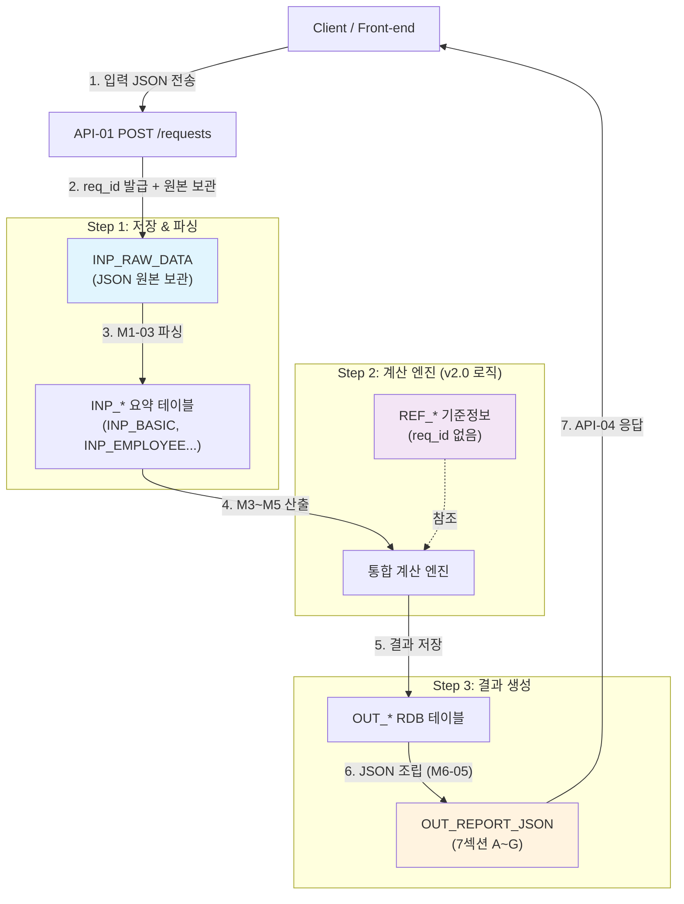

# 통합 경정청구 환급액 산출 시스템 — 개발상세설계서 v3.2

> **문서 버전**: v3.2 (v3.1 → 1차·2차·3차 지적사항 수용 15건 반영)  
> **작성일**: 2026-02-16  
> **기준 프롬프트**:  
> 　- 법인사업자-법인세-경정청구-AI점검요청-프롬프트 v1.3  
> 　- 개인사업자-종합소득세-경정청구-AI점검요청-프롬프트 v1.3  
> 　- 경정청구_환급액_점검결과_출력양식_작성가이드 (초안)  
> **문서 성격**: 본 문서 하나만 참조하면 법인세·종합소득세 통합 경정청구 시스템의 전체 설계를 파악할 수 있는 자기완결적(Self-contained) 최종본  
>
> **v3.1 최적화 변경** (v3.0 대비):
>
> | No | 변경 영역 | 변경 내용 | 근거 |
> |----|----------|----------|------|
> | ① | API 오류 응답 | 표준 오류 응답 스키마 신설 (§28.5) | API 오류 처리 미비 |
> | ② | 동시성 제어 | M1-01 seq_no 발급 시 `SELECT FOR UPDATE` 추가 | 동시 요청 시 seq_no 충돌 방지 |
> | ③ | 트랜잭션 경계 | §33 파이프라인 단계별 트랜잭션 범위 명시 | 장애 복구 시 롤백 범위 불명확 |
> | ④ | 성능 제한 | §29 데이터 흐름에 JSON 크기·타임아웃·페이징 사양 추가 | 대용량 데이터 시나리오 대비 부재 |
> | ⑤ | 감사추적 강화 | REQ_REQUEST·LOG_CALCULATION에 변경이력 컬럼 추가 | 사용자 행위·데이터 변경 추적 불완전 |
> | ⑥ | 검증 규칙 실행 순서 | §35에 규칙 실행 순서·의존성 정의 추가 | 규칙 간 우선순위·의존성 불명확 |
> | ⑦ | OUT_REPORT_JSON 컬럼번호 | 14번 중복 → 정정 | 오류 수정 |
> | ⑧ | 문서 참조 정합성 | 내부 섹션 참조 오류 수정 | 오류 수정 |
>
> **v3.0 핵심 아키텍처 변경** (v2.0/v2.1 대비):
>
> | 변경 | v2.0/v2.1 | v3.0 |
> |------|----------|------|
> | **① 요청번호+요청일자 관리** | entity_id(법인ID/납세자ID) 기반 | `req_id` 비REF 전 테이블 관통 + `request_date` REQ_REQUEST·INP_BASIC에서 최소 관리 |
> | **② 입력자료 구조** | 항목별 개별 입력 테이블 24+8개 | **원시 JSON 보관 테이블** + **계산용 요약 테이블** 2계층 |
> | **③ 출력결과 구조** | 개별 출력 테이블 10+3+4개 | **결과 저장 테이블** + **JSON 전달 인터페이스** 2계층 |
>
> **변경이력 누적**: 법인세 v1.0→v4.0r1 원문 + 종합소득세 v1.3 신규 + v1.1 보완 12건 + v2.1 출력양식 보강 + v3.0 아키텍처 개편 + v3.1 최적화

---

## 목차

### PART I. 시스템 개요 및 아키텍처 (v3.0 개편)
1. [시스템 개요](#1-시스템-개요)
2. [v3.0 아키텍처 설계 원칙](#2-v30-아키텍처-설계-원칙)
3. [요청번호(req_id) 관리 체계](#3-요청번호-관리-체계)
4. [테이블 계층 구조 총괄](#4-테이블-계층-구조-총괄)
5. [기능 분할도 (v3.0 개편)](#5-기능-분할도)
6. [세목별 과세 구조 비교](#6-세목별-과세-구조-비교)

### PART II. 요청 관리 테이블
7. [REQ_REQUEST — 요청 마스터](#7-요청-마스터-테이블)

### PART III. 입력자료 테이블 — 원시 JSON 보관 계층
8. [INP_RAW_DATA — 원시 입력자료 보관](#8-원시-입력자료-보관-테이블)
9. [원시 JSON 데이터셋 스키마 정의](#9-원시-json-데이터셋-스키마)

### PART IV. 입력자료 테이블 — 계산용 요약 계층
10. [INP_BASIC — 신청인 기본 정보 요약](#10-신청인-기본정보-요약)
11. [INP_EMPLOYEE — 고용 정보 요약](#11-고용정보-요약)
12. [INP_DEDUCTION — 공제·감면 기초 요약](#12-공제감면-기초-요약)
13. [INP_FINANCIAL — 재무·세무 수치 요약](#13-재무세무-수치-요약)

### PART V. 기준정보 테이블 (v2.0 승계)
14. [REF_* 기준정보 테이블 22개](#14-기준정보-테이블)

### PART VI. 점검 결과 테이블
15. [CHK_ELIGIBILITY — 자격 진단 결과](#15-자격진단-결과)
16. [CHK_INSPECTION_LOG — 점검항목별 판정](#16-점검항목별-판정)
17. [CHK_VALIDATION_LOG — 검증 규칙 실행 결과](#17-검증규칙-실행-결과)

### PART VII. 출력 결과 테이블 — 산출 저장 계층
18. [OUT_EMPLOYEE_SUMMARY — 상시근로자 산정](#18-상시근로자-산정)
19. [OUT_CREDIT_DETAIL — 개별 공제·감면 산출](#19-개별-공제감면-산출)
20. [OUT_COMBINATION — 조합 비교·최적 선택](#20-조합-비교)
21. [OUT_EXCLUSION_VERIFY — 상호배제 검증](#21-상호배제-검증)
22. [OUT_REFUND — 최종 환급액 산출](#22-최종-환급액-산출)
23. [OUT_RISK — 사후관리·리스크 평가](#23-사후관리-리스크)
24. [OUT_ADDITIONAL_CHECK — 추가 확인 필요](#24-추가확인-필요)
25. [LOG_CALCULATION — 감사추적 로그](#25-감사추적-로그)

### PART VIII. 출력 결과 — JSON 전달 계층
26. [OUT_REPORT_JSON — 최종 보고서 JSON 저장](#26-보고서-json-저장)
27. [JSON 전달 스키마 정의 (7섹션)](#27-json-전달-스키마)
28. [REST API 인터페이스](#28-rest-api)

### PART IX. 모듈 상세설계 (v2.0 승계 + v3.0 변경)
29. [데이터 흐름 — 3계층 파이프라인 + 성능 제한 사양 (★v3.1)](#29-데이터-흐름)
30. [M1 입력 관리 — v3.0 개편 + 동시성 제어·검증 강화 (★v3.1)](#30-m1-입력관리)
31. [M2~M5 점검·산출 — v2.0 승계 요약](#31-점검산출-승계)
32. [M6 보고·전달 — v3.0 개편 (결과 저장·JSON 직렬화·API 응답)](#32-m6-보고전달)
33. [단계별 업무처리 절차서 + 트랜잭션 경계 (★v3.1)](#33-업무처리-절차서)

### PART X. 계산 공식·검증 규칙·용어 (v2.0 승계)
34. [계산 공식 정의서 + 테스트 케이스 (★v3.1)](#34-계산공식)
35. [검증 규칙 + 실행 순서·의존성 (★v3.1)](#35-검증규칙)

### PART XI. 부록
36. [v3.0 아키텍처 마이그레이션 가이드 (v2.0 → v3.0 매핑)](#36-마이그레이션)
37. [출력양식 가이드 ↔ v3.0 최종 매핑](#37-출력양식-매핑)

---

# PART I. 시스템 개요 및 아키텍처

---

## 1. 시스템 개요

### 1.1 목적

법인사업자의 **법인세** 및 개인사업자의 **종합소득세** 경정청구 시 환급액을 극대화하기 위한 통합 AI 점검 시스템. 신청인별·날짜별 유니크한 요청 단위로 입력→점검→산출→보고 전 과정을 추적 관리한다.

### 1.2 적용 범위

| 구분 | 법인세 (`TAX_TYPE='CORP'`) | 종합소득세 (`TAX_TYPE='INC'`) |
|------|---------------------------|-------------------------------|
| 대상 세목 | 법인세 (법인세법) | 종합소득세 (소득세법) |
| 대상 납세자 | 법인사업자 (내국법인) | 개인사업자 (거주자) |
| 경정청구 근거 | 국세기본법 §45의2 | 국세기본법 §45의2 |
| 세율 | 9~24% (4단계) | 6~45% (8단계) |
| 최저한세 기준 | 과세표준 × 7~17% | 산출세액 × 35%/45% |
| 적용순서 근거법 | 법인세법 §59 | 소득세법 §60 |

### 1.3 핵심 설계 원칙 (v2.0 계승 + v3.0 추가)

> **★ 설계반영 핵심 (3대 요구사항)**:
> 1. 기준테이블을 제외한 입력자료·점검·출력결과 테이블에 신청인별 날짜별 **유니크한 요청번호(req_id)** 관리
> 2. 세부 입력자료를 **JSON 데이터셋으로 수신·보관**(INP_RAW_DATA)하고, 환급액 계산용 **요약 테이블**(INP_*)로 이원화
> 3. 출력결과를 **RDB 테이블**(OUT_*)에 저장하고, 세부 결과물을 **JSON 형태**(OUT_REPORT_JSON)로 조립·전달
> 
> **★ Request-Driven 모델 (제미나이 2차+3차 반영)**: 1회 경정청구 진단 요청 = 1 트랜잭션 단위.
> 요청원천(request_source)·요청자(requested_by)·요청자IP(client_ip)를 추적하여 감사 대응력 확보.

| 원칙 | 내용 | 버전 |
|------|------|------|
| 사업연도별 법령 적용 | 세율·공제율·적용기한은 대상 연도 기준 | v1.0 |
| 절사(Truncate) 원칙 | 금액 10원 미만, 비율 소수점 3자리, 환급가산금 1원 미만 | v1.0 |
| 반올림 절대 금지 | 모든 단계 TRUNCATE, ROUND 금지 | v1.0 |
| 적용순서 준수 | 감면 → 이월불가 공제 → 이월가능 공제 | v1.0 |
| 상호배제 준수 | 조특법 §127④ | v1.0 |
| 결산확정 원칙 (CORP) | 결산조정 항목 = 경정청구 불가 (Hard Fail) | v1.1 |
| **요청 단위 추적** | **모든 비기준 테이블에 `req_id` 관통** | **v3.0** |
| **입력 원본 보존** | **원시 JSON을 변환 없이 보관, 요약은 별도 생성** | **v3.0** |
| **출력 JSON 전달** | **산출 결과를 DB 저장 + JSON 직렬화 이중 보관** | **v3.0** |

---

## 2. v3.0 아키텍처 설계 원칙

### 2.0 Request-Driven 데이터 처리 파이프라인 (★제미나이 2차+3차)

> **1회의 경정청구 진단 요청(Request)을 하나의 트랜잭션 단위로 관리**합니다.
> 동일 신청인이라도 요청 시점이 다르면 새로운 req_id가 부여되어 이력이 독립 관리됩니다.



> **Hybrid 저장 전략**: 원본 입력과 최종 결과는 JSON(Document Store)으로 보관하여 무결성·유연성을 확보하고,
> 실제 환급액 계산에는 RDB 테이블(INP_*/OUT_*)을 활용하여 SQL Join·Aggregation 성능을 확보합니다.

> **★v3.2 입력 원본 불변성(Immutability) 원칙**:
> - `INP_RAW_DATA`는 **INSERT ONLY** — 동일 req_id에 대한 UPDATE/DELETE 금지
> - 입력 데이터 수정이 필요한 경우, 기존 req_id를 폐기하고 **새 req_id를 발급**하여 재요청
> - 클라이언트(Front-end)는 수정 요청 시 반드시 API-01을 재호출하여 새 req_id를 발급받아야 하며, 기존 req_id에 대한 수정 API는 제공하지 않음
> - 이 원칙은 감사추적(Audit Trail)의 무결성을 보장하고, 계산 결과의 재현성을 확보하기 위함

### 2.1 3계층 데이터 아키텍처

```
┌─────────────────────────────────────────────────────────────────┐
│                    REQ_REQUEST (요청 마스터)                       │
│              req_id = 신청인 + 날짜 기반 유니크 키                  │
└───────────┬─────────────────────────────────┬───────────────────┘
            │ FK: req_id                       │ FK: req_id
  ┌─────────▼─────────┐             ┌─────────▼─────────┐
  │   입력자료 계층     │             │   출력결과 계층     │
  │                   │             │                   │
  │  ┌──────────────┐ │             │  ┌──────────────┐ │
  │  │ INP_RAW_DATA │ │             │  │ OUT_* 테이블  │ │
  │  │ (원시 JSON)  │ │             │  │ (산출 결과)   │ │
  │  └──────┬───────┘ │             │  └──────┬───────┘ │
  │         │ 파싱     │             │         │ 직렬화  │
  │  ┌──────▼───────┐ │             │  ┌──────▼───────┐ │
  │  │ INP_* 요약   │ │             │  │OUT_REPORT_JSON│ │
  │  │ (계산용)     │ │             │  │ (전달용 JSON) │ │
  │  └──────────────┘ │             │  └──────────────┘ │
  └───────────────────┘             └───────────────────┘
            │                                 │
            │     ┌───────────────┐           │
            └────▶│  점검·산출 엔진 │◀──────────┘
                  │  (M2~M5)      │
                  │  + REF_* 참조 │
                  └───────────────┘
```

### 2.2 설계 방침

| 원칙 | 설명 |
|------|------|
| **★ 설계반영 핵심** | **기준테이블을 제외한 나머지 테이블에 대하여 입력자료 요청일자를 관리하고, 입력·점검·출력결과 테이블 설계 시 유니크한 요청번호가 관리되도록 설계** |
| **요청번호 관통** | 모든 비REF 테이블에 `req_id`(유니크 요청번호) 필수 관리. `request_date`(입력자료 요청일자)는 REQ_REQUEST(마스터) + INP_BASIC(신청인 기본정보)에서 최소 관리하고, 나머지 테이블은 req_id FK JOIN으로 조회 |
| **원본 불변성** | INP_RAW_DATA에 저장된 원시 JSON은 수정하지 않음. 오류 시 새 req_id로 재요청 |
| **요약 재생성 가능** | INP_* 요약 테이블은 INP_RAW_DATA에서 언제든 재파싱 가능 (파생 데이터) |
| **결과 이중 보관** | 산출 결과는 ① OUT_* 정규 테이블에 저장 + ② OUT_REPORT_JSON에 JSON 직렬화 보관 |
| **기준정보 독립** | REF_* 테이블은 req_id 없이 독립 관리 (법령·세율 등 공통 기준) |
| **이력 추적** | 동일 신청인의 재요청 시 req_id가 달라지므로 버전별 비교 가능. 일자별 필터는 REQ_REQUEST.request_date 활용 |

---

## 3. 요청번호(req_id) + 입력자료 요청일자(request_date) 관리 체계

> **설계반영사항**: 기준테이블을 제외한 나머지 테이블에 대하여 입력자료 요청일자를 관리하고,
> 입력·점검·출력결과 테이블 설계 시 유니크한 요청번호가 관리되도록 설계

### 3.0 비REF 테이블 공통 필수 컬럼

| 컬럼명 | 한글명 | 데이터타입 | 설명 | 적용 범위 |
|--------|--------|-----------|------|----------|
| **req_id** | **유니크 요청번호** | VARCHAR(30) | 신청인+날짜+순번 기반 PK/FK | 비REF 전 테이블 (INP_*, CHK_*, OUT_*, LOG_*) |
| **request_date** | **입력자료 요청일자** | DATE | 해당 요청의 접수 일자 (req_id에서 추출) | **REQ_REQUEST + INP_BASIC** 2개 테이블만 관리 |

> `request_date`는 REQ_REQUEST(요청 마스터)와 INP_BASIC(신청인 기본정보)에서만 관리합니다.
> 나머지 테이블에서 요청일자가 필요한 경우 `req_id` FK JOIN으로 조회하면 되므로,
> **역정규화를 최소화**하여 데이터 정합성 관리 부담을 줄입니다.
> 
> **적용 제외**: REF_* 기준정보 22개 테이블 (법령·세율 등 공통 기준, 요청과 무관)

### 3.1 req_id 생성 규칙

```
req_id = {신청인구분}-{사업자번호}-{요청일자}-{일련번호}
```

| 구성요소 | 형식 | 설명 | 예시 |
|----------|------|------|------|
| 신청인구분 | 1자리 | C=법인, P=개인 | C |
| 사업자번호 | 10자리 | 하이픈 제거 | 1234567890 |
| 요청일자 | 8자리 | YYYYMMDD | 20260216 |
| 일련번호 | 3자리 | 당일 순번 (001~) | 001 |

**예시**: `C-1234567890-20260216-001` (법인 사업자번호 123-45-67890의 2026.02.16 첫 번째 요청)

### 3.2 req_id 유니크 제약

```sql
-- REQ_REQUEST 테이블의 PK
PRIMARY KEY (req_id)

-- 유니크 보조 인덱스: 동일 신청인+동일 날짜 내 순번 보장
UNIQUE INDEX (applicant_id, request_date, seq_no)
```

### 3.3 req_id 적용 범위

| 테이블 계층 | req_id 사용 | 비고 |
|------------|:----------:|------|
| REQ_REQUEST (요청 마스터) | PK | 모든 테이블의 기준점 |
| INP_RAW_DATA (원시 JSON) | FK | 1 req_id : N raw_data (카테고리별) |
| INP_* (요약 테이블 4개) | FK | 1 req_id : 1 row (기본정보) 또는 1:N (상세) |
| CHK_* (점검 결과 3개) | FK | 1 req_id : 1~N rows |
| OUT_* (산출 결과 8개) | FK | 1 req_id : 1~N rows |
| LOG_CALCULATION (감사추적) | FK | 1 req_id : N rows |
| OUT_REPORT_JSON (JSON 보관) | FK | 1 req_id : 1 row |
| **REF_* (기준정보 22개)** | **없음** | **법령·세율 등 독립 관리** |

---

## 4. 테이블 계층 구조 총괄

### 4.1 전체 테이블 인벤토리 — v3.0

| 계층 | 접두어 | 테이블 수 | req_id | 역할 |
|------|--------|:--------:|:------:|------|
| **요청 관리** | REQ_ | 1 | PK | 신청인별 요청 단위 관리 |
| **입력-원시** | INP_RAW_ | 1 | FK | 원시 JSON 데이터셋 보관 (불변) |
| **입력-요약** | INP_ | 4 | FK | 계산 엔진이 사용하는 정규화 요약 |
| **기준정보** | REF_ | 22 | — | 법령·세율·공제율 등 공통 기준 (v2.0 승계, req_id·request_date 없음) |
| **점검 결과** | CHK_ | 3 | FK | 자격 진단·점검 판정·검증 규칙 실행 |
| **산출 결과** | OUT_ | 8 | FK | 상시근로자·공제감면·조합·환급액 등 |
| **감사추적** | LOG_ | 1 | FK | 내부 계산 이력 |
| **JSON 전달** | OUT_REPORT_ | 1 | FK | 최종 보고서 JSON 직렬화 보관 |
| **합계** | | **41** | | REF 22 + 요청관리 1 + 입력 5 + 점검 3 + 산출 8 + 로그 1 + JSON 1 |

### 4.2 v2.0 → v3.0 테이블 매핑 요약

| v2.0 테이블 (32+8+17=57개) | v3.0 전환 | 비고 |
|---------------------------|----------|------|
| TBL_CORP_BASIC (53컬럼) | → INP_RAW_DATA (JSON) + INP_BASIC (요약) | 원본→JSON, 계산용→요약 |
| TBL_REPRESENTATIVE (15컬럼) | → INP_RAW_DATA (category='representative') | JSON으로 통합 |
| TBL_EMPLOYEE_DETAIL (25컬럼) | → INP_RAW_DATA (category='employee_detail') + INP_EMPLOYEE (요약) | 상세→JSON, 집계→요약 |
| TBL_EMPLOYEE_MONTHLY (10컬럼) | → INP_RAW_DATA (category='employee_monthly') + INP_EMPLOYEE (요약) | 동일 |
| TBL_INVESTMENT_ASSET (20컬럼) | → INP_RAW_DATA (category='investment') + INP_DEDUCTION (요약) | 동일 |
| TBL_STARTUP_INFO~TBL_DEPRECIATION_ADJUST (20개) | → INP_RAW_DATA (category별) + INP_DEDUCTION/FINANCIAL (요약) | 동일 |
| TBL_INC_BASIC~TBL_INC_JOINT_BIZ (8개) | → INP_RAW_DATA (category별) + INP_BASIC/DEDUCTION (요약) | 동일 |
| REF_* (22개) | → REF_* (22개, 그대로 승계) | 변경 없음 |
| OUT_* (10+3+4개) | → OUT_* (8개로 통합) + OUT_REPORT_JSON | 정규화 + JSON 전달 |

---

## 5. 기능 분할도 (v3.0 개편)

```
[Lv0] 통합 경정청구 환급액 산출 시스템 (v3.0)
│
├─[Lv1] M1. 입력 관리 ★v3.0 전면 개편 ─────────────────────────────────
│  ├─[Lv2] M1-01 요청 접수 및 req_id 발급
│  │  ├─[Lv3] 신청인 식별 (사업자번호, 세목구분)
│  │  ├─[Lv3] req_id 생성 (신청인구분-사업자번호-날짜-순번)
│  │  └─[Lv3] REQ_REQUEST 레코드 생성
│  ├─[Lv2] M1-02 원시 JSON 수신 및 보관
│  │  ├─[Lv3] 입력 JSON 데이터셋 수신 (카테고리별)
│  │  ├─[Lv3] JSON 스키마 유효성 검증 (형식 검증)
│  │  └─[Lv3] INP_RAW_DATA 저장 (불변 원본)
│  ├─[Lv2] M1-03 요약 테이블 생성 (JSON → 정규화)
│  │  ├─[Lv3] INP_BASIC 생성: 법인기본/개인기본 JSON → 요약 추출
│  │  ├─[Lv3] INP_EMPLOYEE 생성: 근로자상세/월별 JSON → 집계 추출
│  │  ├─[Lv3] INP_DEDUCTION 생성: 투자/R&D/창업/감면 JSON → 항목별 요약
│  │  └─[Lv3] INP_FINANCIAL 생성: 재무/세무조정/배당/소득공제 JSON → 수치 요약
│  └─[Lv2] M1-04 기준정보 로드 (REF_* 참조)
│     └─[Lv3] 대상 과세연도 기준 법령 버전 자동 매칭 (REF_LAW_VERSION)
│
├─[Lv1] M2. 기준정보 관리 ─────────────────────────────────────────────
│  └─ (v2.0 승계: REF_* 22개 테이블 관리, req_id 미사용)
│
├─[Lv1] M3. 사전 점검 (STEP 0) ────────────────────────────────────────
│  ├─[Lv2] M3-00 결산조정 항목 Hard Fail 필터 ★v1.1
│  ├─[Lv2] M3-01 경정청구 가능 여부 사전 검증 ★v4.0r1
│  ├─[Lv2] M3-02 중소기업 해당 판단
│  ├─[Lv2] M3-03 소재지 구분 판단
│  ├─[Lv2] M3-04 상시근로자 수 산정
│  ├─[Lv2] M3-05 업종 적격성 사전 스크리닝
│  ├─[Lv2] M3-06 결산확정 원칙 검증 ★v2.0
│  ├─[Lv2] P3-01 [INC] 소재지 사업장별 개별 판단
│  ├─[Lv2] P3-02 [INC] 성실신고확인대상 자동 판정 ★v1.1
│  ├─[Lv2] P3-03 [INC] 종합소득금액 산정
│  └─[Lv2] P3-04 [INC] 소득공제·과세표준·산출세액
│  → 산출물: CHK_ELIGIBILITY, OUT_EMPLOYEE_SUMMARY
│
├─[Lv1] M4. 개별 공제·감면 산출 (STEP 1~2) ────────────────────────────
│  ├─ (v2.0 승계: M4-01~M4-15, P4-01~P4-14 전체)
│  ├─[Lv2] M4-11a [CORP] 업무용 승용차 비용 재산출 ★v1.1
│  └─ → 산출물: OUT_CREDIT_DETAIL
│
├─[Lv1] M5. 최적 조합 탐색 (STEP 3) ──────────────────────────────────
│  ├─ (v2.0 승계: M5-01~M5-05, P5-01)
│  └─ → 산출물: OUT_COMBINATION, OUT_EXCLUSION_VERIFY
│
├─[Lv1] M6. 최종 환급액 산출 및 보고 (STEP 4~5) ★v3.0 개편 ───────────
│  ├─[Lv2] M6-01 환급액 비교표 생성 → OUT_REFUND 저장
│  ├─[Lv2] M6-02 환급가산금 산출 (본세/중간예납 분리)
│  ├─[Lv2] M6-03 지방소득세 환급 안내
│  ├─[Lv2] M6-04 사후관리 리스크 평가 → OUT_RISK 저장
│  ├─[Lv2] M6-05 JSON 직렬화 (OUT_* → JSON 7섹션) ★v3.0
│  │  ├─[Lv3] 섹션A: CHK_ELIGIBILITY → eligibility JSON
│  │  ├─[Lv3] 섹션B: OUT_CREDIT_DETAIL → candidate_items JSON
│  │  ├─[Lv3] 섹션C: OUT_COMBINATION + OUT_EXCLUSION_VERIFY → optimal JSON
│  │  ├─[Lv3] 섹션D: OUT_REFUND → refund_calculation JSON
│  │  ├─[Lv3] 섹션E: CHK_INSPECTION_LOG → inspection_log JSON
│  │  ├─[Lv3] 섹션F: OUT_RISK + OUT_ADDITIONAL_CHECK → post_management JSON
│  │  └─[Lv3] 스키마 검증 + 직렬화 → OUT_REPORT_JSON 저장
│  └─[Lv2] M6-06 API 응답 반환 ★v3.0
│
├─[Lv1] M7. 시뮬레이션 ────────────────────────────────────────────────
│  ├─ (v2.0 승계: M7-01~M7-03)
│  └─ 사후관리 추징액 + 이자상당가산액 (★v1.1 F-COM-01)
│
└─[Lv1] MX. 횡단 기능 (Cross-cutting) ────────────────────────────────
   ├─[Lv2] MX-01 순환 참조 해결 엔진 ★v4.0
   ├─[Lv2] MX-02 법령 버전 자동 매칭
   ├─[Lv2] MX-03 검증 엔진 → CHK_VALIDATION_LOG 저장
   ├─[Lv2] MX-04 계산 이력 / 감사 추적 → LOG_CALCULATION 저장
   └─[Lv2] MX-05 절사 정책 (TRUNCATE, 반올림 금지)
```

---

## 6. 세목별 과세 구조 비교

### 6.1 법인세 vs 종합소득세 과세 구조 비교 (v2.0 승계 통합)

3. [세목별 과세 구조 비교 및 분기 정의](#part-i-3-세목별-과세-구조-비교)

### PART II. 법인세 시스템 (TAX_TYPE='CORP') — v4.0r1 원문
4. [법인세 변경이력 (v1.0→v4.0r1)](#part-ii-4-법인세-변경이력)
5. [법인세 기능 분할도](#part-ii-5-법인세-기능-분할도)
6. [법인세 입력 테이블 (24개)](#part-ii-6-법인세-입력-테이블)
7. [법인세 기준정보 테이블 (22개)](#part-ii-7-법인세-기준정보-테이블)
8. [법인세 출력 테이블 (10개)](#part-ii-8-법인세-출력-테이블)
9. [법인세 업무처리 절차서](#part-ii-9-법인세-업무처리-절차서)
10. [법인세 개별 기능 상세설계 (18개 함수)](#part-ii-10-법인세-개별-기능-상세설계)
11. [법인세 계산 공식 정의서 (56개 공식)](#part-ii-11-법인세-계산-공식-정의서)
12. [법인세 검증 규칙 (V/C/B/L/W/X)](#part-ii-12-법인세-검증-규칙)
13. [법인세 용어 정의](#part-ii-13-법인세-용어-정의)
14. [법인세 프롬프트 교차검증](#part-ii-14-법인세-프롬프트-교차검증)

### PART III. 종합소득세 시스템 (TAX_TYPE='INC') — 신규 + v1.1 보완
15. [개인사업자 전용 설계 원칙](#part-iii-15-개인사업자-전용-설계원칙)
16. [통합 기능 분할도 (법인+개인)](#part-iii-16-통합-기능-분할도)
17. [개인사업자 전용 입력 테이블 (8개)](#part-iii-17-개인사업자-전용-입력-테이블)
18. [개인사업자 전용 기준정보 테이블 (4개)](#part-iii-18-개인사업자-전용-기준정보-테이블)
19. [개인사업자 전용 출력 테이블 (3개)](#part-iii-19-개인사업자-전용-출력-테이블)
20. [개인사업자 업무처리 절차서 (INC 분기)](#part-iii-20-개인사업자-업무처리-절차서)
21. [개인사업자 개별 기능 상세설계 (15+3개 모듈)](#part-iii-21-개인사업자-개별-기능-상세설계)
22. [종합소득세 계산 공식 정의서 (11+1개 공식)](#part-iii-22-종합소득세-계산-공식-정의서)
23. [개인사업자 전용 검증 규칙 (20+4건)](#part-iii-23-개인사업자-전용-검증-규칙)

### PART IV. 통합 검증 및 부록
24. [종합소득세 프롬프트 교차검증](#part-iv-24-종합소득세-프롬프트-교차검증)
25. [v1.1 지적사항 검토 결과](#part-iv-25-지적사항-검토-결과)
26. [법인세 v4.0r1 부록 (오류검토·우선순위·갱신 프로세스)](#part-iv-26-법인세-부록)


---

## 6A. 세목 분기(TAX_TYPE) 아키텍처 (v2.0 승계 통합)

## PART I-2. 세목 분기(TAX_TYPE) 아키텍처

### 2.1 분기 설계 방침

| 구분 | 설계 원칙 |
|------|----------|
| 세목 분기 | 모든 모듈·테이블에 `TAX_TYPE` (`CORP`/`INC`) 분기점 도입 |
| 공통 모듈 유지 | 법인세 v4.0r1의 M1~M7, MX 구조를 그대로 유지하되 세목별 분기 추가 |
| 개인 전용 모듈 | 법인세에 없는 개인사업자 고유 로직을 `P-` 접두어 모듈로 신설 |
| 개인 전용 테이블 | `TBL_INC_*` 접두어로 종합소득세 전용 입력 테이블 신설 |
| 기준정보 확장 | `REF_INC_TAX_RATE` 등 소득세 전용 기준정보 테이블 추가 |
| 법인 고유 모듈 | 기존 법인 전용 모듈(M4-09 수입배당금, M4-12~14 등)은 `TAX_TYPE='CORP'`일 때만 활성화 |

### 2.2 종합소득세 통합을 위한 신규 항목 — 총 62건 + v1.1 보완 13건

### ➕ 종합소득세 통합을 위한 신규 항목 — 총 62건

### 🔧 v1.1 보완 항목 총괄 — 총 13건 (1~3차 지적사항 정당성 검토 후 반영)

| No | 유형 | 보완 대상 | 보완 내용 | 지적 차수 | 정당성 |
|----|------|----------|----------|----------|--------|
| 1 | 로직 보완 | P4-01b | 건강보험료 3분류(지역→소득공제, 직장본인→소득공제, 근로자사업주부담→필요경비) | 1차 | ✅ 프롬프트 ㉖규칙 근거 |
| 2 | 모듈 신설 | M4-11a | 업무용 승용차 비용 재산출 (운행기록부, 전용보험, 감가상각한도) | 1차 | ✅ 프롬프트 점검0 근거 |
| 3 | 로직 보완 | P3-02 | 성실신고확인대상 자동 판정 (수입금액×업종→REF 대조) | 1차 | ✅ 수동입력 의존 제거 |
| 4 | 로직 강화 | M3-00 | 결산조정 항목(감가상각·퇴충·대충) 경정청구 Hard Fail 필터 | 1차 | ✅ 법인세법 §40 근거 |
| 5 | 로직 추가 | M7-03 | 이자상당가산액 포함 추징액 산출 공식 | 1차 | ✅ 프롬프트 ㉖규칙 근거 |
| 6 | 검증 추가 | VP06 | 성실사업자 의료비·교육비 신청 시 대상 여부 검증 | 1차 | ✅ 조특법 §122의3 |
| 7 | 검증 추가 | BP05 | 이월결손금 공제 한도 (중소100%/일반80%) 자동 적용 | 1차 | ✅ 법인세법 §13 |
| 8 | 검증 추가 | LP04 | 2025년 이후 창업 §6+§29의8 중복배제 강제 | 1차 | ✅ 2024세법개정 |
| 9 | 검증 추가 | LP05 | 결산조정 항목 경정청구 불가 필터링 | 2차 | ✅ 법인세법 §40 |
| 10 | 로직 보완 | M4-09 | 수입배당금 익금불산입 연도별 적용기준(2023개정/종전규정) 매칭 | 3차 | ✅ 법인세법 §18의2 |
| 11 | 양식 구조화 | M6-04 | 최종 환급 보고서 4부 구조 (요약표+최저한세분석+지방소득세+사후관리) | 3차 | ✅ 실무 가독성 |
| 12 | 모듈 확장 | P4-04~14 | 개인 전용 공제 모듈 입력·참조 테이블 연계 명시 | 2차 | ✅ 설계 완결성 |
| 13 | 로직 보완 | P4-01 | 세율구간 시뮬레이션 시 노란우산공제 등 반영 후 시나리오 비교 | 3차 | ✅ 최적화 정밀도 |

#### 신규 입력 테이블 (8개)

| No | 테이블 | 목적 | 근거 |
|----|--------|------|------|
| P-T01 | TBL_INC_BASIC | 개인사업자 기본 정보 (대표자 인적사항, 다사업장 정보) | 프롬프트 [납세자 기본 정보] |
| P-T02 | TBL_INC_BUSINESS | 사업장별 상세 정보 (업종, 소재지, 수입금액, 소득금액) | 프롬프트 [사업장별 정보] |
| P-T03 | TBL_INC_OTHER_INCOME | 사업소득 외 합산소득 (근로·이자·배당·연금·기타) | 프롬프트 [종합소득 합산 정보] |
| P-T04 | TBL_INC_DEDUCTION | 소득공제 항목 (인적공제, 연금, 보험료, 주택자금 등) | 프롬프트 [소득공제 정보], 점검 32 |
| P-T05 | TBL_INC_SINCERITY | 성실신고확인 관련 (확인비용, 의료비·교육비) | 점검 26, 31-2 |
| P-T06 | TBL_INC_FOREIGN_TAX | 개인 외국납부세액 상세 (국가별, 세액공제/필요경비 선택) | 점검 34 |
| P-T07 | TBL_INC_RENTAL_REDUCTION | 착한 임대인 세액공제 (임대료 인하 내역) | 점검 35 |
| P-T08 | TBL_INC_JOINT_BIZ | 공동사업자 정보 (손익분배비율, 공동사업장 소득) | 핵심전제 ⑪ |

#### 신규 기준정보 테이블 (4개)

| No | 테이블 | 목적 | 근거 |
|----|--------|------|------|
| P-R01 | REF_INC_TAX_RATE | 소득세 세율 (과세연도별 6~45% 8단계) | 소득세법 §55, 점검 9-7 |
| P-R02 | REF_INC_MIN_TAX | 개인 최저한세율 (산출세액×35%/45%) | 조특법 §132②, 점검 5 |
| P-R03 | REF_INC_DEDUCTION_LIMIT | 소득공제 한도 (노란우산, 연금저축 등 항목별) | 소득세법 §50~54 |
| P-R04 | REF_INC_SINCERITY_THRESHOLD | 성실신고확인대상 수입금액 기준 (업종별) | 소득세법 §70의2 |

#### 신규 출력 테이블 (3개)

| No | 테이블 | 목적 | 근거 |
|----|--------|------|------|
| P-O01 | OUT_INC_INCOME_ALLOCATION | 다사업장 소득 배분 산출 결과 | 점검 9-6, 시행령 §117 |
| P-O02 | OUT_INC_DEDUCTION_IMPACT | 소득공제 반영 전후 세율구간 변동 분석 | 점검 32 세율구간 최적화 |
| P-O03 | OUT_INC_LOCAL_TAX | 지방소득세 환급액 별도 산출 | 점검 33, 지방세법 §89 |

#### 신규 모듈 (15개)

| No | 모듈ID | 기능명 | 근거 |
|----|--------|--------|------|
| 1 | P1-01 | 개인사업자 기본 정보 입력 | [납세자 기본 정보] |
| 2 | P1-02 | 사업장별 정보 입력 (다사업장) | [사업장별 정보] |
| 3 | P1-03 | 종합소득 합산 정보 입력 | [종합소득 합산 정보] |
| 4 | P1-04 | 소득공제 정보 입력 | [소득공제 정보] |
| 5 | P3-01 | 소재지 사업장별 개별 판단 | 점검 2 (본점간주 없음) |
| 6 | P3-02 | 종합소득세 경정청구 기한 (5.31/6.30 기산) | 사전확인 |
| 7 | P4-01 | 소득공제 누락 점검·세율구간 최적화 | 점검 32 |
| 8 | P4-02 | 감면 소득 배분 계산 (다사업장/겸업) | 점검 9-6, 점검 24 |
| 9 | P4-03 | 공동사업자 소득 배분 | 핵심전제 ⑪, 점검 9-6 |
| 10 | P4-04 | 성실사업자 의료비·교육비 세액공제 | 점검 26 |
| 11 | P4-05 | 성실신고확인비용 세액공제 | 점검 31-2 |
| 12 | P4-06 | 기장세액공제 | 점검 30 |
| 13 | P4-07 | 개인 외국납부세액공제 | 점검 34 |
| 14 | P4-08 | 착한 임대인 세액공제 | 점검 35 |
| 15 | P5-01 | 개인 최저한세 산출 (산출세액×35%/45%) | 점검 5 |

#### 신규 검증 규칙 (12건)

| 코드 | 유형 | 설명 | 근거 |
|------|------|------|------|
| VP01 | Validation | 개인사업자 TAX_TYPE='INC' 시 TBL_INC_BASIC 필수 | 입력 검증 |
| VP02 | Validation | 다사업장: TBL_INC_BUSINESS 최소 1건 필수 | 입력 검증 |
| VP03 | Validation | 공동사업자: 손익분배비율 합계 = 100% | 소득세법 §43 |
| CP01 | Calculation | 감면세액 ≤ 산출세액 × (감면대상소득÷종합소득금액) × 감면율 | 시행령 §117 |
| CP02 | Calculation | 소득공제 후 과세표준 ≥ 0 | 논리 검증 |
| CP03 | Calculation | 개인 최저한세 = 산출세액 × 35%(3천만이하) + 45%(초과분) | 조특법 §132② |
| BP01 | Business | 기장세액공제 + 조특법 감면 중복 허용 확인 | 소득세법 §56의2 |
| BP02 | Business | 성실신고확인비용(§126의6) = 최저한세 대상 ○ | 조특법 시행령 §126 |
| BP03 | Business | 성실사업자 의료비·교육비(§122의3) = 최저한세 대상 ✕ | 시행령 §126 미포함 |
| LP01 | Legal | 개인 적용순서 = 소득세법 §60 (법인세법 §59 아님) | 소득세법 §60 |
| LP02 | Legal | 개인 경정청구 기산일 = 5.31 (성실: 6.30) | 소득세법 §70, §70의2 |
| WP01 | Warning | 분리과세 소득이 종합소득금액에서 제외되었는지 확인 | 핵심전제 ⑫ |


---


---

## 6B. 변경이력 — 법인세 v1.0 → v4.0r1 에러·개선 코드 (v2.0 승계 통합)

> 아래 변경이력은 v1.0 초안부터 v4.0r1까지 누적된 에러 수정(E), 개선(I), 모듈 추가(M) 내역입니다.
> v3.0에서 이 이력 자체는 변경 없으며, 참조를 위해 전량 수록합니다.

## PART II-4. 법인세 변경이력 (v1.0 → v4.0r1)

### 변경 이력 (v1.0 → v2.0)

### ?? 오류 수정 (Errors Fixed)

| No | 구분 | v1.0 내용 | v2.0 수정 | 근거 |
|----|------|----------|----------|------|
| E01 | TBL_EMPLOYEE_DETAIL.year_type | `'PRIOR'(직전)/current'(해당)` (대소문자 불일치, 따옴표 누락) | `'PRIOR'/'CURRENT'` (대문자 통일) | 코딩 컨벤션 |
| E02 | 프롬프트 점검 9-3 근거법령 참조 | 설계서에서 소득세법 제56조/제60조 혼재 | `법인세법 제59조` 통일, 소득세법 조문은 비교 참고용으로만 명시 | 프롬프트 핵심전제 |
| E03 | M5-02 최적조합탐색 로직 | R&D 최저한세 배제분 처리 위치가 최저한세 검증 이후 | 최저한세 대상 항목 적용 → 최저한세 한도 검증 → R&D 배제분 추가 적용 순으로 정정 | 조특법 §132②, 프롬프트 점검 22-5 |
| E04 | 최저한세 적용 로직 | 감면 초과분 처리 누락 | 감면(이월불가) 초과분 = 소멸, 공제(이월가능) 초과분 = 이월(10년) 명확화 | 프롬프트 점검 15-5 [C] |
| E05 | 통합고용세액공제 공제금액 | 고정값으로 기재 (1,550만원 등) | `사업연도별 시행령 별표 참조` 원칙 명시, 고정값은 2024년 예시로 한정 | 프롬프트 점검 15 ① |
| E06 | 환급가산금 산출 공식 | `환급액 × 이율 × 일수 ÷ 365` | 기산일 = "원래 납부일의 다음날", 종료일 = "충당일 또는 지급결정일" 명확화 | 프롬프트 점검 9-5, 국기법 §52 |
| E07 | TBL_CORP_BASIC | `taxable_income`을 '공제 전 과세표준'으로 설명 | 과세표준 = 각사업연도소득 - 이월결손금 - 비과세소득이므로, '기신고 과세표준'으로 정정 | 법인세법 §13 |

### ?? 누락 보완 (Missing Content Added)

| No | 누락 항목 | 보완 내용 | 프롬프트 근거 |
|----|----------|----------|-------------|
| M01 | 각 사업연도 소득 컬럼 | TBL_CORP_BASIC에 `biz_income` (각사업연도소득) 추가 | [법인 기본 정보] 입력란 |
| M02 | 비과세소득 컬럼 | TBL_CORP_BASIC에 `non_taxable_income` 추가 | 점검 0 ② 과세표준 산출공식 |
| M03 | 이월결손금 상세 테이블 | TBL_LOSS_CARRYFORWARD 신설 (발생연도별 잔액, 이월기간) | [법인 기본 정보], 점검 27 |
| M04 | 이월세액공제 상세 테이블 | TBL_CREDIT_CARRYFORWARD 신설 (조항별·연도별 미공제액) | [법인 기본 정보], 점검 22-6 [D] |
| M05 | R&D 비용 입력 테이블 | TBL_RD_EXPENSE 신설 (유형별·비목별 R&D비) | 점검 22-2 [B] |
| M06 | 결손금 소급공제 처리 | M4-10 모듈 신설, 비교 로직 포함 | 점검 0 (Loss Carryback) |
| M07 | 세무조정사항 재검토 | M4-11 모듈 신설 (손금불산입/익금불산입 오류 검토) | 점검 0 세무조정사항 |
| M08 | 업무용 승용차 비용 불산입 | M4-11에 통합 (법인세법 시행령 §50의2) | 점검 0 업무용 승용차 |
| M09 | 결산확정의 원칙 검증 | M3-06 모듈 신설 (신고조정/결산조정 구분 필터) | 점검 0 결산확정의 원칙 |
| M10 | 토지등 양도세 추가과세 | M4-12 모듈 신설 | 점검 1 법인 특화 추가 |
| M11 | 기업구조조정 과세이연 | M4-13 모듈 신설 | 점검 31 |
| M12 | 연결납세 특화 점검 | M4-14 모듈 신설 | 점검 32 |
| M13 | 환급가산금 이율 기준 테이블 | REF_REFUND_INTEREST_RATE 신설 | 점검 9-5, 국기법 시행규칙 §19의3 |
| M14 | 지점 소재지 테이블 | TBL_BRANCH_LOCATION 신설 | [법인 기본 정보] 지점 소재지 |
| M15 | 중간예납 상세 테이블 | TBL_INTERIM_TAX 신설 (납부일, 금액) | 점검 29, 점검 9-5 |
| M16 | 후발적 경정청구 처리 | M3-01에 후발적 사유 판단 로직 추가 | 사전확인, 국기법 §45의2② |
| M17 | 북한이탈주민 구분 | TBL_EMPLOYEE_DETAIL.emp_type에 '북한이탈주민' 추가 | 점검 16, 청년등 정의 |
| M18 | 사보공제 청년 기준 차이 | M4-03에 만15~29세 별도 기준 명시 | 점검 18 |
| M19 | 경력단절여성 상세 정보 | TBL_EMPLOYEE_DETAIL에 career_break_reason/rehire_date 추가 | 점검 15 ④, 점검 15-2 [B]④ |
| M20 | 졸업유예 상세 관리 | TBL_CORP_BASIC에 graduation_year, graduation_grace_period 추가 | 점검 9-2 ③ |
| M21 | 고용증대세액공제 경과규정 | M4-02에 제29조의7 경과규정 비교 로직 포함 | 점검 19, 점검 15-6 [D] |
| M22 | 기존 신고 공제·감면 상세 | TBL_EXISTING_DEDUCTION 신설 (항목별 기존 적용 내역) | 점검 9-4 |
| M23 | 수정신고·경정 이력 | TBL_CORP_BASIC에 amendment_history 추가 | 점검 9-4 ④ |
| M24 | 사후관리 리스크 평가 | OUT_RISK_ASSESSMENT 신설 | 점검 15 ⑤, 점검 15-6 [E] |

### ?? 개선사항 (Improvements)

| No | 개선 내용 | 효과 |
|----|----------|------|
| I01 | 에러코드 체계 확장 (V/C/B → V/C/B/L/W) | 법령검증(L), 경고(W) 유형 추가로 정밀한 검증 |
| I02 | 사업연도별 법령 버전 관리 체계 | REF_LAW_VERSION 테이블 추가, 연도별 적용 법령 자동 매칭 |
| I03 | 시뮬레이션 모듈 신설 | M7 모듈 - 다수 과세연도 일괄 시뮬레이션 |
| I04 | 감면/공제 적격성 사전 스크리닝 | M3에 적격성 점수(Score) 산출 기능 추가 |
| I05 | 이월공제 활용 계획 수립 | OUT_CARRYFORWARD_PLAN 테이블 - 향후 10년 이월공제 활용 시나리오 |
| I06 | 감사추적(Audit Trail) 테이블 | LOG_CALCULATION 신설 - 모든 산출 단계 로그 기록 |
| I07 | 입력 데이터 자동 검증 강화 | 교차검증(Cross-validation) 규칙 30건 추가 |
| I08 | 보고서 템플릿 다양화 | 요약보고서/상세보고서/납세자제출용 3종 분리 |
| I09 | 환급 시나리오별 현재가치 비교 | 소급공제 vs 이월공제 NPV 비교 기능 |
| I10 | 조합 탐색 알고리즘 최적화 | 브루트포스(2^n) → 가지치기(Branch & Bound) 적용 |
| I11 | 농특세 연쇄 영향 분석 | 공제 조합 변경 시 농특세 영향 자동 재계산 |
| I12 | 중간예납 환급가산금 별도 기산 | 본세와 중간예납의 환급가산금 기산일 분리 계산 |
| I13 | 프롬프트 오류 피드백 | 프롬프트 v1.3 내 소득세법 조문 참조 불일치(§56 vs §60) 식별 |
| I14 | 데이터 무결성 제약조건 강화 | FK 관계, UNIQUE 제약, CHECK 제약 명시 |
| I15 | API 인터페이스 설계 추가 | 외부 시스템 연계를 위한 REST API 엔드포인트 정의 |


### 🔄 v1.1 → v3.0 통합 내역

| No | 항목 | v1.1 내용 | v3.0 반영 위치 |
|----|------|----------|---------------|
| T01 | TBL_CORP_BASIC 소급공제 필드 | current_year_loss, prior_year_tax_paid, prior_year_tax_base 추가 | 부록 §38 → 3.1 TBL_CORP_BASIC No.39~41 *(★v3.1 참조 정정)* |
| T02 | TBL_CORP_BASIC 세액 필드 | interim_prepaid_tax, withholding_tax 추가 | 부록 §38 → 3.1 TBL_CORP_BASIC No.37~38 *(★v3.1 참조 정정)* |
| T03 | TBL_DIVIDEND_INCOME | 수입배당금 명세 입력 테이블 신설 | §3.14 |
| T04 | TBL_INVESTMENT_ASSET.install_location_zone | 설치장소 수도권구분 컬럼 추가 | §3.5 No.13 |
| T05 | REF_DIVIDEND_EXCLUSION | 수입배당금 익금불산입률 기준 테이블 신설 | §4.15 |
| T06 | REF_RD_MIN_TAX_EXEMPT | R&D 최저한세 배제율 테이블 신설 | §4.16 |
| T07 | M3-03 소재지 분기 로직 | 항목별 소재지 판단 기준 이원화 함수 | §7.7 |
| T08 | M5-03 최저한세 상세 | 최저한세 산출 + R&D 배제분 상세 계산 함수 | §7.8 |
| T09 | M4-09 수입배당금 상세 | 연도별·지분율별 익금불산입 산출 함수 | §7.9 |
| T10 | M4-10 소급공제 시뮬레이션 | 소급 vs 이월 NPV 비교 함수 | §7.10 |
| T11 | 상세 계산 공식 | 산출세액·고용·투자·감면·소급공제 공식 상세 | §8.5 |
| T12 | 부록 A | 오류지적사항 4건 검토 결과 보존 | §부록 A |

---

### 변경 이력 (v3.0 → v4.0)

### ❌ 오류 수정 (Errors Fixed) — 8건

| No | 구분 | v3.0 내용 | v4.0 수정 | 근거 |
|----|------|----------|----------|------|
| E08 | 농특세 비과세 항목 (§8.4 F40) | "통합고용(§29의8), R&D(§10), 통합투자(§24) 비과세" | **비과세 = 제6조(창업감면), 제7조(중소특별), 제10조(R&D)만.** 제29조의8·제24조는 과세 20% | 농특세법 §4③, REF_NONGTEUKSE 테이블 |
| E09 | 수입배당금 익금불산입률 (§6.4.8) | "지분율별 차등: 100%/80%/50%/30%" (4단계) | **2023년 개정법은 3단계:** 50%이상→100%, 30~50%미만→80%, 30%미만→30% | 법인세법 §18의2 (2022.12.31. 개정) |
| E10 | 최저한세 계산 기준 주석 (§7.8) | `max_deductible = computed_tax - min_tax` 주석 불명확 | **주석 보강:** "과세표준 × 최저한세율 = 최저한세액, 산출세액 - 최저한세액 = 공제가능한도" 명시 | 조특법 §132 |
| E11 | TBL_EMPLOYEE_MONTHLY 북한이탈주민 누락 | nk_defector_count 컬럼 없음 | `nk_defector_count DECIMAL(10,2)` 컬럼 추가 | 프롬프트 점검 16 청년등 정의 |
| E12 | 국고보조금 익금불산입 모듈 누락 | M4-11에 상세 로직 부재 | M4-11에 국고보조금 익금불산입(법인세법 §18①) 검토 로직 추가 | 프롬프트 점검 0 |
| E13 | 외국납부세액 상세 입력 테이블 누락 | TBL_CORP_BASIC.foreign_tax_paid는 BOOLEAN만 | **TBL_FOREIGN_TAX 신설** (국가별·소득종류별 외국소득금액, 외국납부세액) | 법인세법 §57 |
| E14 | 업무용 승용차 입력 테이블 누락 | M4-11에 통합 언급만 | **TBL_BUSINESS_VEHICLE 신설** (차량번호, 취득가, 운행기록부, 전용보험 등) | 법인세법 시행령 §50의2 |
| E15 | 세무조정계산서 입력 테이블 누락 | M4-11 기능 존재하나 입력 데이터 없음 | **TBL_TAX_ADJUSTMENT 신설** (조정항목, 조정금액, 손금/익금 구분) | 법인세법 §60 |

### ➕ 누락 보완 (Missing Content Added) — 12건

| No | 누락 항목 | 보완 내용 | 근거 |
|----|----------|----------|------|
| M25 | 접대비 한도 기준 테이블 | REF_ENTERTAINMENT_LIMIT 신설 (중소기업 우대 한도) | 법인세법 §25 |
| M26 | 업종별 감면 적격성 판단 테이블 | REF_INDUSTRY_ELIGIBILITY 신설 (KSIC 코드별 감면 적격성) | 조특법 §6·§7 |
| M27 | 가지급금 인정이자 입력 | TBL_CORP_BASIC + TBL_SHAREHOLDER_LOAN 신설 | 법인세법 시행령 §89 |
| M28 | 업무무관자산 차입금이자 입력 | TBL_CORP_BASIC + TBL_NON_BUSINESS_ASSET 신설 | 법인세법 §28 |
| M29 | 감가상각 의무 이행 추적 | TBL_INVESTMENT_ASSET에 actual_depreciation, required_depreciation 추가 | 조특법 §128⑨ |
| M30 | 자산 처분 추징 리스크 추적 | TBL_INVESTMENT_ASSET에 disposal_date, disposal_reason 추가 | 조특법 §146 |
| M31 | 환급 결정 예상일 입력 | TBL_CORP_BASIC에 expected_refund_decision_date 추가 | 국기법 §52 |
| M32 | NPV 할인율 기준 | REF_SYSTEM_PARAM 신설 (discount_rate 파라미터화) | §7.10 소급공제 NPV |
| M33 | 인구감소지역 갱신 프로세스 | 행정안전부 고시 연동 또는 수동 갱신 절차 명시 | 프롬프트 점검 12 |
| M34 | 환급가산금 이율 갱신 프로세스 | 국기법 시행규칙 §19의3 이율 변동 시 갱신 프로세스 명시 | M6-02 |
| M35 | 한국표준산업분류(KSIC) 코드 테이블 | REF_KSIC_CODE 신설 (코드, 업종명, 감면 적격성 매핑) | 법인 기본 정보 |
| M36 | 다수 과세연도 중소기업 판단 | 연도별 매출액·독립성·졸업유예 재판단 로직 추가 | 점검 9-2 |

### 📊 법인사업자 추가 필요 정보 — 15개 항목

#### TBL_CORP_BASIC 확장 (7개 컬럼)
| 항목 | 컬럼명 | 데이터타입 | 필수 | 사유 |
|------|--------|-----------|------|------|
| 외국소득 총액 | foreign_income_total | BIGINT | N | 외국납부세액공제 한도 계산 (법인세법 §57) |
| 가지급금 잔액 | shareholder_loan_balance | BIGINT | N | 인정이자 익금산입 (시행령 §89) |
| 업무무관자산 가액 | non_business_asset_value | BIGINT | N | 차입금이자 손금불산입 (법인세법 §28) |
| 관련 차입금이자 | related_interest | BIGINT | N | 손금불산입 재검토 |
| 환급 결정 예상일 | expected_refund_decision_date | DATE | N | 환급가산금 종료일 |
| 접대비 지출액 | entertainment_expense | BIGINT | N | 한도 초과 검토 (법인세법 §25) |
| 국고보조금 수령액 | government_subsidy | BIGINT | N | 익금불산입 검토 (법인세법 §18①) |

#### 신규 입력 테이블 (7개) → §3.15~§3.21
| 테이블 | 목적 | 근거 |
|--------|------|------|
| TBL_FOREIGN_TAX | 외국납부세액 상세 (국가별·소득종류별) | 법인세법 §57, E13 |
| TBL_BUSINESS_VEHICLE | 업무용 승용차 (운행기록부·전용보험) | 시행령 §50의2, E14 |
| TBL_TAX_ADJUSTMENT | 세무조정계산서 (조정항목·금액·구분) | 법인세법 §60, E15 |
| TBL_ENTERTAINMENT | 접대비 상세 | 법인세법 §25, M25 |
| TBL_GOVERNMENT_SUBSIDY | 국고보조금 수령 내역 | 법인세법 §18①, E12 |
| TBL_SHAREHOLDER_LOAN | 가지급금 잔액·인정이자 | 시행령 §89, M27 |
| TBL_NON_BUSINESS_ASSET | 업무무관자산·관련 차입금이자 | 법인세법 §28, M28 |

#### 신규 기준정보 테이블 (4개) → §4.17~§4.20
| 테이블 | 목적 | 근거 |
|--------|------|------|
| REF_INDUSTRY_ELIGIBILITY | KSIC 코드별 감면 적격성 | 조특법 §6·§7, M26 |
| REF_ENTERTAINMENT_LIMIT | 접대비 한도 (중소기업 우대) | 법인세법 §25, M25 |
| REF_SYSTEM_PARAM | NPV 할인율, 환급결정소요일 등 시스템 파라미터 | M32 |
| REF_KSIC_CODE | 한국표준산업분류 코드·업종명 | M35 |

### 🔍 외부 참조 데이터 구분 — 10개 항목

#### 법령 기준 데이터 (정부 고시·법령 연동)
| 데이터 | 출처 | 갱신 주기 | 테이블 |
|--------|------|----------|--------|
| 법인세율 | 법인세법 §55 | 세법개정 시 | REF_CORP_TAX_RATE_HISTORY |
| 최저한세율 | 조특법 §132 | 세법개정 시 | REF_MIN_TAX_RATE |
| 통합고용 공제금액 | 조특법 시행령 별표 | 매년 | REF_EMPLOYMENT_CREDIT |
| 환급가산금 이율 | 국기법 시행규칙 §19의3 | 분기별 | REF_REFUND_INTEREST_RATE |
| 인구감소지역 목록 | 행정안전부 고시 | 연 1회 | REF_DEPOPULATION_AREA |
| 수도권 지역 구분 | 수도권정비계획법 §2 | 법령개정 시 | REF_CAPITAL_ZONE |
| 한국표준산업분류 | 통계청 KSIC | 5년 주기 | REF_KSIC_CODE *(v4.0 신규)* |

#### 내부 설정 데이터 (시스템 파라미터)
| 데이터 | 기본값 | 설정 가능 | 테이블 |
|--------|--------|----------|--------|
| NPV 할인율 | 3% | 가능 | REF_SYSTEM_PARAM *(v4.0 신규)* |
| 환급 결정 예상 소요일 | 90일 | 가능 | REF_SYSTEM_PARAM *(v4.0 신규)* |
| 절사 정책 | TRUNCATE | 불가 | 시스템 상수 (반올림 절대 금지) |

#### 업종별 기준 데이터 (법령 해석 필요)
| 데이터 | 출처 | 테이블 |
|--------|------|--------|
| 감면 대상/제외 업종 | 조특법 §6·§7 | REF_INDUSTRY_ELIGIBILITY *(v4.0 신규)* |
| 접대비 한도 | 법인세법 §25 | REF_ENTERTAINMENT_LIMIT *(v4.0 신규)* |
| R&D 최저한세 배제율 | 조특법 §132② | REF_RD_MIN_TAX_EXEMPT (기존) |

### ⚡ 개선사항 (Improvements) — 10건

| No | 개선 내용 | 효과 |
|----|----------|------|
| I16 | 순환 참조 해결 (과세표준 변동 → 최저한세 재계산 루프) | 정확한 공제 가능 한도 산출 |
| I17 | 다수 과세연도 일괄 시뮬레이션 강화 (연도별 중소기업 재판단) | 복수 연도 정확도 향상 |
| I18 | 이월공제 최적 활용 시나리오 정교화 (향후 소득 예측) | 이월 vs 소급 비교 정확도 향상 |
| I19 | 감면·공제 조합 탐색 가지치기 조건 상세화 | 대규모 조합 탐색 성능 향상 |
| I20 | 농특세 연쇄 영향 자동 재계산 트리거 | 실질 환급액 정확도 향상 |
| I21 | 사후관리 리스크 정량화 (추징액 + 이자상당가산액 자동 계산) | 의사결정 지원 강화 |
| I22 | 보고서 템플릿 3종 구체적 양식 작성 | 즉시 활용 가능 산출물 |
| I23 | 입력 데이터 교차검증 규칙 15건 추가 (총 24건) | 입력 오류 사전 차단 |
| I24 | 법령 버전 자동 매칭 로직 (사업연도 입력 시 자동 로드) | 사용자 편의성 향상 |
| I25 | API 인터페이스 설계 구체화 (엔드포인트 정의) | 외부 시스템 연계 용이 |


### 변경 이력 (v4.0 외부검토 반영 — v4.0r1)

> 외부 검토(제미나이 프로 1차·2차)에서 도출된 지적사항을 분석하여, 프롬프트 v1.3 근거가 확인된 항목을 반영하였습니다.

### 외부검토 지적사항 판단 요약

#### ❌ 오류 수정 (3건 — 모두 타당)

| No | 구분 | 지적 내용 | 판단 | 반영 | 근거 |
|----|------|----------|------|------|------|
| E16 | 통합투자 임대자산 배제 | 임대사업자의 임대용 자산 제외 로직 누락 | **타당** | TBL_INVESTMENT_ASSET에 is_rental_asset, is_used_asset 추가 | 프롬프트 점검 10 "임대사업자의 임대용 자산 (2024.12.31. 세법개정 추가)" 명시 |
| E17 | R&D 위탁연구비 예외 | 위탁연구비는 전담부서 없이도 공제 가능 | **타당** | TBL_RD_EXPENSE에 is_commissioned, commissioned_lab_name 추가 | 조특법 시행령 §9, 프롬프트 점검 22-2에 위탁연구비 언급 |
| E18 | 외국납부세액 간접공제 | 자회사 배당 시 간접외국납부세액공제 누락 | **타당** | TBL_FOREIGN_TAX 확장 + M4-07 로직 보강 | 프롬프트 점검 26 "간접외국납부세액공제 (자회사 배당 시)" 명시 |

#### ➕ 누락 보완 (8건 — 타당 6건, 부분타당 2건)

| No | 지적 내용 | 판단 | 반영 | 근거 |
|----|----------|------|------|------|
| M37 | 재해손실세액공제 | **타당** | TBL_DISASTER_LOSS + M4-15 신설 | 점검 9-3 "재해손실세액공제(제58조)" 명시 |
| M38 | 연결납세 자회사 정보 | **타당** | TBL_CONSOLIDATED_SUBSIDIARY 신설 | 점검 32 연결납세 구조, M4-14 데이터 부재 |
| M39 | 벤처확인 3년 제한 강화 | **타당** | TBL_STARTUP_INFO 검증 로직 보강 | 점검 20-2 [B]③ "창업 후 3년 이내 확인 시" |
| M40 | 무형자산 투자 구분 | **타당** | TBL_INVESTMENT_ASSET에 asset_class_code 추가 | 점검 10 "특정 무형자산(산업재산권, 업무용 소프트웨어 등)" |
| M41 | 유보 소득 처분 추적 | **부분타당** | TBL_TAX_ADJUSTMENT에 reserve_type, reserve_balance 추가. 전체 자적을표 연동은 과잉 | 점검 0 세무조정 |
| M42 | 감가상각비 시부인 | **부분타당** | TBL_DEPRECIATION_ADJUST 신설 (핵심 로직만). 결산확정 원칙상 추가 계상은 불가하나, 한도초과 이월 추인(신고조정)은 경정청구 대상 | 점검 0 결산확정 원칙 |
| M43 | 경정청구 불가 사유 검증 | **타당** | M3-01 사전점검에 경정청구 불가 사유(분식회계 등) 검증 추가 | 프롬프트 "경정청구 자체가 불가능한 경우" 명시 |
| M44 | 고용유지 퇴사 예외 사유 | **타당** | TBL_EMPLOYEE_DETAIL에 resign_exception_code 추가 | 점검 15-6 [E] 사후관리 |

#### 📊 추가 필요 정보 (10개 → 9개 반영, 1개 기각)

| 항목 | 판단 | 사유 |
|------|------|------|
| is_rental_asset | ✅ 반영 | 2024 세법개정 명시 |
| is_used_asset | ✅ 반영 | 프롬프트 점검 10 "중고품" 명시 |
| 간접공제 관련 4개 컬럼 | ✅ 반영 | 프롬프트 점검 26 근거 |
| disaster_loss 관련 | ✅ 반영 | 점검 9-3 근거 |
| is_controlling_corp | ✅ 반영 | 점검 32 근거 |
| commissioned_lab_name | ✅ 반영 | 위탁연구비 적격성 |
| reserve_total → reserve_balance | ⚠️ 축소 반영 | 핵심만 |
| resign_exception_code | ✅ 반영 | 점검 15-6 [E] 근거 |

#### 🔍 외부 참조 데이터 (4개 → 2개 반영, 2개 기각)

| 테이블 | 판단 | 사유 |
|--------|------|------|
| REF_EXCHANGE_RATE | ✅ 반영 | 외국납부세액 환율 적용 필수 |
| REF_DEEMED_INTEREST_RATE | ✅ 반영 | 인정이자율 기준 연동 |
| REF_SME_INDUSTRY_SCOPE | ❌ 기각 | REF_INDUSTRY_ELIGIBILITY(v4.0 §4.17)과 중복. 기존 테이블에 is_sme_eligible 컬럼 추가로 해결 |
| REF_CONSOLIDATED_TAX_RATE | ❌ 기각 | 연결납세 세율은 일반 법인세율(§55)과 동일. 별도 세율 테이블 불필요 |

#### 2차(사고모드) 추가 지적 판단

| No | 지적 내용 | 판단 | 사유 |
|----|----------|------|------|
| E17(2차) | 청년 판단 시점 분리 | **이미 반영** | v4.0 §7.1 M3-04 step 5에서 2024이전/2025이후 분기 처리, L02 검증 규칙 존재 |
| M39(2차) | 유보 추인 자동화 | 1차 M42와 통합 | TBL_DEPRECIATION_ADJUST로 핵심 처리 |
| M40(2차) | 이자상당가산액 정량화 | **이미 반영** | v4.0 §7.14 I21 사후관리 리스크 정량화에 이자상당가산액 포함 |


## 목차

1. [시스템 개요](#1-시스템-개요)
2. [기능 분할도 (Functional Decomposition Diagram)](#2-기능-분할도-functional-decomposition-diagram) *(v4.0r1 전면 개편)*
3. [테이블 설계 — 입력 테이블](#3-테이블-설계--입력-테이블) (v2.0: 6개 테이블 신규)
4. [테이블 설계 — 기준정보 테이블](#4-테이블-설계--기준정보-테이블) (v2.0: 5개 테이블 신규)
5. [테이블 설계 — 출력(산출) 테이블](#5-테이블-설계--출력산출-테이블) (v2.0: 4개 테이블 신규/보완)
6. [단계별 업무처리 절차서](#6-단계별-업무처리-절차서) (v2.0: 전면 보강)
7. [개별 기능 상세설계](#7-개별-기능-상세설계) (v2.0: 6개 함수 신규/보강)
8. [계산 공식 정의서](#8-계산-공식-정의서) (v2.0: 환급가산금·농특세 보강)
9. [검증 규칙 및 제약조건](#9-검증-규칙-및-제약조건) (v2.0: L/W 유형 추가, 교차검증 신규)
10. [용어 정의](#10-용어-정의) (v2.0: 15개 용어 추가)
11. [프롬프트 대비 교차검증 결과](#11-프롬프트-대비-교차검증-결과) (v2.0 신규)
12. [부록 A: v1.1 오류지적사항 검토 결과](#부록-a-v11-오류지적사항-검토-결과) (v1.1 통합 기록)

---


---

# PART II. 요청 관리 테이블

---

## 7. REQ_REQUEST — 요청 마스터

> 모든 비기준 테이블의 최상위 부모. 신청인별·날짜별 유니크한 요청 1건 = 1 row.

| No | 컬럼명 | 한글명 | 데이터타입 | 필수 | 설명 |
|----|--------|--------|-----------|:----:|------|
| 1 | **req_id** | **요청번호** | **VARCHAR(30)** | **PK** | **C-1234567890-20260216-001** |
| 2 | applicant_type | 신청인구분 | CHAR(1) | Y | C=법인, P=개인 |
| 3 | applicant_id | 사업자번호 | VARCHAR(15) | Y | 하이픈 포함 |
| 4 | applicant_name | 신청인명 | VARCHAR(100) | Y | 법인명 또는 대표자명 |
| 5 | tax_type | 세목구분 | VARCHAR(4) | Y | CORP / INC |
| 6 | tax_year | 대상과세연도 | VARCHAR(4) | Y | 예: 2024 |
| 7 | request_date | 요청일자 | DATE | Y | req_id의 날짜 부분 |
| 8 | seq_no | 일련번호 | INT | Y | 당일 순번 (1~) |
| 9 | request_status | 요청상태 | VARCHAR(20) | Y | received / parsing / parsed / checking / calculating / optimizing / reporting / completed / error ★v3.2: processing을 세분화 |
| 10 | prompt_version | 프롬프트버전 | VARCHAR(20) | N | 예: v1.3 |
| 11 | design_version | 설계서버전 | VARCHAR(10) | N | 예: v3.0 |
| 12 | created_at | 생성일시 | TIMESTAMP | Y | 자동 |
| 13 | completed_at | 완료일시 | TIMESTAMP | N | processing → completed 시각 |
| 14 | request_source | 요청원천 | VARCHAR(30) | Y | external_api / portal / batch / prompt (★제미나이1차) |
| 15 | requested_by | 요청자ID | VARCHAR(50) | Y | 사번/계정/연계시스템ID (★제미나이1차) |
| 16 | client_ip | 요청자IP | VARCHAR(45) | N | IPv4/IPv6, 보안감사용 (★제미나이2차) |
| 17 | error_message | 오류메시지 | TEXT | N | error 상태 시 상세 |
| 18 | **modified_by** | **수정자ID** | **VARCHAR(50)** | **N** | **최종 수정자 사번/계정 (★v3.1 감사추적 강화)** |
| 19 | **modified_at** | **수정일시** | **TIMESTAMP** | **N** | **최종 수정 시각 (★v3.1 감사추적 강화)** |
| 20 | **version** | **데이터버전** | **INT** | **Y** | **DEFAULT 1. 재처리 시 +1 (★v3.1 이력 관리)** |

**인덱스**:
```sql
PRIMARY KEY (req_id)
UNIQUE INDEX idx_applicant_date (applicant_id, request_date, seq_no)
INDEX idx_status (request_status, created_at)
INDEX idx_request_date (request_date)  -- ★ 일자별 조회·파티셔닝용
```

---

# PART III. 입력자료 테이블 — 원시 JSON 보관 계층

---

## 8. INP_RAW_DATA — 원시 입력자료 보관

> 외부에서 수신한 세부 입력자료를 **JSON 데이터셋 그대로** 보관. 카테고리별로 분리 저장. **수정 불가(INSERT ONLY)**.

| No | 컬럼명 | 한글명 | 데이터타입 | 필수 | 설명 |
|----|--------|--------|-----------|:----:|------|
| 1 | raw_id | 원시데이터ID | BIGINT | PK | AUTO_INCREMENT |
| 2 | **req_id** | **요청번호** | **VARCHAR(30)** | **FK** | → REQ_REQUEST |
| 3 | category | 데이터카테고리 | VARCHAR(30) | Y | 아래 카테고리 코드 |
| 4 | sub_category | 세부카테고리 | VARCHAR(30) | N | 카테고리 내 구분 (필요 시) |
| 5 | **raw_json** | **원시JSON데이터** | **JSON / TEXT** | **Y** | **수신된 원본 JSON 그대로 보관** |
| 6 | json_schema_version | 스키마버전 | VARCHAR(10) | N | 예: 1.0 |
| 7 | record_count | 레코드건수 | INT | N | JSON 배열인 경우 요소 수 |
| 8 | byte_size | 데이터크기 | INT | N | JSON 바이트 수 |
| 9 | checksum | 체크섬 | VARCHAR(64) | N | SHA-256 해시 (무결성 검증) |
| 10 | received_at | 수신일시 | TIMESTAMP | Y | 자동 |

**카테고리 코드 정의**:

| category | v2.0 원본 테이블 | 세목 | 설명 |
|----------|-----------------|------|------|
| `corp_basic` | TBL_CORP_BASIC | CORP | 법인 기본 정보 (53컬럼 → JSON) |
| `representative` | TBL_REPRESENTATIVE | CORP | 대표자/임원/가족 |
| `employee_detail` | TBL_EMPLOYEE_DETAIL | 공통 | 상시근로자 상세 명부 |
| `employee_monthly` | TBL_EMPLOYEE_MONTHLY | 공통 | 월별 상시근로자 |
| `investment` | TBL_INVESTMENT_ASSET | 공통 | 투자 자산 명세 |
| `startup` | TBL_STARTUP_INFO | 공통 | 창업기업 감면 정보 |
| `sme_special` | TBL_SME_SPECIAL | 공통 | 중소기업 특별감면 |
| `loss_carryforward` | TBL_LOSS_CARRYFORWARD | CORP | 이월결손금 상세 |
| `credit_carryforward` | TBL_CREDIT_CARRYFORWARD | CORP | 이월세액공제 상세 |
| `rd_expense` | TBL_RD_EXPENSE | 공통 | R&D 비용 상세 |
| `existing_deduction` | TBL_EXISTING_DEDUCTION | 공통 | 기존 신고 공제·감면 |
| `branch_location` | TBL_BRANCH_LOCATION | CORP | 지점 소재지 |
| `interim_tax` | TBL_INTERIM_TAX | CORP | 중간예납 |
| `dividend_income` | TBL_DIVIDEND_INCOME | CORP | 수입배당금 |
| `foreign_tax` | TBL_FOREIGN_TAX | 공통 | 외국납부세액 |
| `business_vehicle` | TBL_BUSINESS_VEHICLE | CORP | 업무용 승용차 |
| `tax_adjustment` | TBL_TAX_ADJUSTMENT | CORP | 세무조정계산서 |
| `entertainment` | TBL_ENTERTAINMENT | CORP | 접대비 |
| `government_subsidy` | TBL_GOVERNMENT_SUBSIDY | CORP | 국고보조금 |
| `shareholder_loan` | TBL_SHAREHOLDER_LOAN | CORP | 가지급금 |
| `non_business_asset` | TBL_NON_BUSINESS_ASSET | CORP | 업무무관자산 |
| `disaster_loss` | TBL_DISASTER_LOSS | CORP | 재해손실 |
| `consolidated_sub` | TBL_CONSOLIDATED_SUBSIDIARY | CORP | 연결납세 자회사 |
| `depreciation_adjust` | TBL_DEPRECIATION_ADJUST | CORP | 감가상각 시부인 이월 |
| `inc_basic` | TBL_INC_BASIC | INC | 개인사업자 기본 정보 |
| `inc_business` | TBL_INC_BUSINESS | INC | 사업장별 상세 |
| `inc_other_income` | TBL_INC_OTHER_INCOME | INC | 사업소득 외 합산소득 |
| `inc_deduction` | TBL_INC_DEDUCTION | INC | 소득공제 항목 |
| `inc_sincerity` | TBL_INC_SINCERITY | INC | 성실신고확인 |
| `inc_foreign_tax` | TBL_INC_FOREIGN_TAX | INC | 개인 외국납부세액 |
| `inc_rental_reduction` | TBL_INC_RENTAL_REDUCTION | INC | 착한 임대인 |
| `inc_joint_biz` | TBL_INC_JOINT_BIZ | INC | 공동사업자 |

**제약조건**:
```sql
UNIQUE INDEX idx_req_category (req_id, category, sub_category)
-- 동일 요청 내 동일 카테고리 중복 입력 방지
```

---

## 9. 원시 JSON 데이터셋 스키마 정의

### 9.1 JSON 수신 최상위 구조

```json
{
  "applicant_type": "C",
  "applicant_id": "123-45-67890",
  "tax_type": "CORP",
  "tax_year": "2024",
  "datasets": [
    {
      "category": "corp_basic",
      "data": { ... }          // 단건: 객체
    },
    {
      "category": "employee_detail",
      "data": [ {...}, {...} ]  // 다건: 배열
    }
  ]
}
```

### 9.2 주요 카테고리별 JSON 스키마 예시

#### corp_basic (단건 객체)
```json
{
  "corp_name": "주식회사 테스트",
  "biz_reg_no": "123-45-67890",
  "corp_reg_no": "110111-1234567",
  "corp_size": "소기업",
  "industry_code": "62010",
  "open_date": "2020-03-15",
  "hq_location": "서울특별시 강남구",
  "capital_zone": "과밀억제",
  "target_tax_year": "2024",
  "fiscal_start": "2024-01-01",
  "fiscal_end": "2024-12-31",
  "revenue": 1500000000,
  "biz_income": 350000000,
  "non_taxable_income": 0,
  "taxable_income": 280000000,
  "computed_tax": 45000000,
  "paid_tax": 45000000,
  "interim_prepaid_tax": 20000000,
  "loss_carryforward": 0,
  "founding_date": "2020-03-15",
  "venture_yn": true,
  "rd_dept_yn": true,
  "claim_reason": "미적용 공제 신규",
  ...
}
```

#### employee_detail (다건 배열)
```json
[
  {
    "emp_name": "홍길동",
    "emp_type": "청년",
    "birth_date": "1998-05-20",
    "hire_date": "2023-06-01",
    "resign_date": null,
    "is_daily_worker": false,
    "is_executive_family": false,
    "monthly_salary": [3500000, 3500000, ...],
    ...
  }
]
```

> 전체 32개 카테고리의 상세 JSON 스키마는 아래 원칙에 따릅니다:
> - 각 카테고리의 JSON 키 = 해당 원본 TBL_* 테이블의 컬럼명 (snake_case 유지)
> - 단건 데이터(기본정보)는 `{}` 객체, 다건 데이터(근로자/자산 등)는 `[{},{}]` 배열
> - 날짜는 ISO 8601 (`YYYY-MM-DD`), 금액은 원 단위 정수, 비율은 소수 (0.05 = 5%)
> - 필수 필드는 원본 테이블의 NOT NULL 컬럼과 동일
> - 카테고리별 필수/선택 키 목록은 §10~13 INP_* 요약 테이블의 "원시 JSON 소스" 컬럼 참조

---

# PART IV. 입력자료 테이블 — 계산용 요약 계층

> INP_RAW_DATA에서 **M1-03 파싱 모듈**이 추출·집계하여 생성하는 **계산 엔진 전용** 정규화 테이블.
> 각 요약 테이블은 INP_RAW_DATA에서 **언제든 재생성 가능**한 파생(derived) 데이터.

---

## 10. INP_BASIC — 신청인 기본 정보 요약

> **Source**: `INP_RAW_DATA.raw_json` → category=`corp_basic` / `inc_basic` (★제미나이2차 Source 매핑)
> 원시 JSON의 corp_basic / inc_basic에서 **환급액 산출에 직접 필요한 핵심 항목만** 추출.

| No | 컬럼명 | 한글명 | 데이터타입 | 필수 | 설명 | 원시 JSON 소스 |
|----|--------|--------|-----------|:----:|------|---------------|
| 1 | **req_id** | **요청번호** | **VARCHAR(30)** | **FK/PK** | → REQ_REQUEST | — |
| 1A | **request_date** | **입력자료요청일자** | **DATE** | **Y** | req_id의 날짜 부분 | REQ_REQUEST.request_date |
| 2 | tax_type | 세목구분 | VARCHAR(4) | Y | CORP / INC | datasets.tax_type |
| 3 | applicant_name | 신청인명 | VARCHAR(100) | Y | 법인명 / 대표자명 | corp_basic.corp_name / inc_basic.taxpayer_name |
| 4 | biz_reg_no | 사업자등록번호 | VARCHAR(15) | Y | | corp_basic.biz_reg_no |
| 5 | corp_size | 기업규모 | VARCHAR(10) | Y | 소기업/중기업/중견/대 | corp_basic.corp_size |
| 6 | industry_code | 업종코드 | VARCHAR(10) | Y | KSIC | corp_basic.industry_code |
| 7 | hq_location | 본점소재지 | VARCHAR(200) | Y | | corp_basic.hq_location |
| 8 | capital_zone | 수도권구분 | VARCHAR(20) | Y | | corp_basic.capital_zone |
| 9 | depopulation_area | 인구감소지역 | BOOLEAN | N | | corp_basic.depopulation_area |
| 10 | tax_year | 대상과세연도 | VARCHAR(4) | Y | | corp_basic.target_tax_year |
| 11 | fiscal_start | 사업연도시작 | DATE | N | CORP 전용 | corp_basic.fiscal_start |
| 12 | fiscal_end | 사업연도종료 | DATE | N | CORP 전용 | corp_basic.fiscal_end |
| 13 | revenue | 매출액 | BIGINT | Y | | corp_basic.revenue |
| 14 | taxable_income | 과세표준 | BIGINT | Y | | corp_basic.taxable_income |
| 15 | computed_tax | 산출세액 | BIGINT | Y | | corp_basic.computed_tax |
| 16 | paid_tax | 기납부세액 | BIGINT | Y | | corp_basic.paid_tax |
| 17 | founding_date | 창업일자 | DATE | N | | corp_basic.founding_date |
| 18 | venture_yn | 벤처기업확인 | BOOLEAN | N | | corp_basic.venture_yn |
| 19 | rd_dept_yn | 연구전담부서 | BOOLEAN | N | | corp_basic.rd_dept_yn |
| 20 | claim_reason | 경정청구사유 | VARCHAR(200) | Y | | corp_basic.claim_reason |
| 21 | sincerity_target | 성실신고대상 | BOOLEAN | N | INC 전용 ★v1.1 | inc_basic.sincerity_target (또는 P3-02 자동판정) |
| 22 | bookkeeping_type | 기장유형 | VARCHAR(10) | N | INC 전용 | inc_basic.bookkeeping_type |
| 23 | consolidated_tax | 연결납세여부 | BOOLEAN | N | CORP 전용 | corp_basic.consolidated_tax |
| 24 | summary_generated_at | 요약생성일시 | TIMESTAMP | Y | M1-03 실행 시각 | — |

---

## 11. INP_EMPLOYEE — 고용 정보 요약

> **Source**: `INP_RAW_DATA.raw_json` → category=`employee_detail` + `employee_monthly` (★제미나이2차)
> 원시 JSON에서 집계한 **환급액 계산에 필요한 핵심 수치**.

| No | 컬럼명 | 한글명 | 데이터타입 | 필수 | 설명 | 집계 로직 |
|----|--------|--------|-----------|:----:|------|----------|
| 1 | **req_id** | **요청번호** | **VARCHAR(30)** | **FK/PK** | → REQ_REQUEST | — |
| 2 | year_type | 연도구분 | VARCHAR(7) | PK | PRIOR / CURRENT | — |
| 3 | total_regular | 전체상시근로자 | DECIMAL(10,2) | Y | 연평균 | SUM(monthly) / 12, 절사 |
| 4 | youth_count | 청년등근로자 | DECIMAL(10,2) | Y | | 필터(emp_type) 후 집계 |
| 5 | disabled_count | 장애인근로자 | DECIMAL(10,2) | N | | 필터 |
| 6 | aged_count | 고령자근로자 | DECIMAL(10,2) | N | | 필터(60세 이상) |
| 7 | career_break_count | 경력단절여성 | DECIMAL(10,2) | N | | 필터 |
| 8 | north_defector_count | 북한이탈주민 | DECIMAL(10,2) | N | ★v2.0 M17 | 필터 |
| 9 | general_count | 일반근로자 | DECIMAL(10,2) | Y | | total - (youth+disabled+aged+...) |
| 10 | excluded_count | 제외대상인원 | INT | N | | 대표·배우자·일용직 등 |
| 11 | total_salary | 임금총액 | BIGINT | N | 사보공제 기준 | SUM(monthly_salary) |
| 12 | social_insurance_paid | 사회보험료부담액 | BIGINT | N | 사보공제 산출용 | SUM(4대보험 사업주 부담분) |

**복합 PK**: `(req_id, year_type)`

---

## 12. INP_DEDUCTION — 공제·감면 기초 요약

> **Source**: `INP_RAW_DATA.raw_json` → category=`rd_expense`, `investment_asset`, `tax_credit` 등 (★제미나이2차)

> 투자·R&D·창업·감면 관련 원시 JSON에서 공제·감면 산출에 필요한 **항목별 기초 수치** 추출.

| No | 컬럼명 | 한글명 | 데이터타입 | 필수 | 설명 | 원시 JSON 소스 |
|----|--------|--------|-----------|:----:|------|---------------|
| 1 | **req_id** | **요청번호** | **VARCHAR(30)** | **PK/FK** | → REQ_REQUEST | — |
| 2 | **item_category** | **항목구분** | **VARCHAR(20)** | **PK** | INVEST/RD/STARTUP/SME_SPECIAL/EMPLOYMENT/SOCIAL_INS/FOREIGN_TAX/INC_SINCERITY/INC_LANDLORD/... | — |
| 3 | **provision** | **적용조항** | **VARCHAR(20)** | **PK** | 예: §24, §10, §6, §7 | — |
| 4 | **tax_year** | **과세연도** | **VARCHAR(4)** | **PK** | **★제미나이 지적반영: sub_detail에서 컬럼 승격. R&D 5개년 등 다년도 관리 핵심** | — |
| 5 | **item_seq** | **건순번** | **INT** | **PK** | 동일 (category, provision, tax_year) 내 복수건 (1~) | — |
| 6 | base_amount | 기초금액 | BIGINT | Y | 투자금액 / R&D비용 / 감면대상소득 등 | 각 category JSON 집계 |
| 7 | zone_type | 소재지구분 | VARCHAR(20) | N | 수도권/비수도권 | 자산 설치장소 / 사업장 소재지 |
| 8 | asset_type | 자산유형 | VARCHAR(50) | N | 투자: 신성장/일반/중고 | investment.asset_type |
| 9 | rd_type | R&D유형 | VARCHAR(30) | N | 국가전략/신성장/일반 | rd_expense.rd_type |
| 10 | **method** | **공제방식** | **VARCHAR(10)** | **N** | **★제미나이 지적반영: 증가분(INCREMENTAL)/당기분(CURRENT). REF_RD_CREDIT_RATE.method와 JOIN** | — |
| 11 | sub_detail | 세부내역 | JSON/TEXT | N | 비목별 상세 등 항목 고유 데이터 | 원시 JSON에서 필요 필드 추출 |
| 12 | existing_applied | 기존적용여부 | BOOLEAN | N | 기존 신고에서 이미 적용했는지 | existing_deduction 대조 |
| 13 | existing_amount | 기존적용금액 | BIGINT | N | | existing_deduction.amount |
| 14 | carryforward_balance | 이월잔액 | BIGINT | N | 이월세액공제 잔액 | credit_carryforward 집계 |

**복합 PK**: `(req_id, item_category, provision, tax_year, item_seq)`

**★ 유니크 제약 (중복 입력 스키마 수준 차단)**:
```sql
-- R&D 항목: 동일 요청·조항·연도·유형·방식 조합은 1건만 허용
CREATE UNIQUE INDEX ux_inp_deduction_rd
ON INP_DEDUCTION (req_id, provision, tax_year, rd_type, method)
WHERE item_category = 'RD';

-- 감면 항목(§6 창업감면, §7 중소특별): 연도당 1행
CREATE UNIQUE INDEX ux_inp_deduction_sme
ON INP_DEDUCTION (req_id, provision, tax_year)
WHERE item_category IN ('SME_SPECIAL', 'STARTUP');
```

**★v3.2 업무별 CHECK 제약 (데이터 무결성 강화)**:
```sql
-- R&D 행: rd_type, method 필수 (NULL 입력 방지)
ALTER TABLE INP_DEDUCTION
  ADD CONSTRAINT chk_rd_fields
  CHECK (
    (item_category <> 'RD') OR (rd_type IS NOT NULL AND method IS NOT NULL)
  );

-- 감면 행: tax_year 필수
ALTER TABLE INP_DEDUCTION
  ADD CONSTRAINT chk_sme_year
  CHECK (
    (item_category NOT IN ('SME_SPECIAL','STARTUP')) OR (tax_year IS NOT NULL)
  );
```

> **★v3.0 INP_DEDUCTION 설계 보강 (제미나이4차 지적 반영)**:
> 
> **[변경 이유]** 기존 설계에서 tax_year가 sub_detail JSON에만 있어 SQL 레벨 중복방지/인덱스 불가.
> TBL_RD_EXPENSE는 `(req_id, tax_year, rd_type, rd_seq)` 복합PK인데, 요약테이블에 tax_year 컬럼이 없으면 구조 불일치.
> 또한 REF_RD_CREDIT_RATE에 method(증가분/당기분)가 존재하나 INP_DEDUCTION에 없어 JOIN 키 불일치.
> 
> **[변경 내용]**
> 1. `tax_year` 컬럼 승격: sub_detail JSON → 정규 컬럼 (PK 참여)
> 2. `method` 컬럼 추가: 증가분(INCREMENTAL)/당기분(CURRENT), REF_RD_CREDIT_RATE.method와 1:1 대응
> 3. 복합PK 변경: `(req_id, item_seq)` → `(req_id, item_category, provision, tax_year, item_seq)`
> 4. 유니크 제약 추가: R&D 중복 차단(ux_inp_deduction_rd), 감면 중복 차단(ux_inp_deduction_sme)
> 5. 검증규칙: V-RD-01(R&D 중복), V-RD-02(5개년 존재확인), V-RD-03(method 유효성 ★v3.2), B-SME-01(감면 연도 중복)
> 
> **[M4-06 연계]** R&D 증가분 산출 시 `SELECT ... FROM INP_DEDUCTION WHERE item_category='RD' AND method='INCREMENTAL'`로
> 5개년 데이터를 직접 SQL 조회 가능. 기존 sub_detail JSON 파싱 불필요.

| 예시 데이터 | req_id | item_category | provision | tax_year | item_seq | base_amount | rd_type | method | sub_detail |
|------------|--------|--------------|-----------|----------|----------|-------------|---------|--------|------------|
| R&D 2024 일반 증가분 | C-...-001 | RD | §10 | 2024 | 1 | 500M | 일반 | INCREMENTAL | {비목별...} |
| R&D 2023 일반 (비교연도) | C-...-001 | RD | §10 | 2023 | 1 | 450M | 일반 | INCREMENTAL | {...} |
| R&D 2022 일반 (비교연도) | C-...-001 | RD | §10 | 2022 | 1 | 400M | 일반 | INCREMENTAL | {...} |
| R&D 2021 일반 (비교연도) | C-...-001 | RD | §10 | 2021 | 1 | 380M | 일반 | INCREMENTAL | {...} |
| R&D 2020 일반 (비교연도) | C-...-001 | RD | §10 | 2020 | 1 | 350M | 일반 | INCREMENTAL | {...} |
| R&D 2024 신성장 당기분 | C-...-001 | RD | §10 | 2024 | 1 | 200M | 신성장 | CURRENT | {...} |
| 통합투자 2024 | C-...-001 | INVEST | §24 | 2024 | 1 | 1.2B | — | — | {asset_type:신성장} |
| 중소특별감면 2024 | C-...-001 | SME_SPECIAL | §7 | 2024 | 1 | 800M | — | — | {감면율:20%} |

> **증가분 산식 지원**: 일반 R&D 2024년 증가분 = 2024 금액(500M) - 직전3년 평균(410M) = 90M
> **유니크 제약 효과**: 동일 (req_id, §10, 2024, 일반, INCREMENTAL) 조합 재입력 시 → DB 에러로 중복 차단
> **M4-06 참조**: 증가분/당기분 중 유리한 방식을 자동 선택 (REF_RD_CREDIT_RATE.method JOIN)

**★ VW_RD_5Y_BASE — R&D 5개년 집계 뷰 (제미나이4차)**:
```sql
-- M4-06 모듈에서 증가분/당기분 산출 시 참조하는 표준 뷰
CREATE VIEW VW_RD_5Y_BASE AS
SELECT
  d.req_id,
  d.provision,        -- §10
  d.tax_year,
  d.rd_type,          -- 일반/신성장/국가전략
  d.method,           -- INCREMENTAL/CURRENT
  d.base_amount,
  d.sub_detail,       -- 비목별 상세
  r.credit_rate,      -- REF 공제율 JOIN
  r.min_tax_exempt    -- REF 최저한세 배제율 JOIN
FROM INP_DEDUCTION d
LEFT JOIN REF_RD_CREDIT_RATE r
  ON d.rd_type = r.rd_type
  AND d.method = r.method
  AND (SELECT corp_size FROM TBL_CORP_BASIC
       WHERE req_id = d.req_id) = r.corp_size
WHERE d.item_category = 'RD';

-- 사용 예: M4-06 증가분 산출
-- SELECT tax_year, base_amount FROM VW_RD_5Y_BASE
-- WHERE req_id = ? AND rd_type = '일반' AND method = 'INCREMENTAL'
-- ORDER BY tax_year DESC;  -- 2024, 2023, 2022, 2021, 2020
```

---

## 13. INP_FINANCIAL — 재무·세무 수치 요약

> **Source**: `INP_RAW_DATA.raw_json` → category=`financial_data`, `tax_return` 등 (★제미나이2차)

> 세무조정·배당·결손금·소득공제 등 재무 수치 관련 원시 JSON 집계.

| No | 컬럼명 | 한글명 | 데이터타입 | 필수 | 설명 | 원시 JSON 소스 |
|----|--------|--------|-----------|:----:|------|---------------|
| 1 | **req_id** | **요청번호** | **VARCHAR(30)** | **FK/PK** | → REQ_REQUEST | — |
| 2 | biz_income | 각사업연도소득 | BIGINT | N | CORP 전용 | corp_basic.biz_income |
| 3 | non_taxable_income | 비과세소득 | BIGINT | N | CORP 전용 | corp_basic.non_taxable_income |
| 4 | loss_carryforward_total | 이월결손금총잔액 | BIGINT | N | | loss_carryforward 합계 |
| 5 | loss_carryforward_detail | 이월결손금상세 | TEXT | N | JSON: [{year, balance, limit_rate}] | loss_carryforward |
| 6 | interim_prepaid_tax | 중간예납세액 | BIGINT | N | CORP 전용 | corp_basic.interim_prepaid_tax |
| 7 | withholding_tax | 원천납부세액 | BIGINT | N | | corp_basic.withholding_tax |
| 8 | determined_tax | 기존결정세액 | BIGINT | N | | corp_basic.determined_tax |
| 9 | dividend_income_total | 수입배당금합계 | BIGINT | N | CORP 전용 | dividend_income 합계 |
| 10 | dividend_exclusion_detail | 배당익금불산입상세 | TEXT | N | JSON: [{year, ownership, rate}] | dividend_income |
| 11 | foreign_tax_total | 외국납부세액합계 | BIGINT | N | | foreign_tax 합계 |
| 12 | foreign_income_total | 외국소득총액 | BIGINT | N | CORP 전용 | corp_basic.foreign_income_total |
| 13 | tax_adjustment_detail | 세무조정요약 | TEXT | N | CORP: JSON [{type, amount, settlement_or_filing}] | tax_adjustment |
| 14 | inc_deduction_total | 소득공제합계 | BIGINT | N | INC 전용 | inc_deduction 합계 |
| 15 | inc_deduction_detail | 소득공제상세 | TEXT | N | INC: JSON [{type, amount}] | inc_deduction |
| 16 | inc_comprehensive_income | 종합소득금액 | BIGINT | N | INC 전용 | inc_basic + inc_other_income 합산 |
| 17 | current_year_loss | 당기결손금 | BIGINT | N | 소급공제 검토용 | corp_basic/inc_basic |
| 18 | prior_year_tax_paid | 직전연도납부세액 | BIGINT | N | 소급공제 한도 | corp_basic/inc_basic |
| 19 | amendment_history | 수정신고경정이력 | TEXT | N | JSON | corp_basic.amendment_history |
| 20 | vehicle_expense_detail | 업무용승용차요약 | TEXT | N | CORP: JSON ★v1.1 M4-11a | business_vehicle |

---

# PART V. 기준정보 테이블 (v2.0 승계)

---

## 14. REF_* 기준정보 테이블 22개

> **req_id 없이 독립 관리**. v2.0 PART II 기준정보 테이블 전량 승계. 변경 없음. (본 문서 §14~§18에 정의)

| No | 테이블명 | 설명 | 비고 |
|----|---------|------|------|
| 1 | REF_TAX_RATE | 법인세율 기준 | |
| 2 | REF_MIN_TAX_RATE | 최저한세율 기준 | |
| 3 | REF_EMPLOYMENT_CREDIT | 통합고용세액공제 금액 기준 | |
| 4 | REF_INVESTMENT_CREDIT_RATE | 통합투자세액공제율 기준 | |
| 5 | REF_MUTUAL_EXCLUSION | 상호배제 매트릭스 | |
| 6 | REF_CAPITAL_ZONE | 수도권 지역 구분 | |
| 7 | REF_NONGTEUKSE | 농어촌특별세 적용 기준 | |
| 8 | REF_SME_DEDUCTION_RATE | 중소기업 특별세액감면율 | |
| 9 | REF_RD_CREDIT_RATE | R&D 세액공제율 | |
| 10 | REF_REFUND_INTEREST_RATE | 환급가산금 이율 | |
| 11 | REF_STARTUP_DEDUCTION_RATE | 창업감면 감면율 기준 | |
| 12 | REF_DEPOPULATION_AREA | 인구감소지역 목록 | |
| 13 | REF_CORP_TAX_RATE_HISTORY | 법인세율 이력 | |
| 14 | REF_LAW_VERSION | 법령 버전 관리 | |
| 15 | REF_DIVIDEND_EXCLUSION | 수입배당금 익금불산입률 | |
| 16 | REF_RD_MIN_TAX_EXEMPT | R&D 최저한세 배제율 | |
| 17 | REF_INDUSTRY_ELIGIBILITY | 업종별 감면 적격성 | |
| 18 | REF_ENTERTAINMENT_LIMIT | 접대비 한도 기준 | |
| 19 | REF_SYSTEM_PARAM | 시스템 파라미터 | |
| 20 | REF_KSIC_CODE | 한국표준산업분류 | |
| 21 | REF_EXCHANGE_RATE | 외국환 매매기준율 | |
| 22 | REF_DEEMED_INTEREST_RATE | 인정이자율 기준 | |

### 14.1 기준정보 테이블 컬럼 상세 (v2.0 승계 통합)

> 아래는 v2.0에서 전량 승계된 REF_* 테이블의 컬럼 정의입니다. v3.0에서 변경 없음.

### 4.1 REF_TAX_RATE — 법인세율 기준

| No | 컬럼명 | 한글명 | 데이터타입 | 설명 |
|----|--------|--------|-----------|------|
| 1 | rate_id | 세율ID | INT | PK |
| 2 | year_from | 적용시작연도 | VARCHAR(4) | |
| 3 | year_to | 적용종료연도 | VARCHAR(4) | |
| 4 | bracket_min | 과세표준하한 | BIGINT | 원 |
| 5 | bracket_max | 과세표준상한 | BIGINT | 원, NULL=무한 |
| 6 | tax_rate | 세율 | DECIMAL(5,2) | % |
| 7 | progressive_deduction | 누진공제 | BIGINT | 원 |

**기본 데이터 (2023~2025년)**:

| 과세표준 구간 | 세율 |
|-------------|------|
| ~2억 | 9% |
| 2억~200억 | 19% |
| 200억~3,000억 | 21% |
| 3,000억 초과 | 24% |


### 4.2 REF_MIN_TAX_RATE — 최저한세율 기준

| No | 컬럼명 | 한글명 | 데이터타입 | 설명 |
|----|--------|--------|-----------|------|
| 1 | min_tax_id | ID | INT | PK |
| 2 | corp_size | 기업규모 | VARCHAR(10) | 중소/중견/대기업 |
| 3 | bracket_min | 과세표준하한 | BIGINT | |
| 4 | bracket_max | 과세표준상한 | BIGINT | |
| 5 | min_rate | 최저한세율 | DECIMAL(5,2) | % |

**기본 데이터**:

| 기업규모 | 과세표준 | 최저한세율 |
|---------|---------|-----------|
| 중소기업 | 전 구간 | 7% |
| 중견·대기업 | ~100억 | 10% |
| 중견·대기업 | 100억~1,000억 | 12% |
| 중견·대기업 | 1,000억 초과 | 17% |


### 4.3 REF_EMPLOYMENT_CREDIT — 통합고용세액공제 금액 기준

> ★v3.0: 사업연도별 시행령 별표 참조 원칙 — 아래는 2024 사업연도 기준 예시 (E05)

| No | 컬럼명 | 한글명 | 데이터타입 | 설명 |
|----|--------|--------|-----------|------|
| 1 | credit_id | ID | INT | PK |
| 2 | tax_year | 적용과세연도 | VARCHAR(4) | |
| 3 | corp_size | 기업규모 | VARCHAR(10) | |
| 4 | region | 지역구분 | VARCHAR(10) | 수도권/비수도권 |
| 5 | worker_type | 근로자유형 | VARCHAR(20) | 청년등/일반 |
| 6 | credit_per_person | 1인당공제금액 | BIGINT | 원 |

**기본 데이터 (2024 사업연도 기준 예시)**:

| 기업규모 | 지역 | 유형 | 1인당 공제 |
|---------|------|------|-----------|
| 중소기업 | 수도권 | 청년등 | 1,550만원 |
| 중소기업 | 수도권 | 일반 | 850만원 |
| 중소기업 | 비수도권 | 청년등 | 1,550만원 |
| 중소기업 | 비수도권 | 일반 | 950만원 |
| 중견기업 | 전체 | 청년등 | 800만원 |
| 중견기업 | 전체 | 일반 | 450만원 |
| 대기업 | 전체 | 청년등 | 400만원 |
| 대기업 | 전체 | 일반 | 0원 |


### 4.4 REF_INVESTMENT_CREDIT_RATE — 통합투자세액공제율 기준

| No | 컬럼명 | 한글명 | 데이터타입 | 설명 |
|----|--------|--------|-----------|------|
| 1 | rate_id | ID | INT | PK |
| 2 | tax_year_from | 적용시작연도 | VARCHAR(4) | |
| 3 | invest_type | 투자유형 | VARCHAR(30) | 일반/신성장/국가전략 |
| 4 | corp_size | 기업규모 | VARCHAR(10) | |
| 5 | basic_rate | 기본공제율 | DECIMAL(5,2) | % |
| 6 | additional_rate | 추가공제율 | DECIMAL(5,2) | % (3년평균초과분) |


### 4.5 REF_MUTUAL_EXCLUSION — 상호배제 매트릭스

| No | 컬럼명 | 한글명 | 데이터타입 | 설명 |
|----|--------|--------|-----------|------|
| 1 | rule_id | 규칙ID | INT | PK |
| 2 | provision_a | 조항A | VARCHAR(20) | 예: 제6조 |
| 3 | provision_b | 조항B | VARCHAR(20) | 예: 제7조 |
| 4 | year_from | 적용시작연도 | VARCHAR(4) | |
| 5 | year_to | 적용종료연도 | VARCHAR(4) | |
| 6 | is_allowed | 중복가능여부 | BOOLEAN | TRUE=중복가능 |
| 7 | condition_note | 조건비고 | VARCHAR(500) | 특수 조건 설명 |
| 8 | legal_basis | 근거법령 | VARCHAR(100) | |

**핵심 데이터**:

| 조항A | 조항B | 중복가능 | 조건 |
|-------|-------|---------|------|
| 제7조 | 제6조 | ✕ | 택1 선택 |
| 제7조 | 제24조 | ✕ | |
| 제7조 | 제29조의8 | ★ | 연도 무관 |
| 제7조 | 제30조의4 | ★ | |
| 제7조 | 제10조 | ★ | |
| 제6조 | 제24조 | ✕ | |
| 제6조 | 제29조의8 | ● | ~2024 중복가능, 2025~ 중복불가 |
| 제6조 | 제30조의4 | ✕ | |
| 제6조 | 제10조 | ★ | |
| 제24조 | 제29조의8 | ★ | |
| 제24조 | 제10조 | ✕ | 동일 자산 중복불가 |
| 제29조의8 | 제10조 | ★ | |
| 제29조의8 | 제30조의4 | ✕ | 2023~24 선택적용 |


### 4.6 REF_CAPITAL_ZONE — 수도권 지역 구분

| No | 컬럼명 | 한글명 | 데이터타입 | 설명 |
|----|--------|--------|-----------|------|
| 1 | zone_id | 지역ID | INT | PK |
| 2 | sido | 시도 | VARCHAR(20) | |
| 3 | sigungu | 시군구 | VARCHAR(50) | |
| 4 | zone_type | 지역구분 | VARCHAR(20) | 과밀억제/성장관리/자연보전/비수도권 |
| 5 | is_capital | 수도권여부 | BOOLEAN | |
| 6 | is_depopulation | 인구감소지역여부 | BOOLEAN | |


### 4.7 REF_NONGTEUKSE — 농어촌특별세 적용 기준

| No | 컬럼명 | 한글명 | 데이터타입 | 설명 |
|----|--------|--------|-----------|------|
| 1 | provision | 조항 | VARCHAR(20) | PK |
| 2 | is_exempt | 비과세여부 | BOOLEAN | |
| 3 | tax_rate | 농특세율 | DECIMAL(5,2) | 보통 20% 또는 0% |
| 4 | legal_basis | 근거법령 | VARCHAR(100) | |

**기본 데이터**:

| 조항 | 농특세 | 실질환급률 |
|------|--------|----------|
| 제6조 (창업감면) | 비과세 | 100% |
| 제7조 (중소특별) | 비과세 | 100% |
| 제10조 (R&D) | 비과세 | 100% |
| 제24조 (투자) | 과세 20% | 80% |
| 제29조의8 (고용) | 과세 20% | 80% |
| 제30조의4 (사보) | 과세 20% | 80% |
| 제126조의6 (성실신고확인비용) | 비과세 | 100% |
| 제122조의3 (전자세금계산서) | 비과세 | 100% |


### 4.8 REF_SME_DEDUCTION_RATE — 중소기업 특별세액감면율

| No | 컬럼명 | 한글명 | 데이터타입 | 설명 |
|----|--------|--------|-----------|------|
| 1 | rate_id | ID | INT | PK |
| 2 | corp_size_detail | 기업규모상세 | VARCHAR(10) | 소기업/중기업 |
| 3 | industry_class | 업종분류 | VARCHAR(50) | |
| 4 | zone_type | 지역구분 | VARCHAR(20) | |
| 5 | deduction_rate | 감면율 | DECIMAL(5,2) | 5~30% |


### 4.9 REF_RD_CREDIT_RATE — R&D 세액공제율

| No | 컬럼명 | 한글명 | 데이터타입 | 설명 |
|----|--------|--------|-----------|------|
| 1 | rate_id | ID | INT | PK |
| 2 | rd_type | R&D유형 | VARCHAR(20) | 일반/신성장/국가전략 |
| 3 | method | 공제방식 | VARCHAR(10) | 증가분/당기분 |
| 4 | corp_size | 기업규모 | VARCHAR(10) | |
| 5 | credit_rate | 공제율 | DECIMAL(5,2) | % |
| 6 | min_tax_exempt | 최저한세배제 | VARCHAR(20) | 전액/50%/미배제 |


### 4.10 REF_REFUND_INTEREST_RATE — 환급가산금 이율 *(v2.0 신규, M13)*

> 프롬프트: 점검 9-5, 국기법 시행규칙 §19의3

| No | 컬럼명 | 한글명 | 데이터타입 | 설명 |
|----|--------|--------|-----------|------|
| 1 | rate_id | ID | INT | PK |
| 2 | effective_from | 적용시작일 | DATE | |
| 3 | effective_to | 적용종료일 | DATE | |
| 4 | annual_rate | 연이율 | DECIMAL(7,5) | % |
| 5 | legal_basis | 근거법령 | VARCHAR(100) | 국기법 시행규칙 §19의3 |


### 4.11 REF_STARTUP_DEDUCTION_RATE — 창업감면 감면율 기준 *(v2.0 신규)*

> 프롬프트: 점검 12, 제6조 감면율 결정 기준 (지역·창업자유형별)

| No | 컬럼명 | 한글명 | 데이터타입 | 설명 |
|----|--------|--------|-----------|------|
| 1 | rate_id | ID | INT | PK |
| 2 | founder_type | 창업자유형 | VARCHAR(20) | 청년/비청년/벤처 |
| 3 | location_type | 소재지구분 | VARCHAR(30) | 수도권과밀억제/비수도권/인구감소지역 |
| 4 | deduction_rate | 감면율 | DECIMAL(5,2) | 50/75/100 (%) |
| 5 | year_from | 적용시작연도 | VARCHAR(4) | |
| 6 | year_to | 적용종료연도 | VARCHAR(4) | |
| 7 | legal_basis | 근거법령 | VARCHAR(100) | 조특법 §6①②③ |
| 8 | remark | 비고 | VARCHAR(200) | 2025년 이후 인구감소지역 100% 감면 등 |


### 4.12 REF_DEPOPULATION_AREA — 인구감소지역 목록 *(v2.0 신규)*

> 프롬프트: 점검 12 (2025년 이후 창업 100% 감면), 행정안전부 고시

| No | 컬럼명 | 한글명 | 데이터타입 | 설명 |
|----|--------|--------|-----------|------|
| 1 | area_id | ID | INT | PK |
| 2 | sido | 시도 | VARCHAR(20) | |
| 3 | sigungu | 시군구 | VARCHAR(50) | |
| 4 | designation_date | 지정일 | DATE | |
| 5 | effective_from | 적용시작일 | DATE | |
| 6 | is_active | 유효여부 | BOOLEAN | |


### 4.13 REF_CORP_TAX_RATE_HISTORY — 법인세율 이력 (2022년 이전 포함) *(v2.0 신규)*

> 프롬프트: 점검 0 [핵심 전제] — 2023년 이전 세율 구간 상이

| No | 컬럼명 | 한글명 | 데이터타입 | 설명 |
|----|--------|--------|-----------|------|
| 1 | rate_id | ID | INT | PK |
| 2 | year_from | 적용시작연도 | VARCHAR(4) | 예: 2018 |
| 3 | year_to | 적용종료연도 | VARCHAR(4) | 예: 2022 |
| 4 | bracket_min | 과세표준하한 | BIGINT | |
| 5 | bracket_max | 과세표준상한 | BIGINT | NULL=무한 |
| 6 | tax_rate | 세율 | DECIMAL(5,2) | % |
| 7 | progressive_deduction | 누진공제액 | BIGINT | |

**참조**: 2018~2022년: 10%/20%/22%/25% (4단계), 2023~2025년: 9%/19%/21%/24% (4단계)


### 4.14 REF_LAW_VERSION — 법령 버전 관리 *(v2.0 신규, I02)*

| No | 컬럼명 | 한글명 | 데이터타입 | 설명 |
|----|--------|--------|-----------|------|
| 1 | version_id | ID | INT | PK |
| 2 | law_name | 법령명 | VARCHAR(100) | 법인세법/조특법/국기법 등 |
| 3 | provision | 조항 | VARCHAR(20) | |
| 4 | year_from | 적용시작사업연도 | VARCHAR(4) | |
| 5 | year_to | 적용종료사업연도 | VARCHAR(4) | |
| 6 | version_note | 버전설명 | TEXT | 개정 주요 내용 |


### 4.15 REF_DIVIDEND_EXCLUSION — 수입배당금 익금불산입률 *(v1.1 → v3.0 통합)*

> **목적**: 법인세법 제18조의2에 따른 지분율별 익금불산입률 기준 관리

| No | 컬럼명 | 한글명 | 데이터타입 | 설명 |
|----|--------|--------|-----------|------|
| 1 | exclusion_id | ID | INT | PK |
| 2 | year_from | 적용시작연도 | VARCHAR(4) | |
| 3 | year_to | 적용종료연도 | VARCHAR(4) | |
| 4 | corp_type | 구분 | VARCHAR(20) | 일반/상장/비상장/지주회사 |
| 5 | share_ratio_min | 지분율하한 | DECIMAL(5,2) | % |
| 6 | share_ratio_max | 지분율상한 | DECIMAL(5,2) | % |
| 7 | exclusion_rate | 익금불산입률 | DECIMAL(5,2) | % |
| 8 | remark | 비고 | VARCHAR(200) | |

**기본 데이터**:

| 적용연도 | 구분 | 지분율 구간 | 익금불산입률 | 비고 |
|---------|------|-----------|------------|------|
| 2023~ | 일반 | 50% 이상 | 100% | 2023 개정법, 상장/비상장 구분 폐지 |
| 2023~ | 일반 | 30% ~ 50% 미만 | 80% | |
| 2023~ | 일반 | 30% 미만 | 30% | |
| ~2022 | 상장 | 100% | 100% | 구법 |
| ~2022 | 상장 | 30% ~ 100% 미만 | 30% | |
| ~2022 | 상장 | 30% 미만 | 0% | |
| ~2022 | 비상장 | 50% 이상 | 100% | |
| ~2022 | 비상장 | 50% 미만 | 30% | |
| ~2022 | 지주회사 | 80%(상장40%)이상 | 100% | 지주회사특례 |
| ~2022 | 지주회사 | 80%(상장40%)미만 | 80% | |


### 4.16 REF_RD_MIN_TAX_EXEMPT — R&D 최저한세 배제율 *(v1.1 → v3.0 통합)*

> **목적**: R&D 세액공제 유형별 최저한세 배제 비율을 별도 기준 테이블로 분리 관리

| R&D 유형 | 대상 기업 | 배제율 | 비고 |
|---------|----------|-------|------|
| 국가전략기술 | 전체(중소/중견/대) | 100% | 전액 최저한세 적용 제외 |
| 신성장·원천기술 | 중소기업 | 100% | 전액 최저한세 적용 제외 |
| 신성장·원천기술 | 중견·대기업 | 0% | 전액 최저한세 적용 |
| 일반 R&D | 중소기업 | 50% | 공제액의 50%만 최저한세 배제, 나머지 50%는 최저한세 적용 |
| 일반 R&D | 중견·대기업 | 0% | 전액 최저한세 적용 |


### 4.17 REF_INDUSTRY_ELIGIBILITY — 업종별 감면 적격성 *(v4.0 신규, M26)*

> **목적**: 조특법 §6(창업감면)·§7(중소특별) 대상/제외 업종 판단

| No | 컬럼명 | 한글명 | 데이터타입 | 설명 |
|----|--------|--------|-----------|------|
| 1 | ksic_code | 업종코드 | VARCHAR(10) | PK (KSIC 세분류) |
| 2 | industry_name | 업종명 | VARCHAR(100) | |
| 3 | startup_eligible | 창업감면적격 | BOOLEAN | 제6조 대상 여부 |
| 4 | sme_special_eligible | 중소특별적격 | BOOLEAN | 제7조 대상 여부 |
| 5 | excluded_reason | 제외사유 | VARCHAR(200) | 부동산업·유흥업 등 제외 사유 |
| 6 | effective_from | 적용시작일 | DATE | |
| 7 | effective_to | 적용종료일 | DATE | |
| 8 | **is_sme_eligible** | **중소기업해당업종** | BOOLEAN | 중소기업기본법상 해당 업종 여부 | ★v4.0r1 (SME_SCOPE 통합) |


### 4.18 REF_ENTERTAINMENT_LIMIT — 접대비 한도 기준 *(v4.0 신규, M25)*

> **목적**: 법인세법 §25 접대비 한도 계산 기준

| No | 컬럼명 | 한글명 | 데이터타입 | 설명 |
|----|--------|--------|-----------|------|
| 1 | limit_id | ID | INT | PK |
| 2 | corp_size | 기업규모 | VARCHAR(10) | 중소기업/일반법인 |
| 3 | base_amount | 기본한도 | BIGINT | 중소기업 3,600만원(일반 1,200만원) × 사업연도월수/12 |
| 4 | revenue_bracket_min | 수입금액하한 | BIGINT | |
| 5 | revenue_bracket_max | 수입금액상한 | BIGINT | |
| 6 | rate | 적용률 | DECIMAL(5,4) | % |
| 7 | year_from | 적용시작연도 | VARCHAR(4) | |
| 8 | year_to | 적용종료연도 | VARCHAR(4) | |

**기본 데이터** (2024년 기준):

| 구분 | 기본한도(연) | 수입금액 구간 | 적용률 |
|------|------------|-------------|-------|
| 중소기업 | 3,600만원 | 100억 이하 | 0.3% |
| 중소기업 | 3,600만원 | 100~500억 | 0.2% |
| 중소기업 | 3,600만원 | 500억 초과 | 0.03% |
| 일반법인 | 1,200만원 | 100억 이하 | 0.2% |
| 일반법인 | 1,200만원 | 100~500억 | 0.1% |
| 일반법인 | 1,200만원 | 500억 초과 | 0.03% |


### 4.19 REF_SYSTEM_PARAM — 시스템 파라미터 *(v4.0 신규, M32)*

> **목적**: 시스템 설정 가능 파라미터 중앙 관리

| No | 컬럼명 | 한글명 | 데이터타입 | 설명 |
|----|--------|--------|-----------|------|
| 1 | param_key | 파라미터키 | VARCHAR(50) | PK |
| 2 | param_value | 파라미터값 | VARCHAR(100) | |
| 3 | param_type | 데이터유형 | VARCHAR(20) | NUMBER/STRING/BOOLEAN |
| 4 | description | 설명 | VARCHAR(200) | |
| 5 | modifiable | 수정가능여부 | BOOLEAN | |
| 6 | last_updated | 최종수정일 | DATE | |

**기본 데이터**:

| 파라미터키 | 기본값 | 수정가능 | 설명 |
|-----------|--------|---------|------|
| discount_rate | 0.03 | Y | NPV 할인율 (소급공제 vs 이월공제 비교) |
| refund_processing_days | 90 | Y | 환급 결정 예상 소요일 |
| truncation_policy | TRUNCATE | N | 절사 정책 (반올림 금지) |
| min_tax_recalc_iterations | 5 | Y | 최저한세 순환 참조 최대 반복 횟수 |
| combination_search_timeout | 300 | Y | 조합 탐색 타임아웃 (초) |
| min_tax_epsilon | 1 | Y | ★v3.2: 최저한세 순환참조 수렴 허용오차 (원 단위). 수렴 조건: "반복횟수 ≥ max OR 오차 ≤ epsilon" |
| greedy_fallback_threshold | 15 | Y | ★v3.2: M5-02 Greedy 전환 임계치 (항목 수 초과 시 Greedy 모드) |


### 4.20 REF_KSIC_CODE — 한국표준산업분류 *(v4.0 신규, M35)*

> **목적**: 업종코드 검증 및 감면 적격성 매핑 기준

| No | 컬럼명 | 한글명 | 데이터타입 | 설명 |
|----|--------|--------|-----------|------|
| 1 | ksic_code | 업종코드 | VARCHAR(10) | PK (세분류 5자리) |
| 2 | section | 대분류 | VARCHAR(5) | A~U |
| 3 | division | 중분류 | VARCHAR(5) | 2자리 |
| 4 | group_code | 소분류 | VARCHAR(5) | 3자리 |
| 5 | class_code | 세분류 | VARCHAR(5) | 4자리 |
| 6 | sub_class | 세세분류 | VARCHAR(5) | 5자리 |
| 7 | industry_name | 업종명 | VARCHAR(200) | |
| 8 | revision | 개정차수 | VARCHAR(10) | 예: 10차 |
| 9 | effective_date | 시행일 | DATE | |


### 4.21 REF_EXCHANGE_RATE — 외국환 매매기준율 *(v4.0r1 신규)*

> **목적**: 외국납부세액 원화 환산 — 서울외국환중개 매매기준율 기준
> **갱신**: 일별 (영업일 기준), 또는 수동 입력

| No | 컬럼명 | 한글명 | 데이터타입 | 설명 |
|----|--------|--------|-----------|------|
| 1 | rate_date | 고시일자 | DATE | PK (복합) |
| 2 | currency | 통화코드 | VARCHAR(3) | PK (복합) — USD, JPY, EUR 등 |
| 3 | standard_rate | 매매기준율 | DECIMAL(10,4) | |
| 4 | buy_rate | 매입율 | DECIMAL(10,4) | |
| 5 | sell_rate | 매도율 | DECIMAL(10,4) | |


### 4.22 REF_DEEMED_INTEREST_RATE — 인정이자율 기준 *(v4.0r1 신규)*

> **목적**: 가지급금 인정이자 계산 — 당좌대출이자율 (국세청 고시)
> **갱신**: 연 1회 (국세청 고시 확인)

| No | 컬럼명 | 한글명 | 데이터타입 | 설명 |
|----|--------|--------|-----------|------|
| 1 | year | 적용연도 | VARCHAR(4) | PK |
| 2 | rate_type | 이자율유형 | VARCHAR(20) | 당좌대출이자율/가중평균차입이자율 |
| 3 | rate | 이자율 | DECIMAL(5,2) | % |
| 4 | legal_basis | 근거 | VARCHAR(100) | 법인세법 시행규칙 §43 |

**기본 데이터**:

| 연도 | 유형 | 이자율 | 비고 |
|------|------|--------|------|
| 2024 | 당좌대출이자율 | 4.6% | 가중평균차입이자율 산정 불가 시 적용 |
| 2023 | 당좌대출이자율 | 4.6% | |


---

---

## 14B. 개인사업자 전용 기준정보 테이블 4개 (v2.0 승계 통합)

## PART III-18. 개인사업자 전용 기준정보 테이블 (4개)

 (개인 전용 추가분)

> 법인세 기준정보 테이블(REF_CORP_TAX_RATE_HISTORY ~ REF_KSIC_CODE)은 전량 승계.

### 5.1 REF_INC_TAX_RATE — 소득세율 (과세연도별)

| No | 컬럼명 | 한글명 | 데이터타입 | 필수 | 설명 |
|----|--------|--------|-----------|------|------|
| 1 | effective_from | 적용시작연도 | VARCHAR(4) | Y | PK |
| 2 | bracket_no | 구간번호 | INT | Y | PK (1~8) |
| 3 | lower_limit | 하한 | BIGINT | Y | 원 |
| 4 | upper_limit | 상한 | BIGINT | Y | 원 (최고구간: MAX_BIGINT) |
| 5 | tax_rate | 세율 | DECIMAL(5,2) | Y | % |
| 6 | progressive_deduction | 누진공제액 | BIGINT | Y | 원 |

**초기 데이터 (2023년~)**:

| 구간 | 하한 | 상한 | 세율 | 누진공제 |
|------|------|------|------|---------|
| 1 | 0 | 14,000,000 | 6% | 0 |
| 2 | 14,000,001 | 50,000,000 | 15% | 1,260,000 |
| 3 | 50,000,001 | 88,000,000 | 24% | 5,760,000 |
| 4 | 88,000,001 | 150,000,000 | 35% | 15,440,000 |
| 5 | 150,000,001 | 300,000,000 | 38% | 19,940,000 |
| 6 | 300,000,001 | 500,000,000 | 40% | 25,940,000 |
| 7 | 500,000,001 | 1,000,000,000 | 42% | 35,940,000 |
| 8 | 1,000,000,001 | MAX | 45% | 65,940,000 |

### 5.2 REF_INC_MIN_TAX — 개인 최저한세율

| No | 컬럼명 | 한글명 | 데이터타입 | 필수 | 설명 |
|----|--------|--------|-----------|------|------|
| 1 | effective_from | 적용시작연도 | VARCHAR(4) | Y | PK |
| 2 | threshold | 산출세액기준 | BIGINT | Y | 3천만원 |
| 3 | rate_below | 이하세율 | DECIMAL(5,2) | Y | 35% |
| 4 | rate_above | 초과세율 | DECIMAL(5,2) | Y | 45% |

### 5.3 REF_INC_DEDUCTION_LIMIT — 소득공제 한도

| No | 컬럼명 | 한글명 | 데이터타입 | 필수 | 설명 |
|----|--------|--------|-----------|------|------|
| 1 | deduction_type | 공제항목 | VARCHAR(50) | Y | PK |
| 2 | income_bracket | 소득구간 | VARCHAR(50) | Y | PK |
| 3 | annual_limit | 연간한도 | BIGINT | Y | 원 |

### 5.4 REF_INC_SINCERITY_THRESHOLD — 성실신고확인 수입금액 기준

| No | 컬럼명 | 한글명 | 데이터타입 | 필수 | 설명 |
|----|--------|--------|-----------|------|------|
| 1 | industry_group | 업종군 | VARCHAR(50) | Y | PK |
| 2 | effective_from | 적용시작연도 | VARCHAR(4) | Y | PK |
| 3 | revenue_threshold | 수입금액기준 | BIGINT | Y | 초과 시 해당 |

---


---

# PART VI. 점검 결과 테이블

---

## 15. CHK_ELIGIBILITY — 자격 진단 결과

> v2.1 OUT_ELIGIBILITY_DIAGNOSIS 승계 + req_id 적용. 가이드 섹션 A 대응.

| No | 컬럼명 | 한글명 | 데이터타입 | 필수 | 설명 |
|----|--------|--------|-----------|:----:|------|
| 1 | **req_id** | **요청번호** | **VARCHAR(30)** | **FK/PK** | → REQ_REQUEST |
| 2 | tax_type | 세목구분 | VARCHAR(4) | Y | CORP / INC |
| 3 | company_size | 기업규모 | VARCHAR(10) | Y | 소기업/중기업/중견/대 |
| 4 | capital_zone | 수도권구분 | VARCHAR(20) | Y | 과밀억제/성장관리/자연보전/비수도권 |
| 5 | filing_deadline | 법정신고기한 | DATE | Y | |
| 6 | claim_deadline | 경정청구기한 | DATE | Y | filing_deadline + 5년 |
| 7 | deadline_eligible | 기한적격여부 | VARCHAR(10) | Y | 적격/기한도과 |
| 8 | sme_eligible | 중소기업해당 | VARCHAR(10) | Y | 해당/미해당/졸업유예 |
| 9 | sme_grace_end_year | 졸업유예종료연도 | VARCHAR(4) | N | |
| 10 | small_vs_medium | 소기업중기업구분 | VARCHAR(5) | N | |
| 11 | venture_confirmed | 벤처기업확인 | BOOLEAN | N | |
| 12 | settlement_check_result | 결산확정검증 | VARCHAR(5) | N | CORP: pass/fail ★v1.1 |
| 13 | settlement_blocked_items | 결산조정차단항목 | TEXT | N | JSON: ["감가상각비","퇴직급여충당금"] |
| 14 | estimate_check | 추계신고여부 | BOOLEAN | N | INC 전용 |
| 15 | sincerity_target | 성실신고확인대상 | BOOLEAN | N | INC ★v1.1 |
| 16 | overall_status | 종합판정 | VARCHAR(15) | Y | eligible / ineligible / needs_review |
| 17 | diagnosis_detail | 진단상세JSON | TEXT | N | 세부 판정 근거 |
| 18 | checked_at | 점검일시 | TIMESTAMP | Y | |

---

## 16. CHK_INSPECTION_LOG — 점검항목별 판정

> v2.1 OUT_INSPECTION_LOG 승계 + req_id 적용. 가이드 섹션 E 대응.

| No | 컬럼명 | 한글명 | 데이터타입 | 필수 | 설명 |
|----|--------|--------|-----------|:----:|------|
| 1 | **req_id** | **요청번호** | **VARCHAR(30)** | **FK** | → REQ_REQUEST |
| 2 | inspection_code | 점검코드 | VARCHAR(10) | PK | 사전/1/2/.../25/P-1~P-7 |
| 3 | inspection_name | 점검항목명 | VARCHAR(100) | Y | |
| 4 | legal_basis | 근거법령 | VARCHAR(100) | Y | |
| 5 | judgment | 판정결과 | VARCHAR(20) | Y | 적격/완료/적용/해당없음/확인필요 |
| 6 | summary | 비고_산출근거 | VARCHAR(500) | Y | |
| 7 | related_module | 관련모듈 | VARCHAR(20) | N | M3-02, P3-02 등 |
| 8 | calculated_amount | 관련금액 | BIGINT | N | |
| 9 | sort_order | 표시순서 | INT | Y | |
| 10 | checked_at | 점검일시 | TIMESTAMP | Y | |

**복합 PK**: `(req_id, inspection_code)`

---

## 17. CHK_VALIDATION_LOG — 검증 규칙 실행 결과

> v2.0 MX-03 검증 엔진의 실행 결과를 요청 단위로 저장.

| No | 컬럼명 | 한글명 | 데이터타입 | 필수 | 설명 |
|----|--------|--------|-----------|:----:|------|
| 1 | **req_id** | **요청번호** | **VARCHAR(30)** | **FK** | → REQ_REQUEST |
| 2 | rule_code | 규칙코드 | VARCHAR(10) | PK | V01, C01, B01, L01, X01 등 |
| 3 | rule_type | 규칙유형 | CHAR(1) | Y | V/C/B/L/W/X |
| 4 | rule_description | 규칙설명 | VARCHAR(300) | Y | |
| 5 | result | 실행결과 | VARCHAR(10) | Y | PASS / FAIL / WARNING / SKIP |
| 6 | detail | 상세내용 | TEXT | N | 위반 시 구체적 사유 |
| 7 | executed_at | 실행일시 | TIMESTAMP | Y | |

**복합 PK**: `(req_id, rule_code)`

---

# PART VII. 출력 결과 테이블 — 산출 저장 계층

> 모든 출력 테이블에 `req_id` FK 적용. v2.0/v2.1의 entity_id 기반 → req_id 기반으로 전환.

---

## 18. OUT_EMPLOYEE_SUMMARY — 상시근로자 산정

| No | 컬럼명 | 한글명 | 데이터타입 | 필수 | 설명 |
|----|--------|--------|-----------|:----:|------|
| 1 | **req_id** | **요청번호** | **VARCHAR(30)** | **FK** | → REQ_REQUEST |
| 2 | year_type | 연도구분 | VARCHAR(7) | PK | PRIOR / CURRENT |
| 3 | total_regular | 전체상시근로자 | DECIMAL(10,2) | Y | |
| 4 | youth_count | 청년등 | DECIMAL(10,2) | Y | |
| 5 | general_count | 일반 | DECIMAL(10,2) | Y | |
| 6 | increase_total | 전체증가분 | DECIMAL(10,2) | N | CURRENT에만 |
| 7 | increase_youth | 청년등증가분 | DECIMAL(10,2) | N | |
| 8 | increase_general | 일반증가분 | DECIMAL(10,2) | N | |
| 9 | excluded_count | 제외대상인원 | INT | N | |
| 10 | calc_detail | 산출상세JSON | TEXT | N | 월별 산정 내역 |

**복합 PK**: `(req_id, year_type)`

---

## 19. OUT_CREDIT_DETAIL — 개별 공제·감면 산출

> v2.0 OUT_INDIVIDUAL_CREDIT + v2.1 보강분 통합.

| No | 컬럼명 | 한글명 | 데이터타입 | 필수 | 설명 |
|----|--------|--------|-----------|:----:|------|
| 1 | **req_id** | **요청번호** | **VARCHAR(30)** | **FK** | → REQ_REQUEST |
| 2 | item_id | 항목ID | VARCHAR(20) | PK | ITEM-07, ITEM-29-8 등 |
| 3 | item_name | 항목명 | VARCHAR(100) | Y | |
| 4 | provision | 적용조항 | VARCHAR(20) | Y | §6, §7, §10, §24, §29의8 등 |
| 5 | credit_type | 유형 | VARCHAR(10) | Y | 감면/공제 |
| 6 | item_status | 판정상태 | VARCHAR(15) | Y | applicable/not_applicable/needs_review |
| 7 | gross_amount | 총공제감면액 | BIGINT | Y | 농특세 차감 전 |
| 8 | nongteuk_exempt | 농특세비과세 | BOOLEAN | Y | |
| 9 | nongteuk_amount | 농특세액 | BIGINT | Y | |
| 10 | net_amount | 실질환급액 | BIGINT | Y | 농특세 차감 후 |
| 11 | min_tax_subject | 최저한세대상 | BOOLEAN | Y | |
| 12 | is_carryforward | 이월가능여부 | BOOLEAN | Y | |
| 13 | carryforward_amount | 이월공제액 | BIGINT | N | 최저한세 초과분 |
| 14 | sunset_date | 적용기한 | DATE | N | |
| 15 | deduction_rate | 감면율_공제율 | VARCHAR(100) | N | |
| 16 | conditions | 적용조건 | TEXT | N | JSON: ["중소기업 해당", ...] |
| 17 | required_documents | 필요서류 | TEXT | N | JSON: ["사업자등록증", ...] |
| 18 | exclusion_items | 상호배제항목 | TEXT | N | JSON: ["ITEM-06", ...] |
| 19 | notes | 유의사항 | TEXT | N | |
| 20 | **tax_year** | **과세연도** | **VARCHAR(4)** | **N** | **★제미나이4차: R&D 5개년 등 연도 식별. 사후관리·이월매핑 핵심** |
| 21 | **rd_type** | **R&D유형** | **VARCHAR(30)** | **N** | **국가전략/신성장/일반 (R&D 항목만)** |
| 22 | **method** | **공제방식** | **VARCHAR(10)** | **N** | **증가분(INCREMENTAL)/당기분(CURRENT). REF_RD_CREDIT_RATE JOIN** |
| 23 | calc_detail | 산출상세JSON | TEXT | N | 산출 과정 상세 |
| 24 | legal_basis | 근거법령 | VARCHAR(100) | Y | |
| 25 | **exclusion_reasons** | **배제사유코드** | **TEXT** | **N** | **★v3.2: JSON 배열 ["MIN_TAX_EXCEEDED","MUTUAL_EXCLUSION","SUNSET_EXPIRED",...] — item_status='not_applicable' 시 정형화된 배제 사유. 보고서 자동 생성 및 통계 분석용** |

**복합 PK**: `(req_id, item_id)`

**★v3.2 배제 사유 코드(exclusion_reasons) 정의**:

| 코드 | 의미 | 발생 시점 |
|------|------|----------|
| `MIN_TAX_EXCEEDED` | 최저한세 한도 초과로 배제 | M5-02 조합 탐색 |
| `MUTUAL_EXCLUSION` | 상호배제 규칙에 의한 배제 | M5-01 그룹 분리 |
| `SUNSET_EXPIRED` | 적용기한(일몰) 경과 | M4 개별 산출 |
| `ELIGIBILITY_FAIL` | 자격 요건 미충족 | M3 사전 점검 |
| `HARD_FAIL_BLOCKED` | M3 Hard Fail로 전체 차단 | M3-00 |
| `NONGTEUK_UNFAVORABLE` | 농특세 적용 시 실질 환급 불리 | M5-02 |
| `CARRYFORWARD_DEFERRED` | 이월공제로 이연 처리 | M5-03 |
| `DATA_INSUFFICIENT` | 입력 데이터 부족으로 판정 불가 | M3/M4 |

> **★제미나이4차**: R&D 항목의 경우 `tax_year`+`rd_type`+`method`로 INP_DEDUCTION→OUT_CREDIT_DETAIL 간 **1:1 추적** 가능.
> 이월공제 매핑(TBL_CREDIT_CARRYFORWARD) 및 사후관리(OUT_RISK) 시 연도·유형별 역추적 핵심 키.

---

## 20. OUT_COMBINATION — 조합 비교·최적 선택

| No | 컬럼명 | 한글명 | 데이터타입 | 필수 | 설명 |
|----|--------|--------|-----------|:----:|------|
| 1 | **req_id** | **요청번호** | **VARCHAR(30)** | **FK** | → REQ_REQUEST |
| 2 | combo_id | 조합ID | INT | PK | |
| 3 | combo_rank | 순위 | INT | Y | 1=최적 |
| 4 | group_type | 그룹유형 | VARCHAR(5) | Y | A/B |
| 5 | combo_name | 조합명 | VARCHAR(200) | Y | "§7+§29의8+§10" |
| 6 | items_json | 포함항목상세 | TEXT | Y | JSON: [{item_id, provision, **tax_year, rd_type, method,** amount}] ★제미나이5차: 연도별 경과규정 구분 |
| 7 | exemption_total | 감면세액합계 | BIGINT | Y | |
| 8 | credit_total | 공제세액합계 | BIGINT | Y | |
| 9 | min_tax_adj | 최저한세조정 | BIGINT | Y | |
| 10 | nongteuk_total | 농특세합계 | BIGINT | Y | |
| 11 | net_refund | 실질환급액합계 | BIGINT | Y | |
| 12 | is_valid | 유효여부 | BOOLEAN | Y | 상호배제 위반 없음 |
| 13 | application_order | 적용순서 | TEXT | Y | JSON: ["감면(§7)", "이월불가(§29의8)", ...] |
| 14 | carryforward_items | 이월항목상세 | TEXT | N | JSON: [{provision, year, amount}] |

**복합 PK**: `(req_id, combo_id)`

---

## 21. OUT_EXCLUSION_VERIFY — 상호배제 검증

| No | 컬럼명 | 한글명 | 데이터타입 | 필수 | 설명 |
|----|--------|--------|-----------|:----:|------|
| 1 | **req_id** | **요청번호** | **VARCHAR(30)** | **FK** | → REQ_REQUEST |
| 2 | verify_id | 검증ID | INT | PK | |
| 3 | combo_id | 조합ID | INT | FK | → OUT_COMBINATION |
| 4 | provision_a | 조항A | VARCHAR(20) | Y | |
| 5 | provision_b | 조항B | VARCHAR(20) | Y | |
| 6 | overlap_allowed | 중복허용 | VARCHAR(5) | Y | O/X/COND |
| 7 | condition_note | 조건부사유 | VARCHAR(200) | N | |
| 8 | violation_detected | 위반감지 | BOOLEAN | Y | |
| 9 | legal_basis | 근거 | VARCHAR(100) | Y | |

**복합 PK**: `(req_id, verify_id)`

---

## 22. OUT_REFUND — 최종 환급액 산출

> v2.0 OUT_FINAL_REFUND + v2.1 보강분 통합.

| No | 컬럼명 | 한글명 | 데이터타입 | 필수 | 설명 |
|----|--------|--------|-----------|:----:|------|
| 1 | **req_id** | **요청번호** | **VARCHAR(30)** | **FK/PK** | → REQ_REQUEST |
| 2 | existing_computed_tax | 기존산출세액 | BIGINT | Y | |
| 3 | existing_deductions | 기존공제감면합계 | BIGINT | Y | |
| 4 | existing_determined_tax | 기존결정세액 | BIGINT | Y | |
| 5 | existing_paid_tax | 기존납부세액 | BIGINT | Y | |
| 6 | new_computed_tax | 경정후산출세액 | BIGINT | Y | |
| 7 | new_deductions | 경정후공제감면합계 | BIGINT | Y | |
| 8 | new_min_tax_adj | 최저한세조정액 | BIGINT | Y | |
| 9 | new_determined_tax | 경정후결정세액 | BIGINT | Y | |
| 10 | nongteuk_total | 농특세차감합계 | BIGINT | Y | |
| 11 | refund_amount | 환급액 | BIGINT | Y | 기존납부-경정후결정 |
| 12 | refund_interest_start | 환급가산금기산일 | DATE | Y | |
| 13 | refund_interest_end | 환급가산금종료일 | DATE | N | |
| 14 | refund_interest_rate | 적용이율 | DECIMAL(6,4) | Y | |
| 15 | refund_interest_amount | 환급가산금 | BIGINT | Y | |
| 16 | interim_refund_amount | 중간예납환급액 | BIGINT | N | CORP |
| 17 | interim_interest_amount | 중간예납가산금 | BIGINT | N | CORP |
| 18 | local_tax_refund | 지방소득세환급 | BIGINT | Y | 국세 × 10% |
| 19 | total_expected | 총수령예상액 | BIGINT | Y | 환급+가산금+지방 |
| 20 | **refund_cap_detail** | **납부원천별내역** | **TEXT** | **N** | **JSON: [{source:"중간예납", amount:X}, {source:"확정신고", amount:X}, {source:"원천징수", amount:X}, {source:"분납", amount:X}] ★제미나이6차: 개인 환급한도 검증용** |
| 21 | optimal_combo_id | 최적조합ID | INT | FK | → OUT_COMBINATION |
| 22 | carryforward_credits | 이월공제잔액 | BIGINT | N | |
| 23 | carryforward_detail | 이월공제상세 | TEXT | N | JSON |
| 24 | penalty_tax_change | 가산세변동 | BIGINT | N | |

---

## 23. OUT_RISK — 사후관리·리스크 평가

| No | 컬럼명 | 한글명 | 데이터타입 | 필수 | 설명 |
|----|--------|--------|-----------|:----:|------|
| 1 | **req_id** | **요청번호** | **VARCHAR(30)** | **FK** | → REQ_REQUEST |
| 2 | risk_id | 리스크ID | INT | PK | |
| 3 | provision | 관련조항 | VARCHAR(20) | Y | |
| 4 | risk_type | 리스크유형 | VARCHAR(50) | Y | 고용유지/자산처분/감가상각 |
| 5 | obligation | 의무사항 | VARCHAR(200) | Y | |
| 6 | period_start | 의무기간시작 | DATE | Y | |
| 7 | period_end | 의무기간종료 | DATE | Y | |
| 8 | violation_action | 위반시처리 | VARCHAR(200) | Y | |
| 9 | potential_clawback | 추징예상액 | BIGINT | Y | |
| 10 | interest_surcharge | 이자상당가산액 | BIGINT | Y | ★v1.1 F-COM-01 |
| 11 | risk_level | 위험도 | VARCHAR(5) | Y | 상/중/하 |
| 12 | description | 설명 | TEXT | N | |

**복합 PK**: `(req_id, risk_id)`

---

## 24. OUT_ADDITIONAL_CHECK — 추가 확인 필요

| No | 컬럼명 | 한글명 | 데이터타입 | 필수 | 설명 |
|----|--------|--------|-----------|:----:|------|
| 1 | **req_id** | **요청번호** | **VARCHAR(30)** | **FK** | → REQ_REQUEST |
| 2 | check_id | 확인ID | INT | PK | |
| 3 | description | 확인필요사항 | VARCHAR(500) | Y | |
| 4 | reason | 판단불가사유 | VARCHAR(300) | Y | |
| 5 | related_inspection | 관련점검코드 | VARCHAR(10) | Y | |
| 6 | related_module | 관련모듈 | VARCHAR(20) | N | |
| 7 | priority | 우선순위 | VARCHAR(5) | Y | 상/중/하 |
| 8 | status | 확인상태 | VARCHAR(15) | Y | pending/confirmed/resolved |

**복합 PK**: `(req_id, check_id)`

---

## 25. LOG_CALCULATION — 감사추적 로그

| No | 컬럼명 | 한글명 | 데이터타입 | 필수 | 설명 |
|----|--------|--------|-----------|:----:|------|
| 1 | log_id | 로그ID | BIGINT | PK | AUTO_INCREMENT |
| 2 | **req_id** | **요청번호** | **VARCHAR(30)** | **FK** | → REQ_REQUEST |
| 3 | calc_step | 계산단계 | VARCHAR(50) | Y | STEP0/STEP1/.../M1-03 등 |
| 4 | function_name | 함수명 | VARCHAR(100) | Y | |
| 5 | input_data | 입력데이터JSON | TEXT | N | |
| 6 | output_data | 출력데이터JSON | TEXT | N | |
| 7 | legal_basis | 근거법령 | VARCHAR(100) | N | |
| 8 | executed_at | 실행일시 | TIMESTAMP | Y | |
| 9 | **log_level** | **로그수준** | **VARCHAR(10)** | **Y** | **INFO / WARN / ERROR / DEBUG (★v3.1)** |
| 10 | **executed_by** | **실행자** | **VARCHAR(50)** | **N** | **시스템ID / 사용자ID (★v3.1 감사추적 강화)** |
| 11 | **duration_ms** | **소요시간(ms)** | **INT** | **N** | **해당 단계 실행 소요 시간 (★v3.1 성능 모니터링)** |
| 12 | **trace_id** | **추적ID** | **VARCHAR(50)** | **N** | **API 요청 단위 고유 ID. 오류 응답 trace_id와 연계 (★v3.1)** |
| 13 | **prev_data_hash** | **이전데이터해시** | **VARCHAR(64)** | **N** | **재처리 시 이전 INP_* 요약 데이터의 SHA-256 (★v3.1 변경이력)** |

**인덱스**:
```sql
PRIMARY KEY (log_id)
INDEX idx_log_req (req_id, calc_step)
INDEX idx_log_time (executed_at)
INDEX idx_log_level (log_level, executed_at)     -- ★v3.1: 오류 로그 빠른 조회
INDEX idx_log_trace (trace_id)                   -- ★v3.1: API 요청 추적
```

> **★v3.1 감사추적 설계 노트**:
> - `log_level`: 운영 환경에서는 INFO 이상만 기록, 디버그 시 DEBUG 포함
> - `duration_ms`: 성능 병목 분석용. 특히 M5(조합 탐색)의 소요 시간 모니터링 핵심
> - `trace_id`: 단일 API 호출 내 모든 LOG_CALCULATION 행이 동일 trace_id 공유
> - `prev_data_hash`: REQ_REQUEST.version > 1 (재처리)일 때만 기록. 이전 결과와의 변경점 추적

---

# PART VIII. 출력 결과 — JSON 전달 계층

---

## 26. OUT_REPORT_JSON — 최종 보고서 JSON 저장

> 산출 완료 후, 전체 결과를 **7섹션(A~G) JSON으로 직렬화**하여 보관. 외부 시스템에 전달하는 단일 진실 소스(Single Source of Truth).

| No | 컬럼명 | 한글명 | 데이터타입 | 필수 | 설명 |
|----|--------|--------|-----------|:----:|------|
| 1 | **req_id** | **요청번호** | **VARCHAR(30)** | **FK/PK** | → REQ_REQUEST |
| 2 | report_version | 보고서버전 | VARCHAR(10) | Y | 예: 1.0 |
| 3 | report_status | 보고서상태 | VARCHAR(15) | Y | generated / reviewed / finalized |
| 4 | **report_json** | **전체보고서JSON** | **JSON / LONGTEXT** | **Y** | **7섹션 전체 직렬화** |
| 5 | section_a_json | 섹션A_진단 | JSON / TEXT | N | 개별 조회 편의용 |
| 6 | section_b_json | 섹션B_후보항목 | JSON / TEXT | N | |
| 7 | section_c_json | 섹션C_최적조합 | JSON / TEXT | N | |
| 8 | section_d_json | 섹션D_환급액 | JSON / TEXT | N | |
| 9 | section_e_json | 섹션E_점검로그 | JSON / TEXT | N | |
| 10 | section_f_json | 섹션F_사후관리 | JSON / TEXT | N | |
| 11 | section_g_meta | 섹션G_메타정보 | JSON / TEXT | N | report_meta + taxpayer_info |
| 12 | json_byte_size | JSON크기 | INT | N | 바이트 |
| 13 | **result_code** | **결과코드** | **VARCHAR(10)** | **Y** | **SUCCESS / PARTIAL / FAIL (★제미나이2차)** |
| 14 | checksum | 체크섬 | VARCHAR(64) | N | SHA-256 |
| 15 | generated_at | 생성일시 | TIMESTAMP | Y | |

**설계 노트**:
- `report_json` = 전체 JSON (API 응답용, 가이드 섹션 G)
- `section_*_json` = 섹션별 분리 (개별 섹션 API 조회용)
- 두 계층은 M6-05에서 동시에 생성되며, `report_json`이 마스터
- **★v3.2 용어 관계**: 컬럼 `section_g_meta`는 JSON 내부의 `report_meta` 객체와 `taxpayer_info` 객체를 합산한 것. 즉 `section_g_meta = report_json.report_meta + report_json.taxpayer_info`. 외부 참조 시 JSON 키명은 `report_meta`, DB 컬럼명은 `section_g_meta`를 사용.

---

## 27. JSON 전달 스키마 정의 (7섹션)

### 27.1 최상위 구조

```json
{
  "report_meta": {
    "req_id": "C-1234567890-20260216-001",
    "request_date": "2026-02-16",
    "report_id": "RPT-2026-001",
    "generated_at": "2026-02-16T14:30:00+09:00",
    "prompt_version": "v1.3",
    "design_version": "v3.0",
    "tax_year": "2024",
    "tax_type": "CORP",
    "analysis_status": "completed"
  },
  "section_a": { ... },  // 해당가능성 진단 → CHK_ELIGIBILITY
  "section_b": { ... },  // 후보 항목 리스트 → OUT_CREDIT_DETAIL
  "section_c": { ... },  // 최적 조합·배제 → OUT_COMBINATION + OUT_EXCLUSION_VERIFY
  "section_d": { ... },  // 환급액 산출 → OUT_REFUND
  "section_e": { ... },  // 점검 로그 → CHK_INSPECTION_LOG
  "section_f": { ... },  // 사후관리 → OUT_RISK + OUT_ADDITIONAL_CHECK
  "checklist": [ ... ]   // 체크리스트 15항
}
```

### 27.2 섹션별 JSON ↔ 테이블 매핑

| JSON 섹션 | 소스 테이블 | 직렬화 방식 |
|----------|------------|------------|
| section_a.taxpayer_info | INP_BASIC | 1:1 컬럼→키 매핑 |
| section_a.eligibility | CHK_ELIGIBILITY | 1:1 |
| section_b.candidate_items[] | OUT_CREDIT_DETAIL | WHERE item_status IN ('applicable','needs_review') |
| section_c.optimal_combination | OUT_COMBINATION | WHERE combo_rank = 1 |
| section_c.group_comparison | OUT_COMBINATION | WHERE group_type IN ('A','B') AND combo_rank = 1 |
| section_c.exclusion_matrix | OUT_EXCLUSION_VERIFY | PIVOT (provision_a × provision_b) |
| section_d.refund_calculation | OUT_REFUND | 1:1 |
| section_e.inspection_log[] | CHK_INSPECTION_LOG | ORDER BY sort_order |
| section_f.post_management[] | OUT_RISK | 전체 |
| section_f.additional_checks[] | OUT_ADDITIONAL_CHECK | 전체 |

### 27.3 섹션별 JSON 필드 상세

#### section_a (해당가능성 진단)
```json
{
  "taxpayer_info": {
    "req_id": "C-1234567890-20260216-001",
    "request_date": "2026-02-16",
    "tax_type": "CORP",
    "applicant_name": "주식회사 테스트",
    "biz_reg_no": "123-45-67890",
    "corp_size": "소기업",
    "industry_code": "62010",
    "capital_zone": "과밀억제",
    "tax_year": "2024"
  },
  "eligibility": {
    "deadline_check": "적격",
    "sme_check": "해당",
    "capital_zone_check": "과밀억제",
    "settlement_check": "pass",
    "overall_status": "eligible",
    "diagnosis_detail": { ... }
  }
}
```

#### section_b (후보 항목 리스트)
```json
{
  "candidate_items": [
    {
      "item_id": "ITEM-29-8",
      "item_name": "통합고용세액공제",
      "provision": "§29의8",
      "credit_type": "공제",
      "item_status": "applicable",
      "gross_amount": 15600000,
      "nongteuk_exempt": false,
      "nongteuk_amount": 3120000,
      "net_amount": 12480000,
      "min_tax_subject": true,
      "is_carryforward": true,
      "sunset_date": "2025-12-31",
      "deduction_rate": "청년 1,550만/1인, 일반 850만/1인",
      "conditions": ["중소기업 해당", "상시근로자 순증"],
      "exclusion_items": ["ITEM-06"],
      "legal_basis": "조세특례제한법 제29조의8"
    }
  ],
  "total_applicable": 5,
  "total_not_applicable": 2,
  "total_needs_review": 1
}
```

#### section_c (최적 조합·배제)
```json
{
  "optimal_combination": {
    "combo_id": 1,
    "combo_name": "§7(중소특별)+§29의8(고용)+§24(투자)",
    "group_type": "A",
    "items": [ ... ],
    "net_refund": 32500000,
    "application_order": ["감면(§7)", "이월불가(§29의8)", "이월가능(§24)"]
  },
  "group_comparison": {
    "group_a": { "combo_name": "...", "net_refund": 32500000 },
    "group_b": { "combo_name": "...", "net_refund": 28200000 },
    "difference": 4300000,
    "selection_reason": "그룹A가 430만원 유리"
  },
  "exclusion_matrix": {
    "provisions": ["§6","§7","§10","§24","§29의8"],
    "matrix": [
      ["—","X","O","O","COND"],
      ["X","—","O","O","O"],
      ...
    ],
    "all_valid": true,
    "violations": []
  }
}
```

#### section_d (환급액 산출)
```json
{
  "original": {
    "computed_tax": 45000000,
    "deductions": 0,
    "determined_tax": 45000000,
    "paid_tax": 45000000
  },
  "amended": {
    "computed_tax": 45000000,
    "deductions": 32500000,
    "min_tax_adj": 5200000,
    "nongteuk_detail": [
      {"provision": "§24", "amount": 2400000},
      {"provision": "§29의8", "amount": 3120000}
    ],
    "determined_tax": 17700000
  },
  "refund": {
    "refund_amount": 27300000,
    "interest_start": "2025-04-01",
    "interest_end": "2026-04-01",
    "interest_rate": 0.022,
    "interest_amount": 2191800,
    "interim_refund": 0,
    "local_tax_refund": 2730000,
    "total_expected": 32221800
  }
}
```

#### section_e (점검 로그)

> `legal_basis_type` 열거값: `LAW`(법령) / `PRECEDENT`(판례) / `RULING`(예규·심판례) / `NOTICE`(고시·훈령) — ★제미나이6차

```json
{
  "inspection_log": [
    {
      "code": "사전",
      "name": "경정청구 가능 여부 사전 검증",
      "legal_basis": "국기법 §45의2",
      "legal_basis_type": "LAW",
      "judgment": "적격",
      "summary": "법정신고기한 후 5년 이내",
      "amount": null
    },
    {
      "code": "1",
      "name": "업종별 중소기업 해당 여부",
      "legal_basis": "조특법 §2",
      "legal_basis_type": "LAW",
      "judgment": "해당",
      "summary": "소기업, 정보통신업(62010)",
      "amount": null
    }
  ],
  "total_items": 25,
  "pass_count": 22,
  "needs_review_count": 2,
  "not_applicable_count": 1
}
```

#### section_f (사후관리)
```json
{
  "post_management": [
    {
      "provision": "§29의8",
      "obligation": "상시근로자 2년 유지",
      "period_start": "2024-01-01",
      "period_end": "2025-12-31",
      "violation_action": "공제세액 전액 추징",
      "potential_clawback": 15600000,
      "interest_surcharge": 1253760,
      "risk_level": "상"
    }
  ],
  "additional_checks": [
    {
      "check_id": 1,
      "description": "R&D 전담부서 인정서 유효기간 확인",
      "reason": "KOITA 인정서 만료일 미확인",
      "related_inspection": "12",
      "priority": "중"
    }
  ]
}
```

---

## 28. REST API 인터페이스

### 28.1 기본 사항

| 항목 | 내용 |
|------|------|
| 프로토콜 | HTTPS (TLS 1.2+) |
| 인증 | API Key (헤더: `X-API-Key`) |
| 형식 | JSON (Content-Type: application/json; charset=utf-8) |
| 버전 관리 | `/api/v1/...` |

> **★v3.2 실시간 진행률 인터페이스 권장**: API-02(점검 실행) 처리 시간이 대형 법인의 경우 최대 5분 소요 가능. 클라이언트 UX 개선을 위해 **Server-Sent Events(SSE)** 또는 **WebSocket** 기반의 진행률 실시간 전송 인터페이스를 구현 시 추가 도입 권장. 구현 전까지는 API-03(상태 조회) Polling 방식으로 대체.
>
> **★v3.2 보안 권장사항**: 운영 환경에서는 API Key 단독 인증 외에 **mTLS 또는 OAuth2 Client Credentials** 병행 적용을 권장. 로그 내 사업자번호·대표자 식별정보는 마스킹 정책 수립 필요.

### 28.2 엔드포인트 목록

> **★v3.2 SSOT(Single Source of Truth) 선언**: 아래 표가 API 인터페이스의 **유일한 정본**입니다. 본 문서 내 다른 섹션에서 API 경로·메소드·응답 구조를 언급하는 경우, 해당 내용은 이 표에 대한 **참조**이며, 불일치 시 본 표가 우선합니다.

| No | Method | Path | 설명 | 요청 | 응답 |
|----|--------|------|------|------|------|
| **API-01** | **POST** | `/api/v1/requests` | **요청 접수 + 원시 JSON 수신** ★v3.2: Idempotency-Key 헤더 지원 | 입력 JSON 데이터셋 전체 | `{req_id, status: "received"}` |
| **API-02** | **POST** | `/api/v1/requests/{req_id}/analyze` | **점검 실행** (M2~M6 파이프라인) | — | `{req_id, status: "checking"}` |
| **API-03** | **GET** | `/api/v1/requests/{req_id}/status` | **요청 상태 조회** | — | `{req_id, status, progress}` |
| **API-04** | **GET** | `/api/v1/requests/{req_id}/report` | **전체 보고서 JSON** | — | OUT_REPORT_JSON.report_json |
| **API-05** | **GET** | `/api/v1/requests/{req_id}/report/sections/{A-F}` | **섹션별 JSON** | — | section_*_json |
| **API-06** | **GET** | `/api/v1/requests/{req_id}/raw-data` | **원시 입력 JSON 조회** | ?category=... | INP_RAW_DATA.raw_json |
| **API-07** | **GET** | `/api/v1/reference/exclusion-matrix` | **상호배제 기준정보** | — | REF_MUTUAL_EXCLUSION |
| **API-08** | **GET** | `/api/v1/requests/{req_id}/summary` | **★v3.2 경량 요약 조회** — 환급 예상액·상태만 반환 | — | `{req_id, status, total_expected, refund_amount, analysis_status}` |

### 28.3 API-01 요청 예시 (입력 JSON 수신)

```json
POST /api/v1/requests
X-API-Key: ***
Idempotency-Key: "6f1b6e79-..."   ★v3.2: 중복 요청 방지 (선택적 헤더)
{
  "applicant_type": "C",
  "applicant_id": "123-45-67890",
  "tax_type": "CORP",
  "tax_year": "2024",
  "datasets": [
    {
      "category": "corp_basic",
      "data": { "corp_name": "...", "revenue": 1500000000, ... }
    },
    {
      "category": "employee_detail",
      "data": [ {...}, {...} ]
    },
    {
      "category": "investment",
      "data": [ {...} ]
    }
  ]
}
```

**응답**:
```json
{
  "req_id": "C-1234567890-20260216-001",
  "status": "received",
  "datasets_received": 3,
  "created_at": "2026-02-16T14:00:00+09:00"
}
```

**★v3.2 Idempotency-Key 동작 규칙**:
- `Idempotency-Key` 헤더가 포함된 요청은 `(Idempotency-Key, applicant_id, tax_year)` 조합으로 중복 체크
- 동일 키로 재전송 시: 기존 req_id를 `200 OK`로 반환 (신규 INSERT 없음)
- 키 미제공 시: 기존과 동일하게 항상 신규 req_id 발급
- 키 TTL: 24시간 (이후 동일 키로 새 요청 가능)

### 28.3a API-08 요약 조회 응답 예시 *(v3.2 신규)*

```json
GET /api/v1/requests/C-1234567890-20260216-001/summary

{
  "req_id": "C-1234567890-20260216-001",
  "status": "completed",
  "total_expected": 85000000,
  "refund_amount": 72000000,
  "refund_interest_amount": 3200000,
  "local_tax_refund": 7200000,
  "optimal_combo_id": 3,
  "analysis_completed_at": "2026-02-16T14:05:30+09:00"
}
```

> **용도**: 모바일 앱·대시보드에서 환급 예상액만 빠르게 조회. OUT_REFUND 테이블에서 직접 조회하므로 OUT_REPORT_JSON 전체를 파싱하지 않음.

### 28.4 API-04 응답 예시 (전체 보고서 JSON)

```json
{
  "report_meta": {
    "req_id": "C-1234567890-20260216-001",
    "report_id": "RPT-2026-001",
    "generated_at": "2026-02-16T14:30:00+09:00",
    "prompt_version": "v1.3",
    "design_version": "v3.0",
    "tax_year": "2024",
    "tax_type": "CORP",
    "analysis_status": "completed"
  },
  "section_a": { "taxpayer_info": {...}, "eligibility": {...} },
  "section_b": { "candidate_items": [...], "total_applicable": 5 },
  "section_c": { "optimal_combination": {...}, "group_comparison": {...}, "exclusion_matrix": {...} },
  "section_d": { "original": {...}, "amended": {...}, "refund": {...} },
  "section_e": { "inspection_log": [...], "total_items": 25 },
  "section_f": { "post_management": [...], "additional_checks": [...] },
  "checklist": [
    {"no": 1, "item": "중소기업 해당 확인", "result": "PASS", "auto": true},
    {"no": 2, "item": "경정청구 기한 내", "result": "PASS", "auto": true}
  ]
}
```

### 28.5 표준 오류 응답 스키마 (★v3.1 신설)

모든 API 엔드포인트는 오류 발생 시 아래 통일 형식으로 응답합니다.

```json
{
  "error": {
    "code": "ERR_VALIDATION_FAILED",
    "message": "필수 카테고리 'corp_basic'이 누락되었습니다.",
    "details": [
      {
        "field": "datasets[].category",
        "issue": "MISSING_REQUIRED",
        "expected": "corp_basic",
        "received": null
      }
    ],
    "req_id": "C-1234567890-20260216-001",
    "timestamp": "2026-02-16T14:00:05+09:00",
    "trace_id": "abc-123-def-456"
  }
}
```

**오류 코드 체계**:

| HTTP 상태 | 오류 코드 | 설명 | 발생 시점 |
|-----------|----------|------|----------|
| **400** | `ERR_INVALID_JSON` | JSON 파싱 불가 | API-01 M1-02 |
| **400** | `ERR_VALIDATION_FAILED` | 필수 필드 누락 / 형식 오류 | API-01 M1-02 |
| **400** | `ERR_DUPLICATE_CATEGORY` | 동일 카테고리 중복 전송 | API-01 M1-02 |
| **404** | `ERR_REQUEST_NOT_FOUND` | req_id 미존재 | API-02~06 |
| **409** | `ERR_INVALID_STATUS` | 현재 상태에서 불가능한 작업 (예: 'completed' → 'analyze') | API-02 |
| **409** | `ERR_CONCURRENT_CONFLICT` | 동시성 충돌 (seq_no 발급 실패) | API-01 M1-01 |
| **422** | `ERR_HARD_FAIL` | M3-00 결산조정 Hard Fail | API-02 M3-00 |
| **422** | `ERR_CALCULATION_FAILED` | 산출 엔진 오류 | API-02 M4~M6 |
| **500** | `ERR_INTERNAL` | 서버 내부 오류 | 전체 |
| **504** | `ERR_TIMEOUT` | 처리 시간 초과 (combo_timeout 초과) | API-02 M5 |

> **설계 노트**: `trace_id`는 LOG_CALCULATION과 연계되어 오류 원인 추적에 사용. 모든 오류는 LOG_CALCULATION에도 `calc_step='ERROR'`로 기록.

---

# PART IX. 모듈 상세설계

---

## 29. 데이터 흐름 — 3계층 파이프라인 (v3.0)

```
외부 시스템                          내부 엔진                              외부 응답
───────────                    ─────────────────                    ─────────────
                  API-01                          M1-03                        API-04
 입력 JSON ──────────▶ INP_RAW_DATA ──────────▶ INP_* 요약 ──┐
 데이터셋              (원시 보관)               (계산용)     │
                                                             │
                                            REF_* ──────┐   │  M3~M5       M6-01~04
                                            (기준정보)   ├───┼──────────▶ OUT_* (산출)
                                                        │   │             │
                                                        │   │             │ M6-05
                                                        │   │             ▼
                                                        │   │   OUT_REPORT_JSON ──▶ JSON 응답
                                                        │   │   (직렬화 보관)
                                                        │   │
                                               CHK_* ◀──┘   │
                                             (점검 결과)     │
                                               LOG_* ◀──────┘
                                             (감사 추적)
```

### 29.1 성능 제한 사양 (★v3.1 신설)

| 항목 | 제한값 | 설명 | 초과 시 조치 |
|------|-------|------|-------------|
| **INP_RAW_DATA.raw_json 최대 크기** | **10 MB / category** | 단일 카테고리 JSON 크기 상한 | ERR_VALIDATION_FAILED (400) |
| **datasets[] 최대 카테고리 수** | **40개 / 요청** | API-01 단일 요청 내 카테고리 수 | ERR_VALIDATION_FAILED (400) |
| **전체 요청 페이로드 크기** | **50 MB** | API-01 HTTP body 총 크기 | HTTP 413 Payload Too Large |
| **employee_detail 최대 행 수** | **10,000건** | 근로자 상세 명부 레코드 수 | Warning 로그 + 비동기 처리 전환 |
| **M5 조합 탐색 타임아웃** | **120초 (기본)** | REF_SYSTEM_PARAM.combo_timeout에서 설정 | ERR_TIMEOUT (504), 탐색 중단 + 현재까지 최선 조합 반환 |
| **TX-1 트랜잭션 타임아웃** | **60초** | API-01 요청접수~요약생성 | ROLLBACK + ERR_TIMEOUT |
| **TX-2 트랜잭션 타임아웃** | **300초** | API-02 점검~직렬화 전체 | ROLLBACK + ERR_TIMEOUT |
| **CHK_INSPECTION_LOG 최대 건수** | **500건 / req_id** | 점검 결과 로그 최대 행 수 | 초과 시 severity='INFO' 항목 생략 |
| **OUT_REPORT_JSON.report_json 최대 크기** | **20 MB** | 최종 보고서 JSON 크기 | 섹션별 분리 반환 (API-05) 권고 |
| **API 응답 페이징** | **100건 / 페이지** | CHK_INSPECTION_LOG, OUT_CREDIT_DETAIL 조회 시 | API-05 섹션E에 `page`, `page_size` 파라미터 지원 |

> **설계 노트**: REF_SYSTEM_PARAM 테이블에 위 제한값의 기본값을 저장하고, 운영 중 동적 변경 가능하도록 설계.
> 대형 법인(employee > 1,000명)의 경우 `request_source='batch'`로 비동기 처리 권장.

---

## 30. M1 입력 관리 — v3.0 전면 개편

### 30.1 M1-01 요청 접수 및 req_id 발급

```
함수: create_request(applicant_type, applicant_id, tax_type, tax_year)
처리:
  -- ★v3.1 동시성 제어: 동일 신청인의 동시 요청 시 seq_no 충돌 방지
  BEGIN TRANSACTION (ISOLATION = SERIALIZABLE)
  
  1. SELECT MAX(seq_no) FROM REQ_REQUEST 
     WHERE applicant_id = ? AND request_date = CURRENT_DATE
     FOR UPDATE  -- ★v3.1: 행 수준 락으로 동시 INSERT 차단
  2. seq_no = COALESCE(MAX(기존), 0) + 1
  3. req_id = {applicant_type}-{applicant_id(하이픈제거)}-{YYYYMMDD}-{seq_no:03d}
  4. INSERT INTO REQ_REQUEST (req_id, applicant_type, applicant_id, ..., 
     request_status='received', version=1)
  5. COMMIT
  6. RETURN req_id
  
  -- 실패 시 ROLLBACK + 재시도 (최대 3회, 지수 백오프)
  ON DEADLOCK: ROLLBACK → RETRY (max=3, backoff=100ms×2^n)
```

> **★v3.1 동시성 설계 노트**:
> - `SELECT ... FOR UPDATE`로 동일 (applicant_id, request_date) 조합에 대한 행 수준 배타적 락 획득
> - UNIQUE INDEX `idx_applicant_date (applicant_id, request_date, seq_no)` 이미 존재하므로, 데드락 발생 시 DB 레벨 보조 방어
> - 배치 처리(request_source='batch') 시에는 단일 트랜잭션 내에서 다건 seq_no 일괄 발급 허용

### 30.2 M1-02 원시 JSON 수신 및 보관

```
함수: store_raw_data(req_id, datasets[])
처리:
  -- ★v3.1: 사전 검증 (TX-1 내)
  VALIDATE:
    - datasets.length ≤ 40 (최대 카테고리 수)
    - EACH dataset.data JSON 크기 ≤ 10 MB
    - 전체 페이로드 ≤ 50 MB
    - 필수 카테고리 존재: CORP→corp_basic, INC→inc_basic
  IF VALIDATION FAIL: THROW ERR_VALIDATION_FAILED

  FOR EACH dataset IN datasets:
    1. JSON 스키마 유효성 검증 (카테고리별 필수 키 존재 여부)
    2. checksum = SHA256(dataset.data)
    3. byte_size = LEN(JSON.stringify(dataset.data))
    4. record_count = (배열이면 LENGTH, 단건이면 1)
    5. INSERT INTO INP_RAW_DATA (req_id, category, raw_json, checksum, byte_size, record_count)
  UPDATE REQ_REQUEST SET request_status = 'parsing'
```

### 30.3 M1-03 요약 테이블 생성

```
함수: generate_summaries(req_id)
처리:
  -- ★v3.1: 재처리(version > 1) 시 기존 요약 삭제 후 재생성
  current_version = SELECT version FROM REQ_REQUEST WHERE req_id
  IF current_version > 1:
    -- 이전 데이터 해시 보존 (감사추적)
    prev_hash = SHA256(SELECT * FROM INP_BASIC WHERE req_id)
    LOG_CALCULATION에 prev_data_hash 기록
    DELETE FROM INP_BASIC WHERE req_id
    DELETE FROM INP_EMPLOYEE WHERE req_id
    DELETE FROM INP_DEDUCTION WHERE req_id
    DELETE FROM INP_FINANCIAL WHERE req_id

  -- 1) INP_BASIC 생성
  raw = SELECT raw_json FROM INP_RAW_DATA WHERE req_id AND category IN ('corp_basic','inc_basic')
  EXTRACT 핵심 필드 → INSERT INTO INP_BASIC

  -- 2) INP_EMPLOYEE 생성
  detail_raw = SELECT raw_json FROM INP_RAW_DATA WHERE req_id AND category='employee_detail'
  monthly_raw = SELECT raw_json FROM INP_RAW_DATA WHERE req_id AND category='employee_monthly'
  AGGREGATE (emp_type별 카운트, 월별 평균, 제외 대상 필터)
  → INSERT INTO INP_EMPLOYEE (PRIOR/CURRENT 각 1행)

  -- 3) INP_DEDUCTION 생성
  FOR EACH category IN (investment, rd_expense, startup, sme_special, ...):
    raw = SELECT raw_json FROM INP_RAW_DATA WHERE req_id AND category
    SUMMARIZE (항목별 기초금액, 소재지, 유형)
    → INSERT INTO INP_DEDUCTION (req_id, item_seq, item_category, provision, base_amount, ...)

  -- 4) INP_FINANCIAL 생성
  AGGREGATE (이월결손금, 배당, 외국납부, 세무조정, 소득공제 등)
  → INSERT INTO INP_FINANCIAL

  UPDATE REQ_REQUEST SET request_status = 'parsed'
  -- ★v3.2: 상태 세분화 — API-02 호출 시 checking → calculating → optimizing → reporting → completed 순차 전이
```

---

## 31. M2~M5 점검·산출 — v2.0 승계 요약

> **v3.0 변경사항**: 모든 함수의 `corp_id`/`entity_id` 파라미터 → `req_id`로 대체.
> 모든 `TBL_*` 테이블 참조 → `INP_*` 요약 테이블 참조로 변경.
> 계산 로직 자체는 v2.0과 동일.

| 모듈 | v2.0 입력 | v3.0 입력 | v3.0 출력 | 변경점 |
|------|----------|----------|----------|--------|
| M3 사전점검 | TBL_CORP_BASIC, TBL_EMPLOYEE_* | INP_BASIC, INP_EMPLOYEE, REF_* | CHK_ELIGIBILITY, OUT_EMPLOYEE_SUMMARY, CHK_INSPECTION_LOG | entity_id → req_id, TBL → INP |
| M4 개별산출 | TBL_INVESTMENT_*, TBL_RD_* 등 | INP_DEDUCTION, INP_FINANCIAL, REF_* | OUT_CREDIT_DETAIL, CHK_INSPECTION_LOG | entity_id → req_id, TBL → INP |
| M5 최적조합 | OUT_INDIVIDUAL_CREDIT | OUT_CREDIT_DETAIL, REF_MUTUAL_EXCLUSION | OUT_COMBINATION, OUT_EXCLUSION_VERIFY | 테이블명 변경 |

### 31.1 법인세 모듈 상세 의사코드 (v2.0 승계 통합)

> 아래 의사코드에서 `corp_id` → `req_id`, `TBL_*` → `INP_*` 으로 읽어야 합니다.
> (원문 보존을 위해 v2.0 원본 형태로 수록, v3.0 매핑은 §36 참조)

### 7.1 [M3-04] 상시근로자 수 산정

**목적**: 통합고용세액공제의 핵심 입력값인 상시근로자 증감 인원을 정확히 산정

**처리 로직**:

```
FUNCTION calculate_regular_employees(corp_id, year_type):

  1. TBL_EMPLOYEE_DETAIL에서 해당 corp_id, year_type 근로자 목록 조회
  
  2. 제외 대상 필터링:
     - TBL_REPRESENTATIVE에서 최대주주 및 배우자, 직계존비속 조회 → 제외
     - role_type = '등기임원' 또는 '감사' → 제외
     - monthly_hours < 60 → 제외 (단시간 근로자)
     - 근로계약기간 1년 미만 → 제외 (단, 연속갱신 총 1년 이상 → 포함) ★v2.0
     - contract_type = '파견' → 제외
  
  3. 월별 상시근로자 수 집계:
     FOR each month in year:
       month_count = 해당월 말일 기준 재직자 수 (제외 대상 차감)
       → TBL_EMPLOYEE_MONTHLY에 저장
  
  4. 연평균 산정:
     annual_avg = TRUNCATE(SUM(monthly_counts) / active_months, 2)
     ※ 소수점 3자리에서 절사 (TRUNCATE, NOT ROUND)
  
  5. 청년등 구분:  ★v2.0 연도별 분기 추가
     FOR each employee:
       IF target_tax_year <= 2024:
         age_base_date = fiscal_end    // 과세연도 말일 기준
       ELSE:
         age_base_date = hire_date     // 근로계약 체결일 기준 (2025~)
       
       age = age_at(age_base_date, birth_date)
       military_years = MIN(6, military_end - military_start)  // 최대 6년
       
       IF age <= 34 + military_years → 청년
       IF is_disabled → 장애인 (청년등)
       IF age >= 60 → 60세이상 (청년등)
       IF is_career_break → 경력단절여성 (청년등)
       IF is_nk_defector → 북한이탈주민 (청년등)  ★v2.0
  
  RETURN {total_avg, youth_avg, general_avg, monthly_details}
```

### 7.2 [M3-06] 결산확정 원칙 검증 *(v2.0 신규)*

**목적**: 경정청구 대상 항목 중 결산조정이 필요한 항목을 사전 차단

**처리 로직**:

```
FUNCTION validate_settlement_principle(claim_items):

  // 결산조정 항목 (경정청구 불가)
  SETTLEMENT_REQUIRED = [
    '감가상각비 추가 계상',
    '퇴직급여충당금 추가',
    '대손충당금 추가',
    '감가상각 방법 변경',
    '결산서 변경 필요 항목'
  ]
  
  // 신고조정 항목 (경정청구 가능)
  RETURN_ADJUSTABLE = [
    '세액감면 신규/변경',
    '세액공제 추가',
    '공제방식 변경(R&D)',
    '일시상각충당금',
    '익금불산입 누락',
    '외국납부세액공제 방식 변경',
    '이월결손금 오류 수정'
  ]
  
  FOR each item in claim_items:
    IF item IN SETTLEMENT_REQUIRED:
      item.status = 'BLOCKED'
      item.reason = '결산조정 항목으로 경정청구 대상 아님 (법인세법 §40)'
    ELSE:
      item.status = 'ELIGIBLE'
  
  // 과세관청 직권경정 시 과소신고분 감면 차단
  IF corp.amendment_history contains '직권경정':
    FOR each 감면 item:
      item.warning = '직권경정 사업연도 감면 적용 제한 확인 (조특법 §128③)'
  
  RETURN filtered_items
```

### 7.3 [M4-02] 통합고용세액공제 — 경과규정 비교 *(v2.0 보강)*

**목적**: 2023~2024년 과세연도에서 제29조의7 경과규정과 제29조의8 중 유리한 공제 선택

```
FUNCTION compare_employment_credits(corp_id, tax_year):
  
  IF tax_year IN [2023, 2024]:
    // 2022년 고용증대세액공제(§29의7) 적용 이력 확인
    IF has_prior_art29_7(corp_id, 2022):
      
      // 경과규정 산출: 2022년 기준 2차·3차 추가공제
      transitional_credit = calc_art29_7_transitional(corp_id, tax_year)
      
      // 통합고용세액공제 산출
      integrated_credit = calc_art29_8(corp_id, tax_year)
      
      // 유리한 쪽 선택
      IF transitional_credit > integrated_credit:
        RETURN {provision: '제29조의7', amount: transitional_credit, reason: '경과규정 유리'}
      ELSE:
        RETURN {provision: '제29조의8', amount: integrated_credit, reason: '통합고용 유리'}
    
    ELSE:
      RETURN calc_art29_8(corp_id, tax_year)
  
  ELSE:
    RETURN calc_art29_8(corp_id, tax_year)
```

### 7.4 [M5-02] 최적 조합 탐색 — v2.0 보강

**목적**: 상호배제 규칙과 최저한세를 반영하여 실질 환급액 극대화 조합 산출

```
FUNCTION find_optimal_combination(corp_id, individual_credits):
  
  // 1. 상호배제 규칙 로드
  exclusion_rules = REF_MUTUAL_EXCLUSION.load()
  
  // 2. 연도별 중복적용 분기 ★v2.0
  IF target_tax_year <= 2024:
    exclusion_rules.allow('제6조', '제29조의8')   // 중복 허용
  ELSE:
    exclusion_rules.deny('제6조', '제29조의8')    // 택1
  
  // 3. 후보 조합 생성 ★v3.2: 항목 수 기반 알고리즘 적응 전환
  threshold = lookup(REF_SYSTEM_PARAM, 'greedy_fallback_threshold')  // 기본 15
  
  IF individual_credits.length <= threshold:
    // 정밀 탐색: Branch & Bound ★v2.0 (I10)
    candidates = generate_combinations_bnb(individual_credits, exclusion_rules)
    LOG(calc_step='M5-02', message='B&B 모드', item_count=individual_credits.length)
  ELSE:
    // ★v3.2 Greedy 폴백: 항목 수 초과 시 탐욕적 우선순위 선정 + 상위 항목 부분 최적화
    // (1) 개별 항목을 순환급액(net_amount) 내림차순 정렬
    sorted_items = individual_credits.sort_by(net_amount DESC)
    // (2) 상위 threshold개 항목에 대해서만 B&B 수행
    top_items = sorted_items[:threshold]
    remaining_items = sorted_items[threshold:]
    candidates = generate_combinations_bnb(top_items, exclusion_rules)
    // (3) 나머지 항목은 상호배제 미충돌 시 Greedy 추가
    FOR each combo IN candidates:
      FOR item IN remaining_items:
        IF NOT conflicts(item, combo, exclusion_rules):
          combo.add(item)
    LOG(calc_step='M5-02', message='Greedy 폴백 모드', item_count=individual_credits.length,
        bnb_items=threshold, greedy_items=remaining_items.length)
  
  FOR each combo in candidates:
    
    // 4. 법인세법 §59 적용순서
    step1 = apply_exemptions(combo.exemptions)       // ① 감면
    step2 = apply_non_carryover(combo.credits_nc)    // ② 이월불가공제
    step3 = apply_carryover(combo.credits_cf)        // ③ 이월가능공제
    
    // 5. 최저한세 적용 (과세표준 기준)
    min_tax = computed_tax * min_tax_rate(corp_size, taxable_income)
    max_deduction = computed_tax - min_tax
    
    // 감면 초과분: 소멸 (이월불가) ★v2.0 (E04)
    IF step1.total > max_deduction:
      step1.excess = step1.total - max_deduction  // 소멸
      step1.applied = max_deduction
    
    // 공제 초과분: 이월 ★v2.0 (E04)
    remaining_limit = max_deduction - step1.applied
    IF (step2.total + step3.total) > remaining_limit:
      excess = (step2.total + step3.total) - remaining_limit
      combo.carryforward = allocate_carryforward(excess, combo.credits_cf)  // 10년 이월
    
    // 6. R&D 최저한세 배제 3단계 ★v2.0
    rd_exempt = 0
    rd_exempt += combo.rd_national_strategic   // 국가전략: 전액
    IF corp_size == '중소기업':
      rd_exempt += combo.rd_new_growth         // 신성장: 중소 전액
      rd_exempt += combo.rd_general * 0.5      // 일반: 중소 50%
    
    combo.total_applied = step1.applied + step2.applied + step3.applied + rd_exempt
    
    // 7. 농특세 (항목별 차등)
    combo.nongteuk = calc_nongteuk_by_item(combo)
    
    // 8. 실질 환급액
    combo.net_refund = combo.total_applied - combo.nongteuk
  
  // 9. 최적 조합 선택 (실질환급액 내림차순)
  RETURN candidates.sort_by(net_refund, DESC)
```

### 7.5 [M6-02] 환급가산금 산출 — v2.0 보강

**목적**: 본세와 중간예납의 환급가산금을 분리 산출

```
FUNCTION calc_refund_interest(corp_id, refund_amount):
  
  // 본세 환급가산금
  main_start = original_payment_date + 1일   // 기산일: 납부일 다음날 ★v2.0 (E06)
  main_end = refund_decision_date            // 종료일: 지급결정일
  main_days = main_end - main_start
  main_rate = REF_REFUND_INTEREST_RATE.get(main_start, main_end)  // 기간별 변동이율
  main_interest = TRUNCATE(refund_amount * main_rate * main_days / 365, 0)  // 1원미만 절사
  
  // 중간예납 환급가산금 (별도 기산) ★v2.0 (I12)
  interim_records = TBL_INTERIM_TAX.get(corp_id)
  interim_interest = 0
  FOR each record in interim_records:
    int_start = record.payment_date + 1일
    int_days = refund_decision_date - int_start
    int_rate = REF_REFUND_INTEREST_RATE.get(int_start, refund_decision_date)
    interim_interest += TRUNCATE(record.overpaid * int_rate * int_days / 365, 0)
  
  RETURN {
    main_interest: main_interest,
    interim_interest: interim_interest,
    total_interest: main_interest + interim_interest
  }
```

### 7.6 [M6-05] 지방소득세 경정청구 안내 *(v2.0 신규)*

**목적**: 법인세 환급에 따른 지방소득세 별도 경정청구 필요성 안내

```
FUNCTION generate_local_tax_guidance(corp_tax_refund):
  
  local_tax_refund = corp_tax_refund * 0.10   // 법인세 × 10%
  
  guidance = {
    refund_amount: local_tax_refund,
    filing_to: '본점 소재지 지방자치단체',
    deadline: '법인세 경정청구 결정 통보 후 2개월 이내',
    required_docs: [
      '법인세 경정결정통지서 사본',
      '지방소득세 경정청구서',
      '지방소득세 과세표준 및 세액 신고서'
    ],
    note: '법인세 경정청구와 별도로 지방소득세 경정청구 필요 (자동 연동 아님)'
  }
  
  RETURN guidance
```

### 7.7 [M3-03] 소재지 구분 판단 로직 분기 *(v1.1 → v3.0 통합)*

**목적**: 적용 항목에 따라 서로 다른 소재지 판단 기준을 정확히 적용하여 공제 누락 또는 과다 적용 방지

**근거**: 제7조(본점 간주)와 제24조(실제 설치장소)의 판단 로직 분리

```
FUNCTION determine_location_zone(corp_id, provision):
  /*
   * 소재지 판단 기준은 적용 항목에 따라 이원화된다.
   *
   * - 제7조(중소기업 특별세액감면): 조특법 §7①단서
   *   → 법인의 본점 소재지를 기준으로 판단
   *   → 본점이 수도권이면 모든 사업장을 수도권으로 간주
   *
   * - 제24조(통합투자세액공제): 조특법 §24
   *   → 실제 자산이 설치된 장소를 기준으로 판단
   *   → 본점이 수도권이더라도, 자산이 비수도권에 설치되면 비수도권 공제율 적용
   *   → 과밀억제권역 내 투자는 공제 제한
   *
   * - 제6조(창업중소기업감면): 법인 소재지 기준
   * - 제29조의8(통합고용): 법인 전체 합산 (소재지 무관, 단 공제 금액은 지역별 차등)
   */
  
  IF provision == '제7조':
    // 본점 간주 규정 적용
    RETURN TBL_CORP_BASIC.capital_zone
    
  ELSE IF provision == '제24조':
    // 자산별 실제 설치 장소 기준 (자산 단위로 개별 판단)
    RETURN TBL_INVESTMENT_ASSET.install_location_zone
    
  ELSE IF provision == '제6조':
    // 창업 소재지 기준
    RETURN TBL_STARTUP_INFO.location_zone
    
  ELSE:
    // 기본: 법인 소재지
    RETURN TBL_CORP_BASIC.capital_zone
```

**소재지 교차 검증 로직**:

```
FUNCTION validate_location_for_combo(combo, corp_data):
  FOR each item IN combo:
    IF item == '제7조':
      assert item.location_source == 'capital_zone'
      IF corp_data.capital_zone IN ('과밀억제','성장관리','자연보전'):
        WARN "본점 수도권 간주규정으로 수도권 감면율 적용됨"
        
    IF item == '제24조':
      assert item.location_source == 'install_location_zone'
      IF asset.install_location_zone == '비수도권' AND corp_data.capital_zone != '비수도권':
        INFO "비수도권 설치 자산: 투자세액공제 적용 가능"
```

### 7.8 [M5-03] 최저한세 적용 상세 *(v1.1 → v3.0 통합)*

**처리 로직**:

```
FUNCTION calculate_min_tax(taxable_base, corp_size):

  IF corp_size == '중소기업':
    min_tax = taxable_base × 0.07
    
  ELSE:  // 중견·대기업
    IF taxable_base <= 10,000,000,000:
      min_tax = taxable_base × 0.10
    ELIF taxable_base <= 100,000,000,000:
      min_tax = 10,000,000,000 × 0.10 
               + (taxable_base - 10,000,000,000) × 0.12
    ELSE:
      min_tax = 10,000,000,000 × 0.10 
               + 90,000,000,000 × 0.12 
               + (taxable_base - 100,000,000,000) × 0.17

  // ★v4.0 주석 보강 (E10): 최저한세 계산 기준 명확화
  //   (1) 과세표준 × 최저한세율 = 최저한세액 (조특법 §132, 법인은 과세표준 기준)
  //   (2) 산출세액 - 최저한세액 = 공제·감면 가능 한도
  //   주의: 개인사업자는 산출세액 기준이나, 법인은 과세표준 기준으로 최저한세를 산출
  max_deductible = computed_tax - min_tax  // 공제·감면 가능 한도
  
  RETURN {min_tax, max_deductible}
```

**R&D 최저한세 배제분 상세 계산**:

```
FUNCTION calculate_rd_min_tax_exempt(rd_items, corp_size):
  /*
   * R&D 세액공제는 유형별로 최저한세 배제 비율이 상이하므로
   * 각 유형별로 개별 계산 후 합산한다.
   * 기준: REF_RD_MIN_TAX_EXEMPT 테이블
   */
  
  total_exempt = 0
  total_subject = 0  // 최저한세 적용 대상 금액
  
  FOR rd IN rd_items:
    exempt_rate = lookup(REF_RD_MIN_TAX_EXEMPT, rd.type, corp_size)
    
    IF rd.type == '국가전략기술':
      // 모든 기업: 100% 배제 → 전액 최저한세 한도 외 추가 공제
      total_exempt += rd.credit_amount
      
    ELSE IF rd.type == '신성장·원천기술':
      IF corp_size == '중소기업':
        // 중소기업: 100% 배제
        total_exempt += rd.credit_amount
      ELSE:
        // 중견·대기업: 0% 배제 → 전액 최저한세 적용
        total_subject += rd.credit_amount
        
    ELSE IF rd.type == '일반':
      IF corp_size == '중소기업':
        // 중소기업: 50% 배제 / 50% 적용
        total_exempt += TRUNCATE(rd.credit_amount * 0.5, 10)
        total_subject += rd.credit_amount - TRUNCATE(rd.credit_amount * 0.5, 10)
      ELSE:
        // 중견·대기업: 0% 배제 → 전액 최저한세 적용
        total_subject += rd.credit_amount
  
  RETURN {
    exempt_amount: total_exempt,      // 최저한세 한도와 무관하게 추가 공제 가능
    subject_amount: total_subject     // 최저한세 한도 내에서만 공제 가능
  }
```

### 7.9 [M4-09] 수입배당금 익금불산입 산출 상세 *(v1.1 → v3.0 통합)*

**목적**: 법인세법 제18조의2에 따라 수입배당금 중 익금불산입 금액을 정확히 산출하여 과세표준 재계산에 반영

```
FUNCTION calculate_dividend_exclusion(corp_id, tax_year):
  
  1. TBL_DIVIDEND_INCOME에서 해당 corp_id의 배당 명세 조회
  
  2. 적용 기준 판단 (연도별 분기):
     IF tax_year >= 2023:
       // 2023년 개정법: 상장/비상장 구분 폐지, 3단계 단순화
       FOR each dividend IN dividend_list:
         IF dividend.share_ratio >= 50:
           exclusion_rate = 100%
         ELSE IF dividend.share_ratio >= 30:
           exclusion_rate = 80%
         ELSE:
           exclusion_rate = 30%
         
         exclusion_amt = TRUNCATE(dividend.dividend_amt * exclusion_rate, 10)
     
     ELSE:  // 2022년 이전 — 구법 적용
       FOR each dividend IN dividend_list:
         IF dividend.is_holding_company:
           // 지주회사 특례
           threshold = IF dividend.is_listed THEN 40% ELSE 80%
           IF dividend.share_ratio >= threshold:
             exclusion_rate = 100%
           ELSE:
             exclusion_rate = 80%
         ELSE IF dividend.is_listed:
           // 상장법인
           IF dividend.share_ratio >= 100%: exclusion_rate = 100%
           ELSE IF dividend.share_ratio >= 30%: exclusion_rate = 30%
           ELSE: exclusion_rate = 0%
         ELSE:
           // 비상장법인
           IF dividend.share_ratio >= 50%: exclusion_rate = 100%
           ELSE: exclusion_rate = 30%
         
         exclusion_amt = TRUNCATE(dividend.dividend_amt * exclusion_rate, 10)
  
  3. 합산 및 과세표준 영향 계산:
     total_exclusion = SUM(각 배당별 exclusion_amt)
     // 과세표준 = 각사업연도소득 - 이월결손금 - 비과세소득 - 익금불산입
     // → 익금불산입 금액만큼 과세표준 감소 → 산출세액 재계산 필요
     
  RETURN {
    total_exclusion,
    detail: [{src_corp, share_ratio, dividend_amt, exclusion_rate, exclusion_amt}, ...]
  }
```

### 7.10 [M4-10] 결손금 소급공제 시뮬레이션 상세 *(v1.1 → v3.0 통합)*

**목적**: 중소기업의 당기 결손금에 대해 직전 연도 납부세액 환급(소급공제)과 향후 이월공제의 실익을 비교하여 최적 전략 제안

**근거**: 법인세법 제72조

```
FUNCTION simulate_loss_carryback(corp_id):
  
  1. 적격 요건 확인:
     IF NOT (corp_size IN ('소기업', '중기업')):
       RETURN {eligible: false, reason: "중소기업만 소급공제 가능"}
     IF current_year_loss <= 0:
       RETURN {eligible: false, reason: "당기 결손금 없음"}
     IF prior_year_tax_paid <= 0:
       RETURN {eligible: false, reason: "직전연도 납부세액 없음 — 소급공제 불가"}
  
  2. 소급공제 환급액 산출:
     // 소급공제 대상 결손금 = MIN(당기결손금, 직전연도 과세표준)
     carryback_loss = MIN(current_year_loss, prior_year_tax_base)
     
     // 환급액 = 소급공제 대상 결손금에 대한 직전연도 세율 적용
     revised_prior_tax = calculate_tax(prior_year_tax_base - carryback_loss)
     original_prior_tax = calculate_tax(prior_year_tax_base)
     
     carryback_refund = original_prior_tax - revised_prior_tax
     // 실제 환급액은 직전연도 납부세액 한도
     actual_refund = MIN(carryback_refund, prior_year_tax_paid)
  
  3. 이월공제 예상 실익 산출 (간이):
     // 향후 15년간 이월 적용 시 예상 절세효과
     carryforward_benefit = current_year_loss * estimated_future_rate
     // 현가 할인 (연 3% 가정, 평균 적용 시점 5년)
     carryforward_pv = TRUNCATE(carryforward_benefit / (1.03 ^ 5), 10)
  
  4. 비교 및 권고:
     IF actual_refund > carryforward_pv:
       recommendation = "소급공제 신청 권장"
     ELSE:
       recommendation = "이월공제(15년) 적용 권장"
  
  RETURN {
    eligible: true,
    carryback_refund: actual_refund,
    carryforward_pv: carryforward_pv,
    recommendation, reason
  }
```

---


### 7.11 [M4-11] 세무조정 재검토 상세 *(v4.0 보강, E12·M27·M28)*

**목적**: 기존 신고 세무조정사항의 오류·누락을 체계적으로 재검토하여 추가 환급 가능액 산출

```
FUNCTION review_tax_adjustments(corp_id, tax_year):
  result = {additional_refund: 0, adjustments: []}
  
  // === (1) 국고보조금 익금불산입 검토 ===
  subsidies = SELECT * FROM TBL_GOVERNMENT_SUBSIDY WHERE corp_id AND NOT exclusion_applied
  FOR s IN subsidies:
    IF s.asset_acquired:
      // 자산취득용: 일시상각충당금 설정 확인
      adjustment = s.subsidy_amount  // 익금불산입
      result.adjustments.append({item: '국고보조금', type: '익금불산입', amount: adjustment})
    ELSE:
      // 사업운영용: 미사용 잔액 익금불산입 검토
      ...
  
  // === (2) 가지급금 인정이자 검토 ===
  loans = SELECT * FROM TBL_SHAREHOLDER_LOAN WHERE corp_id
  FOR loan IN loans:
    deemed_interest = loan.loan_balance × loan.deemed_interest_rate × (loan.loan_period_months / 12)
    // 기존 신고에서 이미 인정이자 처리했는지 확인
    existing = SELECT FROM TBL_TAX_ADJUSTMENT 
               WHERE adjustment_item LIKE '%인정이자%' AND tax_year
    IF existing IS NULL:
      result.adjustments.append({item: '가지급금인정이자', type: '익금산입', amount: deemed_interest})
  
  // === (3) 업무무관자산 차입금이자 검토 ===
  assets = SELECT * FROM TBL_NON_BUSINESS_ASSET WHERE corp_id
  FOR asset IN assets:
    disallowed = asset.interest_amount × (asset.asset_value / total_assets)
    result.adjustments.append({item: '업무무관자산이자', type: '손금불산입', amount: disallowed})
  
  // === (4) 업무용 승용차 비용 불산입 검토 ===
  vehicles = SELECT * FROM TBL_BUSINESS_VEHICLE WHERE corp_id
  FOR v IN vehicles:
    IF NOT v.exclusive_insurance:
      disallowed = v.annual_expense  // 전액 불산입
    ELIF NOT v.logbook_maintained:
      disallowed = v.annual_expense × 0.5  // 50% 불산입
    ELSE:
      disallowed = MAX(v.annual_depreciation - v.depreciation_limit, 0)
    
    IF v.acquire_cost > 0:
      depreciation_disallowed = MAX(v.annual_depreciation - 8000000, 0)  // 연 800만원 한도
      disallowed += depreciation_disallowed
    
    result.adjustments.append({item: '업무용승용차', type: '손금불산입', amount: disallowed})
  
  // === (5) 접대비 한도 초과 검토 ===
  entertainment_total = SELECT SUM(expense_amount) FROM TBL_ENTERTAINMENT WHERE corp_id
  limit = calculate_entertainment_limit(corp_id)  // F53
  IF entertainment_total > limit:
    disallowed = entertainment_total - limit
    result.adjustments.append({item: '접대비한도초과', type: '손금불산입', amount: disallowed})
  
  RETURN result
```

### 7.12 [M5-02] 순환 참조 해결 — 과세표준 변동 시 최저한세 재계산 *(v4.0 신규, I16)*

**목적**: 익금불산입(수입배당금, 국고보조금 등) 적용 → 과세표준 변동 → 최저한세 재계산 루프

```
FUNCTION resolve_circular_reference(corp_id, initial_combination):
  max_iterations = lookup(REF_SYSTEM_PARAM, 'min_tax_recalc_iterations')  // 기본 5회
  prev_refund = 0
  
  FOR i IN 1..max_iterations:
    // (1) 익금불산입 적용 후 과세표준 재산출
    adjusted_taxable = recalculate_taxable_base(corp_id, initial_combination)
    
    // (2) 재산출된 과세표준으로 산출세액 재계산
    adjusted_tax = calculate_computed_tax(adjusted_taxable)
    
    // (3) 새로운 산출세액으로 최저한세 재계산
    min_tax_result = calculate_min_tax(adjusted_taxable, corp_size)
    
    // (4) 공제·감면 한도 재적용
    adjusted_refund = apply_deductions_with_limit(
      initial_combination, adjusted_tax, min_tax_result.max_deductible)
    
    // (5) 수렴 여부 확인 (1원 이내 차이)
    IF ABS(adjusted_refund - prev_refund) <= 1:
      RETURN {converged: true, iterations: i, final_refund: adjusted_refund}
    
    prev_refund = adjusted_refund
  
  // 수렴 실패 시 경고
  RETURN {converged: false, iterations: max_iterations, final_refund: prev_refund,
          warning: 'W_CIRCULAR_NOT_CONVERGED'}
```

### 7.13 [M7-01] 다수 과세연도 시뮬레이션 — 연도별 중소기업 재판단 *(v4.0 보강, I17·M36)*

**목적**: 복수 과세연도 일괄 경정청구 시 연도별 중소기업 해당 여부 재판단

```
FUNCTION simulate_multi_year(corp_id, year_list):
  results = []
  
  FOR year IN year_list:
    // (1) 해당 연도 중소기업 해당 여부 재판단
    sme_status = evaluate_sme_status(corp_id, year)
    //   - 매출액 기준 (업종별 중소기업 매출 한도)
    //   - 독립성 기준 (대기업 지분 30% 미만)
    //   - 졸업유예 적용 (최초 초과 과세연도 + 3년)
    
    // (2) 해당 연도 적용 법령 버전 자동 로드 ★I24
    law_version = lookup(REF_LAW_VERSION, year)
    
    // (3) 해당 연도 기준으로 전체 계산 실행
    year_result = calculate_full(corp_id, year, sme_status, law_version)
    
    results.append({year: year, sme_status: sme_status, result: year_result})
  
  // (4) 연도간 이월공제 연계 분석
  carryforward_plan = optimize_carryforward_across_years(results)
  
  RETURN {year_results: results, carryforward_plan: carryforward_plan}
```

### 7.14 [I21] 사후관리 리스크 정량화 *(v4.0 신규)*

**목적**: 고용 유지 실패·자산 처분 등 사후관리 위반 시 추징 예상액 자동 계산

```
FUNCTION quantify_risk(corp_id, tax_year):
  risks = []
  
  // (1) 고용 유지 실패 리스크 (통합고용세액공제)
  employment_credits = SELECT * FROM OUT_INDIVIDUAL_CREDIT 
                       WHERE provision = '제29조의8' AND corp_id
  FOR credit IN employment_credits:
    // 2년 고용유지 의무 위반 시
    clawback = credit.credit_amount
    interest = clawback × refund_interest_rate × (violation_days / 365)
    risks.append({
      type: '고용유지실패',
      provision: '제29조의8',
      clawback_amount: clawback,
      interest_surcharge: interest,
      total_risk: clawback + interest
    })
  
  // (2) 자산 처분 리스크 (통합투자세액공제)
  investment_assets = SELECT * FROM TBL_INVESTMENT_ASSET WHERE corp_id AND disposal_date IS NOT NULL
  FOR asset IN investment_assets:
    IF (disposal_date - acquire_date).days < 730:  // 2년 이내 처분
      clawback = asset.tax_credit
      risks.append({
        type: '자산조기처분',
        provision: '조특법 §146',
        asset_name: asset.asset_name,
        clawback_amount: clawback
      })
  
  // (3) 감가상각 의무 미이행 리스크
  FOR asset IN investment_assets:
    IF asset.actual_depreciation < asset.required_depreciation:
      shortfall = asset.required_depreciation - asset.actual_depreciation
      risks.append({
        type: '감가상각의무미이행',
        provision: '조특법 §128⑨',
        shortfall_amount: shortfall
      })
  
  RETURN risks
```


### 7.15 [M4-07] 외국납부세액공제 — 간접공제 포함 최적 방식 비교 *(v4.0r1 신규, E18)*

**목적**: 직접공제, 간접공제(자회사 배당), 손금산입 방식을 모두 비교하여 최적 유리 방식 도출

```
FUNCTION calculate_foreign_tax_credit_v2(corp_id, tax_year):
  
  // === (1) 직접외국납부세액 집계 ===
  direct_taxes = SELECT * FROM TBL_FOREIGN_TAX 
                 WHERE corp_id AND NOT is_indirect_credit AND tax_year
  total_direct = SUM(direct_taxes.foreign_tax_paid)
  total_foreign_income = SUM(direct_taxes.foreign_income)
  
  // === (2) 간접외국납부세액 계산 (법인세법 §57④) ===
  indirect_items = SELECT * FROM TBL_FOREIGN_TAX 
                   WHERE corp_id AND is_indirect_credit AND tax_year
  total_indirect = 0
  FOR item IN indirect_items:
    IF item.subsidiary_share_ratio >= 25.0:  // 25% 이상 지분 요건
      // 간접공제액 = 자회사법인세 × (수입배당금 / (자회사소득 - 자회사법인세))
      sub_net_income = item.foreign_income - item.subsidiary_tax_paid
      IF sub_net_income > 0:
        indirect_credit = item.subsidiary_tax_paid * (item.dividend_from_subsidiary / sub_net_income)
        total_indirect += TRUNCATE(indirect_credit, 10)
    ELSE:
      LOG_WARNING('W_INDIRECT_SHARE_BELOW_25', item.subsidiary_name)
  
  // === (3) 공제 한도 산정 ===
  // 한도 = 산출세액 × (국외원천소득 / 과세표준)
  taxable_base = lookup(TBL_CORP_BASIC, corp_id, 'taxable_income')
  computed_tax = lookup(TBL_CORP_BASIC, corp_id, 'computed_tax')
  
  credit_limit = TRUNCATE(computed_tax * (total_foreign_income / taxable_base), 10)
  
  total_credit_available = total_direct + total_indirect
  actual_credit = MIN(total_credit_available, credit_limit)
  excess_carryforward = total_credit_available - actual_credit  // 5년 이월
  
  // === (4) 손금산입 방식 비교 ===
  marginal_rate = get_marginal_tax_rate(taxable_base)
  deduction_benefit = TRUNCATE(total_credit_available * marginal_rate, 10)
  
  // === (5) 최적 방식 선택 ===
  IF actual_credit >= deduction_benefit:
    RETURN {method: 'CREDIT', direct: total_direct, indirect: total_indirect,
            amount: actual_credit, excess: excess_carryforward}
  ELSE:
    RETURN {method: 'EXPENSE', amount: deduction_benefit}
```

### 7.16 [M4-15] 재해손실세액공제 산출 *(v4.0r1 신규, M37)*

**목적**: 법인세법 §58 재해손실세액공제 — 자산 20% 이상 상실 시 미납부 법인세 공제

```
FUNCTION calc_disaster_loss_credit(corp_id, tax_year):
  disaster = SELECT * FROM TBL_DISASTER_LOSS WHERE corp_id AND tax_year
  
  IF disaster IS NULL:
    RETURN {eligible: false, amount: 0}
  
  // (1) 상실 비율 검증 (20% 이상)
  ratio = disaster.lost_asset_book_value / disaster.total_asset_book_value
  
  IF ratio < 0.20:
    RETURN {eligible: false, amount: 0, 
            reason: '상실비율 ' + FORMAT(ratio*100, '0.0') + '% — 20% 미만 부적격'}
  
  // (2) 공제 대상 세액 (미납부 법인세)
  target_tax = disaster.unpaid_tax
  
  // (3) 공제세액 산출
  credit_amount = TRUNCATE(target_tax * ratio, 10)
  
  // (4) 한도: 상실된 자산가액
  final_credit = MIN(credit_amount, disaster.lost_asset_book_value)
  
  RETURN {eligible: true, amount: TRUNCATE(final_credit, 10),
          loss_ratio: ratio, target_tax: target_tax}
```

### 7.17 [M3-01] 경정청구 불가 사유 사전 검증 *(v4.0r1 신규, M43)*

**목적**: 경정청구 자체가 불가능한 경우를 사전에 식별하여 불필요한 계산 방지

```
FUNCTION validate_claim_eligibility(corp_id, tax_year):
  errors = []
  
  // (1) 법정신고기한 후 5년 경과 여부
  filing_deadline = get_filing_deadline(tax_year)  // 사업연도 종료일 + 3개월
  claim_deadline = filing_deadline + 5 YEARS
  IF TODAY > claim_deadline:
    errors.append({code: 'DISQ_01', reason: '경정청구 기한(5년) 경과',
                   deadline: claim_deadline})
  
  // (2) 분식회계(사실과 다른 회계처리) 해당 여부
  corp = lookup(TBL_CORP_BASIC, corp_id)
  IF corp.claim_disqualification_check CONTAINS '분식회계':
    errors.append({code: 'DISQ_02', 
                   reason: '사실과 다른 회계처리(국기법 §45의2④) — 경정청구 제한'})
  
  // (3) 결산확정 원칙 위반 항목 사전 필터
  //     결산조정 항목(감가상각비 추가, 퇴직급여충당금 추가 등)은 경정청구 불가
  //     → 신고조정 가능 항목만 환급 전략에 포함
  
  // (4) 과세관청 직권경정 중 감면 적용 제한 확인
  IF corp.amendment_history CONTAINS '직권경정':
    errors.append({code: 'DISQ_03', 
                   reason: '직권경정 시 과소신고분 감면 제한(조특법 §128③) 확인 필요',
                   severity: 'WARNING'})
  
  IF errors.length > 0:
    RETURN {eligible: false, disqualifications: errors}
  ELSE:
    RETURN {eligible: true}
```

### 7.18 [M42] 감가상각 시부인 이월 추인 검토 *(v4.0r1 신규)*

**목적**: 전기 감가상각비 한도초과액(유보)이 있고 당기 시인부족액 발생 시, 손금산입(△유보) 누락 여부 검토

> **주의**: 감가상각비 "추가 계상"은 결산조정 항목이므로 경정청구 불가.
> 그러나 기존 유보의 "추인"(한도초과 이월액의 당기 손금산입)은 **신고조정**으로 가능 → 경정청구 대상

```
FUNCTION check_depreciation_reinstatement(corp_id, tax_year):
  adjustments = SELECT * FROM TBL_DEPRECIATION_ADJUST WHERE corp_id AND tax_year
  additional_deduction = 0
  
  FOR adj IN adjustments:
    IF adj.carryforward_excess > 0 AND adj.shortfall_amount > 0:
      // 전기 한도초과 이월액이 있고, 당기 시인부족(세무상 한도 > 회계상 계상)
      reinstatement = MIN(adj.shortfall_amount, adj.carryforward_excess)
      
      // 기존 신고에서 추인(손금산입 △유보)을 했는지 확인
      existing = SELECT FROM TBL_TAX_ADJUSTMENT 
                 WHERE corp_id AND tax_year AND adjustment_item LIKE '%감가상각%추인%'
      
      IF existing IS NULL OR existing.adjustment_amount < reinstatement:
        // 추인 누락 → 경정청구로 손금산입 가능
        missed = reinstatement - (existing.adjustment_amount IF existing ELSE 0)
        additional_deduction += missed
        
        LOG({item: adj.asset_category, 
             carryforward: adj.carryforward_excess,
             shortfall: adj.shortfall_amount,
             reinstatement_missed: missed})
  
  RETURN {additional_deduction: additional_deduction,
          tax_effect: additional_deduction * marginal_tax_rate}
```


### 31.2 종합소득세 모듈 상세 의사코드 (v2.0 승계 통합)

> 아래 의사코드에서 `taxpayer_id` → `req_id`, `TBL_INC_*` → `INP_*` 으로 읽어야 합니다.

## PART III-21. 개인사업자 개별 기능 상세설계


### 8.1 P3-01: 소재지 사업장별 개별 판단

```
함수: determine_inc_location(taxpayer_id)
입력: TBL_INC_BUSINESS (사업장별 소재지)
출력: 사업장별 수도권 구분, 인구감소지역 여부

로직:
  FOR EACH biz IN TBL_INC_BUSINESS:
    biz.capital_zone = lookup(REF_CAPITAL_ZONE, biz.address)
    biz.is_depopulation = lookup(REF_DEPOPULATION_AREA, biz.address)
    // ★ 법인의 본점간주 규정 적용하지 않음
    // 사업장 A(비수도권) + 사업장 B(수도권) = 각각 다른 감면율 적용
  END FOR
```

### 8.2 P3-03: 종합소득금액 산정

### ★v1.1 8.1a P3-02: 성실신고확인대상 자동 판정 (신규)

```
함수: check_sincerity_target(taxpayer_id)
입력: TBL_INC_BUSINESS (업종코드, 수입금액), REF_INC_SINCERITY_THRESHOLD
출력: is_sincerity_target, filing_deadline, 활성화 모듈 목록

로직:
  // 1. 업종별 수입금액 합산 (다사업장 합산)
  total_revenue_by_industry = {}
  FOR EACH biz IN TBL_INC_BUSINESS:
    industry_group = classify_industry_group(biz.industry_code)
    // 도소매, 제조·건설·운수, 서비스업 등 그룹 분류
    total_revenue_by_industry[industry_group] += biz.revenue
  END FOR
  
  // 2. 업종별 기준금액 대조
  is_target = FALSE
  FOR EACH (group, revenue) IN total_revenue_by_industry:
    threshold = GET_THRESHOLD(REF_INC_SINCERITY_THRESHOLD, group)
    // 도소매 15억, 제조·건설·운수 7.5억, 서비스 5억
    IF revenue >= threshold:
      is_target = TRUE
      BREAK
    END IF
  END FOR
  
  // 3. 판정 결과에 따른 모듈·기한 제어
  IF is_target:
    UPDATE TBL_INC_BASIC SET is_sincerity_target = TRUE
    filing_deadline = CONCAT(tax_year + 1, '-06-30')  // 6월 30일
    ENABLE MODULE P4-04  // 성실사업자 의료비·교육비 세액공제
    ENABLE MODULE P4-05  // 성실신고확인비용 세액공제
  ELSE:
    UPDATE TBL_INC_BASIC SET is_sincerity_target = FALSE
    filing_deadline = CONCAT(tax_year + 1, '-05-31')  // 5월 31일
    DISABLE MODULE P4-04
    DISABLE MODULE P4-05
  END IF
  
  // ★ 수동 입력값과 자동 판정 불일치 시 경고
  IF basic.is_sincerity_target_manual != is_target:
    WARNING: "수동입력 성실신고대상 여부와 수입금액 기준 자동판정 불일치 — 확인 필요"
  END IF
  
  RETURN {is_target, filing_deadline}
```

### ★v1.1 8.1b M4-11a: 업무용 승용차 비용 재산출 [CORP] (신설)

```
함수: recalculate_biz_car_expense(taxpayer_id)
입력: 운행기록부 유무/소급확보 여부, 임직원 전용보험 가입여부
      차량별 감가상각비, 유지비, 처분손실
출력: 조정된_세무조정_금액 (손금불산입 환입 가능액)

로직:
  refund_amount = 0
  
  FOR EACH car IN TBL_BIZ_CAR_LIST:
    // ★ STEP 1: 임직원 전용보험 확인
    IF car.exclusive_insurance = FALSE:
      // 전용보험 미가입 → 관련 비용 전액 손금불산입
      // ★ 경정청구로 환급 불가 → 사용자에게 '경정 불가' 안내
      car.refundable = 0
      WARNING: "차량 [car.id] — 임직원 전용보험 미가입, 경정 대상 아님"
      CONTINUE
    END IF
    
    // ★ STEP 2: 운행기록부 확인
    IF car.driving_log_exists = FALSE AND car.driving_log_recovered = FALSE:
      // 운행기록부 미작성 → 연 1,500만원 한도 적용
      limit = 15,000,000  // 감가상각 800만 + 유지비 700만
      IF car.total_expense > limit:
        car.disallowed = car.total_expense - limit
        // 기존에 전액 불산입했으면 한도까지 환입 가능
        IF car.prev_disallowed > car.disallowed:
          car.refundable = car.prev_disallowed - car.disallowed
        END IF
      END IF
    ELSE IF car.driving_log_recovered = TRUE:
      // ★ 운행기록부 소급 확보 → 업무사용비율 재산정
      biz_ratio = car.recovered_biz_usage_ratio  // 업무사용비율
      new_deductible = TRUNCATE(car.total_expense × biz_ratio, -1)
      car.refundable = new_deductible - car.prev_deducted
    END IF
    
    // ★ STEP 3: 감가상각비 한도 검증
    IF car.depreciation > 8,000,000:
      car.depreciation_disallowed = car.depreciation - 8,000,000  // 유보
    END IF
    
    // ★ STEP 4: 처분손실 한도 검증
    IF car.disposal_loss > 8,000,000:
      car.disposal_disallowed = car.disposal_loss - 8,000,000  // 기타사외유출/유보
    END IF
    
    refund_amount += MAX(0, car.refundable)
  END FOR
  
  RETURN refund_amount  // 세무조정 환입 가능 총액
```

### 8.2 P3-03: 종합소득금액 산정

```
함수: calculate_comprehensive_income(taxpayer_id)
입력: TBL_INC_BUSINESS, TBL_INC_OTHER_INCOME, TBL_INC_JOINT_BIZ
출력: 종합소득금액

로직:
  // 1. 사업소득 합산
  total_biz_income = 0
  FOR EACH biz IN TBL_INC_BUSINESS:
    IF is_joint_biz:
      total_biz_income += biz.total_biz_income × joint.profit_share_ratio
    ELSE:
      total_biz_income += biz.biz_income
  END FOR
  
  // 2. 기타 소득 합산
  other = TBL_INC_OTHER_INCOME
  employment = other.employment_income
  
  // ★ 금융소득 2천만원 초과 여부 판단
  IF other.financial_income_total > 20,000,000:
    financial = other.financial_income_total  // 전액 종합과세
  ELSE:
    financial = 0  // 분리과세 → 종합소득금액에서 제외
  END IF
  
  pension = other.pension_income
  etc_income = other.other_income
  
  // 3. 종합소득금액 (분리과세 제외)
  comprehensive_income = total_biz_income + employment + financial + pension + etc_income
  // ★ 분리과세 주택임대소득 등도 제외
  
  RETURN comprehensive_income
```

### 8.3 P4-02: 감면 소득 배분 계산 (다사업장)

```
함수: calculate_inc_exemption_allocation(taxpayer_id, computed_tax)
입력: TBL_INC_BUSINESS, comprehensive_income, computed_tax
출력: OUT_INC_INCOME_ALLOCATION

로직:
  total_exemption = 0
  
  FOR EACH biz IN TBL_INC_BUSINESS WHERE is_exempt_eligible = TRUE:
    // ★ 감면세액 = 산출세액 × (감면대상소득 ÷ 종합소득금액) × 감면율
    income_ratio = TRUNCATE(biz.biz_income / comprehensive_income, 4)
    
    IF exemption_type = '§7':
      rate = biz.exemption_rate_7  // 소재지·규모별 5~30%
    ELSE IF exemption_type = '§6':
      rate = determine_startup_rate(biz)  // 50~100%
    END IF
    
    exemption = TRUNCATE(computed_tax × income_ratio × rate, -1)  // 10원 미만 절사
    
    // 공동사업자인 경우
    IF is_joint_biz:
      exemption = TRUNCATE(exemption × joint.profit_share_ratio / 100, -1)
    END IF
    
    INSERT INTO OUT_INC_INCOME_ALLOCATION(...)
    total_exemption += exemption
  END FOR
  
  // 감면한도 적용 (제7조: 1억원)
  IF exemption_type = '§7':
    total_exemption = MIN(total_exemption, 100,000,000)
    // 상시근로자 감소 시: MAX(0, 1억 - 감소인원 × 500만)
  END IF
  
  RETURN total_exemption
```

### 8.4 P5-01: 개인 최저한세 산출

```
함수: calculate_inc_minimum_tax(computed_tax)
입력: computed_tax (산출세액)
출력: minimum_tax, max_deductible

로직:
  threshold = 30,000,000  // 3천만원
  
  IF computed_tax <= threshold:
    minimum_tax = TRUNCATE(computed_tax × 0.35, -1)
  ELSE:
    below = TRUNCATE(threshold × 0.35, -1)
    above = TRUNCATE((computed_tax - threshold) × 0.45, -1)
    minimum_tax = below + above
  END IF
  
  // 공제 가능 한도 = 산출세액 - 최저한세액
  max_deductible = computed_tax - minimum_tax
  
  // ★ 최저한세 비대상 항목은 별도 처리
  // - 성실사업자 의료비·교육비 (§122의3) → 최저한세 한도와 무관, 별도 적용
  // - 기장세액공제 (소득세법 §56의2) → 소득세법상 공제, 조특법 최저한세 비대상
  // - 외국납부세액공제 (소득세법 §57) → 소득세법상 공제
  // - 자녀세액공제 (소득세법 §59의2) → 소득세법상 공제
  // - 연금저축세액공제 (소득세법 §59의3) → 소득세법상 공제
  
  // ★ 최저한세 대상 항목
  // - 성실신고확인비용 (§126의6) → 최저한세 대상 ○
  // - 착한 임대인 (§96의3) → 최저한세 대상 ○
  // - §6, §7, §24, §29의8, §30의4 등 조특법 감면·공제 → 최저한세 대상 ○
  
  RETURN {minimum_tax, max_deductible}
```

### 8.5 P4-01: 소득공제 누락 점검·세율구간 최적화

```
함수: optimize_income_deduction(taxpayer_id)
입력: TBL_INC_DEDUCTION, TBL_INC_BASIC, REF_INC_TAX_RATE
출력: OUT_INC_DEDUCTION_IMPACT

로직:
  // BEFORE: 기존 신고 기준
  before_base = basic.taxable_base
  before_tax = basic.computed_tax
  
  // 누락 소득공제 확인
  additional_deduction = 0
  
  // ① 인적공제 누락 확인
  additional_deduction += check_personal_deduction_missed()
  
  // ② 건강보험료 가입유형 구분 ★v1.1 3분류 분기 로직 (프롬프트 ㉖규칙)
  // 유형1: 지역가입자 → 전액 소득공제
  IF deduction.health_type = 'LOCAL':
    additional_deduction += deduction.health_insurance
  
  // 유형2: 직장가입자(사업주) 본인 부담분 → 소득공제
  ELSE IF deduction.health_type = 'EMPLOYED':
    additional_deduction += deduction.health_insurance_owner
    // ★ 사업소득 필요경비 아님 (사업과 직접 관련 비용이 아닌 개인 부담)
    // ★ 겸업자(근로+사업) → 직장건강보험료는 근로소득 관련, 사업소득 무관
  END IF
  
  // 유형3: 사업장 근로자용 사업주 부담 4대보험료 → 필요경비
  // ★ 이 항목은 소득공제가 아닌 TBL_INC_BUSINESS의 필요경비로 처리
  // ★ P1-02 입력 시점에서 이미 사업소득금액에 반영되어야 함
  // ★ 누락 시 → 사업소득금액 재계산(소득금액 감소) → 과세표준·세율구간 변동
  IF biz.employer_insurance_missed > 0:
    // 필요경비 누락분 → 사업소득금액 재계산 트리거
    FLAG: RECALCULATE_BIZ_INCOME
    biz.biz_income -= biz.employer_insurance_missed  // 소득금액 감소
    // ★ 종합소득금액이 변동되므로 감면소득배분(P4-02) 전면 재계산 필요
  END IF
  
  // ③ 노란우산공제 누락 확인
  additional_deduction += check_noran_umbrella_missed()
  
  // AFTER: 소득공제 추가 반영 후
  after_base = MAX(0, before_base - additional_deduction)
  after_tax = calculate_progressive_tax(after_base, REF_INC_TAX_RATE)
  
  // ★ 세율구간 변동 확인
  before_bracket = get_tax_bracket(before_base)
  after_bracket = get_tax_bracket(after_base)
  
  IF before_bracket != after_bracket:
    // ★★★ 세율구간 변동 시 산출세액이 크게 달라짐
    // 모든 감면·공제 전략을 재수립해야 함
    FLAG: RECALCULATE_ALL_EXEMPTIONS
  END IF
  
  INSERT INTO OUT_INC_DEDUCTION_IMPACT(...)
  
  RETURN {after_base, after_tax, additional_deduction}
```

---


## 32. M6 보고·전달 — v3.0 개편

### 32.1 M6-01~04 환급액·사후관리 산출 (v2.0 승계, req_id 적용)

```
함수: calculate_refund(req_id)
처리:
  optimal = SELECT * FROM OUT_COMBINATION WHERE req_id AND combo_rank=1
  ... (v2.0 STEP4 동일 로직)
  INSERT INTO OUT_REFUND (req_id, request_date, ...)
  INSERT INTO OUT_RISK (req_id, request_date, ...) -- 사후관리
  INSERT INTO OUT_ADDITIONAL_CHECK (req_id, ...) -- 추가확인
```

### 32.2 M6-05 JSON 직렬화 (v3.0 신설 — 핵심 신규 모듈)

```
함수: generate_report_json(req_id)
처리:
  -- 1) 소스 테이블 조회
  eligibility = SELECT * FROM CHK_ELIGIBILITY WHERE req_id
  basic = SELECT * FROM INP_BASIC WHERE req_id
  credits = SELECT * FROM OUT_CREDIT_DETAIL WHERE req_id AND item_status IN ('applicable','needs_review')
  combination = SELECT * FROM OUT_COMBINATION WHERE req_id
  exclusion = SELECT * FROM OUT_EXCLUSION_VERIFY WHERE req_id
  refund = SELECT * FROM OUT_REFUND WHERE req_id
  log = SELECT * FROM CHK_INSPECTION_LOG WHERE req_id ORDER BY sort_order
  risks = SELECT * FROM OUT_RISK WHERE req_id
  checks = SELECT * FROM OUT_ADDITIONAL_CHECK WHERE req_id

  -- 2) 섹션별 JSON 조립
  section_a = build_section_a(basic, eligibility)
  section_b = build_section_b(credits)
  section_c = build_section_c(combination, exclusion)
  section_d = build_section_d(refund)
  section_e = build_section_e(log)
  section_f = build_section_f(risks, checks)
  meta = build_meta(req_id, ...)

  -- 3) 전체 JSON 직렬화
  report_json = JSON.stringify({
    report_meta: meta,
    section_a, section_b, section_c, section_d, section_e, section_f,
    checklist: build_checklist(...)
  })

  -- 4) 스키마 검증 (X14~X17 규칙)
  validate_json_schema(report_json)

  -- 5) 저장
  INSERT INTO OUT_REPORT_JSON (
    req_id, report_version='1.0', report_status='generated',
    report_json,
    section_a_json=section_a, section_b_json=section_b, ...,
    json_byte_size=LEN(report_json), checksum=SHA256(report_json)
  )

  -- 6) 요청 상태 완료
  UPDATE REQ_REQUEST SET request_status='completed', completed_at=NOW()
```

### 32.3 M6-06 API 응답 반환 (v3.0 신설)

```
함수: get_report_response(req_id, section=null)
처리:
  IF section IS NULL:
    RETURN SELECT report_json FROM OUT_REPORT_JSON WHERE req_id
  ELSE:
    RETURN SELECT section_{section}_json FROM OUT_REPORT_JSON WHERE req_id
```

---

## 33. 단계별 업무처리 절차서 (v3.0 + v3.1 트랜잭션 경계)

```
┌─────────────────────────────────────────────────────────────────┐
│                    v3.0 처리 파이프라인                           │
│                                                                 │
│  ① API-01 요청접수  ═══ [TX-1: 요청 트랜잭션] ═══               │
│     └→ M1-01: req_id 발급 → REQ_REQUEST 생성                    │
│     └→ M1-02: 원시 JSON 보관 → INP_RAW_DATA                     │
│     └→ M1-03: 요약 생성 → INP_BASIC/EMPLOYEE/DEDUCTION/FINANCIAL│
│     └→ COMMIT TX-1 (실패 시: REQ_REQUEST.status='error' 기록 후  │
│        전체 ROLLBACK, INP_RAW_DATA 포함 삭제)                    │
│                                                                 │
│  ② API-02 점검실행  ═══ [TX-2: 산출 트랜잭션] ═══               │
│     └→ STEP 0: 사전 점검 (M3-00~M3-06, P3-01~P3-04)            │
│        → CHK_ELIGIBILITY, OUT_EMPLOYEE_SUMMARY                  │
│        → CHK_INSPECTION_LOG (사전~9-5)                          │
│        → [M3-00 Hard Fail 시: TX-2 ROLLBACK,                    │
│           REQ_REQUEST.status='error' (TX-1 외부 UPDATE)]         │
│                                                                 │
│     └→ STEP 1~2: 개별 공제·감면 산출 (M4-01~M4-15, P4-01~P4-14)│
│        → OUT_CREDIT_DETAIL                                      │
│        → CHK_INSPECTION_LOG (10~25, P-1~P-7)                   │
│                                                                 │
│     └→ STEP 3: 최적 조합 탐색 (M5-01~M5-05, P5-01)             │
│        → OUT_COMBINATION, OUT_EXCLUSION_VERIFY                  │
│                                                                 │
│     └→ STEP 4: 환급액 산출 (M6-01~M6-04)                        │
│        → OUT_REFUND, OUT_RISK, OUT_ADDITIONAL_CHECK             │
│                                                                 │
│     └→ STEP 5: JSON 직렬화 (M6-05)                              │
│        → OUT_REPORT_JSON                                        │
│        → REQ_REQUEST.status = 'completed'                       │
│     └→ COMMIT TX-2                                              │
│                                                                 │
│  ③ API-04 결과조회  ═══ [읽기 전용 — 트랜잭션 불요] ═══         │
│     └→ M6-06: OUT_REPORT_JSON → JSON 응답 반환                  │
└─────────────────────────────────────────────────────────────────┘
```

### 33.0 트랜잭션 경계 정의 (★v3.1 신설)

| 트랜잭션 ID | 범위 | 격리수준 | 성공 시 | 실패 시 | 타임아웃 |
|------------|------|---------|--------|--------|---------|
| **TX-1** | M1-01 ~ M1-03 (요청접수·파싱·요약생성) | READ COMMITTED | COMMIT → status='processing' | ROLLBACK 전체 → status='error' + error_message 기록 | 60초 |
| **TX-2** | M3 ~ M6-05 (점검·산출·직렬화) | READ COMMITTED | COMMIT → status='completed' | ROLLBACK 전체 → status='error' + error_message 기록 | 300초 (REF_SYSTEM_PARAM.combo_timeout 참조) |

> **★v3.1 트랜잭션 설계 원칙**:
> 1. **TX-1과 TX-2는 분리**: API-01과 API-02가 별개 HTTP 요청이므로 트랜잭션도 독립
> 2. **All-or-Nothing**: TX-2 내 STEP 0~5는 단일 트랜잭션 (부분 성공 허용 안 함)
> 3. **상태 기록은 TX 외부**: 실패 시 status='error' 업데이트는 별도 커넥션으로 수행 (ROLLBACK 영향 없음)
> 4. **재처리 지원**: TX-2 실패 후 재실행 시 기존 OUT_*/CHK_* 데이터를 DELETE 후 재생성 (REQ_REQUEST.version +1)

**★v3.2 상태 전이 정의 (request_status)**:

| 전이 시점 | 이전 상태 | 이후 상태 | 트리거 |
|-----------|----------|----------|--------|
| API-01 접수 | — | received | M1-01 INSERT |
| M1-02 검증 시작 | received | parsing | TX-1 시작 |
| M1-03 요약 생성 완료 | parsing | parsed | TX-1 COMMIT |
| API-02 점검 시작 | parsed | checking | TX-2 시작, M3 진입 |
| M3 완료 → M4 진입 | checking | calculating | M4-01 시작 |
| M4 완료 → M5 진입 | calculating | optimizing | M5-01 시작 |
| M5 완료 → M6 진입 | optimizing | reporting | M6-01 시작 |
| M6 완료 | reporting | completed | TX-2 COMMIT |
| TX-1 또는 TX-2 실패 | 任意 | error | ROLLBACK 후 별도 커넥션 |

> **비고**: `checking/calculating/optimizing/reporting`은 모두 TX-2 내부 상태이므로, TX-2 ROLLBACK 시 일괄 `error`로 전환됨.

---

## 33A. 법인세 기능 분할도 — Lv3 상세 (v2.0 승계 통합)

> v3.0 §5의 기능 분할도는 Lv2까지 요약 수록. 아래는 v2.0의 Lv3 상세입니다.
> `corp_id` → `req_id`, `TBL_*` → `INP_*` 으로 매핑하여 읽어야 합니다.

## PART II-5. 법인세 기능 분할도


> **목적**: 전체 시스템을 모듈 단위로 분해하고, 각 모듈의 세부 기능을 계층적(Level 0~3)으로 나열
> **표기 규칙**: `[Lv0] 시스템` → `[Lv1] 대모듈(M1~M7)` → `[Lv2] 서브모듈(M1-01 등)` → `[Lv3] 세부 처리 단계`

### 2.1 전체 시스템 계층 구조도

```
[Lv0] 법인세 경정청구 환급액 산출 시스템 (v4.0r1)
│
├─[Lv1] M1. 입력 관리 ──────────────────────────────────────────────────
│  ├─[Lv2] M1-01 법인 기본 정보 입력
│  ├─[Lv2] M1-02 대표자/임원/가족 정보 입력
│  ├─[Lv2] M1-03 상시근로자 상세 명부 입력
│  ├─[Lv2] M1-04 투자 자산 명세 입력
│  ├─[Lv2] M1-05 창업/감면 관련 정보 입력
│  ├─[Lv2] M1-06 R&D 비용 상세 입력 ★v2.0
│  ├─[Lv2] M1-07 이월결손금 상세 입력 ★v2.0
│  ├─[Lv2] M1-08 이월세액공제 상세 입력 ★v2.0
│  ├─[Lv2] M1-09 기존 신고 공제·감면 상세 ★v2.0
│  ├─[Lv2] M1-10 지점 소재지 정보 입력 ★v2.0
│  ├─[Lv2] M1-11 중간예납 상세 입력 ★v2.0
│  └─[Lv2] M1-12 수입배당금 명세 입력 ★v3.0
│
├─[Lv1] M2. 기준정보 관리 ──────────────────────────────────────────────
│  ├─[Lv2] M2-01 법인세율 관리 (REF_CORP_TAX_RATE_HISTORY)
│  ├─[Lv2] M2-02 최저한세율 관리 (REF_MIN_TAX_RATE)
│  ├─[Lv2] M2-03 공제 금액/율 관리 (REF_EMPLOYMENT_CREDIT 등)
│  ├─[Lv2] M2-04 상호배제 매트릭스 관리 (REF_MUTUAL_EXCLUSION)
│  ├─[Lv2] M2-05 수도권 지역 구분 관리 (REF_CAPITAL_ZONE)
│  ├─[Lv2] M2-06 환급가산금 이율 관리 ★v2.0 (REF_REFUND_INTEREST_RATE)
│  ├─[Lv2] M2-07 법령 버전 관리 ★v2.0 (REF_LAW_VERSION)
│  ├─[Lv2] M2-08 외부 참조 데이터 갱신 (부록 C 절차 연동)
│  │  ├─[Lv3] 환율 정보 갱신 (REF_EXCHANGE_RATE) ★v4.0r1
│  │  ├─[Lv3] 인정이자율 갱신 (REF_DEEMED_INTEREST_RATE) ★v4.0r1
│  │  ├─[Lv3] 인구감소지역 갱신 (REF_DEPOPULATION_AREA)
│  │  └─[Lv3] KSIC 코드 갱신 (REF_KSIC_CODE) ★v4.0
│  └─[Lv2] M2-09 시스템 파라미터 관리 ★v4.0 (REF_SYSTEM_PARAM)
│
├─[Lv1] M3. 사전 점검 / 검증 (STEP 0~1) ──────────────────────────────
│  ├─[Lv2] M3-00 경정청구 불가 사유 사전 검증 ★v4.0r1 (M43)
│  │  ├─[Lv3] 0-0a 법정신고기한 후 5년 경과 여부 검증
│  │  ├─[Lv3] 0-0b 분식회계(사실과 다른 회계처리) 해당 여부
│  │  ├─[Lv3] 0-0c 직권경정 시 감면 제한 (조특법 §128③)
│  │  └─[Lv3] 0-0d 결산조정 항목 사전 배제 필터
│  ├─[Lv2] M3-01 경정청구 기한 점검
│  │  ├─[Lv3] 0-1 법정신고기한 산정 (사업연도종료 + 3개월)
│  │  ├─[Lv3] 0-2 경정청구 마감일 산출 (법정신고기한 + 5년)
│  │  └─[Lv3] 0-3 후발적 경정청구 사유 확인 ★v2.0
│  ├─[Lv2] M3-02 중소기업 해당 여부 판단
│  │  ├─[Lv3] 0-4 매출액 기준 판단 (업종별 상한)
│  │  ├─[Lv3] 0-5 독립성 기준 판단 (상호출자·자산총액)
│  │  ├─[Lv3] 0-6 졸업유예 기간 판단 ★v2.0 (3년/5년 분기)
│  │  └─[Lv3] 0-7 연도별 중소기업 재판단 ★v4.0 (M7-01 연동)
│  ├─[Lv2] M3-03 소재지 구분 판단
│  │  ├─[Lv3] 0-8 본점 소재지 → 수도권 구분 (REF_CAPITAL_ZONE)
│  │  ├─[Lv3] 0-9 본점 간주 규정 적용 (제7조 전사업장 수도권 간주)
│  │  ├─[Lv3] 0-10 투자자산 소재지 별도 판단 (제24조 실제 설치장소 기준)
│  │  └─[Lv3] 0-11 인구감소지역 해당 여부 (2025년~ 창업감면용) ★v2.0
│  ├─[Lv2] M3-04 상시근로자 수 산정
│  │  ├─[Lv3] step1 제외 대상 필터링 (임원, 최대주주 친족, 일용직, 단시간)
│  │  ├─[Lv3] step2 월별 상시근로자 수 집계
│  │  ├─[Lv3] step3 연평균 상시근로자 수 산정 (소수점 2자리)
│  │  ├─[Lv3] step4 청년등/일반 분류
│  │  ├─[Lv3] step5 청년 연령 판단 (2024이전: 과세연도말 / 2025이후: 근로계약체결시)
│  │  ├─[Lv3] step6 병역가산 적용 (최대 6년)
│  │  └─[Lv3] step7 증감분 산정 (해당-직전, 청년등증가분·일반증가분)
│  ├─[Lv2] M3-05 입력 데이터 정합성 검증
│  │  ├─[Lv3] 필수 값 검증 (V01~V16)
│  │  ├─[Lv3] 범위·논리 검증
│  │  └─[Lv3] 교차검증 (X01~X13)
│  └─[Lv2] M3-06 결산확정 원칙 검증 ★v2.0
│     ├─[Lv3] 신고조정 가능 항목 식별 → 경정청구 전략에 포함
│     └─[Lv3] 결산조정 항목 → 경정청구 대상에서 자동 배제
│
├─[Lv1] M4. 개별 공제·감면 산출 (STEP 2) ─────────────────────────────
│  │
│  ├─── [세액감면 그룹] ──────────────────────────
│  ├─[Lv2] M4-04 창업중소기업 세액감면 (조특법 §6)
│  │  ├─[Lv3] 2C-1 창업 요건 확인 (소재지, 업종, 승계, 법인전환)
│  │  ├─[Lv3] 2C-2 감면율 결정 (청년/비청년/벤처/지역별 50~100%)
│  │  │         └ 벤처확인 3년 검증 ★v4.0r1 (M39)
│  │  ├─[Lv3] 2C-3 감면 기간 확인 (최초소득+4년 = 5년)
│  │  ├─[Lv3] 2C-4 감면세액 산출 (산출세액×소득비율×감면율)
│  │  ├─[Lv3] 2C-5 중복적용 연도별 분기 ★v2.0
│  │  └─[Lv3] 2C-6 인구감소지역 100% 감면 ★v2.0
│  ├─[Lv2] M4-05 중소기업 특별세액감면 (조특법 §7)
│  │  ├─[Lv3] 2D-1 업종·규모·소재지별 감면율 결정 (5~30%)
│  │  ├─[Lv3] 2D-2 감면세액 산출
│  │  ├─[Lv3] 2D-3 감면한도 적용 (1억 - 감소인원×500만)
│  │  └─[Lv3] 2D-4 우대 감면율 확인 (10년+소득1억이하+성실→×110%)
│  │
│  ├─── [세액공제 그룹 — 이월공제 가능] ──────────
│  ├─[Lv2] M4-01 통합투자세액공제 (조특법 §24) — v4.0r1 E16 보강
│  │  ├─[Lv3] 2B-0 제외 대상 사전 필터 ★v4.0r1
│  │  │         ├ 중고품 배제 (is_used_asset)
│  │  │         ├ 임대용 자산 배제 (is_rental_asset, 2024개정)
│  │  │         ├ 소비성 서비스업 / 부동산 임대업 배제
│  │  │         └ 운용리스 배제
│  │  ├─[Lv3] 2B-1 대상 자산 분류 (유형자산 + 무형자산(SW/IP) ★v4.0r1 M40)
│  │  ├─[Lv3] 2B-2 수도권 제한 확인 (설치장소 기준, 본점간주 X)
│  │  ├─[Lv3] 2B-3 기본공제 산출 (투자금액×기본공제율)
│  │  ├─[Lv3] 2B-4 추가공제 산출 (당해-직전3년평균)×추가공제율
│  │  └─[Lv3] 2B-5 총 공제세액 합산
│  ├─[Lv2] M4-02 통합고용세액공제 (조특법 §29의8)
│  │  ├─[Lv3] 2A-1 전체 증가분 확인 (≤0 → 종료)
│  │  ├─[Lv3] 2A-2 청년등 증가분 산정
│  │  ├─[Lv3] 2A-3 일반 증가분 산정 (대기업 일반=0원) ★v2.0
│  │  ├─[Lv3] 2A-4 기본 공제세액 (규모·지역·유형별 단가)
│  │  ├─[Lv3] 2A-5~7 추가 공제 (경력단절/정규직전환/육아복귀)
│  │  ├─[Lv3] 2A-8 총 공제세액 합산
│  │  └─[Lv3] 2A-9 제29조의7 경과규정 비교 ★v2.0
│  ├─[Lv2] M4-06 연구인력개발비 세액공제 (조특법 §10)
│  │  ├─[Lv3] 2E-1 R&D 유형 구분 (일반/신성장/국가전략)
│  │  ├─[Lv3] 2E-2 증가분 방식 산출
│  │  ├─[Lv3] 2E-3 당기분 방식 산출
│  │  ├─[Lv3] 2E-4 유리한 방식 선택 (경정청구로 변경 가능)
│  │  ├─[Lv3] 2E-5 최저한세 배제액 산출 ★v2.0
│  │  └─[Lv3] 2E-6 위탁연구비 예외 처리 ★v4.0r1 (E17)
│  ├─[Lv2] M4-03 사회보험료세액공제 (조특법 §30의4)
│  │  ├─[Lv3] 2F-1 대상자 확인 (고용증가 중 사회보험 신규가입)
│  │  └─[Lv3] 2F-2 청년 기준 확인 (만15~29세 — 통합고용과 상이) ★v2.0
│  │
│  ├─── [법인세법 고유 세액공제 그룹] ──────────────
│  ├─[Lv2] M4-07 외국납부세액공제 (법인세법 §57) — v4.0r1 E18 간접공제 보강
│  │  ├─[Lv3] 2G-1 직접 외국납부세액 집계 (국가별·소득별)
│  │  ├─[Lv3] 2G-2 간접외국납부세액 계산 ★v4.0r1 (지분율≥25% 자회사 배당)
│  │  ├─[Lv3] 2G-3 공제 한도 산정 (산출세액×국외소득/과세표준)
│  │  ├─[Lv3] 2G-4 공제 방식 비교 (세액공제 vs 손금산입, 간접공제 포함)
│  │  └─[Lv3] 2G-5 한도 초과분 이월 (5년) ★v4.0r1
│  ├─[Lv2] M4-15 재해손실세액공제 (법인세법 §58) ★v4.0r1 (M37)
│  │  ├─[Lv3] 2L-1 재해 발생 확인
│  │  ├─[Lv3] 2L-2 상실 비율 검증 (≥20%)
│  │  ├─[Lv3] 2L-3 공제세액 산출 (미납부법인세×상실비율)
│  │  ├─[Lv3] 2L-4 한도 적용 (MIN(공제액, 상실자산가액))
│  │  └─[Lv3] 2L-5 기존 적용 여부 확인
│  │
│  ├─── [과세표준 영향 그룹] ────────────────────
│  ├─[Lv2] M4-08 이월결손금 재검토 (법인세법 §13)
│  ├─[Lv2] M4-09 수입배당금 익금불산입 (법인세법 §18의2)
│  │  ├─[Lv3] 2H-1 지분율 확인
│  │  ├─[Lv3] 2H-2 익금불산입률 결정 (2023년 개정: 3단계 / 2022년 이전: 구법)
│  │  ├─[Lv3] 2H-3 익금불산입 금액 산출
│  │  └─[Lv3] 2H-4 과세표준 변동 영향 분석
│  ├─[Lv2] M4-10 결손금 소급공제 검토 ★v2.0 (법인세법 §72)
│  │  ├─[Lv3] 2I-1 소급공제 요건 확인 (중소기업, 직전1년)
│  │  ├─[Lv3] 2I-2 소급 환급세액 산출
│  │  └─[Lv3] 2I-3 이월공제 vs 소급공제 NPV 비교
│  │
│  ├─── [세무조정 재검토 그룹] ──────────────────
│  ├─[Lv2] M4-11 세무조정 재검토 ★v2.0 — v4.0 보강
│  │  ├─[Lv3] 손금불산입 오류 검토 (접대비 한도, 업무무관자산 이자)
│  │  ├─[Lv3] 익금불산입 누락 검토 (국고보조금, 수입배당금)
│  │  ├─[Lv3] 가지급금 인정이자 익금산입 ★v4.0
│  │  ├─[Lv3] 업무용 승용차 비용 불산입 ★v4.0
│  │  └─[Lv3] 접대비 한도 초과 ★v4.0
│  ├─[Lv2] M42 감가상각 시부인 이월 추인 검토 ★v4.0r1
│  │  ├─[Lv3] 전기 한도초과액(유보) 잔액 확인
│  │  ├─[Lv3] 당기 시인부족액 확인
│  │  └─[Lv3] 추인 누락 여부 판단 → 손금산입(△유보) 경정청구 대상
│  │
│  ├─── [법인 특화 점검 그룹] ──────────────────
│  ├─[Lv2] M4-12 토지등 양도세 추가과세 ★v2.0 (법인세법 §55의2)
│  ├─[Lv2] M4-13 기업구조조정 과세이연 ★v2.0 (법인세법 §44~47)
│  └─[Lv2] M4-14 연결납세 특화 점검 ★v2.0 (법인세법 §76의8)
│     ├─[Lv3] 연결 과세표준 합산 시뮬레이션
│     ├─[Lv3] 연결집단 내 이월결손금 상계
│     └─[Lv3] 자회사 공제·감면 개별 산정 (TBL_CONSOLIDATED_SUBSIDIARY ★v4.0r1)
│
├─[Lv1] M5. 최적 조합 산출 (STEP 3) ──────────────────────────────────
│  ├─[Lv2] M5-01 상호배제 규칙 검증
│  │  ├─[Lv3] 3-1 제127조 제4항 중복적용 규칙 필터
│  │  ├─[Lv3] 3-2 연도별 중복 규칙 분기 (2024이전/2025이후)
│  │  └─[Lv3] 3-3 유효 조합 목록 생성
│  ├─[Lv2] M5-02 최적 조합 탐색 (그리디+가지치기)
│  │  ├─[Lv3] 3-4 그룹A(감면중심) 시나리오 산출
│  │  ├─[Lv3] 3-5 그룹B(공제중심) 시나리오 산출
│  │  ├─[Lv3] 3-6 실질 환급액 극대화 비교 엔진
│  │  └─[Lv3] 3-7 순환 참조 해결 루프 ★v4.0 (I16) — 최대 5회 반복, 1원 수렴
│  ├─[Lv2] M5-03 최저한세 적용
│  │  ├─[Lv3] 3-8 최저한세액 산출 (과세표준 × 최저한세율)
│  │  ├─[Lv3] 3-9 공제 가능 한도 산출 (산출세액 - 최저한세액)
│  │  └─[Lv3] 3-10 최저한세 배제 항목 처리 (R&D·국가전략·재해손실 등)
│  ├─[Lv2] M5-04 농특세 적용
│  │  ├─[Lv3] 3-11 항목별 과세/비과세 판정 (REF_NONGTEUKSE)
│  │  ├─[Lv3] 3-12 농특세 20% 산출
│  │  └─[Lv3] 3-13 실질 환급액 보정 (공제×80% + 비과세분 100%)
│  └─[Lv2] M5-05 세액 적용순서 처리
│     ├─[Lv3] 3-14 ① 세액감면 (면제 포함)
│     ├─[Lv3] 3-15 ② 이월공제 불가 세액공제
│     ├─[Lv3] 3-16 ③ 이월공제 가능 세액공제 (이월분 먼저)
│     └─[Lv3] 3-17 농특세 연쇄 영향 재계산 ★v4.0 (I20)
│
├─[Lv1] M6. 최종 환급액 산출 및 보고 (STEP 4~5) ─────────────────────
│  ├─[Lv2] M6-01 환급액 비교표 생성
│  │  ├─[Lv3] 4-1 기존 신고세액 집계
│  │  ├─[Lv3] 4-2 경정 후 세액 산출
│  │  └─[Lv3] 4-3 차액(환급액) 산정 (법인세 + 농특세 + 지방소득세)
│  ├─[Lv2] M6-02 환급가산금 산출
│  │  ├─[Lv3] 4-4 본세 환급가산금 (법정신고기한 다음날 ~ 환급결정일)
│  │  ├─[Lv3] 4-5 중간예납 환급가산금 (납부일 다음날 ~ 환급결정일)
│  │  └─[Lv3] 4-6 이자율 적용 (REF_REFUND_INTEREST_RATE 시기별 변동)
│  ├─[Lv2] M6-03 지방소득세 환급 안내
│  │  └─[Lv3] 4-7 법인세 환급액 × 10% 안내 + 별도 청구 기한
│  └─[Lv2] M6-04 최종 보고서 생성 (3종)
│     ├─[Lv3] 5-1 보고서A: 경영진용 요약 (1~2페이지)
│     ├─[Lv3] 5-2 보고서B: 세무대리인용 상세 (공제·감면 산출 근거)
│     └─[Lv3] 5-3 보고서C: 국세청 제출용 (경정청구서 양식)
│
├─[Lv1] M7. 시뮬레이션 ★v2.0 ────────────────────────────────────────
│  ├─[Lv2] M7-01 다수 과세연도 일괄 시뮬레이션
│  │  ├─[Lv3] 연도별 중소기업 재판단 ★v4.0 (매출액·독립성·졸업유예)
│  │  ├─[Lv3] 연도별 적용 법령 버전 자동 로드 (REF_LAW_VERSION)
│  │  └─[Lv3] 연도간 이월공제 연계 분석
│  ├─[Lv2] M7-02 이월공제 활용 시나리오 비교
│  │  ├─[Lv3] 향후 10년 이월공제 최적 활용 계획
│  │  └─[Lv3] 이월 vs 소급 NPV 비교 (REF_SYSTEM_PARAM 할인율)
│  └─[Lv2] M7-03 사후관리 리스크 평가 ★v4.0 (I21)
│     ├─[Lv3] 고용 유지 실패 리스크 (추징액 + 이자상당가산액)
│     │         └ 퇴사 예외 사유 반영 ★v4.0r1 (M44: 정년/사망/병역 등)
│     ├─[Lv3] 자산 조기 처분 리스크 (2년 이내 처분 추징)
│     └─[Lv3] 감가상각 의무 미이행 리스크
│
└─[Lv1] MX. 횡단 기능 (Cross-cutting) ────────────────────────────────
   ├─[Lv2] MX-01 순환 참조 해결 엔진 ★v4.0 (I16)
   │  └─[Lv3] 익금불산입 → 과세표준 변동 → 최저한세 재계산 루프 (최대 5회, 1원 수렴)
   ├─[Lv2] MX-02 법령 버전 자동 매칭 (I24)
   │  └─[Lv3] 사업연도 입력 → REF_LAW_VERSION → 세율·공제율·적용기한 자동 로드
   ├─[Lv2] MX-03 검증 엔진 (§9)
   │  ├─[Lv3] 입력 검증 (V01~V19)
   │  ├─[Lv3] 계산 검증 (C01~C13)
   │  ├─[Lv3] 업무 규칙 검증 (B01~B11)
   │  ├─[Lv3] 법령 검증 (L01~L09)
   │  └─[Lv3] 교차검증 (X01~X13)
   ├─[Lv2] MX-04 계산 이력 / 감사 추적 (LOG_CALCULATION)
   └─[Lv2] MX-05 절사 정책 (TRUNCATE, 반올림 금지)
```

### 2.2 모듈 간 데이터 흐름 (Data Flow)

```
                ┌─────────┐
                │ 외부참조 │ REF_* 테이블 17개 (세율·공제율·법령·환율·이자율 등)
                └────┬────┘
                     │ 참조
    ┌────────────────┼────────────────┐
    ▼                ▼                ▼
┌───────┐      ┌──────────┐     ┌──────────────┐
│  M1   │      │   M2     │     │   MX-02      │
│입력관리│──▶  │기준정보   │     │법령버전매칭   │
│       │      │관리      │     │              │
└───┬───┘      └─────┬────┘     └──────┬───────┘
    │ 입력 데이터      │ 기준정보          │ 법령 파라미터
    ▼                 ▼                  ▼
┌──────────────────────────────────────────┐
│   M3. 사전 점검 / 검증 (STEP 0~1)          │
│   M3-00 불가사유 → M3-01~06 사전점검         │
│   산출물: 중소기업여부, 소재지구분,              │
│          상시근로자수, 검증결과                 │
└──────────────────┬───────────────────────┘
                   │ 검증된 기초 데이터
                   ▼
┌──────────────────────────────────────────┐
│   M4. 개별 공제·감면 산출 (STEP 2)           │
│   14개 서브모듈 병렬 산출                      │
│   산출물: 항목별 {공제/감면액, 농특세, 이월액}    │
└──────────────────┬───────────────────────┘
                   │ 개별 산출 결과
                   ▼
┌──────────────────────────────────────────┐
│   M5. 최적 조합 산출 (STEP 3)               │◀── MX-01 순환참조 해결
│   상호배제 → 최저한세 → 농특세 → 적용순서       │
│   산출물: 최적 조합 {실질환급액 극대화}          │
└──────────────────┬───────────────────────┘
                   │ 최적 조합
                   ▼
┌──────────────────────────────────────────┐
│   M6. 최종 산출 / 보고 (STEP 4~5)           │
│   환급액비교 → 환급가산금 → 지방소득세 → 보고서    │
│   산출물: 최종보고서 3종                       │
└──────────────────┬───────────────────────┘
                   │ 최종 결과
                   ▼
┌──────────────────────────────────────────┐
│   M7. 시뮬레이션                             │
│   다수연도 → 이월최적화 → 사후관리 리스크         │
│   산출물: 시뮬레이션 시나리오 비교 보고서          │
└──────────────────────────────────────────┘
```

### 2.3 모듈별 기능 요약 (일람표)

| 모듈 | 기능ID | 기능명 | 설명 | 버전 |
|------|--------|--------|------|------|
| **M1** | M1-01 | 법인 기본 정보 입력 | 법인명, 규모, 업종, 소재지, 과세연도, 재무 정보 등 | v1.0 |
| M1 | M1-02 | 대표자/임원/가족 정보 입력 | 대표자 생년월일, 임원 목록, 최대주주 가족관계 | v1.0 |
| M1 | M1-03 | 상시근로자 상세 명부 입력 | 직전/해당 연도 월별 근로자 상세 정보 | v1.0 |
| M1 | M1-04 | 투자 자산 명세 입력 | 투자 자산별 취득가, 종류, 소재지, 구분, **임대/중고/무형 구분** | v1.0 / **v4.0r1** |
| M1 | M1-05 | 창업/감면 관련 정보 입력 | 창업일, 소재지 구분, 업종 확인, 감면 이력 | v1.0 |
| M1 | M1-06 | R&D 비용 상세 입력 | 유형별·비목별 R&D비, 직전4년 이력, **위탁연구비** | v2.0 / **v4.0r1** |
| M1 | M1-07 | 이월결손금 상세 입력 | 발생연도별 잔액, 이월기간 | v2.0 |
| M1 | M1-08 | 이월세액공제 상세 입력 | 조항별·연도별 미공제 세액 | v2.0 |
| M1 | M1-09 | 기존 신고 공제·감면 상세 | 항목별 기존 적용 내역 | v2.0 |
| M1 | M1-10 | 지점 소재지 정보 입력 | 지점별 주소, 수도권 구분 | v2.0 |
| M1 | M1-11 | 중간예납 상세 입력 | 납부일, 납부금액 | v2.0 |
| M1 | M1-12 | 수입배당금 명세 입력 | 배당 지급법인, 지분율, 배당금액, 보유기간 | v3.0 |
| **M2** | M2-01 | 법인세율 관리 | 사업연도별 초과누진 세율 테이블 | v1.0 |
| M2 | M2-02 | 최저한세율 관리 | 기업 규모별·과세표준 구간별 최저한세율 | v1.0 |
| M2 | M2-03 | 공제 금액 관리 | 통합고용·투자 등 항목별 공제 금액/율 | v1.0 |
| M2 | M2-04 | 상호배제 매트릭스 관리 | 중복적용 가능/불가 조합 규칙 | v1.0 |
| M2 | M2-05 | 수도권 지역 구분 관리 | 과밀억제/성장관리/자연보전/비수도권 | v1.0 |
| M2 | M2-06 | 환급가산금 이율 관리 | 시기별 변동 이율 관리 | v2.0 |
| M2 | M2-07 | 법령 버전 관리 | 사업연도별 적용 법령 버전 매칭 | v2.0 |
| M2 | M2-08 | 외부 참조 데이터 갱신 | 환율, 인정이자율, 인구감소지역, KSIC 코드 | **v4.0r1** |
| M2 | M2-09 | 시스템 파라미터 관리 | NPV 할인율, 환급결정소요일, 절사정책 | v4.0 |
| **M3** | **M3-00** | **경정청구 불가 사유 검증** | **5년경과/분식회계/직권경정/결산조정 사전 차단** | **v4.0r1** |
| M3 | M3-01 | 경정청구 기한 점검 | 일반(5년) + 후발적(3개월) 기한 점검 | v1.0 / v2.0 |
| M3 | M3-02 | 중소기업 해당 여부 판단 | 매출액, 독립성, 졸업유예, **연도별 재판단** | v1.0 / v4.0 |
| M3 | M3-03 | 소재지 구분 판단 | 본점 간주 규정 + 제24조 예외 + **인구감소지역** | v1.0 / v3.0 / v2.0 |
| M3 | M3-04 | 상시근로자 수 산정 | 제외 필터, 월별 평균, **청년 시점 연도별 분기** | v1.0 / v2.0 |
| M3 | M3-05 | 입력 데이터 정합성 검증 | 필수 값, 범위, 논리, **교차검증 X01~X13** | v1.0 / **v4.0r1** |
| M3 | M3-06 | 결산확정 원칙 검증 | 신고조정/결산조정 구분, 경정청구 대상 필터링 | v2.0 |
| **M4** | M4-01 | 통합투자세액공제 | 제24조 기본/추가, **임대·중고 배제, 무형자산 구분** | v1.0 / **v4.0r1** |
| M4 | M4-02 | 통합고용세액공제 | 제29조의8 기본/추가 + **제29조의7 경과규정 비교** | v1.0 / v2.0 |
| M4 | M4-03 | 사회보험료세액공제 | 제30조의4 (청년 만15~29세 별도) | v1.0 / v2.0 |
| M4 | M4-04 | 창업중소기업세액감면 | 제6조, **벤처3년 검증·인구감소지역 100%** | v1.0 / v2.0 / **v4.0r1** |
| M4 | M4-05 | 중소기업특별세액감면 | 제7조 감면세액 계산 | v1.0 |
| M4 | M4-06 | 연구인력개발비세액공제 | 제10조 R&D (유형별 3단계), **위탁연구비 예외** | v1.0 / v2.0 / **v4.0r1** |
| M4 | M4-07 | 외국납부세액공제 | 법인세법 §57 직접+**간접공제**+손금산입 비교 | v2.0 / **v4.0r1** |
| M4 | M4-08 | 이월결손금 재검토 | 법인세법 §13 | v2.0 |
| M4 | M4-09 | 수입배당금 익금불산입 | 법인세법 §18의2 (2023 개정 3단계) | v3.0 |
| M4 | M4-10 | 결손금 소급공제 검토 | 법인세법 §72, 이월 vs 소급 NPV 비교 | v2.0 |
| M4 | M4-11 | 세무조정 재검토 | 손금/익금 오류, **가지급금·접대비·업무용승용차** | v2.0 / v4.0 |
| M4 | M4-12 | 토지등 양도세 추가과세 | 법인세법 §55의2 적용 오류 검토 | v2.0 |
| M4 | M4-13 | 기업구조조정 과세이연 | 법인세법 §44~47 | v2.0 |
| M4 | M4-14 | 연결납세 특화 점검 | 법인세법 §76의8, **자회사 데이터 구조** | v2.0 / **v4.0r1** |
| M4 | **M4-15** | **재해손실세액공제** | **법인세법 §58 — 자산 20%↑ 상실 시** | **v4.0r1** |
| M4 | **M42** | **감가상각 시부인 이월 추인** | **한도초과 이월 추인 누락 검토 (신고조정)** | **v4.0r1** |
| **M5** | M5-01 | 상호배제 규칙 검증 | 제127조 제4항, **연도별 중복 분기** | v1.0 / v2.0 |
| M5 | M5-02 | 최적 조합 탐색 | 그룹A/B 비교 + **순환참조 해결** | v1.0 / v2.0 / v4.0 |
| M5 | M5-03 | 최저한세 적용 | 과세표준 기준, **R&D 배제 3단계** | v1.0 / v3.0 |
| M5 | M5-04 | 농특세 적용 | 항목별 과세/비과세, **연쇄 재계산** | v1.0 / v4.0 |
| M5 | M5-05 | 세액 적용순서 처리 | 법인세법 §59 적용순서 | v1.0 |
| **M6** | M6-01 | 환급액 비교표 생성 | 기존 vs 경정 후 세액 비교 | v1.0 |
| M6 | M6-02 | 환급가산금 산출 | 국기법 §52, **본세/중간예납 기산일 분리** | v1.0 / v2.0 |
| M6 | M6-03 | 지방소득세 환급 안내 | 법인세 환급액 × 10% | v2.0 |
| M6 | M6-04 | 최종 보고서 생성 | **3종 분리 (경영진/세무대리인/국세청)** | v1.0 / v2.0 |
| **M7** | M7-01 | 다수 과세연도 시뮬레이션 | 복수 연도 일괄 + **연도별 중소기업 재판단** | v2.0 / v4.0 |
| M7 | M7-02 | 이월공제 활용 시나리오 | 향후 10년 최적 활용 계획 | v2.0 |
| M7 | M7-03 | 사후관리 리스크 평가 | 고용유지·자산처분, **퇴사예외사유·이자상당가산액** | v2.0 / v4.0 / **v4.0r1** |
| **MX** | MX-01 | 순환 참조 해결 엔진 | 과세표준↔최저한세 반복 (최대 5회, 1원 수렴) | v4.0 |
| MX | MX-02 | 법령 버전 자동 매칭 | 사업연도 → 세율·공제율·적용기한 자동 로드 | v2.0 |
| MX | MX-03 | 검증 엔진 | V/C/B/L/X 5유형, **총 71건** | v1.0 ~ **v4.0r1** |
| MX | MX-04 | 계산 이력 / 감사 추적 | LOG_CALCULATION | v1.0 |
| MX | MX-05 | 절사 정책 | TRUNCATE (반올림 금지) | v4.0 |

### 2.4 기능 분할 통계

| 계층 | 항목 수 | 설명 |
|------|---------|------|
| **Level 0** | 1 | 시스템 전체 |
| **Level 1** | 8 | 대모듈 (M1~M7 + MX) |
| **Level 2** | 52 | 서브모듈 (M1-01~MX-05) |
| **Level 3** | 110+ | 세부 처리 단계 (step/공식/검증 등) |
| **테이블** | 42 | 입력 24 + 기준정보 22 + 출력 6 (*중복 제거 기준) |
| **계산 공식** | 56 | F01~F56 (v4.0r1 기준) |
| **검증 규칙** | 71 | V19 + C13 + B11 + L09 + X13 + W6 |

---


---

## 33B. 통합 기능 분할도 — 법인+개인 (v2.0 승계 통합)

## PART III-16. 통합 기능 분할도 (법인+개인)


> **표기**: 기존 법인세 모듈은 `M`+번호, 개인사업자 전용 모듈은 `P`+번호  
> **세목 분기**: `[CORP]` = 법인 전용, `[INC]` = 개인 전용, 무표기 = 공통

```
[Lv0] 통합 경정청구 환급액 산출 시스템 v1.1
│
├─[Lv1] M0. 세목 분기 (TAX_TYPE 결정) ──────────────────────────────────
│  ├─[Lv2] M0-01 납세자 유형 선택 (CORP / INC)
│  └─[Lv2] M0-02 세목별 모듈·테이블·기준정보 활성화 제어
│
├─[Lv1] M1. 입력 관리 ──────────────────────────────────────────────────
│  ├─── [공통] ──────────────────────────────────
│  ├─[Lv2] M1-01 기본 정보 입력 (법인/개인 분기)
│  ├─[Lv2] M1-03 상시근로자 상세 명부 입력
│  ├─[Lv2] M1-04 투자 자산 명세 입력
│  ├─[Lv2] M1-05 창업/감면 관련 정보 입력
│  ├─[Lv2] M1-06 R&D 비용 상세 입력
│  ├─[Lv2] M1-08 이월세액공제 상세 입력
│  ├─[Lv2] M1-09 기존 신고 공제·감면 상세
│  │
│  ├─── [CORP 전용] ──────────────────────────────
│  ├─[Lv2] M1-02 대표자/임원/가족 정보 입력
│  ├─[Lv2] M1-07 이월결손금 상세 입력
│  ├─[Lv2] M1-10 지점 소재지 정보 입력
│  ├─[Lv2] M1-11 중간예납 상세 입력
│  ├─[Lv2] M1-12 수입배당금 명세 입력
│  │
│  ├─── [INC 전용] ★ 신규 ──────────────────────────
│  ├─[Lv2] P1-01 개인사업자 기본 정보 입력 (TBL_INC_BASIC)
│  │  ├─[Lv3] 대표자 인적사항 (생년월일, 병역이행기간)
│  │  ├─[Lv3] 사업자 유형 (소기업/중기업)
│  │  ├─[Lv3] 기장 방식 (복식부기/간편장부/추계)
│  │  ├─[Lv3] 성실신고확인대상 여부
│  │  └─[Lv3] 공동사업자 여부 + 손익분배비율
│  ├─[Lv2] P1-02 사업장별 상세 정보 입력 (TBL_INC_BUSINESS)
│  │  ├─[Lv3] 사업장명/사업자등록번호/업종(KSIC)
│  │  ├─[Lv3] 소재지 (시군구 → 수도권 구분, 인구감소지역 여부)
│  │  ├─[Lv3] 수입금액/사업소득금액
│  │  ├─[Lv3] 상시근로자 수 (직전/해당, 청년등/일반)
│  │  ├─[Lv3] 4대보험 사업주 부담 납부액
│  │  └─[Lv3] 창업일/벤처확인일/연구전담부서 여부
│  ├─[Lv2] P1-03 종합소득 합산 정보 입력 (TBL_INC_OTHER_INCOME)
│  │  ├─[Lv3] 근로소득 금액
│  │  ├─[Lv3] 이자·배당소득 (2천만 초과 여부 → 종합과세 판단)
│  │  ├─[Lv3] 연금소득 / 기타소득
│  │  └─[Lv3] 분리과세 소득 여부 (금융소득 2천만 이하, 주택임대 등)
│  ├─[Lv2] P1-04 소득공제 정보 입력 (TBL_INC_DEDUCTION)
│  │  ├─[Lv3] 인적공제 (본인·배우자·부양가족)
│  │  ├─[Lv3] 국민연금보험료 / 건강보험료 (가입유형별 구분)
│  │  ├─[Lv3] 노란우산공제 불입액
│  │  ├─[Lv3] 주택자금공제 / 기부금 소득공제
│  │  └─[Lv3] 표준세액공제 (7만원, 성실 12만원)
│  ├─[Lv2] P1-05 성실신고확인 관련 입력 (TBL_INC_SINCERITY)
│  ├─[Lv2] P1-06 개인 외국납부세액 입력 (TBL_INC_FOREIGN_TAX)
│  ├─[Lv2] P1-07 착한 임대인 세액공제 입력 (TBL_INC_RENTAL_REDUCTION)
│  └─[Lv2] P1-08 공동사업자 정보 입력 (TBL_INC_JOINT_BIZ)
│
├─[Lv1] M2. 기준정보 관리 ── (기존 법인 M2-01~09 유지 + 아래 추가) ──
│  ├─[Lv2] M2-10 소득세율 관리 [INC] (REF_INC_TAX_RATE) ★ 신규
│  ├─[Lv2] M2-11 개인 최저한세율 관리 [INC] (REF_INC_MIN_TAX) ★ 신규
│  ├─[Lv2] M2-12 소득공제 한도 관리 [INC] (REF_INC_DEDUCTION_LIMIT) ★ 신규
│  └─[Lv2] M2-13 성실신고확인 기준 관리 [INC] (REF_INC_SINCERITY_THRESHOLD) ★ 신규
│
├─[Lv1] M3. 사전 점검 / 검증 ── (기존 M3-00~06 유지 + 세목 분기) ──
│  ├─[Lv2] M3-00 경정청구 불가 사유 사전 검증 (세목 분기)
│  │  ├─[Lv3] [공통] 법정신고기한 후 5년 경과 여부
│  │  ├─[Lv3] [CORP] 분식회계/직권경정/결산조정 사전 차단
│  │  │  └─[Lv4] ★v1.1 결산조정 항목 Hard Fail 필터 (감가상각비·퇴직급여충당금·대손충당금)
│  │  │     ├ 경정청구 신청 항목에 결산조정 항목 포함 여부 자동 스캔
│  │  │     ├ 포함 시 → Hard Fail (국세청 거부 리스크 원천 차단)
│  │  │     ├ 워닝: "결산서 변경 불가 — 결산확정의 원칙(법인세법 §40) 위반"
│  │  │     └ 대안 안내: "신고조정 가능 항목으로 환급 전략 전환 필요"
│  │  └─[Lv3] [INC] 추계신고 사업자 감면 배제 확인 (조특법 §128)
│  ├─[Lv2] M3-01 경정청구 기한 점검 (세목 분기)
│  │  ├─[Lv3] [CORP] 사업연도종료+3개월 → +5년
│  │  └─[Lv3] [INC] P3-02 종합소득세 기한 (5.31/6.30 기산) ★ 신규
│  │     ├─[Lv4] ★v1.1 성실신고확인대상 자동 판정 로직
│  │     │  ├ TBL_INC_BUSINESS.업종코드 + 수입금액합계 → REF_INC_SINCERITY_THRESHOLD 대조
│  │     │  ├ 판정: 도소매 15억, 제조·건설 7.5억, 서비스 5억 이상 시 → 대상
│  │     │  ├ 대상=TRUE → 신고기한 6.30, P4-04(의료비·교육비) 활성화, P4-05(확인비용) 활성화
│  │     │  └ 대상=FALSE → 신고기한 5.31, P4-04·P4-05 비활성화
│  │     └─[Lv4] TBL_INC_BASIC.is_sincerity_target 자동 갱신 (수동입력 의존 제거)
│  ├─[Lv2] M3-02 중소기업 해당 여부 (세목 분기)
│  │  └─[Lv3] [INC] 다사업장 매출 합산 기준 판단
│  ├─[Lv2] M3-03 소재지 구분 판단 (세목 분기) ★ 핵심 차이
│  │  ├─[Lv3] [CORP] 본점 간주 규정 (기존 유지)
│  │  └─[Lv3] [INC] P3-01 사업장별 개별 판단 ★ 신규
│  │     ├ 사업장 A → 수도권/비수도권
│  │     ├ 사업장 B → 수도권/비수도권 (개별)
│  │     └ 인구감소지역 여부 (사업장별)
│  ├─[Lv2] M3-04 상시근로자 수 산정 (세목 분기)
│  │  ├─[Lv3] [CORP] 임원·최대주주 친족 제외
│  │  └─[Lv3] [INC] 대표자 본인·배우자·직계존비속 제외
│  │
│  ├─[Lv2] P3-03 종합소득금액 산정 [INC] ★ 신규
│  │  ├─[Lv3] 사업장별 사업소득 합산
│  │  ├─[Lv3] 사업소득 외 소득 합산 (근로·이자·배당·연금·기타)
│  │  ├─[Lv3] 비과세·분리과세 소득 제외 (★ 금융소득 2천만 초과 여부)
│  │  └─[Lv3] 공동사업자: 손익분배비율 적용 배분
│  └─[Lv2] P3-04 소득공제 적용·과세표준 산출 [INC] ★ 신규
│     ├─[Lv3] 인적공제 → 국민연금 → 건강보험(유형별) → 노란우산 → 기타
│     ├─[Lv3] 과세표준 확정 → 적용 세율구간 결정
│     └─[Lv3] 산출세액 계산 (초과누진세율 6~45%)
│
├─[Lv1] M4. 개별 공제·감면 산출 ─────────────────────────────────────
│  │
│  ├─── [공통 세액감면·공제] (기존 M4-01~06 유지, 세목 분기 추가) ──
│  ├─[Lv2] M4-04 창업중소기업 세액감면 (§6)
│  │  └─[Lv3] [INC] 감면세액 = 산출세액 × (감면대상소득÷종합소득금액) × 감면율
│  │     ├ 개인 창업일 = 개업일 (사업자등록증)
│  │     ├ 다사업장: 사업장별 감면 대상 판단
│  │     └ 재창업 리스크: 동일 업종(세분류) 폐업 이력 확인 ★
│  ├─[Lv2] M4-05 중소기업 특별세액감면 (§7)
│  │  └─[Lv3] [INC] 사업장별 감면율 차등 + 소득배분 공식
│  │     ├ 사업장 A(비수도권 30%) + 사업장 B(수도권 5%) 등 개별 계산
│  │     └ 감면한도 1억원 = 합산 기준
│  ├─[Lv2] M4-02 통합고용세액공제 (§29의8)
│  │  └─[Lv3] [INC] 다사업장 합산, 대표자 제외, 군복무 차감
│  ├─[Lv2] M4-01 통합투자세액공제 (§24)
│  │  └─[Lv3] [INC] 사업장별 소재지 개별 판단 (본점간주 X)
│  ├─[Lv2] M4-06 연구인력개발비 세액공제 (§10)
│  │  └─[Lv3] [INC] 개인도 KOITA 연구전담부서 신고 가능
│  ├─[Lv2] M4-03 사회보험료세액공제 (§30의4)
│  │  └─[Lv3] [INC] 사업장별 4대보험 납부액 확인
│  │
│  ├─── [CORP 전용] (기존 유지) ───────────────────────
│  ├─[Lv2] M4-07 외국납부세액공제 [CORP] (법인세법 §57)
│  ├─[Lv2] M4-08 이월결손금 재검토 [CORP]
│  ├─[Lv2] M4-09 수입배당금 익금불산입 [CORP]
│  │  └─[Lv3] ★v1.1 연도별 적용기준 매칭 강화
│  │     ├ [2023.1.1 이후] 지분율 3단계: 50%↑→100%, 30~50%→80%, 30%↓→30%
│  │     ├ [2022.12.31 이전] 상장/비상장/지주회사별 4~5단계 구분
│  │     ├ 경과규정: 2023~2024년 배당분은 종전 규정 적용도 허용
│  │     └ 지분 변동 미반영 → 과세표준 변동 → 환급 사유 (법인세법 §18의2)
│  ├─[Lv2] M4-10 결손금 소급공제 [CORP] (법인세법 §72)
│  ├─[Lv2] M4-11 세무조정 재검토 [CORP]
│  │  └─[Lv3] ★v1.1 M4-11a 업무용 승용차 비용 재산출 (신설)
│  │     ├ 입력: 운행기록부 유무, 임직원 전용보험 가입여부, 감가상각비, 처분손실
│  │     ├ ① 임직원 전용보험 미가입 → 전액 손금불산입 (경정 불가 안내)
│  │     ├ ② 운행기록부 미작성 → 연 1,500만원 한도 (감가800+유지700)
│  │     ├ ③ 감가상각비 한도 초과분(연 800만) → 손금불산입(유보)
│  │     ├ ④ 처분손실 한도 초과분(연 800만) → 손금불산입(기타사외유출/유보)
│  │     ├ ⑤ 운행기록부 소급 확보 시 업무사용비율 재산정 → 환입 로직
│  │     └ 근거: 법인세법 §27의2, 시행령 §50의2
│  ├─[Lv2] M4-12 토지등 양도세 추가과세 [CORP]
│  ├─[Lv2] M4-13 기업구조조정 과세이연 [CORP]
│  ├─[Lv2] M4-14 연결납세 특화 점검 [CORP]
│  ├─[Lv2] M4-15 재해손실세액공제 [CORP] (법인세법 §58)
│  └─[Lv2] M42  감가상각 시부인 이월 추인 [CORP]
│  │
│  ├─── [INC 전용] ★ 신규 ────────────────────────
│  ├─[Lv2] P4-01 소득공제 누락 점검·세율구간 최적화 ★
│  │  ├─[Lv3] P4-01a 인적공제 누락 확인 (부양가족 변동)
│  │  ├─[Lv3] P4-01b 국민연금/건강보험료 구분 확인 (지역/직장)
│  │  │  └─[Lv4] ★v1.1 건강보험료 3분류 분기 로직 (프롬프트 ㉖규칙 반영)
│  │  │     ├ 유형1: 지역가입자 건강보험료 → TBL_INC_DEDUCTION → 소득공제
│  │  │     ├ 유형2: 직장가입자(사업주) 본인 부담분 → TBL_INC_DEDUCTION → 소득공제
│  │  │     │  (★ 사업소득 필요경비 아님 — 사업과 직접 관련 비용이 아닌 개인 부담)
│  │  │     ├ 유형3: 사업장 근로자용 사업주 부담 4대보험료 → TBL_INC_BUSINESS → 필요경비
│  │  │     │  (★ 필요경비 산입 → 사업소득금액 감소 → 과세표준·세율구간 변동 가능)
│  │  │     ├ 겸업자(근로+사업): 직장건강보험료 = 근로소득 관련 → 사업소득 필요경비 무관
│  │  │     └ 누락분 점검 → 소득공제/필요경비 중 유리한 방식 선택 안내
│  │  ├─[Lv3] P4-01c 노란우산공제 누락 확인
│  │  ├─[Lv3] P4-01d 과세표준 재산정 → 세율구간 변동 확인
│  │  └─[Lv3] P4-01e 산출세액 재계산 → 감면·공제 전략 재수립
│  ├─[Lv2] P4-02 감면 소득 배분 계산 (다사업장/겸업) ★
│  │  ├─[Lv3] P4-02a 사업장별 감면 대상 소득 확정
│  │  ├─[Lv3] P4-02b 종합소득금액 분모 산정 (분리과세 제외)
│  │  ├─[Lv3] P4-02c 감면세액 = 산출세액 × (감면소득÷종합소득) × 감면율
│  │  └─[Lv3] P4-02d 사업장별 개별 계산 후 합산
│  ├─[Lv2] P4-03 공동사업자 소득 배분 ★
│  │  ├─[Lv3] P4-03a 전체 사업소득 × 본인 지분율 = 본인 소득
│  │  ├─[Lv3] P4-03b 감면세액도 지분율에 따라 배분
│  │  └─[Lv3] P4-03c 고용공제 = 전체 근로자 기준 판단 → 공제액만 배분
│  ├─[Lv2] P4-04 성실사업자 의료비·교육비 세액공제 (§122의3) ★
│  │  ├─[Lv3] 성실신고확인대상 여부 확인
│  │  ├─[Lv3] 의료비 15% + 교육비 15% 공제
│  │  └─[Lv3] ★★ 최저한세 적용 대상 아님 (별도 전액 적용)
│  ├─[Lv2] P4-05 성실신고확인비용 세액공제 (§126의6) ★
│  │  ├─[Lv3] 확인비용의 60%, 연 120만원 한도
│  │  └─[Lv3] ★★ 최저한세 적용 대상 ○ (P4-04와 구분 필수)
│  ├─[Lv2] P4-06 기장세액공제 (소득세법 §56의2) ★
│  │  ├─[Lv3] 산출세액의 20%, 100만원 한도
│  │  ├─[Lv3] 간편장부대상자가 복식부기 기장 시에도 적용
│  │  └─[Lv3] ★★ 조특법 §127 중복배제 비대상 → 모든 감면과 병행 가능
│  ├─[Lv2] P4-07 개인 외국납부세액공제 (소득세법 §57) ★
│  │  ├─[Lv3] 세액공제 vs 필요경비 산입 비교
│  │  ├─[Lv3] 공제한도 = 산출세액 × (국외소득÷종합소득금액)
│  │  └─[Lv3] 최저한세 비대상 (소득세법상 공제)
│  ├─[Lv2] P4-08 착한 임대인 세액공제 (§96의3) ★
│  │  ├─[Lv3] 임대료 인하액의 50~70%
│  │  └─[Lv3] 최저한세 적용 대상
│  ├─[Lv2] P4-09 결손금 소급공제 [INC] (소득세법 §85의2) ★
│  │  ├─[Lv3] 중소기업만 적용
│  │  ├─[Lv3] 환급세액 = 직전연도 산출세액 × (소급결손금÷직전 과세표준)
│  │  └─[Lv3] 이월공제 vs 소급공제 NPV 비교
│  ├─[Lv2] P4-10 자녀세액공제 (소득세법 §59의2) ★
│  ├─[Lv2] P4-11 연금저축 세액공제 (소득세법 §59의3) ★
│  ├─[Lv2] P4-12 전자신고 세액공제 (§104의8) ★
│  ├─[Lv2] P4-13 재해손실세액공제 [INC] (소득세법 §58) ★
│  └─[Lv2] P4-14 벤처투자조합 출자 소득공제 (§16) ★
│
├─[Lv1] M5. 최적 조합 산출 ── (세목 분기 추가) ────────────────────
│  ├─[Lv2] M5-01 상호배제 규칙 검증 (공통)
│  ├─[Lv2] M5-02 최적 조합 탐색 (공통)
│  │  └─[Lv3] [INC] 개인 전용 공제(P4-04~14) 포함 탐색
│  ├─[Lv2] M5-03 최저한세 적용 (세목 분기) ★ 핵심 차이
│  │  ├─[Lv3] [CORP] 과세표준 × 최저한세율 (기존 유지)
│  │  └─[Lv3] [INC] P5-01 산출세액 × 35%/45% ★ 신규
│  │     ├ 산출세액 3천만 이하분: ×35%
│  │     ├ 산출세액 3천만 초과분: ×45%
│  │     ├ 성실신고확인비용(§126의6) → 최저한세 대상 ○
│  │     ├ 성실사업자 의료비·교육비(§122의3) → 최저한세 비대상 ✕
│  │     └ 기장세액공제(§56의2) → 최저한세 비대상 (소득세법)
│  ├─[Lv2] M5-04 농특세 적용 (공통)
│  └─[Lv2] M5-05 세액 적용순서 처리 (세목 분기)
│     ├─[Lv3] [CORP] 법인세법 §59
│     └─[Lv3] [INC] 소득세법 §60
│
├─[Lv1] M6. 최종 환급액 산출 및 보고 ── (세목 분기 추가) ─────────────
│  ├─[Lv2] M6-01 환급액 비교표 생성 (세목 분기)
│  │  └─[Lv3] [INC] 기존 산출세액/결정세액 + 중간예납+원천징수+분납 반영
│  ├─[Lv2] M6-02 환급가산금 산출 (공통)
│  ├─[Lv2] M6-03 지방소득세 환급 안내 (세목 분기)
│  │  └─[Lv3] [INC] 고정 양식: "종합소득세 환급액 ○○원 + 지방소득세 ○○원(10%) = 총 ○○원"
│  └─[Lv2] M6-04 최종 보고서 생성 (세목별 3종)
│     ├─[Lv3] ★v1.1 보고서 4부 구조 (3차 보완)
│     │  ├ 제1부: 환급 요약표 — 항목별 실질 환급액 (농특세 20% 차감 후)
│     │  ├ 제2부: 최저한세 분석 — [CORP] 과세표준×7~17% / [INC] 산출세액×35/45%
│     │  ├ 제3부: 지방소득세 안내 — 고정양식 "국세환급 ○원 + 지방소득세(10%) ○원 = 총 ○원"
│     │  └ 제4부: 사후관리 경고 — 고용유지의무 위반 시 인당 추징 예상액 (이자상당가산액 포함)
│     ├─[Lv3] [INC] 소득공제 반영 전후 산출세액 변동 포함
│     ├─[Lv3] [INC] 다사업장 소득 배분 비율 계산 포함
│     └─[Lv3] [INC] 결손금 소급공제 추가 환급액 별도 표기
│
├─[Lv1] M7. 시뮬레이션 ── (기존 유지 + INC 확장) ─────────────────────
│  ├─[Lv2] M7-03 사후관리 리스크 분석 (기능 강화) ★v1.1
│  │  ├─[Lv3] 고용 유지 의무(2년) 위반 시 인당 추징 예상액 수치화
│  │  └─[Lv3] ★v1.1 이자상당가산액 포함 추징액 산출 (F-COM-01 계산식 연동)
│  │     ├ 본세 추징액 = 감소인원 × 인당 공제액
│  │     ├ 이자상당가산액 = 본세 × (경과일수/365) × 이율(연 8.03% 등)
│  │     ├ 총 추징액 = 본세 + 이자상당가산액
│  │     └ 경정청구 시점 기준 2년 내 인원 감소 시나리오별 예상 추징액 테이블 생성
│  └─[Lv2] M7-04 [INC] 소득공제 시나리오 비교 ★ 신규
│     └─[Lv3] 소득공제 조합별 과세표준·세율구간·산출세액 변동 시뮬레이션
│
└─[Lv1] MX. 횡단 기능 ── (기존 MX-01~05 유지) ────────────────────────
   └─[Lv2] MX-06 세목 분기 엔진 ★ 신규
      └─[Lv3] TAX_TYPE에 따라 모듈·테이블·기준정보·검증규칙 자동 활성화/비활성화
```


---

## 33C. 법인세 업무처리 절차서 — STEP별 상세 (v2.0 승계 통합)

> v3.0 §33은 v3.0 파이프라인 요약. 아래는 v2.0의 STEP 0~5 상세 절차입니다.
> 입력 소스만 `INP_*`로 변경, 처리 로직은 동일.

## PART II-9. 법인세 업무처리 절차서


### 6.1 전체 처리 흐름도

```
┌─────────────────────────────────────────────────────────────────────────────┐
│                   STEP 0: 사전 점검 및 경정청구 전략 수립                       │
│  ┌──────────┐  ┌────────────┐  ┌──────────────┐  ┌────────────────────┐    │
│  │경정청구   │→ │중소기업    │→ │소재지 구분   │→ │결산확정 원칙       │    │
│  │기한 확인  │  │해당여부판단│  │(본점간주규정)│  │(신고조정/결산조정)  │    │
│  └──────────┘  └────────────┘  └──────────────┘  └────────────────────┘    │
│  ┌──────────────────┐  ┌──────────────────────────────┐                    │
│  │경정청구 가능/불가 │→ │후발적 경정청구 사유 확인       │                    │
│  │사전 필터          │  │(국기법 §45의2②)               │                    │
│  └──────────────────┘  └──────────────────────────────┘                    │
└────────────────────────┬───────────────────────────────────────────────────┘
                         ▼
┌─────────────────────────────────────────────────────────────────────────────┐
│              STEP 1: 과세체계 확인 및 기초 데이터 산정                         │
│  ┌─────────────┐  ┌──────────────┐  ┌───────────────┐  ┌──────────────┐   │
│  │과세표준 검증 │→ │이월결손금    │→ │상시근로자수  │→ │중간예납      │   │
│  │(법인세율)    │  │재검토        │  │산정(제외대상) │  │납부확인      │   │
│  └─────────────┘  └──────────────┘  └───────────────┘  └──────────────┘   │
└────────────────────────┬───────────────────────────────────────────────────┘
                         ▼
┌─────────────────────────────────────────────────────────────────────────────┐
│              STEP 2: 개별 공제·감면 항목 산출                                  │
│  ┌────────┐ ┌────────┐ ┌────────┐ ┌────────┐ ┌────────┐ ┌──────────┐     │
│  │제6조   │ │제7조   │ │제10조  │ │제24조  │ │제29조  │ │제30조의4 │     │
│  │창업감면│ │중소특별│ │R&D    │ │투자    │ │의8고용│ │사보      │     │
│  └───┬────┘ └───┬────┘ └───┬────┘ └───┬────┘ └───┬────┘ └────┬─────┘     │
│      └──────────┴──────────┴──────────┴──────────┴───────────┘           │
│  ┌────────┐ ┌────────┐ ┌────────┐ ┌──────────┐ ┌──────────┐             │
│  │외국납부│ │수입배당│ │이월결손│ │결손금    │ │세무조정  │             │
│  │세액공제│ │금익금↓ │ │금재검토│ │소급공제  │ │재검토    │             │
│  └────────┘ └────────┘ └────────┘ └──────────┘ └──────────┘             │
│  ┌────────┐ ┌────────┐ ┌────────┐                                       │
│  │토지양도│ │구조조정│ │연결납세│                                       │
│  │세추가  │ │과세이연│ │특화    │                                       │
│  └────────┘ └────────┘ └────────┘                                       │
└────────────────────────┬───────────────────────────────────────────────────┘
                         ▼
┌─────────────────────────────────────────────────────────────────────────────┐
│              STEP 3: 최적 조합 탐색                                           │
│  ┌──────────────┐  ┌───────────────┐  ┌──────────────┐                    │
│  │상호배제      │→ │후보 조합      │→ │세액 적용순서 │                    │
│  │규칙 필터     │  │생성(B&B)      │  │(법59조)      │                    │
│  └──────────────┘  └───────────────┘  └──────────────┘                    │
│                             ▼                                              │
│  ┌──────────────┐  ┌───────────────┐  ┌──────────────┐                    │
│  │최저한세      │→ │R&D최저한세   │→ │농특세 적용   │                    │
│  │적용          │  │배제처리(3단계)│  │(항목별 차등) │                    │
│  └──────────────┘  └───────────────┘  └──────────────┘                    │
│                             ▼                                              │
│  ┌──────────────┐  ┌───────────────┐                                      │
│  │이월공제 처리 │→ │실질 환급액    │                                      │
│  │(10년 이월)   │  │비교·선택      │                                      │
│  └──────────────┘  └───────────────┘                                      │
└────────────────────────┬───────────────────────────────────────────────────┘
                         ▼
┌─────────────────────────────────────────────────────────────────────────────┐
│              STEP 4: 최종 환급액 산출                                          │
│  ┌──────────┐  ┌──────────┐  ┌──────────┐  ┌──────────┐  ┌──────────┐    │
│  │환급액    │→ │환급가산  │→ │중간예납  │→ │지방소득  │→ │총수령    │    │
│  │비교표    │  │금 산출   │  │환급확인  │  │세 안내   │  │예상액    │    │
│  └──────────┘  └──────────┘  └──────────┘  └──────────┘  └──────────┘    │
└────────────────────────┬───────────────────────────────────────────────────┘
                         ▼
┌─────────────────────────────────────────────────────────────────────────────┐
│              STEP 5: 보고서 생성 및 사후관리 안내                               │
│  요약표 | 최적조합 | 최저한세영향 | 환급액비교표 |                              │
│  세무조정변동 | 필요증빙 | 사후관리리스크 | 추가확인필요항목 |                  │
│  이월공제활용계획 | 지방소득세경정청구안내                                      │
└─────────────────────────────────────────────────────────────────────────────┘
```

### 6.2 STEP 0: 사전 점검 — 상세 절차 *(v4.0r1 M43 보강)*

| 순서 | 처리내용 | 입력 | 출력 | 판단기준 | 근거법령 |
|------|---------|------|------|---------|---------|
| 0-1 | 경정청구 기한 확인 | 사업연도종료일 | 기한도과여부 | 법정신고기한 후 5년 이내 | 국기법 §45의2① |
| 0-2 | 법정신고기한 산정 | 사업연도종료일 | 법정신고기한 | 종료 후 3개월 (12월결산: 익년 3.31) | 법인세법 §60 |
| 0-3 | 경정청구 마감일 산출 | 법정신고기한 | 마감일 | 법정신고기한 + 5년 | 국기법 §45의2① |
| 0-4 | **후발적 경정청구 사유 확인** | 판결·결정 등 | 후발적사유해당여부 | 사유 발생을 안 날부터 3개월 | 국기법 §45의2② ★v2.0 |
| 0-5 | 중소기업 해당 여부 | 매출액, 주주구조 | 중소/중견/대 | 매출액기준 + 독립성기준 + 졸업유예 | 조특법 시행령 §2 |
| 0-6 | **졸업유예 기간 판단** | 졸업연도, 업종 | 유예기간(3년/5년) | 업종·시행령 적용시기별 상이 | 조특법 시행령 §2⑤ ★v2.0 |
| 0-7 | 본점 소재지 판단 | 본점주소 | 수도권구분 | REF_CAPITAL_ZONE 참조 | 수도권정비계획법 §2 |
| 0-8 | 본점 간주 규정 적용 | 본점수도권여부 | 전사업장수도권간주 | 본점이 수도권 → 전사업장 수도권 | 조특법 §7①단서 |
| 0-9 | **결산확정 원칙 검증** | 경정청구 대상 항목 | 가능/불가 구분 | 결산조정 항목 → 경정청구 불가 차단 | 법인세법 §40 ★v2.0 (M3-06) |
| 0-10 | **법인 전환 이력 확인** | 법인 설립 경위 | 전환/창업 구분 | 개인→법인 전환 시 창업감면 불가 | 조특법 §6①단서 ★v2.0 |

### 6.3 STEP 1: 과세체계 확인 — 상세 절차

| 순서 | 처리내용 | 산출 공식 | 주의사항 |
|------|---------|----------|---------|
| 1-1 | 과세표준 검증 | 각사업연도소득 - 이월결손금 - 비과세소득 | 이월결손금 한도: 중소 100%, 기타 80% |
| 1-2 | **이월결손금 공제 한도 적용** | MIN(이월결손금잔액, 소득×한도율) | 2020년 이후: 15년 이월 / 이전: 10년 이월 ★v2.0 |
| 1-3 | 산출세액 계산 | 과세표준 × 법인세율(초과누진) | **사업연도별 세율 확인 필수** (2022이전/2023이후 상이) |
| 1-4 | 상시근로자 수 산정 | Σ(매월말 상시근로자) ÷ 해당월수 | 소수점 3자리 절사, 2자리까지 |
| 1-5 | 제외 대상 필터링 | 최대주주가족, 임원, 단시간, 1년미만, 파견 제외 | 연속갱신 1년이상 → 포함 |
| 1-6 | 청년등 구분 | 만15~34세(병역가산 최대6년) | **2024이전: 과세연도말 기준** / **2025이후: 근로계약체결시** ★v2.0 |
| 1-7 | 증감 인원 산정 | 해당연도 - 직전연도 (전체/청년등/일반) | 전체 ≤ 0 → 고용공제 불가 |
| 1-8 | **중간예납 납부내역 확인** | TBL_INTERIM_TAX 조회 | 과납 여부 확인, 환급가산금 기산일 분리 ★v2.0 |

### 6.4 STEP 2: 개별 공제·감면 산출 — 상세 절차

#### 6.4.1 통합고용세액공제 (제29조의8) — v2.0 보강

| 순서 | 처리 | 공식 | v2.0 보강사항 |
|------|------|------|-------------|
| 2A-1 | 전체 증가분 확인 | 해당연도전체 - 직전연도전체 (≤0 → 종료) | |
| 2A-2 | 청년등 증가분 산정 | MIN(청년등증가분, 전체증가분) | 청년 판단 시점 연도별 분기 적용 |
| 2A-3 | 일반 증가분 산정 | 전체증가분 - 청년등증가분(조정후) | **대기업 일반: 공제금액 0원** ★v2.0 |
| 2A-4 | 기본 공제세액 | (청년등증가 × 청년등단가) + (일반증가 × 일반단가) | 사업연도별 시행령 별표 참조 원칙 |
| 2A-5 | 추가 공제(경력단절) | 경력단절재고용인원 × 1,300만/900만원 | 퇴직 후 2~15년 이내 재고용 |
| 2A-6 | 추가 공제(정규직전환) | 전환인원 × 1,300만/900만원 | 전환 후 2년 유지 조건 |
| 2A-7 | 추가 공제(육아복귀) | 복귀인원 × 1,300만/900만원 | 복귀 후 6개월 이상 근무 |
| 2A-8 | 총 공제세액 | 기본 + 추가항목 합계 | |
| 2A-9 | **제29조의7 경과규정 비교** | 2022년 적용분 2차·3차 추가공제 산출 | 2023~2024년: §29의7 vs §29의8 유리선택 ★v2.0 |

#### 6.4.2 통합투자세액공제 (제24조) — v4.0r1 E16 배제 로직 보강

| 순서 | 처리 | 공식 |
|------|------|------|
| 2B-1 | 투자 자산 분류 | 자산별 투자유형 구분 (일반/신성장/국가전략) |
| 2B-2 | 수도권 제한 확인 | **설치장소 기준** 과밀억제권역 여부 (본점간주X, 실제투자장소) |
| 2B-3 | 기본공제 산출 | 투자금액 × 기본공제율 (규모·유형별) |
| 2B-4 | 추가공제 산출 | MAX(0, 당해투자 - 직전3년평균) × 추가공제율 |
| 2B-5 | 총 공제세액 | 기본공제 + 추가공제 |

#### 6.4.3 창업중소기업 세액감면 (제6조) — v2.0 보강

| 순서 | 처리 | 공식 | v2.0 보강사항 |
|------|------|------|-------------|
| 2C-1 | 창업 요건 확인 | 소재지, 업종, 승계여부, 중소기업여부 | 법인 전환 여부 확인 |
| 2C-2 | **감면율 결정** | 청년/비청년/벤처/지역별 → 50~100% | REF_STARTUP_DEDUCTION_RATE 참조 ★v2.0 |
| 2C-3 | 감면 기간 확인 | 최초소득발생 + 4년 = 5년간 | |
| 2C-4 | 감면세액 산출 | 산출세액 × 감면대상소득비율 × 감면율 | |
| 2C-5 | **중복적용 연도별 분기** | 2024이전: 제6조+제29조의8 가능 / 2025이후: 택1 | ★v2.0 핵심 |
| 2C-6 | **인구감소지역 100% 감면** | 2025년 이후 인구감소지역 창업 시 | REF_DEPOPULATION_AREA 참조 ★v2.0 |

#### 6.4.4 중소기업 특별세액감면 (제7조)

| 순서 | 처리 | 공식 |
|------|------|------|
| 2D-1 | 감면율 결정 | 업종·규모·소재지별 5~30% |
| 2D-2 | 감면세액 산출 | 산출세액 × 감면대상소득비율 × 감면율 |
| 2D-3 | 감면한도 적용 | MIN(감면세액, MAX(0, 1억 - 감소인원×500만)) |
| 2D-4 | 우대 감면율 확인 | 10년이상+소득1억이하+성실사업자 → ×110% |

#### 6.4.5 연구인력개발비 세액공제 (제10조) — v2.0 보강

| 순서 | 처리 | 공식 | v2.0 보강사항 |
|------|------|------|-------------|
| 2E-1 | R&D 유형 구분 | 일반/신성장/국가전략 | TBL_RD_EXPENSE 활용 |
| 2E-2 | 증가분 방식 산출 | (해당R&D비 - 직전R&D비) × 공제율 | |
| 2E-3 | 당기분 방식 산출 | 해당R&D비 × 공제율 | |
| 2E-4 | 유리한 방식 선택 | MAX(증가분공제, 당기분공제) | 경정청구로 방식 변경 가능 (서이 46012-11806) |
| 2E-5 | **최저한세 배제액 산출** | 유형별 3단계 배제 산출 | 국가전략:전액 / 신성장·중소:전액 / 일반·중소:50% ★v2.0 |

#### 6.4.6 사회보험료세액공제 (제30조의4) — v2.0 보강

| 순서 | 처리 | 공식 |
|------|------|------|
| 2F-1 | 대상자 확인 | 고용증가인원 중 사회보험 신규가입자 |
| 2F-2 | 청년 기준 확인 | **만 15~29세 (통합고용과 다름)** ★v2.0 (M18) |
| 2F-3 | 공제세액 산출 | 사업주 부담분 × 공제율 (50%/100%) |

#### 6.4.7 외국납부세액공제 (법인세법 §57) — v2.0 신규

| 순서 | 처리 | 공식 |
|------|------|------|
| 2G-1 | 외국납부세액 확인 | TBL_CORP_BASIC.foreign_tax_paid |
| 2G-2 | **직접공제 산출** | MIN(외국납부세액, 산출세액 × 국외소득/과세표준) |
| 2G-3 | **손금산입 산출** | 외국납부세액 전액 손금 → 과세표준 감소 효과 |
| 2G-4 | **유리한 방식 비교** | 직접공제 vs 손금산입 → 환급액 극대화 방식 선택 ★v2.0 |

#### 6.4.8 수입배당금 익금불산입 (법인세법 §18의2) — v2.0 신규

| 순서 | 처리 | 공식 |
|------|------|------|
| 2H-1 | 지분율 확인 | 출자법인별 지분율 조회 |
| 2H-2 | **익금불산입 비율 결정** | **2023년 개정법 3단계:** 50%이상→100%, 30~50%미만→80%, 30%미만→30% | ★v4.0 정정 (E09) | 
| 2H-3 | **2023년 개정 전후 구분** | 개정 전/후 지분율 기준 상이 ★v2.0 |
| 2H-4 | 과세표준 재산출 | 익금불산입 적용 후 과세표준 변동 반영 |

#### 6.4.9 결손금 소급공제 (법인세법 §72) — v2.0 신규 (M4-10)

| 순서 | 처리 | 공식 |
|------|------|------|
| 2I-1 | 중소기업 여부 확인 | 소급공제는 중소기업만 가능 |
| 2I-2 | 직전 사업연도 납부세액 확인 | 소급공제 환급 한도 |
| 2I-3 | 소급공제 환급액 산출 | 직전년도법인세 × (결손금/직전년도과세표준) |
| 2I-4 | **이월 vs 소급 NPV 비교** | 이월공제의 현재가치와 소급공제 즉시환급 비교 ★v2.0 (I09) |

#### 6.4.10 세무조정 재검토 — v2.0 신규 (M4-11)

| 순서 | 처리 | 점검항목 |
|------|------|---------|
| 2J-1 | 손금불산입 오류 검토 | 법인세법 §19~§28 위반 여부 |
| 2J-2 | 익금불산입 누락 확인 | 법인세법 §18 해당 항목 미적용 |
| 2J-3 | **업무용 승용차** | 감가상각 한도·운행일지·비용 불산입 재검토 (시행령 §50의2) |
| 2J-4 | 접대비 한도 초과 여부 | 법인세법 §25, REF_ENTERTAINMENT_LIMIT 참조 |
| 2J-5 | **국고보조금 익금불산입** | 법인세법 §18① — 자산취득 시 일시상각충당금 설정 확인 | ★v4.0 신규 (E12) |
| 2J-6 | **가지급금 인정이자** | 시행령 §89 — 특수관계인 가지급금 인정이자 익금산입 | ★v4.0 신규 (M27) |
| 2J-7 | **업무무관자산 차입금이자** | 법인세법 §28 — 업무무관자산 관련 차입금이자 손금불산입 | ★v4.0 신규 (M28) |

#### 6.4.11 토지등 양도세 추가과세 — v2.0 신규 (M4-12)

| 순서 | 처리 | 점검항목 |
|------|------|---------|
| 2K-1 | 추가과세 적용 대상 확인 | 비사업용 토지, 주택 양도 |
| 2K-2 | 적용 오류 검토 | 법인세법 §55의2 과세 요건 충족 여부 |
| 2K-3 | 비과세·감면 적용 확인 | 양도세 추가과세 비적용 사유 검토 |

#### 6.4.12 재해손실세액공제 (법인세법 §58) — v4.0r1 신규 (M37)

| 순서 | 처리 | 공식 |
|------|------|------|
| 2L-1 | 재해 발생 확인 | TBL_DISASTER_LOSS 데이터 존재 여부 |
| 2L-2 | **상실 비율 검증** | 상실비율 = 상실자산가액 / 재해전자산총액 ≥ 20% 요건 |
| 2L-3 | **공제세액 산출** | 공제액 = 미납부법인세 × 상실비율 |
| 2L-4 | **한도 적용** | MIN(공제액, 상실자산가액) |
| 2L-5 | 기존 적용 확인 | 기존 신고에서 미적용 시 경정청구 대상 |


### 6.5 STEP 3: 최적 조합 탐색 — 상세 절차

| 순서 | 처리내용 | 설명 | v2.0 보강사항 |
|------|---------|------|-------------|
| 3-1 | 후보 조합 생성 | 가능한 모든 감면+공제 조합 열거 | **Branch & Bound 알고리즘 적용** ★v2.0 (I10) |
| 3-2 | 상호배제 필터링 | REF_MUTUAL_EXCLUSION 참조, 위반 조합 제거 | **제6조+제29조의8 연도별 분기 반영** ★v2.0 |
| 3-3 | 조합별 세액 적용순서 적용 | **① 감면 → ② 이월불가공제 → ③ 이월가능공제** | 법인세법 §59 준수 |
| 3-4 | 최저한세 적용 | 산출세액 - 최저한세액 = 공제감면 가능 한도 | 과세표준 기준 (법인세 고유) |
| 3-5 | **R&D 최저한세 배제 3단계** | ① 국가전략: 전액 ② 신성장·중소: 전액 ③ 일반·중소: 50% | ★v2.0 핵심 (조특법 §132②) |
| 3-6 | 감면 초과분 처리 | **감면(이월불가) 초과분 = 소멸** | ★v2.0 (E04) |
| 3-7 | 공제 초과분 처리 | **공제(이월가능) 초과분 = 이월(10년)** | ★v2.0 (E04) |
| 3-8 | 농특세 적용 | 항목별 비과세/20% 적용 | **공제 변경 시 농특세 연쇄 재계산** ★v2.0 (I11) |
| 3-9 | 실질 환급액 산출 | 각 조합별 실질환급액 = 총공제감면 - 농특세 | |
| 3-10 | 최적 조합 선택 | 실질환급액 최대 조합 = 1순위 | |

**최적 조합 탐색 핵심 시나리오**:

| 시나리오 | 감면 | 공제 | R&D | 특징 |
|---------|------|------|-----|------|
| 그룹A-1 | 제6조(창업) | 제29조의8(고용)* | 제10조 | *2024이전만 중복가능, 2025이후 택1 |
| 그룹A-2 | 제7조(중소특별) | 제29조의8(고용) | 제10조 | 3중 병행, 핵심 전략 |
| 그룹A-3 | 제7조(중소특별) | 제29조의7(경과규정) | 제10조 | 2023~2024년 한정 비교 대상 |
| 그룹B-1 | 없음 | 제24조+제29조의8 | 제10조 | 투자액 큰 경우 |
| 그룹B-2 | 없음 | 제29조의8(고용) | 제10조 | 고용 증가만 |
| 그룹C | 제6조(창업) | 없음 | 제10조 | 2025이후 감면만+R&D |

### 6.6 STEP 4: 최종 환급액 산출 — 상세 절차

| 순서 | 처리 | 공식 | v2.0 보강사항 |
|------|------|------|-------------|
| 4-1 | 경정 후 결정세액 | 산출세액 - 최적조합 공제감면액(최저한세 적용 후) | |
| 4-2 | 법인세 환급액 | 기존납부세액 - 경정후결정세액 | |
| 4-3 | **본세 환급가산금** | 환급액 × 이율 × 일수 ÷ 365 (1원미만절사) | 기산일: 원래 납부일 다음날, 종료일: 지급결정일 ★v2.0 (E06) |
| 4-4 | **중간예납 환급가산금** | 중간예납환급액 × 이율 × 일수 ÷ 365 | 기산일: 중간예납 납부일 다음날 (별도 기산) ★v2.0 (I12) |
| 4-5 | 지방소득세 환급 | 법인세환급액 × 10% | **별도 경정청구 필요** ★v2.0 (M6-05) |
| 4-6 | 총수령예상액 | 법인세환급 + 환급가산금(본세+중간예납) + 지방소득세환급 | |

### 6.7 STEP 5: 보고서 생성 — v2.0 보강

**보고서 3종 분리** *(v2.0 신규, I08)*:

| 보고서 유형 | 대상 | 포함 내용 |
|------------|------|----------|
| ① 요약보고서 | 경영진 | 환급예상액, 최적조합, 핵심 변경사항, 리스크 요약 |
| ② 상세보고서 | 세무담당자 | 전체 산출 과정, 계산식, 근거법령, 조합별 비교, 검증 로그 |
| ③ 납세자제출용 | 과세관청 | 경정청구서 양식, 첨부서류 목록, 근거서류 |

**보고서 필수 포함 섹션**:

1. 환급액 요약표 (기존 vs 경정후)
2. 최적 조합 상세 (적용 조항, 공제·감면액)
3. 최저한세 영향 분석 (R&D 배제 상세 포함)
4. 환급가산금 산출 내역 (본세/중간예납 분리)
5. 지방소득세 경정청구 안내
6. 농특세 변동 내역
7. 이월공제 잔액 및 향후 활용 계획
8. 사후관리 리스크 평가 (추징 예상액, 의무기간)
9. 필요 증빙서류 목록
10. 추가 확인 필요 항목

---


---

## 33D. 개인사업자 업무처리 절차서 — INC 분기 (v2.0 승계 통합)

## PART III-20. 개인사업자 업무처리 절차서 (INC 분기)

 — 종합소득세 (INC) 전용

> 법인세 STEP 0~5는 기존 유지. 아래는 TAX_TYPE='INC'일 때의 분기 처리.

### STEP 0: 사전 점검 (INC 분기)

| 단계 | 처리 | 모듈 | 핵심 차이 |
|------|------|------|----------|
| 0-1 | 경정청구 기한 산정 | P3-02 | 법정신고기한 = 5.31 (성실: 6.30) → +5년 |
| 0-2 | 추계신고 여부 확인 | M3-00 | 추계 → 감면·공제 대부분 배제 |
| 0-3 | 중소기업 판단 | M3-02 | 다사업장 매출 합산 기준 |
| 0-4 | 소재지 판단 | P3-01 | ★ 사업장별 개별 판단 (본점간주 없음) |
| 0-5 | 상시근로자 산정 | M3-04 | ★ 대표자·배우자·직계존비속 제외 |
| 0-6 | 종합소득금액 산정 | P3-03 | 사업소득 + 기타소득 합산, 분리과세 제외 |
| 0-7 | 소득공제 적용 | P3-04 | 인적→연금→보험→노란우산 등 순서 |
| 0-8 | 과세표준·산출세액 | P3-04 | 초과누진세율 6~45% 적용 |

### STEP 1: 환급극대화 전략 수립 (INC 분기)

| 단계 | 처리 | 모듈 | 핵심 차이 |
|------|------|------|----------|
| 1-1 | 그룹 A(감면중심) 구성 | M5-02 | 감면세액 = 산출세액 × (감면소득÷종합소득) × 감면율 |
| 1-2 | 그룹 B(공제중심) 구성 | M5-02 | 투자공제: 사업장별 소재지 개별 판단 |
| 1-3 | 개인 전용 추가공제 점검 | P4-04~14 | 성실사업자, 기장세액, 외국납부, 착한임대인 등 |
| 1-4 | 소득공제 누락분 점검 | P4-01 | ★ 세율구간 변동 → 산출세액 재계산 |
| 1-5 | 결손금 소급공제 점검 | P4-09 | 소득세법 §85의2 |

### STEP 2: 개별 공제·감면 산출 (INC 분기)

| 단계 | 처리 | 모듈 | 핵심 차이 |
|------|------|------|----------|
| 2-1 | 소득공제 반영 후 산출세액 확정 | P3-04 | 소득공제 누락분 반영 후 재계산 |
| 2-2 | 감면 소득 배분 계산 | P4-02 | ★ 다사업장별 개별 계산 후 합산 |
| 2-3 | 공동사업자 소득 배분 | P4-03 | 지분율에 따라 배분 |
| 2-4 | 창업감면(§6) 산출 | M4-04+P4-02 | 재창업 리스크 확인 필수 |
| 2-5 | 특별감면(§7) 산출 | M4-05+P4-02 | 사업장별 감면율 차등 |
| 2-6 | 통합고용(§29의8) 산출 | M4-02 | 사업장별 합산, 대표자 제외 |
| 2-7 | 투자공제(§24) 산출 | M4-01 | 사업장별 소재지 판단 |
| 2-8 | R&D공제(§10) 산출 | M4-06 | 개인도 KOITA 가능 |
| 2-9 | 사보공제(§30의4) 산출 | M4-03 | 사업장별 납부액 확인 |
| 2-10 | 성실사업자 의료비·교육비 | P4-04 | ★ 최저한세 비대상 |
| 2-11 | 성실신고확인비용 | P4-05 | ★ 최저한세 대상 |
| 2-12 | 기장세액공제 | P4-06 | ★ 조특법 중복배제 비대상 |
| 2-13 | 외국납부세액공제 | P4-07 | 세액공제 vs 필요경비 비교 |
| 2-14 | 착한 임대인 세액공제 | P4-08 | 최저한세 대상 |
| 2-15 | 자녀세액공제 | P4-10 | |
| 2-16 | 연금저축 세액공제 | P4-11 | |
| 2-17 | 전자신고 세액공제 | P4-12 | 2만원 |
| 2-18 | 결손금 소급공제 | P4-09 | 소득세법 §85의2 |

### STEP 3: 최적 조합 산출 (INC 분기)

| 단계 | 처리 | 모듈 | 핵심 차이 |
|------|------|------|----------|
| 3-1 | 상호배제 검증 | M5-01 | §127④ 동일 |
| 3-2 | 최저한세 적용 | P5-01 | ★ 산출세액 × 35%/45% (규모 불문) |
| 3-3 | 최저한세 비대상 별도 적용 | P5-01 | 성실 의료비·교육비(§122의3) + 기장세액(§56의2) + 외국납부(§57) |
| 3-4 | 농특세 적용 | M5-04 | 동일 |
| 3-5 | 적용순서 | M5-05 | ★ 소득세법 §60 |
| 3-6 | 기장세액공제 추가 적용 | P4-06 | ★ 감면 적용 후 잔여 산출세액에 20% |

### STEP 4~5: 환급액 산출·보고 (INC 분기)

| 단계 | 처리 | 모듈 | 핵심 차이 |
|------|------|------|----------|
| 4-1 | 환급액 산출 | M6-01 | = 실제납부(중간예납+확정+분납) - 경정후 결정세액 |
| 4-2 | 환급상한 검증 | M6-01 | ★ 환급액 ≤ 실제납부세액 총액 |
| 4-3 | 환급가산금 | M6-02 | 납부일 다음날 기산, 비과세소득 |
| 4-4 | 지방소득세 안내 | M6-03 | ★ 고정양식 출력 |
| 4-5 | 보고서 생성 | M6-04 | 소득공제 전후 비교, 다사업장 배분, 결손금 소급 별도 |

---


---

## 33E. 개인사업자 전용 설계 원칙 (v2.0 승계 통합)

## PART III-15. 개인사업자 전용 설계 원칙


| 원칙 | 내용 | 근거 |
|------|------|------|
| 인별 합산과세 | 대표자 1인 기준, 모든 소득(사업·근로·이자·배당·연금·기타) 합산 | 소득세법 §14 |
| 사업장별 개별 판단 | 본점 간주 규정 없음 → 소재지별 감면율 차등 | 프롬프트 핵심전제 ⑨ |
| 감면 소득 배분 | 감면세액 = 산출세액 × (감면대상소득 ÷ 종합소득금액) × 감면율 | 시행령 §117 |
| 적용순서 근거법 | **소득세법 제60조** (법인세법 §59 아님) | 핵심전제 ⑦ |
| 최저한세 | 산출세액 × 35% (3천만이하) / 45% (초과분), 규모 불문 동일 | 조특법 §132② |
| 소득공제 | 인적공제·연금·보험료 등 과세표준 차감 → 세율구간 변동 가능 | 소득세법 §50~54 |
| 공동사업자 | 손익분배비율에 따라 소득 배분 후 인별 과세 | 소득세법 §43 |
| 분리과세 소득 제외 | 종합소득금액 분모에서 비과세·분리과세 소득 제외 | 핵심전제 ⑫ |
| 기장세액공제 | 소득세법상 공제 → 조특법 §127 중복배제 비대상 | 소득세법 §56의2 |
| 지방소득세 별도 | 국세 확정 후 별도 경정청구 | 지방세법 §89 |

### 경정청구 가능/불가 (개인 전용)

| 구분 | 항목 |
|------|------|
| 가능 | 소득공제 누락분 추가, 성실사업자 의료비·교육비 미신청분, 성실신고확인비용 미신청분, 기장세액공제 누락, 외국납부세액공제 미적용/방식변경, 착한 임대인 세액공제 미신청 |
| 불가 | 추계신고 사업자의 세액감면·공제 (조특법 §128) |


---

# PART X. 계산 공식·검증 규칙·용어

---

## 34. 계산 공식 정의서 — v2.0 전량 승계

### 34.1 법인세 계산 공식 (v2.0 승계 통합, 입력 소스 INP_*로 변경)

> v3.0 변경사항: 모든 공식의 입력 소스가 `TBL_CORP_BASIC` → `INP_BASIC`, `TBL_EMPLOYEE_*` → `INP_EMPLOYEE` 등으로 변경.
> 공식 자체의 계산 로직은 동일.

## PART II-11. 법인세 계산 공식 정의서


### 8.1 과세표준 및 산출세액

| 공식ID | 공식명 | 산출 공식 | 절사규칙 | 근거법령 | v2.0 변경 |
|--------|--------|----------|---------|---------|----------|
| F01 | 과세표준 | 각사업연도소득 - 이월결손금 - 비과세소득 | 10원미만 절사 | 법인세법 §13 | |
| F02 | 이월결손금 공제한도 | MIN(잔액, 소득 × 한도율) | — | 법인세법 §13 | ★ 중소 100%, 기타 80% 명시 |
| F03 | 산출세액 | 과세표준 × 초과누진세율 | 10원미만 절사 | 법인세법 §55 | ★ 연도별 세율표 참조 |
| F04 | 최저한세 | 과세표준 × 최저한세율 | 10원미만 절사 | 조특법 §132 | 중소 7% / 중견 10~12% / 대 17% |

### 8.2 공제·감면 세액

| 공식ID | 공식명 | 산출 공식 | 절사규칙 | 근거법령 | v2.0 변경 |
|--------|--------|----------|---------|---------|----------|
| F10 | 통합고용 기본공제 | (청년등증가 × 단가) + (일반증가 × 단가) | 10원미만 절사 | 조특법 §29의8 | ★ 대기업일반=0원 |
| F11 | 통합고용 추가공제 | 추가공제대상인원 × 추가단가 | 10원미만 절사 | 조특법 §29의8 | |
| F12 | 통합투자 기본공제 | 투자금액 × 기본공제율 | 10원미만 절사 | 조특법 §24 | |
| F13 | 통합투자 추가공제 | MAX(0, 당해-직전3년평균) × 추가율 | 10원미만 절사 | 조특법 §24 | |
| F14 | 창업감면세액 | 산출세액 × (감면대상소득/총소득) × 감면율 | 10원미만 절사 | 조특법 §6 | ★ 감면율 결정 테이블화 |
| F15 | 중소특별감면세액 | 산출세액 × (감면대상소득/총소득) × 감면율 | 10원미만 절사 | 조특법 §7 | |
| F16 | 중소특별감면한도 | MIN(감면세액, MAX(0, 1억 - 감소인원×500만)) | — | 조특법 §7 | |
| F17 | R&D 증가분공제 | (해당R&D비 - 직전R&D비) × 공제율 | 10원미만 절사 | 조특법 §10 | |
| F18 | R&D 당기분공제 | 해당R&D비 × 공제율 | 10원미만 절사 | 조특법 §10 | |
| F19 | 사보공제 | 사업주부담분 × 공제율 | 10원미만 절사 | 조특법 §30의4 | ★ 청년 만15~29세 별도 |

### 8.3 최종 환급액

| 공식ID | 공식명 | 산출 공식 | 절사규칙 | 근거법령 | v2.0 변경 |
|--------|--------|----------|---------|---------|----------|
| F30 | 법인세환급액 | 기존납부세액 - 경정후결정세액 | — | 국기법 §51 | |
| F31 | 환급가산금(본세) | 환급액 × 이율 × 일수 ÷ 365 | 1원미만 절사 | 국기법 §52 | ★ 기산일 정정 |
| F32 | 환급가산금(중간예납) | 중간예납과납분 × 이율 × 일수 ÷ 365 | 1원미만 절사 | 국기법 §52 | ★v2.0 신규 |
| F33 | 지방소득세환급 | 법인세환급액 × 10% | 10원미만 절사 | 지방세법 §103의23 | |
| F34 | 총수령예상액 | F30 + F31 + F32 + F33 | — | — | ★ 중간예납 가산금 포함 |

### 8.4 농어촌특별세

| 공식ID | 공식명 | 산출 공식 | 비과세 항목 |
|--------|--------|----------|-----------|
| F40 | 농특세 | 감면·공제세액 × 20% | **비과세: 제6조(창업감면), 제7조(중소특별), 제10조(R&D)** / 과세: 제24조(투자), 제29조의8(고용), 제30조의4(사보) | ★v4.0 정정 (E08) |
| F41 | 농특세 변동 | 경정후농특세 - 기존농특세 | 공제 조합 변경 시 연쇄 재계산 ★v2.0 (I11) |


### 8.5 상세 계산 공식 보충 *(v1.1 → v3.0 통합)*

#### 8.5.1 법인세 산출세액 (2023~2025년)

```
산출세액 = 
  IF 과세표준 ≤ 200,000,000:
    과세표준 × 9%
  ELIF 과세표준 ≤ 20,000,000,000:
    18,000,000 + (과세표준 - 200,000,000) × 19%
  ELIF 과세표준 ≤ 300,000,000,000:
    3,780,000,000 + (과세표준 - 20,000,000,000) × 21%
  ELSE:
    62,580,000,000 + (과세표준 - 300,000,000,000) × 24%
  
  → 10원 미만 절사
```

#### 8.5.2 상시근로자 수 산정

```
상시근로자수(연평균) = TRUNCATE(Σ(매월말 상시근로자수) ÷ 해당월수, 2)

청년등증가분 = MIN(해당연도청년등 - 직전연도청년등, 전체증가분)
             (음수 → 0)
일반증가분   = 전체증가분 - 청년등증가분(조정후)
             (음수 → 0)
```

#### 8.5.3 통합고용세액공제

```
기본공제세액 = (청년등증가인원 × 청년등1인당공제) + (일반증가인원 × 일반1인당공제)
추가공제     = 경력단절재고용인원 × 추가공제단가 (중소 1,300만, 중견 900만)
             + 정규직전환인원 × 추가공제단가
             + 육아복귀인원 × 추가공제단가
총공제세액   = 기본공제 + 추가공제  → 10원 미만 절사
실질환급     = 총공제세액 × 80% (농특세 20% 차감)
```

#### 8.5.4 통합투자세액공제

```
기본공제 = Σ(자산별 투자금액 × 기본공제율)
추가공제 = MAX(0, 해당연도투자총액 - 직전3년평균투자) × 추가공제율
총공제   = 기본공제 + 추가공제  → 10원 미만 절사
실질환급 = 총공제 × 80% (농특세 20%)
```

#### 8.5.5 창업중소기업 세액감면

```
감면세액 = 산출세액 × 감면대상소득비율 × 감면율  → 10원 미만 절사
실질환급 = 감면세액 × 100% (농특세 비과세)
```

#### 8.5.6 중소기업 특별세액감면

```
감면세액_산출 = 산출세액 × 감면대상소득비율 × 감면율
감면한도      = MAX(0, 100,000,000 - 감소인원 × 5,000,000)
감면세액      = MIN(감면세액_산출, 감면한도)  → 10원 미만 절사
실질환급      = 감면세액 × 100% (농특세 비과세)
```

#### 8.5.7 최종 환급액

```
경정후결정세액 = 산출세액 - 최적조합공제감면합계(최저한세 적용 후)
법인세환급액   = (기납부세액 + 중간예납세액 + 원천납부세액) - 경정후결정세액
환급가산금(본세) = TRUNCATE(환급액 × 이율 × (원래납부일다음날~지급결정일 일수) ÷ 365, 0)
환급가산금(중간예납) = TRUNCATE(중간예납과납분 × 이율 × (납부일다음날~지급결정일 일수) ÷ 365, 0)
지방소득세환급 = TRUNCATE(법인세환급액 × 10%, 10)
총수령예상액   = 법인세환급액 + 환급가산금(본세+중간예납) + 지방소득세환급
```

#### 8.5.8 이월결손금 공제 한도

```
IF 기업규모 == '중소기업':
  공제한도 = 각사업연도소득 × 100%
ELSE:
  공제한도 = 각사업연도소득 × 80%
```

#### 8.5.9 결손금 소급공제 환급액

```
소급공제대상결손금 = MIN(당기결손금, 직전연도과세표준)
직전연도재계산세액 = 법인세산출(직전연도과세표준 - 소급공제대상결손금)
소급공제환급액     = 직전연도산출세액 - 직전연도재계산세액
실제환급액         = MIN(소급공제환급액, 직전연도납부세액)
```


### 34.2 종합소득세 계산 공식 (v2.0 원본 승계)

## PART III-22. 종합소득세 계산 공식 정의서


### 9.1 종합소득세 산출세액

```
F-INC-01: 종합소득금액
= Σ(사업장별 사업소득) + 근로소득 + 금융소득(2천만 초과 시) + 연금소득 + 기타소득
  - 비과세소득 - 분리과세소득
  ※ 공동사업자: 사업소득 = 전체소득 × 본인 지분율

F-INC-02: 과세표준
= 종합소득금액 - 소득공제 합계
  ※ 소득공제: 인적공제 + 국민연금 + 건강보험 + 노란우산 + 기타

F-INC-03: 산출세액
= 과세표준 × 초과누진세율(6~45%) - 누진공제액
  ※ TRUNCATE(-1) (10원 미만 절사)
```

### 9.2 감면세액 (다사업장)

```
F-INC-04: 감면세액 (사업장별)
= 산출세액 × TRUNCATE(감면대상사업소득 ÷ 종합소득금액, 4) × 감면율
  ※ 종합소득금액 분모에서 분리과세소득 반드시 제외
  ※ 공동사업자: 감면대상소득 = 전체소득 × 본인지분율

F-INC-05: 총 감면세액
= Σ(사업장별 감면세액)
  ※ 제7조 감면한도: MIN(총감면세액, MAX(0, 1억 - 감소인원 × 500만))
```

### 9.3 개인 최저한세

```
F-INC-06: 최저한세액
= TRUNCATE(MIN(산출세액, 3천만) × 0.35, -1)
  + TRUNCATE(MAX(0, 산출세액 - 3천만) × 0.45, -1)

F-INC-07: 공제가능한도
= 산출세액 - 최저한세액
  ※ 최저한세 대상 감면·공제 합계가 이 한도 내에서만 적용
  ※ 최저한세 비대상 항목(§122의3, §56의2, §57, §59의2, §59의3)은 별도 추가
```

### 9.4 환급액

```
F-INC-08: 경정청구 환급액
= 실제납부세액(중간예납 + 확정신고 + 분납) - 경정후 결정세액
  ※ 환급액 ≤ 실제납부세액 총액 (초과 불가)
  ※ 농특세 차감 후 실질 환급액 기준

F-INC-09: 환급가산금
= 환급액 × 이율 × 일수 ÷ 365
  기산일: 원래 납부일 다음날
  종료일: 지급결정일
  ※ 1원 미만 절사
  ※ 비과세소득 (소득세법 열거주의)

F-INC-10: 총 실질 환급액
= 종합소득세 환급액 + 지방소득세 환급액(10%) + 환급가산금
```

### ★v1.1 9.6 사후관리 추징액 산출 (공통)

```
F-COM-01: 고용세액공제 추징액 (이자상당액 포함) ★v1.1 신규

Input:
  - reduced_count: 감소 인원 수
  - deduction_per_person: 당초 공제받은 인당 금액 (청년/일반 구분)
  - tax_year_end: 공제받은 과세연도 종료일
  - payment_date: 추징사유 발생일 (납부일)
  - interest_rate: 국세기본법 시행규칙 이율 (연 8.03% 등, 해당 연도 기준)

Formula:
  // STEP 1: 본세 추징액
  principal_tax = reduced_count × deduction_per_person
  
  // STEP 2: 경과일수 산정
  days_elapsed = payment_date - (tax_year_end + 1일)
  
  // STEP 3: 이자상당가산액
  interest_surcharge = TRUNCATE(principal_tax × (days_elapsed / 365) × interest_rate, -1)
  // 10원 미만 절사
  
  // STEP 4: 총 추징액
  total_surcharge = principal_tax + interest_surcharge
  
  ※ 경정청구 시점 기준 향후 2년 내 인원 감소 시나리오별 예상 추징액 산출
  ※ 법인(CORP)과 개인(INC) 동일하게 적용
  ※ 청년/일반에 따라 deduction_per_person 차등 적용
```

### 9.5 결손금 소급공제 환급 (개인)

```
F-INC-11: 소급공제 환급세액
= 직전연도 산출세액 × TRUNCATE(소급공제 결손금 ÷ 직전연도 과세표준, 4)
  ※ 중소기업만 적용 (소득세법 §85의2)
  ※ 직전연도 실제 납부세액 한도
```

---


### 34.3 공통 이자상당가산액 공식 (v1.1 보완 ⑤)

```
F-COM-01: 이자상당가산액 = 추징세액 × 이자율 × (감면적용일~추징사유발생일 일수) ÷ 365
  이자율 = 국세기본법 시행규칙 §19의3 (1일 0.022%)
  적용: 사후관리 위반으로 세액 추징 시 이자상당액 추가 납부
```

### 34.4 핵심 공식 검증 테스트 케이스 (★v3.1 신설)

> 구현 시 단위 테스트에 활용할 핵심 공식별 예시 입출력. 경계값·제로·음수 케이스 포함.

**TC-F01~F03: 과세표준 → 산출세액**

| TC | 각사업연도소득 | 이월결손금 | 비과세 | 과세표준(F01) | 산출세액(F03, 2024년 기준) | 검증 포인트 |
|----|-------------|----------|-------|-------------|------------------------|-----------|
| TC-01 | 500,000,000 | 0 | 0 | 500,000,000 | 72,000,000 | 2억 이하 9% + 나머지 19% |
| TC-02 | 200,000,000 | 200,000,000 | 0 | 0 | 0 | 결손금=소득 → 과세표준=0 |
| TC-03 | 100,000,000 | 150,000,000 | 0 | 0 | 0 | 결손금 > 소득 → 과세표준=0 (음수 불가) |
| TC-04 | 20,000,000,000 | 0 | 0 | 20,000,000,000 | 4,460,000,000 | 초과누진 4단계 적용 |
| TC-05 | 50,000,000 | 0 | 50,000,000 | 0 | 0 | 전액 비과세 |
| TC-06 | 0 | 0 | 0 | 0 | 0 | 제로 입력 |

**TC-F10~F11: 통합고용 공제**

| TC | 청년등증가 | 청년단가 | 일반증가 | 일반단가 | 기본공제(F10) | 검증 포인트 |
|----|----------|---------|---------|---------|-------------|-----------|
| TC-10 | 3 | 14,500,000 | 2 | 8,500,000 | 60,500,000 | 정상 케이스 |
| TC-11 | 0 | 14,500,000 | 0 | 8,500,000 | 0 | 증가 없음 → 공제 없음 |
| TC-12 | -1 | 14,500,000 | 2 | 8,500,000 | — | 음수 불가 → 검증 규칙 V에서 차단 |

**TC-F17~F18: R&D 세액공제**

| TC | 해당연도 R&D비 | 직전연도 R&D비 | 증가분공제율 | 증가분(F17) | 당기분공제율 | 당기분(F18) | 유리방식 | 검증 포인트 |
|----|-------------|-------------|-----------|-----------|-----------|-----------|---------|-----------|
| TC-17 | 500,000,000 | 400,000,000 | 50% | 50,000,000 | 2% | 10,000,000 | 증가분 | 증가분 > 당기분 |
| TC-18 | 500,000,000 | 500,000,000 | 50% | 0 | 2% | 10,000,000 | 당기분 | 증가분=0 → 당기분 선택 |
| TC-19 | 500,000,000 | 600,000,000 | 50% | 0 | 2% | 10,000,000 | 당기분 | 직전 > 해당 → 증가분=MAX(0,음수)=0 |
| TC-20 | 0 | 0 | 50% | 0 | 2% | 0 | N/A | 제로 입력 |

**TC-F30~F34: 최종 환급액**

| TC | 기존납부세액 | 경정후결정세액 | 환급액(F30) | 지방세(F33) | 검증 포인트 |
|----|-----------|-------------|-----------|-----------|-----------|
| TC-30 | 100,000,000 | 50,000,000 | 50,000,000 | 5,000,000 | 정상 환급 |
| TC-31 | 50,000,000 | 100,000,000 | -50,000,000 | — | 추가납부 케이스 → 환급 불가 경고 |
| TC-32 | 50,000,000 | 50,000,000 | 0 | 0 | 동일 → 환급 없음 |

> **활용**: 각 TC는 `LOG_CALCULATION.input_data`/`output_data`에 JSON으로 기록되어 재현성 검증에 사용.

---

## 35. 검증 규칙 — v2.0 + v2.1 + v3.0 추가 + v3.1 실행 순서 정의

### 35.0 검증 규칙 실행 순서 및 의존성 (★v3.1 신설)

> 검증 규칙은 파이프라인 단계별로 **순차 실행**되며, 상위 단계의 Fail은 하위 단계를 **스킵**합니다.

**실행 순서 (Phase)**:

| Phase | 시점 | 규칙 유형 | 의존성 | Fail 시 영향 |
|-------|------|----------|--------|-------------|
| **P1** | M1-02 (JSON 수신) | V21, V22, V23, V25, V26, X-JSON-01 | 없음 (최초 실행) | **TX-1 ROLLBACK** — 후속 Phase 전체 스킵 |
| **P2** | M1-03 (요약 생성) | V-RD-01, V-RD-02, V-RD-03, B-SME-01, V-LOSS-01, V-EMP-01, B13 | P1 통과 필수 | TX-1 ROLLBACK — INP_* 생성 중단 |
| **P3** | M3-00~M3-06 (사전 점검) | V01~V10, B01~B05, L01~L06 | P2 통과 필수 | M3-00 Hard Fail → TX-2 ROLLBACK. 그 외 → Warning 기록 후 진행 |
| **P4** | M4-01~M4-15 (개별 산출) | C01~C10, V11~V17, V-POST-01 | P3 통과 필수 (Hard Fail 없을 것) | 개별 항목 산출 실패 → 해당 항목 item_status='error', 다른 항목은 계속 |
| **P5** | M5 (조합 탐색) | X01~X10, X18~X21 | P4 완료 필수 (1건 이상 applicable) | 조합 탐색 실패 → 단일 항목 모드로 폴백 |
| **P6** | M6-05 (JSON 직렬화) | X19, X21 | P5 완료 필수 | JSON 무결성 실패 → 재직렬화 1회 재시도 |

**규칙 간 의존성 그래프**:
```
V21 (JSON 유효) ──→ V22 (필수 카테고리) ──→ V25 (해시 검증)
                                           │
                                           ▼
                                    V-RD-01 (R&D 중복)
                                           │
                                           ▼
                                    V-RD-02 (5개년 확인) ──→ M4-06 증가분 산출
                                           │
                                           ▼
                                    V-RD-03 (method 유효성) ──→ REF_RD_CREDIT_RATE 조인 보장 ★v3.2
                                           
V-LOSS-01 (결손금 합계) ──→ M4-11 이월결손금 공제
V-EMP-01 (고용 집계) ──→ M3-04 상시근로자 수 산정
```

> **실행 원칙**:
> 1. **동일 Phase 내 규칙**: 독립적으로 병렬 실행 가능 (단, 순환의존 없음)
> 2. **Phase 간 규칙**: 상위 Phase 완료 후 하위 Phase 실행 (순차)
> 3. **Fail 전파**: Fail 등급 규칙 위반 시 해당 Phase에서 중단, Warning은 기록 후 계속
> 4. **규칙 스킵**: 세목(TAX_TYPE)에 따라 해당 없는 규칙은 자동 스킵 (예: INC는 R&D 증가분 관련 규칙 스킵 가능)

### 35.1 v3.0 추가 검증 규칙 — 8건

| 코드 | 유형 | 규칙 | 시점 | 조치 |
|------|------|------|------|------|
| **V21** | 입력 | INP_RAW_DATA.raw_json이 유효한 JSON인지 | M1-02 | Fail: 파싱 불가 |
| **V22** | 입력 | INP_RAW_DATA 필수 카테고리 존재 (CORP: corp_basic, INC: inc_basic) | M1-02 | Fail: 기본정보 없음 |
| **V23** | 입력 | INP_RAW_DATA.checksum 중복 검사 (동일 req_id 내 동일 category) | M1-02 | Warning: 중복 입력 |
| **B13** | 업무 | INP_BASIC.req_id = REQ_REQUEST.req_id (FK 정합성) | M1-03 | Fail: 요청 불일치 |
| **X18** | 교차 | OUT_REPORT_JSON.report_json 내 req_id = REQ_REQUEST.req_id | M6-05 | Fail: req_id 불일치 |
| **X19** | 교차 | OUT_REPORT_JSON 내 section_d.total_expected = OUT_REFUND.total_expected | M6-05 | Fail: 금액 불일치 |
| **X20** | 교차 | INP_RAW_DATA에서 INP_* 요약 재생성 시 동일 결과 (재현성 검증) | 선택적 | Warning: 재현 불일치 |
| **X21** | 교차 | OUT_REPORT_JSON 내 모든 candidate_items[].item_id가 OUT_CREDIT_DETAIL에 존재 | M6-05 | Fail: 항목 누락 |
| **V25** | **입력** | **INP_RAW_DATA 원본 JSON 해시 vs 파싱된 INP_* 요약 데이터 교차검증** (원본 재파싱 시 동일 결과 확인) | **M1-03** | **Fail: 정합성 위반 (★제미나이3차)** |
| **V26** | **입력** | **req_id 누락 프로세스 차단**: 비REF 테이블 INSERT 시 req_id NOT NULL 강제 | **전 모듈** | **Fail: 즉시 차단 (★제미나이3차)** |
| **V-RD-01** | **입력** | **R&D 중복 입력 차단**: 동일 (req_id, §10, tax_year, rd_type, method) 조합 중복행 금지 | **M1-03** | **Fail: "R&D 동일 연도·유형·방식 중복 (점검 22-2 [B])" (★제미나이4차)** |
| **V-RD-02** | **입력** | **R&D 증가분 5개년 데이터 확인**: method=INCREMENTAL 시 해당연도+직전4년 INP_DEDUCTION 행 존재 검증 | **M4-06** | **Warning: "직전연도 데이터 부재 → 평균 보정 필요" (★제미나이4차)** |
| **V-RD-03** | **입력** | **★v3.2 R&D method 유효성 검증**: INP_DEDUCTION.method 값이 REF_RD_CREDIT_RATE에 존재하는 유효값(INCREMENTAL/CURRENT)인지 검증. INP_BASIC.corp_size와 조합하여 해당 기업규모에 적용 가능한 공제율이 REF 테이블에 존재하는지 확인 | **M1-03** | **Fail: "method 값이 REF_RD_CREDIT_RATE에 미존재 또는 기업규모 부적합"** |
| **B-SME-01** | **업무** | **감면 연도 중복 차단**: §7(중소특별)·§6(창업감면)은 동일 (req_id, provision, tax_year) 1행만 허용 | **M1-03** | **Fail: "동일 연도 감면 중복 입력" (★제미나이4차)** |
| **V-LOSS-01** | **정합** | **결손금 합계 일치**: SUM(TBL_LOSS_CARRYFORWARD.remaining_amount) = INP_FINANCIAL.loss_carryforward_total | **M1-03** | **Fail: "이월결손금 상세·요약 불일치" (★제미나이5차)** |
| **V-EMP-01** | **정합** | **고용 월별→연평균 재현**: SUM(TBL_EMPLOYEE_MONTHLY.total_regular)/활동월수 = INP_EMPLOYEE.total_regular (허용오차 ±0.01) | **M1-03** | **Warning: "상시근로자 집계 불일치" (★제미나이5차)** |
| **V-POST-01** | **절차** | **후발적 경정청구 기한 경고**: M3-01에서 후발사유 해당 판정 시, OUT_ADDITIONAL_CHECK에 "후발사유 발생일로부터 3개월 이내 청구 필요(국기법§45의2②)" 자동 경고 레코드 생성 | **M3-01** | **Warning: "후발적 경정청구 기한 3개월 주의" (★제미나이6차)** |
| **X-JSON-01** | **무결성** | **원시→요약 체크섬 일치**: INP_RAW_DATA 재파싱 결과 ↔ INP/TBL 요약 테이블 건수·합계·해시 비교 | **M1-02** | **Warning: "원시→요약 파싱 결과 불일치, 재생성 필요" (★제미나이5차)** |

### 35.2 기존 검증 규칙 (v2.0 + v2.1) — 전량 승계

#### 기존 검증 규칙 상세 (v2.0 + v2.1 승계 통합)

> v3.0 변경사항: 모든 규칙의 테이블 참조가 `TBL_*` → `INP_*` / `OUT_*` / `CHK_*`로 변경.
> 규칙 로직 자체는 동일.

## PART II-12. 법인세 검증 규칙


### 9.1 입력 데이터 검증 규칙 (V: Validation)

| 규칙ID | 검증내용 | 조건 | 에러레벨 | 비고 |
|--------|---------|------|---------|------|
| V01 | 필수 입력값 존재 | corp_size, target_tax_year, taxable_income 등 NOT NULL | ERROR | |
| V02 | 과세표준 범위 | taxable_income **≥ 0** | ERROR | ★v2.0: > 0 → ≥ 0으로 수정 (결손금 발생 시 0 가능) |
| V03 | 산출세액 정합성 | computed_tax = tax_formula(taxable_income) | ERROR | 입력 산출세액과 재계산 비교 |
| V04 | 사업연도 범위 | 경정청구 가능 과세연도 | ERROR | 법정신고기한 후 5년 이내 |
| V05 | 근로자 월수 | 1 ≤ active_months ≤ 12 | ERROR | |
| V06 | 생년월일 유효성 | birth_date ≤ 현재일 | ERROR | |
| V07 | 입퇴사일 정합성 | hire_date ≤ resign_date (존재 시) | ERROR | |
| V08 | 기업규모 일관성 | corp_size와 매출액·독립성 일치 | WARNING | ★v2.0: 경고(W)레벨 추가 |
| V09 | 이월결손금 정합성 | TBL_LOSS_CARRYFORWARD 합계 = TBL_CORP_BASIC.loss_carryforward | WARNING | ★v2.0 신규 |
| V10 | 중복 근로자 확인 | 동일 emp_id가 PRIOR/CURRENT에 정합적으로 존재 | WARNING | ★v2.0 신규 |

### 9.2 계산 로직 검증 규칙 (C: Calculation)

| 규칙ID | 검증내용 | 조건 | 에러레벨 | 비고 |
|--------|---------|------|---------|------|
| C01 | 감면세액 ≤ 산출세액 | 감면이 산출세액 초과 불가 | ERROR | |
| C02 | 공제감면 합계 ≤ 산출세액 | 총 공제감면이 산출세액 초과 불가 (이월 제외) | ERROR | |
| C03 | 최저한세 적용 확인 | 감면+공제 후 세액 ≥ 최저한세 (R&D 배제분 제외) | ERROR | |
| C04 | 농특세 적용 확인 | 감면 항목에 농특세 20% 적용 (비과세 항목 제외) | WARNING | |
| C05 | 환급가산금 이율 확인 | REF_REFUND_INTEREST_RATE에서 해당 기간 이율 존재 | ERROR | ★v2.0 신규 |
| C06 | 이월결손금 한도 확인 | 공제액 ≤ 소득 × 한도율 (중소100%/기타80%) | ERROR | ★v2.0 신규 |
| C07 | TRUNCATE 준수 | 모든 금액 계산에 ROUND 미사용 | ERROR | 시스템 전역 규칙 |

### 9.3 업무 규칙 검증 (B: Business)

| 규칙ID | 검증내용 | 조건 | 에러레벨 | 비고 |
|--------|---------|------|---------|------|
| B01 | 상호배제 위반 | REF_MUTUAL_EXCLUSION 규칙 위반 조합 없음 | ERROR | |
| B02 | 적용기한 확인 | 각 공제·감면의 적용기한 내 | ERROR | |
| B03 | 중소기업 요건 | 감면 전제인 중소기업 요건 충족 | ERROR | |
| B04 | 창업 요건 | 제6조 적용 시 업종·소재지·승계여부 충족 | ERROR | |
| B05 | 고용 증가 전제 | 전체 상시근로자 순증 ≥ 1 (고용공제 전제) | ERROR | |
| B06 | 결산확정 원칙 | 결산조정 항목 경정청구 차단 | ERROR | ★v2.0 신규 (M3-06) |
| B07 | 제6조+제29조의8 연도별 분기 | 2024이전: 중복허용 / 2025이후: 택1 | ERROR | ★v2.0 신규 |

### 9.4 법령 검증 규칙 (L: Legal) *(v2.0 신규)*

| 규칙ID | 검증내용 | 조건 | 에러레벨 | 비고 |
|--------|---------|------|---------|------|
| L01 | 적용순서 근거법 | **법인세법 제59조** 적용 (소득세법 아님) | ERROR | E02 수정 반영 |
| L02 | 청년 판단 시점 | 2024이전=과세연도말 / 2025이후=근로계약체결시 | ERROR | |
| L03 | 졸업유예 기간 | 업종·시행령 적용시기별 3년 또는 5년 | WARNING | |
| L04 | 이월기간 적용 | 2020년 이후 발생분 15년 / 이전 10년 | ERROR | |
| L05 | 인구감소지역 확인 | 2025년 이후 창업 시 REF_DEPOPULATION_AREA 대조 | WARNING | |
| L06 | 사보공제 청년 기준 | 만 15~29세 (통합고용 34세와 상이) | ERROR | |

### 9.5 교차검증 규칙 *(v2.0 신규, I07)*

| 규칙ID | 검증내용 | 교차 대상 |
|--------|---------|----------|
| X01 | 상시근로자 수 합산 = 전 사업장 합계 | TBL_EMPLOYEE_DETAIL ↔ TBL_BRANCH_LOCATION |
| X02 | 기존 공제감면 합계 일치 | TBL_EXISTING_DEDUCTION.SUM ↔ TBL_CORP_BASIC.existing_deduction_amount |
| X03 | R&D비 합계 일치 | TBL_RD_EXPENSE.total ↔ 개별항목합계 |
| X04 | 이월결손금 잔액 일치 | TBL_LOSS_CARRYFORWARD.SUM ↔ TBL_CORP_BASIC.loss_carryforward |
| X05 | 중간예납 합계 일치 | TBL_INTERIM_TAX.SUM ↔ TBL_CORP_BASIC.prepaid_tax (일부) |
| X06 | 과세표준 역산 검증 | biz_income - loss_carryforward_applied - non_taxable = taxable_income |
| X07 | 산출세액 역산 검증 | tax_formula(taxable_income) = computed_tax |
| X08 | 소재지 교차검증 *(v1.1)* | 제7조: capital_zone 사용 / 제24조: install_location_zone 사용 확인 |
| X09 | 소급공제 적격 확인 *(v1.1)* | 중소기업 여부 AND 당기결손금 > 0 AND 직전연도 납부세액 > 0 |

---


### 9.6 v4.0 추가 검증 규칙 — 15건

#### 입력 데이터 검증 (V)

| 코드 | 규칙 | 심각도 |
|------|------|--------|
| V11 | 외국소득 합계(TBL_CORP_BASIC.foreign_income_total) = Σ TBL_FOREIGN_TAX.foreign_income | ERROR |
| V12 | 가지급금 인정이자 = 잔액 × 인정이자율 × 기간 (TBL_SHAREHOLDER_LOAN 정합성) | ERROR |
| V13 | 업무무관자산 차입금이자(TBL_NON_BUSINESS_ASSET) ≤ 총 차입금이자 | ERROR |
| V14 | 접대비 지출액(TBL_ENTERTAINMENT 합계) ≥ 0 | ERROR |
| V15 | 국고보조금 수령액(TBL_GOVERNMENT_SUBSIDY 합계) ≥ 0 | ERROR |
| V16 | 업무용 승용차 감가상각 한도(TBL_BUSINESS_VEHICLE) = 연 800만원 이하 | WARNING |

#### 계산 로직 검증 (C)

| 코드 | 규칙 | 심각도 |
|------|------|--------|
| C08 | 외국납부세액공제 한도 = 산출세액 × (국외소득/과세표준) 정합성 | ERROR |
| C09 | 가지급금 인정이자 익금산입 = 인정이자 - 실제수취이자 (음수 시 0) | ERROR |
| C10 | 업무용 승용차 감가상각비 ≤ 연 800만원 (운행일지 미작성 시 50% 적용) | ERROR |

#### 업무 규칙 검증 (B)

| 코드 | 규칙 | 심각도 |
|------|------|--------|
| B08 | 국고보조금 익금불산입 요건: 자산취득용 → 일시상각충당금 설정 의무 확인 | WARNING |
| B09 | 업무용 승용차: 전용보험 미가입 시 비용 전액 불산입 경고 | WARNING |

#### 법령 검증 (L)

| 코드 | 규칙 | 심각도 |
|------|------|--------|
| L07 | 접대비 한도 = REF_ENTERTAINMENT_LIMIT 기준 적용, 중소기업 우대 한도 확인 | ERROR |
| L08 | 외국납부세액공제 vs 손금산입 선택 최적성 비교 | WARNING |

#### 교차검증 (X)

| 코드 | 규칙 | 심각도 |
|------|------|--------|
| X10 | 외국소득 합계: TBL_CORP_BASIC.foreign_income_total = Σ TBL_FOREIGN_TAX.foreign_income | ERROR |
| X11 | 접대비 한도 초과: TBL_CORP_BASIC.entertainment_expense > F53 한도 시 경고 | WARNING |


### 9.7 v4.0r1 추가 검증 규칙 — 10건

#### 입력 데이터 검증 (V)

| 코드 | 규칙 | 심각도 |
|------|------|--------|
| V17 | 재해 상실비율 = 상실자산가액/총자산가액 (TBL_DISASTER_LOSS 정합성) | ERROR |
| V18 | 간접공제 자회사 지분율 ≥ 25% (TBL_FOREIGN_TAX.subsidiary_share_ratio) | ERROR |
| V19 | 벤처확인일 - 창업일 ≤ 3년 (TBL_STARTUP_INFO 벤처감면 적격) | ERROR |

#### 계산 로직 검증 (C)

| 코드 | 규칙 | 심각도 |
|------|------|--------|
| C11 | 간접공제세액 = 자회사법인세 × (배당금/(자회사소득-자회사법인세)) 정합성 | ERROR |
| C12 | 재해손실공제 = MIN(미납부법인세 × 상실비율, 상실자산가액) | ERROR |
| C13 | 감가상각 추인액 = MIN(시인부족액, 전기이월한도초과) | ERROR |

#### 업무 규칙 검증 (B)

| 코드 | 규칙 | 심각도 |
|------|------|--------|
| B10 | 임대용 자산(is_rental_asset=TRUE) → 통합투자세액공제 배제 확인 | ERROR |
| B11 | 중고품(is_used_asset=TRUE) → 통합투자세액공제 배제 확인 | ERROR |

#### 법령 검증 (L)

| 코드 | 규칙 | 심각도 |
|------|------|--------|
| L09 | 경정청구 불가 사유 사전 검증 통과 확인 (M43) | ERROR |

#### 교차검증 (X)

| 코드 | 규칙 | 심각도 |
|------|------|--------|
| X13 | 퇴사자 예외사유(resign_exception_code) 설정 시 추징액 제외 반영 | WARNING |


#### v2.1 추가 검증 규칙 6건

| 코드 | 유형 | 규칙 | 시점 | 조치 |
|------|------|------|------|------|
| V20 | 입력 | CHK_ELIGIBILITY.overall_status 존재 필수 (M6-04 전) | M6-04 | Fail |
| B12 | 업무 | CHK_INSPECTION_LOG 레코드 15건 이상 (M6-05 전) | M6-05 | Fail |
| X14 | 교차 | JSON candidate_items[].item_id → OUT_CREDIT_DETAIL 존재 | M6-05 | Fail |
| X15 | 교차 | refund_calculation.total_expected = refund_amount + interest + local_tax | M6-05 | Fail |
| X16 | 교차 | inspection_log[] → 가이드 25개 항목 + INC P-1~P-7 커버 | M6-05 | Fail |
| X17 | 교차 | post_management[].interest_surcharge → F-COM-01 공식 사용 | M6-05 | Fail |

총 누적: V01~V23, C01~C13, B01~B13, L01~L09, W01~W05, X01~X21

---

## 35C. 개인사업자 전용 검증 규칙 (v2.0 승계 통합)

## PART III-23. 개인사업자 전용 검증 규칙


### 10.1 개인사업자 전용 검증 규칙

| 코드 | 유형 | 설명 | 처리 |
|------|------|------|------|
| VP01 | V | TAX_TYPE='INC' 시 TBL_INC_BASIC 필수 | 오류 → 입력 요청 |
| VP02 | V | 다사업장: TBL_INC_BUSINESS 최소 1건 | 오류 → 입력 요청 |
| VP03 | V | 공동사업자: 손익분배비율 합계 ≤ 100% | 오류 → 비율 확인 |
| VP04 | V | 추계신고 시 감면·공제 적용 불가 확인 | 경고 → 기장 여부 재확인 |
| VP05 | V | 성실신고확인대상 여부 vs 수입금액 교차확인 | 경고 → 수입금액 확인 |
| CP01 | C | 감면세액 ≤ 산출세액 × 소득비율 × 감면율 | 오류 → 재계산 |
| CP02 | C | 소득공제 후 과세표준 ≥ 0 | 오류 → 공제 한도 확인 |
| CP03 | C | 최저한세 = 산출세액 × 35%/45% 검증 | 오류 → 재계산 |
| CP04 | C | 환급액 ≤ 실제납부세액 총액 | 오류 → 상한 적용 |
| CP05 | C | 분리과세 소득이 종합소득금액에서 제외 확인 | 오류 → 분모 재계산 |
| BP01 | B | 기장세액공제 + 조특법 감면 중복 허용 | 정보 → 추가 적용 |
| BP02 | B | §126의6(확인비용) = 최저한세 대상 확인 | 경고 → 한도 내 적용 |
| BP03 | B | §122의3(의료비·교육비) = 최저한세 비대상 | 정보 → 별도 적용 |
| BP04 | B | 창업감면 시 동일 업종 재창업 이력 확인 | 경고 → 리스크 안내 |
| LP01 | L | 적용순서 = 소득세법 §60 확인 | 오류 → 순서 정정 |
| LP02 | L | 경정청구 기산일 = 5.31/6.30 확인 | 오류 → 기한 재산정 |
| LP03 | L | 사업장별 소재지 개별 판단 (본점간주 X) | 경고 → 소재지 재확인 |
| WP01 | W | 분리과세 소득 제외 여부 안내 | 경고 |
| WP02 | W | 세율구간 변동 발생 시 전면 재계산 안내 | 경고 |

### ★v1.1 추가 검증 규칙 (1~3차 지적 반영)

| 코드 | 유형 | 설명 | 처리 | 근거 |
|------|------|------|------|------|
| VP06 | V | [개인] 성실사업자 의료비·교육비(§122의3) 신청 시 `is_sincerity_target=TRUE` 검증. FALSE면 적용 불가 처리 | 오류 → P4-04 비활성화 | 조특법 §122의3 |
| BP05 | B | [법인] 이월결손금 공제 한도 적용 시, 중소기업=소득100%, 비중소기업=80% 자동 제한 | 자동 적용 → 한도 초과분 차단 | 법인세법 §13 |
| LP04 | L | [공통] 2025.1.1 이후 창업: 창업감면(§6) + 통합고용공제(§29의8) 중복적용 시도 시 Hard Fail + 택일 유도 | 오류 → 감면/공제 택일 | 조특법 §127④ (2024 개정) |
| LP05 | L | [법인] 경정청구 항목에 결산조정 항목(감가상각비·퇴직급여충당금·대손충당금) 포함 시 불가 필터링 | Hard Fail → 신고조정 항목으로 전환 안내 | 법인세법 §40 (결산확정주의) |

### 10.2 교차검증 규칙 (개인 전용 추가)

| 코드 | 설명 |
|------|------|
| XP01 | TBL_INC_BUSINESS.revenue 합계 ↔ 중소기업 매출액 기준 교차 |
| XP02 | TBL_INC_BUSINESS.biz_income 합계 + TBL_INC_OTHER_INCOME = 종합소득금액 |
| XP03 | TBL_INC_DEDUCTION.total_deduction = 개별 공제 합계 |
| XP04 | 공동사업자 본인지분소득 = 전체소득 × 지분율 |
| XP05 | 금융소득 2천만 초과 시 → 전액 종합과세 반영 확인 |


---

# PART IV. 통합 검증 및 부록

---


---

## 35D. 용어 정의 (v2.0 승계 통합)

## PART II-13. 법인세 용어 정의


| 용어 | 정의 | 근거법령 |
|------|------|---------|
| 경정청구 | 과세표준 신고서에 기재된 과세표준·세액이 세법에 의하여 신고해야 할 과세표준·세액을 초과할 때 그 차액의 경정을 청구하는 것 | 국기법 §45의2 |
| 후발적 경정청구 | 판결, 결정 등 후발적 사유 발생 시 그 사유를 안 날부터 3개월 이내 경정청구 | 국기법 §45의2② |
| 각 사업연도 소득 | 법인의 각 사업연도의 익금총액에서 손금총액을 공제한 금액 | 법인세법 §14 |
| 과세표준 | 각사업연도소득 - 이월결손금 - 비과세소득 | 법인세법 §13 |
| 산출세액 | 과세표준 × 세율 | 법인세법 §55 |
| 최저한세 | 각종 감면·공제를 적용한 후에도 납부해야 하는 최소한의 세금 | 조특법 §132 |
| 상시근로자 | 근로기준법에 따른 근로자 중 근로계약기간이 1년 이상이고 월 소정근로시간 60시간 이상인 자 (임원, 최대주주 가족 등 제외) | 조특법 시행령 §23⑩ |
| 청년 (통합고용) | 만 15~34세 (병역복무기간 최대 6년 가산), 2025년부터 근로계약 체결 시점 기준 | 조특법 시행령 §23⑩, §26의8 |
| 청년 (사보공제) | 만 15~29세 | 조특법 §30의4 |
| 경력단절여성 | 결혼·임신·출산·육아·자녀교육·가족돌봄 사유로 퇴직 후 2~15년 이내 재고용된 여성 | 조특법 §29의8③ |
| 본점 간주 규정 | 법인 본점이 수도권 소재 시 전 사업장을 수도권으로 간주 (제7조) | 조특법 §7①단서 |
| 실질 환급액 | 공제·감면세액 합계 - 농어촌특별세 = 실제 수령 가능 환급액 | — |
| 환급가산금 | 국세환급금에 대해 일정 이율을 곱한 금액 | 국기법 §52 |
| 이월세액공제 | 최저한세 등으로 당해 사용 불가한 공제세액을 향후 10년간 이월하여 공제 | 조특법 §144 |
| 결산조정 | 법인의 결산 확정 시 장부에 계상해야만 세무상 인정되는 항목 (경정청구 불가) | 법인세법 §40 |
| 신고조정 | 세무조정계산서에 의해 조정하는 항목 (경정청구 가능) | 법인세법 §60 |
| R&D 최저한세 배제 | R&D 세액공제의 일부 또는 전부를 최저한세 적용에서 배제 | 조특법 §132② |

---


---

## 35E. 법인세 프롬프트 교차검증 — 점검항목 ↔ 설계서 매핑 (v2.0 승계 통합)

## PART II-14. 법인세 프롬프트 교차검증


### 11.1 프롬프트 점검항목 ↔ 설계서 모듈 매핑

| 프롬프트 점검 | 점검 주제 | 설계서 모듈 | 커버 상태 |
|--------------|----------|-----------|----------|
| 점검 0 | 사전확인·경정청구전략 | M3-01, M3-02, M3-03, **M3-06**, **M4-10**, **M4-11** | ★v2.0 보완 |
| 점검 1~8 | 법인세 특화 점검 | M4-07~M4-09, **M4-12~M4-14** | ★v2.0 보완 |
| 점검 9 | 과세표준·세율 확인 | M1-01, STEP 1 | ○ |
| 점검 9-2 | 중소기업 판단 | M3-02 | ○ (졸업유예 상세화) |
| 점검 9-3 | 감면·공제 적용순서 | M5-05 | ○ (법인세법 §59 통일) |
| 점검 9-4 | 기존 신고 확인 | **M1-09**, TBL_EXISTING_DEDUCTION | ★v2.0 신규 |
| 점검 9-5 | 환급가산금 | M6-02 | ★v2.0 보강 (기산일, 이율 테이블) |
| 점검 10~11 | 상시근로자 산정 | M3-04, M1-03 | ○ |
| 점검 12~13 | 창업중소기업 감면 | M4-04, M1-05 | ★v2.0 보강 (감면율 테이블, 인구감소지역) |
| 점검 14 | 고용공제 청년연령 | M3-04 내 청년 판단 | ★v2.0 연도별 분기 추가 |
| 점검 15 | 고용공제 공제액 산정 | M4-02 | ★v2.0 보강 (경과규정, 경력단절 등) |
| 점검 15-5~15-6 | 최저한세·이월공제 | M5-03, M5-02 | ★v2.0 (감면초과소멸, 공제초과이월) |
| 점검 16~18 | 청년등 세부구분 | M3-04, M4-03 | ★v2.0 (북한이탈주민, 사보청년기준) |
| 점검 19 | 고용증대세액공제 경과규정 | **M4-02 경과규정 비교** | ★v2.0 신규 |
| 점검 20~21 | 통합투자세액공제 | M4-01 | ○ |
| 점검 22 | R&D 세액공제 | M4-06, **TBL_RD_EXPENSE** | ★v2.0 보강 (최저한세 배제 3단계) |
| 점검 23~26 | 기타 공제·감면 | M4-05, M4-07, M4-09, M4-08 | ○ |
| 점검 27 | 이월결손금 | M4-08, **TBL_LOSS_CARRYFORWARD** | ★v2.0 신규 테이블 |
| 점검 28 | 사후관리 | **M7-03**, **OUT_RISK_ASSESSMENT** | ★v2.0 신규 |
| 점검 29 | 중간예납 | **TBL_INTERIM_TAX**, M6-02 | ★v2.0 신규 |
| 점검 30 | 지방소득세 | M6-03, **M6-05** | ★v2.0 상세 안내 추가 |
| 점검 31 | 기업구조조정 | **M4-13** | ★v2.0 신규 |
| 점검 32 | 연결납세 | **M4-14** | ★v2.0 신규 |

### 11.2 프롬프트 핵심전제 ↔ 설계서 반영 확인

| 핵심전제 | 설계서 반영 위치 | 상태 |
|---------|----------------|------|
| 법인세법 §59 적용순서 | §1.3 핵심설계원칙, M5-05, STEP 3-3 | ✅ 통일 |
| 반올림 절대 금지(TRUNCATE) | §1.3, 검증규칙 C07 | ✅ |
| 본점 간주 규정 | §1.3, M3-03, STEP 0-6/0-8 | ✅ |
| 결산확정 원칙 | §1.3, **M3-06**, 검증규칙 B06 | ✅ v2.0 신규 |
| 사업연도별 법령 적용 | §1.3, REF_LAW_VERSION, REF_CORP_TAX_RATE_HISTORY | ✅ v2.0 신규 |
| 법인 전체 합산 | §1.3, M3-04 | ✅ |
| R&D 최저한세 배제 | M5-02 step 6, STEP 3-5 | ✅ v2.0 3단계 상세화 |
| 청년 판단 시점 변경 | M3-04 step 5, STEP 1-6, L02 | ✅ v2.0 연도별 분기 |
| 제6조+제29조의8 중복 | STEP 3-2, 시나리오 표, B07 | ✅ v2.0 연도별 분기 |

### 11.3 v2.0 에러코드 체계 *(신규, I01)*

| 접두어 | 유형 | 설명 | 예시 |
|--------|------|------|------|
| V | Validation | 입력 데이터 검증 | V01: 필수값 누락 |
| C | Calculation | 계산 로직 검증 | C01: 감면 > 산출세액 |
| B | Business | 업무 규칙 검증 | B01: 상호배제 위반 |
| L | Legal | 법령 검증 | L01: 적용순서 법령 불일치 |
| W | Warning | 경고 (계속 진행 가능) | W01: 기업규모 불일치 의심 |

---


---


### 11.4 v4.0 프롬프트 대비 커버리지 보완 확인

| 프롬프트 점검 | v3.0 상태 | v4.0 보완 | 상태 |
|--------------|----------|----------|------|
| 점검 0 (세무조정) | M4-11 존재 | 국고보조금·가지급금·업무무관자산·업무용 승용차·접대비 상세화 | ✅ |
| 점검 0 (소급공제) | M4-10 존재 | NPV 할인율 파라미터화 (REF_SYSTEM_PARAM) | ✅ |
| 점검 0 (결산확정) | M3-06 존재 | 변경 없음 | ✅ |
| 점검 12 (업종 제한) | 언급만 | REF_INDUSTRY_ELIGIBILITY 신설 | ✅ |
| 점검 16 (청년등 정의) | TBL_EMPLOYEE_DETAIL | TBL_EMPLOYEE_MONTHLY에 nk_defector_count 추가 | ✅ |
| 점검 27 (이월결손금) | TBL_LOSS_CARRYFORWARD | 변경 없음 | ✅ |
| 점검 28 (수입배당금) | M4-09, REF_DIVIDEND_EXCLUSION | 익금불산입률 3단계 정정 (E09) | ✅ |
| 점검 29 (중간예납) | TBL_INTERIM_TAX, M6-02 | 변경 없음 | ✅ |
| 점검 9-2 (중소기업 판단) | M7-01 | 연도별 중소기업 재판단 로직 추가 (M36) | ✅ |
| 점검 9-4 (기존 신고) | TBL_EXISTING_DEDUCTION | TBL_TAX_ADJUSTMENT 추가 (E15) | ✅ |
| 점검 9-5 (환급가산금) | REF_REFUND_INTEREST_RATE | 갱신 프로세스 명시 (M34) | ✅ |


### 11.5 v4.0r1 외부검토 반영 커버리지 확인

| 프롬프트 점검 | v4.0 상태 | v4.0r1 보완 | 상태 |
|--------------|----------|------------|------|
| 점검 9-3 (적용순서·법인고유) | 순서 존재 | 재해손실세액공제(§58) M4-15·F56 신설 | ✅ |
| 점검 10 (투자 제외 대상) | 일반 제외만 | 임대자산·중고품 배제 필드 + 무형자산 구분 추가 | ✅ |
| 점검 14 (청년 판단 시점) | M3-04에서 연도별 분기 | v4.0에서 이미 반영 완료 (2차 지적은 기반영 확인) | ✅ |
| 점검 20-2 (벤처 3년) | TBL_STARTUP_INFO | 벤처확인일-창업일 ≤ 3년 검증 로직 + V19 규칙 | ✅ |
| 점검 26 (외국납부·간접공제) | 직접공제만 | 간접외국납부세액공제 로직 + TBL_FOREIGN_TAX 확장 | ✅ |
| 점검 32 (연결납세) | M4-14 모듈 | TBL_CONSOLIDATED_SUBSIDIARY 데이터 구조 신설 | ✅ |
| 경정청구 불가 사유 | 언급 없음 | M43 사전 검증 모듈 + STEP 0 보강 | ✅ |
| 결산확정 원칙 (유보 추인) | M3-06 존재 | TBL_DEPRECIATION_ADJUST + M42 추인 검토 로직 | ✅ |
| 점검 15-6 [E] (사후관리) | I21 리스크 정량화 | 퇴사 예외사유(resign_exception_code) 추가 | ✅ |


---

# PART III. 종합소득세 시스템 (TAX_TYPE='INC') — 신규 + v1.1 보완

> 이하 개인사업자 종합소득세 경정청구 환급액 산출 시스템의 전체 설계를 수록합니다.  
> 인별 합산과세, 사업장별 소재지 판단, 소득공제 세율구간 최적화, 성실사업자 공제 등 개인사업자 고유 설계가 모두 포함되어 있습니다.

---


---

## 35F. 종합소득세 프롬프트 교차검증 (v2.0 승계 통합)

## PART IV-24. 종합소득세 프롬프트 교차검증


### 12.1 종합소득세 프롬프트 v1.3 ↔ 통합 설계서 v1.1

| 프롬프트 항목 | 설계서 반영 위치 | 상태 |
|--------------|----------------|------|
| **[핵심전제]** |||
| ① 인별 합산과세 | §1.3 개인전용원칙, §11.1 | ✅ |
| ② 소득합산 | P3-03, TBL_INC_OTHER_INCOME | ✅ |
| ③ 6~45% 세율 | REF_INC_TAX_RATE (§5.1) | ✅ |
| ④ 소득공제 | TBL_INC_DEDUCTION, P4-01 | ✅ |
| ⑤ 감면소득배분 | P4-02, F-INC-04 (§9.2) | ✅ |
| ⑥ 최저한세 산출세액 기준 | P5-01, F-INC-06 (§9.3) | ✅ |
| ⑦ 소득세법 §60 적용순서 | §1.3, LP01 | ✅ |
| ⑧ 신고기한 5.31/6.30 | P3-02, LP02 | ✅ |
| ⑨ 사업장별 개별 판단 | P3-01, LP03 | ✅ |
| ⑩ 지방소득세 별도 | M6-03, OUT_INC_LOCAL_TAX | ✅ |
| ⑪ 공동사업자 배분 | P4-03, TBL_INC_JOINT_BIZ | ✅ |
| ⑫ 분리과세 소득 제외 | P3-03, WP01, CP05 | ✅ |
| ⑬ 기장세액공제 중복배제 비대상 | P4-06, BP01 | ✅ |
| **[1단계] 전략수립** |||
| 그룹 A·B 비교 | M5-02 (세목 분기) | ✅ |
| 개인 전용 추가공제 | P4-04~14 (15개 모듈) | ✅ |
| 다사업장 소득배분 공식 | P4-02, F-INC-04 | ✅ |
| **[2단계] 공통전제** |||
| 소재지 사업장별 | P3-01 | ✅ |
| 농특세 | M5-04 | ✅ |
| 최저한세 (산출세액×35%/45%) | P5-01, F-INC-06 | ✅ |
| §126의6 최저한세 대상 / §122의3 비대상 | BP02, BP03 | ✅ |
| 상호배제 | M5-01, §11.2 | ✅ |
| 중소기업 판단 | M3-02 (다사업장 합산) | ✅ |
| 적용순서 (§60) | M5-05 [INC] | ✅ |
| 기존 신고 확인 (중간예납/원천징수/분납) | TBL_INC_BASIC | ✅ |
| 환급가산금 (비과세) | M6-02, §9.4 | ✅ |
| 다사업장 합산·배분 | P3-03, P4-02 | ✅ |
| 소득세 세율 확인 | REF_INC_TAX_RATE | ✅ |
| 결손금 소급공제 | P4-09, F-INC-11 | ✅ |
| **[3단계] 개별점검** |||
| 점검 10~13 투자공제 | M4-01 [INC분기: 사업장별 소재지] | ✅ |
| 점검 14~16 고용공제 | M4-02 [INC분기: 대표자제외, 합산] | ✅ |
| 점검 17~18 사보공제 | M4-03 | ✅ |
| 점검 19 고용증대 | M4-02 (경과규정) | ✅ |
| 점검 20~21 창업감면 | M4-04 [INC분기: 개업일, 재창업 리스크] | ✅ |
| 점검 22~23 R&D | M4-06 [INC분기: KOITA 가능] | ✅ |
| 점검 24~25 특별감면 | M4-05 [INC분기: 사업장별 감면율] | ✅ |
| 점검 26 성실사업자 의료비·교육비 | P4-04 ★신규 | ✅ |
| 점검 27 노란우산 | P4-01 (소득공제) | ✅ |
| 점검 28 연금저축 | P4-11 ★신규 | ✅ |
| 점검 29 자녀세액공제 | P4-10 ★신규 | ✅ |
| 점검 30 기장세액공제 | P4-06 ★신규 | ✅ |
| 점검 31 전자신고 | P4-12 ★신규 | ✅ |
| 점검 31-2 성실신고확인비용 | P4-05 ★신규 | ✅ |
| 점검 32 소득공제 누락 | P4-01 ★신규 (세율구간 최적화 포함) | ✅ |
| 점검 33 지방소득세 | M6-03, OUT_INC_LOCAL_TAX | ✅ |
| 점검 34 외국납부세액공제 | P4-07 ★신규 | ✅ |
| 점검 35 착한 임대인 | P4-08 ★신규 | ✅ |
| 점검 36 재해손실 | P4-13 ★신규 | ✅ |
| 점검 37 벤처투자조합 | P4-14 ★신규 | ✅ |
| **[4단계] 최종보고** |||
| 요약표 (개인전용 포함) | M6-04 | ✅ |
| 최적조합 (다사업장 배분 포함) | M6-04 | ✅ |
| 최저한세 영향분석 (산출세액×35%/45%) | M6-04 | ✅ |
| 환급액 비교표 (소득공제 전후, 결손금 소급) | M6-04, OUT_INC_DEDUCTION_IMPACT | ✅ |
| 지방소득세 고정양식 | M6-03, OUT_INC_LOCAL_TAX | ✅ |
| 필요 증빙 서류 | M6-04 | ✅ |
| 사후관리 | M7-03 | ✅ |
| **[필수준수규칙]** |||
| ① 10원 미만 절사 | MX-05 | ✅ |
| ② 소수점 3자리 절사 | MX-05 | ✅ |
| ③ 농특세 20% 차감 | M5-04 | ✅ |
| ④ 농특세 면제 항목 | M5-04 (§6,§7,§10) | ✅ |
| ⑤ 상호배제 교차검증 | M5-01 | ✅ |
| ⑮ 감면소득배분 공식 | P4-02, F-INC-04 | ✅ |
| ⑯ 최저한세 산출세액 기준 | P5-01, F-INC-06 | ✅ |
| ⑰ 소득공제 누락 점검 | P4-01 | ✅ |
| ⑱ 지방소득세 안내 | M6-03 | ✅ |
| ⑲ 공동사업자 배분 | P4-03 | ✅ |
| ⑳ 성실신고확인비용 점검 | P4-05, BP02 | ✅ |
| ㉑ 결손금 소급공제 중소기업 한정 | P4-09 | ✅ |
| ㉒ 기장세액공제 중복배제 비대상 | P4-06, BP01 | ✅ |
| ㉓ §126의6 vs §122의3 최저한세 구분 | BP02, BP03 | ✅ |
| ㉔ 분리과세 소득 제외 | P3-03, CP05, WP01 | ✅ |
| ㉕ 재창업 리스크 | M4-04, BP04 | ✅ |
| ㉖ 건강보험료 가입유형 구분 | P4-01b ★v1.1 3분류(지역→소득공제, 직장본인→소득공제, 근로자사업주부담→필요경비) | ✅ 보완 |
| ㉗ 외국납부세액공제 | P4-07 | ✅ |
| ㉘ 청년 병역 차감 산식 | M3-04 step6 | ✅ |

### 12.2 법인세 프롬프트 v1.3 커버리지

> 법인세 v4.0r1 설계서의 전체 커버리지(§11.1~11.5)를 그대로 승계.  
> 모든 점검항목(점검 0~32) ↔ 설계서 모듈 매핑 완료. 상세는 [부록] 참조.

#### ★v1.1 추가 매핑

| 프롬프트 항목 | v1.0 상태 | v1.1 반영 위치 | 상태 |
|--------------|----------|---------------|------|
| [점검 0] 업무용 승용차 비용 불산입 재검토 | 미구체화 | M4-11a (신설) | ✅ 보완 |
| [점검 0] 결산확정의 원칙 | 언급만 | M3-00 Hard Fail 필터 + LP05 | ✅ 보완 |
| [점검 27] 이월결손금 중소/일반 한도 | 미명시 | BP05 (중소100%/일반80%) | ✅ 보완 |
| [점검 28] 수입배당금 연도별 적용기준 | 미구체화 | M4-09 연도별 매칭 | ✅ 보완 |
| 사후관리 이자상당가산액 | 미포함 | M7-03 + F-COM-01 | ✅ 보완 |


---

## 35G. v1.1 지적사항 검토 결과 (v2.0 승계 통합)

## PART IV-25. v1.1 지적사항 검토 결과


### A.1 1차 지적사항 검토 (5건)

| No | 지적 내용 | 정당성 | 판단 근거 | 반영 위치 |
|----|----------|--------|----------|----------|
| 1-1 | [개인] 건강보험료 필요경비 vs 소득공제 분기 로직 미흡 | ✅ 정당 | 프롬프트 ㉖규칙에 3분류(지역→소득공제, 직장본인→소득공제, 근로자사업주부담→필요경비) 명시. v1.0에서는 가입유형 2분류만 처리 | P4-01b |
| 1-2 | [법인] 업무용 승용차 세무조정 재검토 모듈 미구체화 | ✅ 정당 | 프롬프트 점검0에 운행기록부/전용보험/감가상각한도 상세 로직 있으나 v1.0에 미반영 | M4-11a 신설 |
| 1-3 | [개인] 성실신고확인대상 판단이 수동입력 의존 | ✅ 정당 | REF_INC_SINCERITY_THRESHOLD 테이블이 있으므로 자동 판정 가능. 수동입력은 오류 위험 | P3-02 |
| 1-4 | [법인] 결산확정 원칙 검증 필터 부족 | ✅ 정당 | v1.0에 결산조정 차단 언급 있으나 구체적 필터링 항목·처리 방식 미명시 | M3-00, LP05 |
| 1-5 | [공통] 사후관리 추징액에 이자상당가산액 미포함 | ✅ 정당 | 프롬프트에 인당 추징 예상액 수치화 지시 있고, 이자상당가산액은 실무 필수 | M7-03, F-COM-01 |

### A.2 1차 신규 검증 규칙 제안 (3건)

| 코드 | 정당성 | 판단 근거 | 반영 |
|------|--------|----------|------|
| VP06 | ✅ 정당 | 성실대상 아닌 자가 §122의3 신청 시 국세청 거부 → 사전 차단 필요 | 반영 |
| BP05 | ✅ 정당 | 이월결손금 한도(중소100%/일반80%)는 법인세법 §13 핵심 규정이나 v1.0에 미명시 | 반영 |
| LP04 | ✅ 정당 | 2024 세법개정으로 2025.1.1 이후 창업분 §6+§29의8 중복배제 강제 — 실무 리스크 높음 | 반영 |

### A.3 2차 지적사항 검토

> 2차는 1차 지적사항에 대한 구체적 보완안(v1.1)을 제시한 것으로, 추가 지적 1건 식별:

| No | 지적 내용 | 정당성 | 판단 근거 | 반영 위치 |
|----|----------|--------|----------|----------|
| 2-1 | LP05 검증 규칙 추가 (결산조정 항목 필터링) | ✅ 정당 | 1차의 M3-00 강화와 연계, 검증 규칙으로 명시적 코드 부여 필요 | LP05 |

### A.4 3차 지적사항 검토

> 3차는 실무 관점에서 정밀도와 보고서 품질 개선을 제안:

| No | 지적 내용 | 정당성 | 판단 근거 | 반영 위치 |
|----|----------|--------|----------|----------|
| 3-1 | 수입배당금 익금불산입 연도별 적용기준 매칭 | ✅ 정당 | 2023년 개정규정(3단계)/종전규정(4~5단계) 구분이 경정청구 실무에서 핵심 — v1.0 미구체화 | M4-09 |
| 3-2 | 최종 환급 보고서 4부 구조화 | ✅ 정당 | 환급요약+최저한세분석+지방소득세+사후관리로 구조화하면 납세자 가독성 향상 | M6-04 |
| 3-3 | 세율구간 시뮬레이션 시 노란우산공제 명시 | ✅ 정당 | P4-01에 이미 포함되어 있으나 시뮬레이션 시나리오 비교에서 명시적 언급 부족 | P4-01d |

### A.5 검토 총평

| 항목 | 수치 |
|------|------|
| 총 지적사항 | 1차 8건 + 2차 1건 + 3차 3건 = **12건** |
| 정당한 지적 | **12건 (100%)** |
| 반영 완료 | **12건 (100%)** |
| 반영 결과 | 모듈 1건 신설(M4-11a), 검증규칙 4건 추가(VP06/BP05/LP04/LP05), 계산공식 1건 추가(F-COM-01), 로직 보완 6건 |


---

## 35H. v3.1 최적화 변경이력 (★v3.1 신설)

### 변경 이력 (v3.0 → v3.1)

| No | 분류 | 변경 내용 | 영향 범위 | 위치 |
|----|------|----------|----------|------|
| O-01 | 오류수정 | OUT_REPORT_JSON 컬럼번호 14번 중복 → 14(checksum), 15(generated_at) 정정 | §26 | line ~1997 |
| O-02 | 오류수정 | 문서 내부 참조 "§3.1 No.39~41" → "부록 §38 → 3.1 TBL_CORP_BASIC No.39~41" 정정 | §6B 변경이력 T01, T02 | line ~614 |
| O-03 | 오류수정 | REF 테이블 참조 "§4.1~4.22" → "본 문서 §14~§18에 정의" 정정 | §13 REF 테이블 서두 | line ~1204 |
| I-01 | 신설 | API 표준 오류 응답 스키마 (§28.5) — 10개 오류 코드 정의 | §28 REST API | line ~2308 |
| I-02 | 보강 | M1-01 동시성 제어 — `SELECT FOR UPDATE` + 데드락 재시도 로직 | §30.1 M1-01 | line ~2399 |
| I-03 | 보강 | M1-02 사전 검증 — JSON 크기·카테고리 수·필수 카테고리 검증 추가 | §30.2 M1-02 | line ~2420 |
| I-04 | 보강 | M1-03 재처리 시 버전 관리 — 기존 INP_* 삭제 후 재생성, prev_data_hash 기록 | §30.3 M1-03 | line ~2445 |
| I-05 | 신설 | 트랜잭션 경계 정의 (§33.0) — TX-1, TX-2 범위·격리수준·타임아웃 명시 | §33 업무처리 절차서 | line ~3710 |
| I-06 | 신설 | 성능 제한 사양 (§29.1) — JSON 크기·타임아웃·페이징 등 10개 항목 정의 | §29 데이터 흐름 | line ~2382 |
| I-07 | 보강 | REQ_REQUEST 감사추적 컬럼 추가 — modified_by, modified_at, version | §7 REQ_REQUEST | line ~845 |
| I-08 | 보강 | LOG_CALCULATION 감사추적 강화 — log_level, executed_by, duration_ms, trace_id, prev_data_hash + 인덱스 4개 | §25 LOG_CALCULATION | line ~1970 |
| I-09 | 신설 | 검증 규칙 실행 순서 및 의존성 (§35.0) — 6단계 Phase 정의, 의존성 그래프 | §35 검증 규칙 | line ~5085 |
| I-10 | 신설 | 핵심 공식 검증 테스트 케이스 (§34.4) — 4개 공식군 22개 TC | §34 계산 공식 | line ~5078 |

> **v3.1 변경 통계**: 오류수정 3건 + 보강 4건 + 신설 5건 = 총 12건

---

## 35I. v3.2 지적사항 수용 변경이력 (★v3.2 신설)

> **근거**: 1차·2차·3차 최적화 방안 43건 검토 → 수용 15건 반영

### 변경 이력 (v3.1 → v3.2)

| No | 분류 | 수용 출처 | 변경 내용 | 영향 범위 |
|----|------|----------|----------|----------|
| S-01 | 오류수정 | 2차 1-1 | OUT_REFUND 컬럼번호 No.20 중복 정정 (20→20, 20→21, 이후 시프트) | §22 OUT_REFUND |
| S-02 | 데이터보강 | 1차 세무① | REF_NONGTEUKSE에 §126의6(성실신고확인비용, 비과세), §122의3(전자세금계산서, 비과세) 행 추가 | §4.7 REF_NONGTEUKSE |
| S-03 | 상태세분화 | 3차 | request_status 세분화: processing → parsed/checking/calculating/optimizing/reporting 5단계 분리 + 상태 전이 정의 테이블 | §7, §33.0, M1-03 |
| S-04 | 컬럼추가 | 3차 | OUT_CREDIT_DETAIL에 exclusion_reasons(JSON) 추가 — 8개 배제 사유 코드 정의 | §19 OUT_CREDIT_DETAIL |
| S-05 | 제약추가 | 2차 2.3 | INP_DEDUCTION CHECK 제약 2건: chk_rd_fields(R&D시 rd_type/method NOT NULL), chk_sme_year(감면시 tax_year NOT NULL) | §12 INP_DEDUCTION |
| S-06 | 파라미터 | 2차 3.3 | REF_SYSTEM_PARAM에 min_tax_epsilon(수렴 허용오차, 기본 1원), greedy_fallback_threshold(Greedy 전환 임계치, 기본 15) 추가 | §4.19 REF_SYSTEM_PARAM |
| S-07 | 문서품질 | 2차 1-3 | §28.2에 API SSOT(Single Source of Truth) 선언 추가 | §28.2 엔드포인트 목록 |
| S-08 | API신설 | 2차 2.1 | API-01에 Idempotency-Key 헤더 지원 — 중복 요청 방지 정책 정의(TTL 24시간) | §28.3 API-01 |
| S-09 | API신설 | 1차 UX① | API-08 경량 요약 조회 신설 (`GET /summary`) — 환급 예상액·상태만 반환 | §28.2, §28.3a |
| S-10 | 노트추가 | 3차 | §28.1에 SSE/WebSocket 실시간 진행률 인터페이스 권장 노트 + 보안 권장사항(mTLS/OAuth2) 추가 | §28.1 기본 사항 |
| S-11 | 규칙추가 | 1차 ② | V-RD-03 검증 규칙 신설: INP_DEDUCTION.method 값이 REF_RD_CREDIT_RATE에 유효한지 검증 (M1-03) | §35.1, P2, 의존성 그래프 |
| S-12 | 용어정리 | 2차 8 | section_g_meta / report_meta 용어 관계 명시 (DB 컬럼명 vs JSON 키명) | §26 설계 노트 |
| S-13 | 원칙명문화 | 1차 보안② | §2.0에 INP_RAW_DATA 불변성(Immutability) 원칙 명문화 — INSERT ONLY, 수정 시 새 req_id 발급 | §2.0 설계 원칙 |
| S-14 | 부록신설 | 2차 1-2 | 부록 D: DBMS별 부분 유니크 인덱스 대안 (PostgreSQL/MySQL/Oracle/트리거) | 부록 D |
| S-15 | 알고리즘 | 3차 | M5-02 Greedy 폴백 분기 로직 — 항목 수 > threshold 시 Greedy+부분B&B 하이브리드 전환 | §7.4 M5-02 의사코드 |

> **v3.2 변경 통계**: 오류수정 1건 + 보강 10건 + 신설 4건 = 총 15건 (수용 판정 15건 전수 반영)

---

# PART XI. 부록

---

## 36. v3.0 아키텍처 마이그레이션 가이드 (v2.0 → v3.0 매핑)

### 36.1 입력 테이블 전환 매핑

| v2.0 테이블 | v3.0 원시 보관 | v3.0 요약 테이블 | 요약 추출 로직 |
|------------|---------------|-----------------|---------------|
| TBL_CORP_BASIC (53컬럼) | INP_RAW_DATA (category='corp_basic') | INP_BASIC (24컬럼) + INP_FINANCIAL (20컬럼) | 핵심 식별정보→BASIC, 재무수치→FINANCIAL |
| TBL_REPRESENTATIVE (15컬럼) | INP_RAW_DATA (category='representative') | (요약 불필요, 원시 JSON으로 직접 참조) | — |
| TBL_EMPLOYEE_DETAIL (25컬럼) | INP_RAW_DATA (category='employee_detail') | INP_EMPLOYEE (12컬럼 × 2행) | 연도별 집계 |
| TBL_EMPLOYEE_MONTHLY (10컬럼) | INP_RAW_DATA (category='employee_monthly') | INP_EMPLOYEE | 월별→연평균 집계 |
| TBL_INVESTMENT_ASSET (20컬럼) | INP_RAW_DATA (category='investment') | INP_DEDUCTION (항목별 1행) | 자산별→항목별 합계 |
| TBL_RD_EXPENSE (15컬럼) | INP_RAW_DATA (category='rd_expense') | INP_DEDUCTION (항목별 1행) | R&D유형별 합계 |
| TBL_STARTUP_INFO (20컬럼) | INP_RAW_DATA (category='startup') | INP_DEDUCTION (1행) | 감면 기초금액 |
| (기타 16개 테이블) | INP_RAW_DATA (카테고리별) | INP_DEDUCTION / INP_FINANCIAL | 항목별 |
| TBL_INC_BASIC~JOINT_BIZ (8개) | INP_RAW_DATA (category='inc_*') | INP_BASIC + INP_DEDUCTION + INP_FINANCIAL | 동일 패턴 |

### 36.2 출력 테이블 전환 매핑

| v2.0/v2.1 테이블 | v3.0 테이블 | 변경 사항 |
|-----------------|------------|----------|
| OUT_EMPLOYEE_SUMMARY | OUT_EMPLOYEE_SUMMARY | corp_id → req_id |
| OUT_INDIVIDUAL_CREDIT + v2.1 보강 | OUT_CREDIT_DETAIL | 통합 + req_id |
| OUT_COMBINATION (기본+상세) | OUT_COMBINATION | 통합 + req_id |
| OUT_EXCLUSION_VERIFICATION (v2.1) | OUT_EXCLUSION_VERIFY | req_id |
| OUT_FINAL_REFUND + v2.1 보강 | OUT_REFUND | 통합 + req_id |
| OUT_RISK_ASSESSMENT + v2.1 보강 | OUT_RISK | 통합 + req_id |
| OUT_ADDITIONAL_CHECK (v2.1) | OUT_ADDITIONAL_CHECK | req_id |
| OUT_ELIGIBILITY_DIAGNOSIS (v2.1) | CHK_ELIGIBILITY | 점검계층으로 이동 + req_id |
| OUT_INSPECTION_LOG (v2.1) | CHK_INSPECTION_LOG | 점검계층으로 이동 + req_id |
| LOG_CALCULATION | LOG_CALCULATION | corp_id → req_id |
| OUT_INC_* (3개) | (OUT_CREDIT_DETAIL + OUT_REFUND에 통합) | INC 전용 필드로 흡수 |
| (없음) | OUT_REPORT_JSON | v3.0 신설 |

### 36.3 삭제된 테이블

| v2.0 테이블 | 삭제 사유 | v3.0 대체 |
|------------|----------|----------|
| OUT_CARRYFORWARD_PLAN | OUT_REFUND.carryforward_detail로 흡수 | OUT_REFUND 컬럼 22 |
| OUT_INC_INCOME_ALLOCATION | OUT_CREDIT_DETAIL.calc_detail JSON으로 흡수 | 산출상세 JSON |
| OUT_INC_DEDUCTION_IMPACT | OUT_CREDIT_DETAIL.calc_detail JSON으로 흡수 | 산출상세 JSON |
| OUT_INC_LOCAL_TAX | OUT_REFUND.local_tax_refund로 흡수 | OUT_REFUND 컬럼 18 |

---

## 37. 출력양식 가이드 ↔ v3.0 최종 매핑

| 가이드 섹션 | v3.0 저장 테이블 | v3.0 전달 JSON | API 엔드포인트 |
|------------|-----------------|---------------|---------------|
| A. 해당가능성 진단 | CHK_ELIGIBILITY + INP_BASIC | section_a_json | API-05 (section=A) |
| B. 후보 항목 리스트 | OUT_CREDIT_DETAIL | section_b_json | API-05 (section=B) |
| C. 최적조합·배제 | OUT_COMBINATION + OUT_EXCLUSION_VERIFY | section_c_json | API-05 (section=C) |
| D. 환급/추징 금액 | OUT_REFUND | section_d_json | API-05 (section=D) |
| E. 산출 진행 로그 | CHK_INSPECTION_LOG | section_e_json | API-05 (section=E) |
| F. 주의·사후관리 | OUT_RISK + OUT_ADDITIONAL_CHECK | section_f_json | API-05 (section=F) |
| G. 제출 데이터 | OUT_REPORT_JSON.report_json | report_json 전체 | API-04 |

---

**[문서 끝]** — 통합 경정청구 환급액 산출 시스템 개발상세설계서 v3.0

## 38. 법인세 입력 TBL_* 24개 — 컬럼 상세 (v2.0 승계, JSON 스키마 원본)

> v3.0에서 이 테이블들은 INP_RAW_DATA에 JSON으로 보관됩니다.
> 아래 컬럼 정의는 JSON 스키마의 원본이며, 각 키가 아래 컬럼명에 1:1 대응합니다.

## PART II-6. 법인세 입력 테이블 (24개)


### 3.1 TBL_CORP_BASIC — 법인 기본 정보

> 출처: 엑셀 시트 `1.법인기본정보(당해년도)`

| No | 컬럼명 | 한글명 | 데이터타입 | 필수 | 설명 | 비고 |
|----|--------|--------|-----------|------|------|------|
| 1 | **req_id** | **요청번호** | **VARCHAR(30)** | **PK/FK** | **→ REQ_REQUEST (★v3.0)** | — |
| 1A | corp_id | 법인ID | VARCHAR(20) | Y | FK (참조용) | |
| 2 | biz_type | 사업자유형 | VARCHAR(10) | Y | '법인사업자' 고정 | |
| 3 | corp_size | 기업규모 | VARCHAR(10) | Y | 소기업/중기업/중견기업/대기업 | |
| 4 | industry_code | 업종코드 | VARCHAR(10) | Y | 한국표준산업분류(KSIC) | 예: C21 |
| 5 | corp_name | 법인명 | VARCHAR(100) | Y | | |
| 6 | biz_reg_no | 사업자등록번호 | VARCHAR(15) | Y | | |
| 7 | corp_reg_no | 법인등록번호 | VARCHAR(15) | Y | | |
| 8 | rep_name | 대표자명 | VARCHAR(50) | N | | |
| 9 | open_date | 개업일자 | DATE | Y | 사업자등록증 개업일 | |
| 10 | location | 소재지 | VARCHAR(200) | Y | 시·군·구 단위 | 사업장 주소 |
| 11 | hq_location | 본점소재지 | VARCHAR(200) | Y | 법인 본점 주소 | ★v2.0: 필수로 변경 |
| 12 | capital_zone | 수도권구분 | VARCHAR(20) | Y | 과밀억제/성장관리/자연보전/비수도권 | |
| 13 | depopulation_area | 인구감소지역여부 | BOOLEAN | N | 행정안전부 고시 기준 | 2025년 이후 창업 시 |
| 14 | target_tax_year | 경정청구대상과세연도 | VARCHAR(4) | Y | 예: 2025 | |
| 15 | fiscal_start | 사업연도시작일 | DATE | Y | 예: 2025-01-01 | |
| 16 | fiscal_end | 사업연도종료일 | DATE | Y | 예: 2025-12-31 | |
| 17 | revenue | 해당연도매출액 | BIGINT | Y | 원 단위 | |
| 18 | revenue_deduction | 감면대상업종매출액 | BIGINT | N | 겸업 시 구분 | |
| 19 | **biz_income** | **각사업연도소득** | BIGINT | Y | 익금총액 - 손금총액 | ★v2.0 신규 (M01) |
| 20 | **non_taxable_income** | **비과세소득** | BIGINT | N | 과세표준 산출 시 차감 | ★v2.0 신규 (M02) |
| 21 | taxable_income | 과세표준 | BIGINT | Y | 기신고 과세표준 | ★v2.0: 설명 정정 (E07) |
| 22 | computed_tax | 산출세액 | BIGINT | Y | 과세표준 × 세율 | |
| 23 | prepaid_tax | 기납부세액 | BIGINT | N | 중간예납+원천징수 합계 | |
| 24 | determined_tax | 기존결정세액 | BIGINT | N | 기존 신고 결정세액 | |
| 25 | paid_tax | 기존납부세액 | BIGINT | Y | 실제 납부 세액 | ★v2.0: 필수로 변경 |
| 26 | founding_date | 창업일자 | DATE | N | 법인설립등기일 | |
| 27 | existing_deduction_type | 기존적용공제감면종류 | VARCHAR(200) | N | 예: 제7조 | |
| 28 | existing_deduction_amount | 기존적용공제감면금액 | BIGINT | N | | |
| 29 | loss_carryforward | 이월결손금잔액 | BIGINT | N | 총잔액 (상세는 별도 테이블) | |
| 30 | foreign_tax_paid | 외국납부세액유무 | BOOLEAN | N | | |
| 31 | consolidated_tax | 연결납세적용여부 | BOOLEAN | N | | |
| 32 | rd_dept_yn | 연구개발전담부서보유 | BOOLEAN | N | KOITA 인정 여부 | |
| 33 | venture_yn | 벤처기업확인여부 | BOOLEAN | N | | |
| 34 | venture_date | 벤처기업확인일 | DATE | N | | |
| 35 | **graduation_year** | **중소기업졸업연도** | VARCHAR(4) | N | 졸업유예 판단용 | ★v2.0 신규 (M20) |
| 36 | **graduation_grace_period** | **졸업유예기간** | INT | N | 3 또는 5 (연도) | ★v2.0 신규 (M20) |
| 37 | **interim_prepaid_tax** | **중간예납세액** | BIGINT | N | 중간예납으로 납부한 세액 | ★v1.1 → v3.0 통합 |
| 38 | **withholding_tax** | **원천납부세액** | BIGINT | N | 원천징수된 세액 | ★v1.1 → v3.0 통합 |
| 39 | **current_year_loss** | **당기결손금** | BIGINT | N | 당해 사업연도 결손금 — 소급공제 검토용 | ★v1.1 → v3.0 통합 |
| 40 | **prior_year_tax_paid** | **직전연도납부세액** | BIGINT | N | 직전 사업연도 납부 법인세 — 소급공제 한도 | ★v1.1 → v3.0 통합 |
| 41 | **prior_year_tax_base** | **직전연도과세표준** | BIGINT | N | 직전 사업연도 과세표준 — 소급공제 환급액 계산 | ★v1.1 → v3.0 통합 |
| 42 | **amendment_history** | **수정신고경정이력** | TEXT | N | JSON 형태 이력 | ★v2.0 신규 (M23) |
| 43 | **claim_reason** | **경정청구사유** | VARCHAR(200) | Y | 미적용/종류변경/기타 | ★v2.0 신규 |
| 44 | **foreign_income_total** | **외국소득총액** | BIGINT | N | 외국납부세액공제 한도 계산용 (원화 환산) | ★v4.0 신규 (E13) |
| 45 | **shareholder_loan_balance** | **가지급금잔액** | BIGINT | N | 인정이자 익금산입 검토용 | ★v4.0 신규 (M27) |
| 46 | **non_business_asset_value** | **업무무관자산가액** | BIGINT | N | 차입금이자 손금불산입 검토용 | ★v4.0 신규 (M28) |
| 47 | **related_interest** | **관련차입금이자** | BIGINT | N | 업무무관자산 관련 손금불산입 검토 | ★v4.0 신규 (M28) |
| 48 | **expected_refund_decision_date** | **환급결정예상일** | DATE | N | 환급가산금 종료일 산정용 | ★v4.0 신규 (M31) |
| 49 | **entertainment_expense** | **접대비지출액** | BIGINT | N | 접대비 한도 초과 검토용 | ★v4.0 신규 (M25) |
| 50 | **government_subsidy** | **국고보조금수령액** | BIGINT | N | 익금불산입 검토용 (법인세법 §18①) | ★v4.0 신규 (E12) |
| 51 | **is_controlling_corp** | **연결모법인여부** | BOOLEAN | N | 연결납세 적용 판단 | ★v4.0r1 (M38) |
| 52 | **disaster_loss_yn** | **재해손실여부** | BOOLEAN | N | 재해손실세액공제 검토 | ★v4.0r1 (M37) |
| 53 | **claim_disqualification_check** | **경정청구불가사유** | VARCHAR(200) | N | 분식회계/5년경과/직권경정 등 사전확인 | ★v4.0r1 (M43) |

### 3.2 TBL_REPRESENTATIVE — 대표자/임원/가족 정보

> v1.0과 동일 (변경 없음)

| No | 컬럼명 | 한글명 | 데이터타입 | 필수 | 설명 |
|----|--------|--------|-----------|------|------|
| 1 | **req_id** | **요청번호** | **VARCHAR(30)** | **PK/FK** | **→ REQ_REQUEST (★v3.0)** |
| 2 | person_id | 인물ID | VARCHAR(20) | Y | PK |
| 3 | role_type | 구분 | VARCHAR(20) | Y | 대표이사/대표이사배우자/등기임원/감사 등 |
| 4 | person_name | 성명 | VARCHAR(50) | Y | |
| 5 | birth_date | 생년월일 | DATE | Y | 청년 판단용 |
| 6 | gender | 성별 | VARCHAR(2) | N | 병역가산 적용 여부 참고 |
| 7 | address | 주소 | VARCHAR(200) | N | |
| 8 | phone | 연락처 | VARCHAR(20) | N | |
| 9 | appoint_date | 취임일 | DATE | N | |
| 10 | is_major_shareholder | 최대주주여부 | BOOLEAN | Y | |
| 11 | share_ratio | 지분율 | DECIMAL(5,2) | N | % |
| 12 | military_start | 병역시작일 | DATE | N | |
| 13 | military_end | 병역종료일 | DATE | N | |
| 14 | remark | 비고 | VARCHAR(200) | N | |
| 15 | **family_relation** | **가족관계** | VARCHAR(20) | N | 최대주주와의 관계 | ★v2.0 신규 |

### 3.3 TBL_EMPLOYEE_DETAIL — 상시근로자 상세 명부 *(v4.0r1 M44 보강)*

> 출처: 엑셀 시트 `3.직전년도_12월_상세명부`, `3-2.해당년도_12월_상세명부`

| No | 컬럼명 | 한글명 | 데이터타입 | 필수 | 설명 |
|----|--------|--------|-----------|------|------|
| 1 | **req_id** | **요청번호** | **VARCHAR(30)** | **PK/FK** | **→ REQ_REQUEST (★v3.0)** |
| 2 | **emp_id** | **사번** | **VARCHAR(20)** | **PK** | 근로자 식별 |
| 3 | **year_type** | **연도구분** | **VARCHAR(10)** | **PK** | **PRIOR/CURRENT ★법적근거: 조특법§29의7 고용증대 직전/당기 비교 필수** |
| 4 | emp_name | 성명 | VARCHAR(50) | Y | |
| 5 | birth_date | 생년월일 | DATE | Y | |
| 6 | hire_date | 입사일 | DATE | Y | 근로계약 체결일 (2025년~ 청년 판단 기준) |
| 7 | emp_type | 직원유형 | VARCHAR(20) | Y | 일반/청년/60세이상/장애인/경력단절여성/**북한이탈주민** ★v2.0 추가 (M17) |
| 8 | is_disabled | 장애인여부 | BOOLEAN | Y | |
| 9 | is_career_break | 경력단절여성여부 | BOOLEAN | Y | |
| 10 | **career_break_reason** | **경력단절사유** | VARCHAR(50) | N | 결혼/임신/출산/육아/자녀교육/가족돌봄 | ★v2.0 신규 (M19) |
| 11 | **career_break_resign_date** | **경력단절퇴직일** | DATE | N | 퇴직 후 2~15년 이내 재고용 확인 | ★v2.0 신규 (M19) |
| 12 | **rehire_date** | **재고용일** | DATE | N | 경력단절여성 재고용일 | ★v2.0 신규 (M19) |
| 13 | **is_converted_regular** | **정규직전환여부** | BOOLEAN | N | 비정규직→정규직 전환 | ★v2.0 신규 |
| 14 | **conversion_date** | **정규직전환일** | DATE | N | 전환일 기준 2년 유지 조건 | ★v2.0 신규 |
| 15 | **parental_leave_return** | **육아휴직복귀여부** | BOOLEAN | N | 복귀 후 6개월 이상 근무 | ★v2.0 신규 |
| 16 | **parental_return_date** | **육아휴직복귀일** | DATE | N | | ★v2.0 신규 |
| 17 | address | 주소 | VARCHAR(200) | N | |
| 18 | phone | 연락처 | VARCHAR(20) | N | |
| 19 | monthly_salary | 월평균급여 | BIGINT | N | 원 |
| 20 | pension_employer | 국민연금_사업주부담 | BIGINT | N | 월 원 |
| 21 | health_employer | 건강보험_사업주부담 | BIGINT | N | 월 원 |
| 22 | employ_employer | 고용보험_사업주부담 | BIGINT | N | 월 원 |
| 23 | injury_employer | 산재보험_사업주부담 | BIGINT | N | 월 원 |
| 24 | resign_date | 퇴사일 | DATE | N | |
| 25 | resign_reason | 퇴사사유 | VARCHAR(200) | N | |
| 26 | contract_type | 근로계약유형 | VARCHAR(20) | N | 정규직/기간제/파견 |
| 27 | monthly_hours | 월소정근로시간 | INT | N | 60시간 미만 시 제외 |
| 28 | **contract_period_months** | **근로계약기간** | INT | N | 개월 수 (1년 미만 시 제외, 연속갱신 확인) | ★v2.0 신규 |
| 29 | **is_nk_defector** | **북한이탈주민여부** | BOOLEAN | N | 청년등 범위 포함 | ★v2.0 신규 (M17) |
| 30 | **branch_location** | **근무사업장** | VARCHAR(200) | N | 법인 내 근무 사업장 | ★v2.0 신규 |

### 3.4 TBL_EMPLOYEE_MONTHLY — 월별 상시근로자 요약

> 출처: 엑셀 시트 `3-1.직전년도_월별요약`, `3-3.해당년도_월별요약`

| No | 컬럼명 | 한글명 | 데이터타입 | 필수 | 설명 |
|----|--------|--------|-----------|------|------|
| 1 | **req_id** | **요청번호** | **VARCHAR(30)** | **PK/FK** | **→ REQ_REQUEST (★v3.0)** |
| 2 | year_month | 년월 | VARCHAR(7) | Y | PK (YYYY-MM, 최대 24개월) |
| 3 | year_type | 연도구분 | VARCHAR(10) | Y | PRIOR/CURRENT |
| 4 | total_regular | 상시근로자수 | DECIMAL(10,2) | Y | |
| 5 | youth_count | 청년수 | DECIMAL(10,2) | Y | 만15~34세 |
| 6 | senior_count | 60세이상수 | DECIMAL(10,2) | Y | |
| 7 | disabled_count | 장애인수 | DECIMAL(10,2) | Y | |
| 8 | career_break_count | 경력단절여성수 | DECIMAL(10,2) | Y | |
| 9 | **nk_defector_count** | **북한이탈주민수** | DECIMAL(10,2) | Y | | ★v4.0 신규 (E11) |

### 3.5 TBL_INVESTMENT_ASSET — 투자 자산 명세

> 출처: 엑셀 시트 `5.통합투자자산명세`

| No | 컬럼명 | 한글명 | 데이터타입 | 필수 | 설명 |
|----|--------|--------|-----------|------|------|
| 1 | **req_id** | **요청번호** | **VARCHAR(30)** | **PK/FK** | **→ REQ_REQUEST (★v3.0)** |
| 2 | asset_id | 자산번호 | VARCHAR(20) | Y | PK |
| 3 | asset_category | 자산종류 | VARCHAR(50) | Y | 기계장치/차량운반구 등 |
| 4 | asset_name | 자산명 | VARCHAR(100) | Y | |
| 5 | model | 규격모델 | VARCHAR(50) | N | |
| 6 | qty | 수량 | INT | Y | |
| 7 | acquire_date | 취득일자 | DATE | Y | |
| 8 | acquire_cost | 취득가액 | BIGINT | Y | 원 |
| 9 | acquire_method | 취득방법 | VARCHAR(20) | Y | 매입/자가제작 등 |
| 10 | supplier_name | 공급자명 | VARCHAR(100) | N | |
| 11 | supplier_biz_no | 공급자사업자번호 | VARCHAR(20) | N | |
| 12 | install_location | 설치장소 | VARCHAR(200) | Y | 실제 자산 설치 주소 |
| 13 | **install_location_zone** | **설치장소수도권구분** | VARCHAR(20) | Y | 과밀억제/성장관리/자연보전/비수도권 — **제24조 판단용 (본점과 다를 수 있음)** | ★v1.1 |
| 14 | depreciation_start | 감가상각개시일 | DATE | N | |
| 15 | useful_life | 내용연수 | INT | N | 년 |
| 16 | invest_type | 투자구분 | VARCHAR(20) | Y | general/strategic/growth 등 |
| 17 | invest_category | 투자항목 | VARCHAR(100) | Y | 일반/신성장/국가전략/안전/환경/에너지/R&D |
| 18 | tax_credit | 세액공제액 | BIGINT | N | 산출 결과 |
| 19 | evidence | 증빙서류 | VARCHAR(200) | N | |
| 20 | **actual_depreciation** | **실제감가상각비** | BIGINT | N | 당기 실제 계상한 감가상각비 | ★v4.0 신규 (M29) |
| 21 | **required_depreciation** | **의무감가상각비** | BIGINT | N | 세액공제 사후관리상 의무 감가상각비 | ★v4.0 신규 (M29) |
| 22 | **disposal_date** | **처분일자** | DATE | N | 2년 이내 처분 시 추징 리스크 | ★v4.0 신규 (M30) |
| 23 | **disposal_reason** | **처분사유** | VARCHAR(100) | N | 매각/폐기/기타 | ★v4.0 신규 (M30) |
| 24 | **is_rental_asset** | **임대용자산여부** | BOOLEAN | N | TRUE면 제24조 공제 불가 (2024 세법개정) | ★v4.0r1 (E16) |
| 25 | **is_used_asset** | **중고품여부** | BOOLEAN | N | TRUE면 제24조 공제 불가 | ★v4.0r1 (E16) |
| 26 | **asset_class_code** | **자산분류코드** | VARCHAR(20) | N | 기계장치/공구/비품/SW/IP 등 (무형자산 구분) | ★v4.0r1 (M40) |

### 3.6 TBL_STARTUP_INFO — 창업기업 세액감면 정보 *(v4.0r1 M39 벤처검증 보강)*

> 출처: 엑셀 시트 `6.창업기업세액명세서`

| No | 컬럼명 | 한글명 | 데이터타입 | 필수 | 설명 |
|----|--------|--------|-----------|------|------|
| 1 | **req_id** | **요청번호** | **VARCHAR(30)** | **PK/FK** | **→ REQ_REQUEST (★v3.0)** |
| 1A | corp_id | 법인ID | VARCHAR(20) | Y | FK |
| 2 | founding_date | 창업일 | DATE | N | |
| 3 | location_zone | 수도권구분 | VARCHAR(20) | N | |
| 4 | depopulation_yn | 인구감소지역해당 | BOOLEAN | N | |
| 5 | eligible_industry | 감면대상업종해당 | BOOLEAN | N | |
| 6 | biz_succession | 사업승계여부 | BOOLEAN | N | |
| 7 | is_sme | 중소기업해당여부 | BOOLEAN | N | |
| 8 | rep_birth | 대표자생년월일 | DATE | N | |
| 9 | military_start | 병역시작일 | DATE | N | |
| 10 | military_end | 병역종료일 | DATE | N | |
| 11 | rep_gender | 대표자성별 | VARCHAR(2) | N | |
| 12 | venture_yn | 벤처기업확인 | BOOLEAN | N | |
| 13 | venture_date | 벤처확인일 | DATE | N | |
| 14 | annual_revenue | 수입금액 | BIGINT | N | |
| 15 | founding_period | 창업시점구분 | VARCHAR(20) | N | 2024이전/2025이후 |
| 16 | computed_tax | 산출세액 | BIGINT | N | |
| 17 | taxable_base | 과세표준 | BIGINT | N | |
| 18 | income_ratio | 감면대상소득비율 | DECIMAL(5,2) | N | |
| 19 | first_income_year | 최초소득발생연도 | VARCHAR(4) | N | |
| 20 | existing_deduction | 기존적용공제감면 | VARCHAR(200) | N | |
| 21 | existing_deduction_amt | 기존공제감면금액 | BIGINT | N | |
| 22 | existing_determined | 기존결정세액 | BIGINT | N | |
| 23 | existing_paid | 기존납부세액 | BIGINT | N | |

### 3.7 TBL_SME_SPECIAL — 중소기업 특별세액감면 정보

> 출처: 엑셀 시트 `7.중소기업특별세액감면명세서`

| No | 컬럼명 | 한글명 | 데이터타입 | 필수 | 설명 |
|----|--------|--------|-----------|------|------|
| 1 | **req_id** | **요청번호** | **VARCHAR(30)** | **PK/FK** | **→ REQ_REQUEST (★v3.0)** |
| 1A | corp_id | 법인ID | VARCHAR(20) | Y | FK |
| 2 | biz_type | 사업자유형 | VARCHAR(10) | N | |
| 3 | corp_size_detail | 기업규모상세 | VARCHAR(10) | N | 소기업/중기업 |
| 4 | industry_name | 업종명 | VARCHAR(100) | N | |
| 5 | industry_code | 업종코드 | VARCHAR(10) | N | |
| 6 | excluded_industry | 감면제외업종해당 | BOOLEAN | N | |
| 7 | location | 사업장소재지 | VARCHAR(200) | N | |
| 8 | capital_zone | 수도권구분 | VARCHAR(20) | N | |
| 9 | hq_location | 법인본점소재지 | VARCHAR(200) | N | |
| 10 | target_year | 경정청구대상연도 | VARCHAR(4) | N | |
| 11 | is_sme | 중소기업해당 | BOOLEAN | N | |
| 12 | graduation_status | 졸업유예상태 | VARCHAR(20) | N | |
| 13 | size_sub | 소기업중기업구분 | VARCHAR(10) | N | |
| 14 | industry_class | 업종분류_감면율용 | VARCHAR(50) | N | |
| 15 | revenue | 해당연도수입금액 | BIGINT | N | |
| 16 | continued_10yr | 10년이상계속경영 | BOOLEAN | N | |
| 17 | income_under_1e | 소득1억이하 | BOOLEAN | N | |
| 18 | faithful_taxpayer | 성실사업자해당 | BOOLEAN | N | |
| 19 | premium_eligible | 우대적용여부 | BOOLEAN | N | 3가지 모두 충족 시 |
| 20 | computed_tax | 산출세액 | BIGINT | N | |
| 21 | taxable_base | 과세표준 | BIGINT | N | |
| 22 | deductible_income | 감면대상업종소득 | BIGINT | N | |
| 23 | total_income | 전체소득금액 | BIGINT | N | |
| 24 | income_ratio | 감면대상소득비율 | DECIMAL(5,2) | N | |
| 25 | deduction_rate | 적용감면율 | DECIMAL(5,2) | N | |
| 26 | prior_yr_employees | 직전연도상시근로자수 | DECIMAL(10,2) | N | |
| 27 | current_yr_employees | 해당연도상시근로자수 | DECIMAL(10,2) | N | |

### 3.8 TBL_LOSS_CARRYFORWARD — 이월결손금 상세 *(v2.0 신규, M03)*

> 프롬프트: [법인 기본 정보] '이월결손금 잔액 및 발생 연도별 내역', 점검 27

| No | 컬럼명 | 한글명 | 데이터타입 | 필수 | 설명 |
|----|--------|--------|-----------|------|------|
| 1 | **req_id** | **요청번호** | **VARCHAR(30)** | **PK/FK** | **→ REQ_REQUEST (★v3.0)** |
| 2 | **origin_year** | **발생사업연도** | **VARCHAR(4)** | **PK** | **결손금 발생 연도 (다년도)** |
| 2A | **loss_seq** | **건순번** | **INT** | **PK** | **동일 연도 복수건 (1~)** |
| 4 | original_amount | 발생금액 | BIGINT | Y | 원 |
| 5 | used_amount | 기사용금액 | BIGINT | Y | 이미 공제에 사용된 금액 |
| 6 | remaining_amount | 잔액 | BIGINT | Y | 원 |
| 7 | expiry_date | 소멸기한 | DATE | Y | 발생+15년(또는 10년) |
| 8 | carryforward_period | 이월기간 | INT | Y | 10 또는 15 (2020년 기준) |

### 3.9 TBL_CREDIT_CARRYFORWARD — 이월세액공제 상세 *(v2.0 신규, M04)*

> 프롬프트: [법인 기본 정보] '이월된 미공제 세액 내역 (제10조·제24조·제29조의8 등)'

| No | 컬럼명 | 한글명 | 데이터타입 | 필수 | 설명 |
|----|--------|--------|-----------|------|------|
| 1 | **req_id** | **요청번호** | **VARCHAR(30)** | **PK/FK** | **→ REQ_REQUEST (★v3.0)** |
| 2 | **origin_year** | **발생사업연도** | **VARCHAR(4)** | **PK** | **공제 최초 발생 연도. ★법적근거: 조특법§144 이월공제 10년 한도** |
| 3 | **provision** | **적용조항** | **VARCHAR(20)** | **PK** | **§10/§24/§29의8 등** |
| 4 | **cf_seq** | **건순번** | **INT** | **PK** | **동일 연도·조항 복수건 (1~)** |
| 5 | original_amount | 발생금액 | BIGINT | Y | 원 |
| 6 | used_amount | 기사용금액 | BIGINT | Y | 이미 공제에 사용된 금액 |
| 7 | remaining_amount | 잔액 | BIGINT | Y | 원 |
| 8 | expiry_year | 소멸연도 | VARCHAR(4) | Y | 발생+10년 |

### 3.10 TBL_RD_EXPENSE — R&D 비용 상세 *(v2.0 신규, M05 / v4.0r1 E17 보강 / ★v3.0 PK 수정)*

> 프롬프트: 점검 22-2 [B] 공제율 결정용 입력자료
> **★v3.0 PK 수정**: 기존 `rd_id` 단일 PK → `(req_id, tax_year, rd_type, rd_seq)` 복합 PK로 변경.
> 5개년(해당+직전4년) × R&D유형(3종) × 건별 복수 입력 지원.

| No | 컬럼명 | 한글명 | 데이터타입 | 필수 | 설명 |
|----|--------|--------|-----------|------|------|
| 1 | **req_id** | **요청번호** | **VARCHAR(30)** | **PK/FK** | **→ REQ_REQUEST (★v3.0)** |
| 2 | **tax_year** | **과세연도** | **VARCHAR(4)** | **PK** | **해당연도+직전4년 (5개년)** |
| 3 | **rd_type** | **R&D유형** | **VARCHAR(20)** | **PK** | **일반/신성장/국가전략** |
| 4 | **rd_seq** | **건순번** | **INT** | **PK** | **동일 연도·유형 내 복수건 (1~)** |
| 5 | personnel_cost | 인건비 | BIGINT | N | |
| 6 | depreciation_cost | 감가상각비 | BIGINT | N | |
| 7 | outsource_cost | 위탁비 | BIGINT | N | |
| 8 | material_cost | 재료비 | BIGINT | N | |
| 9 | test_analysis_cost | 시험분석비 | BIGINT | N | |
| 10 | other_cost | 기타비용 | BIGINT | N | |
| 11 | total_rd_cost | R&D비총액 | BIGINT | Y | 각 비목의 합계 |
| 12 | **is_commissioned** | **위탁연구여부** | BOOLEAN | N | TRUE면 위탁연구비 — 전담부서 없이도 공제 가능 | ★v4.0r1 (E17) |
| 13 | **commissioned_lab_name** | **위탁기관명** | VARCHAR(100) | N | 위탁연구기관명 (적격 연구기관 확인용) | ★v4.0r1 (E17) |
| 14 | **commissioned_contract_date** | **위탁계약일** | DATE | N | 위탁연구개발 계약 체결일 | ★v4.0r1 (E17) |

**복합 PK**: `(req_id, tax_year, rd_type, rd_seq)`
**인덱스**: `INDEX idx_rd_year (req_id, tax_year)` — 연도별 R&D비 합산 조회용

> **데이터 예시** (대상연도 2024, 직전4년 포함):
> | req_id | tax_year | rd_type | rd_seq | total_rd_cost |
> |--------|----------|---------|--------|--------------|
> | C-...-001 | 2024 | 일반 | 1 | 500,000,000 |
> | C-...-001 | 2024 | 신성장 | 1 | 200,000,000 |
> | C-...-001 | 2023 | 일반 | 1 | 450,000,000 |
> | C-...-001 | 2022 | 일반 | 1 | 400,000,000 |
> | C-...-001 | 2021 | 일반 | 1 | 380,000,000 |
> | C-...-001 | 2020 | 일반 | 1 | 350,000,000 |

### 3.11 TBL_EXISTING_DEDUCTION — 기존 신고 공제·감면 상세 *(v2.0 신규, M22)*

> 프롬프트: 점검 9-4 기존 신고 내역 확인

| No | 컬럼명 | 한글명 | 데이터타입 | 필수 | 설명 |
|----|--------|--------|-----------|------|------|
| 1 | **req_id** | **요청번호** | **VARCHAR(30)** | **PK/FK** | **→ REQ_REQUEST (★v3.0)** |
| 2 | **provision** | **적용조항** | **VARCHAR(20)** | **PK** | **§6, §7, §10 등** |
| 3 | **tax_year** | **적용과세연도** | **VARCHAR(4)** | **PK** | **★기존 신고에서 적용된 과세연도. 이월공제 매핑·중복적용 검증 핵심** |
| 4 | deduction_seq | 건순번 | INT | Y | PK (동일 조항·연도 내 복수건) |
| 5 | provision_name | 적용조항명 | VARCHAR(20) | Y | 제6조/제7조/제10조 등 |
| 4 | deduction_type | 유형 | VARCHAR(10) | Y | 감면/공제 |
| 5 | amount | 적용금액 | BIGINT | Y | |
| 6 | nongteuk_tax | 농특세액 | BIGINT | N | |
| 7 | remark | 비고 | VARCHAR(200) | N | |

### 3.12 TBL_BRANCH_LOCATION — 지점 소재지 *(v2.0 신규, M14)*

> 프롬프트: [법인 기본 정보] '지점(사업장) 소재지'

| No | 컬럼명 | 한글명 | 데이터타입 | 필수 | 설명 |
|----|--------|--------|-----------|------|------|
| 1 | **req_id** | **요청번호** | **VARCHAR(30)** | **PK/FK** | **→ REQ_REQUEST (★v3.0)** |
| 2 | branch_seq | 지점순번 | INT | Y | PK |
| 3 | branch_name | 지점명 | VARCHAR(100) | Y | |
| 4 | address | 주소 | VARCHAR(200) | Y | |
| 5 | capital_zone | 수도권구분 | VARCHAR(20) | Y | |
| 6 | is_depopulation | 인구감소지역여부 | BOOLEAN | N | |

### 3.13 TBL_INTERIM_TAX — 중간예납 상세 *(v2.0 신규, M15)*

> 프롬프트: 점검 29, 점검 9-5

| No | 컬럼명 | 한글명 | 데이터타입 | 필수 | 설명 |
|----|--------|--------|-----------|------|------|
| 1 | **req_id** | **요청번호** | **VARCHAR(30)** | **PK/FK** | **→ REQ_REQUEST (★v3.0)** |
| 2 | **tax_year** | **과세연도** | **VARCHAR(4)** | **PK** | **중간예납 연도. ★법적근거: 법인세법§63 중간예납 사업연도별 관리** |
| 3 | interim_seq | 중간예납순번 | INT | Y | PK |
| 4 | payment_date | 납부일 | DATE | Y | 환급가산금 기산점(국세기본법§52) |
| 5 | payment_amount | 납부금액 | BIGINT | Y | |
| 6 | method | 계산방식 | VARCHAR(20) | N | 직전50%/가결산 |

### 3.14 TBL_DIVIDEND_INCOME — 수입배당금 명세 *(v1.1 → v3.0 통합)*

> **목적**: 법인세법 제18조의2 익금불산입 계산을 위한 배당소득 상세 입력  
> **근거**: v1.1 오류지적 ②항 — M4-09 처리를 위한 입력 테이블 보완

| No | 컬럼명 | 한글명 | 데이터타입 | 필수 | 설명 |
|----|--------|--------|-----------|------|------|
| 1 | **req_id** | **요청번호** | **VARCHAR(30)** | **PK/FK** | **→ REQ_REQUEST (★v3.0)** |
| 2 | **tax_year** | **적용과세연도** | **VARCHAR(4)** | **PK** | **★법적근거: 법인세법§18의2(2022이후)/§18의3(2022이전) 연도별 익금불산입율 상이** |
| 3 | dividend_seq | 배당순번 | INT | Y | PK |
| 4 | dividend_src_corp | 배당지급법인명 | VARCHAR(100) | Y | 배당을 지급한 법인 |
| 5 | dividend_src_biz_no | 배당지급법인사업자번호 | VARCHAR(15) | N | |
| 6 | share_ratio | 지분율 | DECIMAL(5,2) | Y | %, 출자비율 |
| 7 | dividend_amt | 배당금액 | BIGINT | Y | 원 |
| 8 | holding_period_months | 지분보유기간 | INT | N | 월 단위 |
| 9 | is_listed | 상장여부 | BOOLEAN | N | 2022년 이전 적용 시 구분용 |
| 10 | is_holding_company | 지주회사여부 | BOOLEAN | N | 2022년 이전 적용 시 구분용 |

---


### 3.15 TBL_FOREIGN_TAX — 외국납부세액 상세 *(v4.0 신규, E13)*

> **목적**: 법인세법 §57 외국납부세액공제 한도 계산을 위한 국가별·소득종류별 상세 데이터

| No | 컬럼명 | 한글명 | 데이터타입 | 필수 | 설명 |
|----|--------|--------|-----------|------|------|
| 1 | **req_id** | **요청번호** | **VARCHAR(30)** | **PK/FK** | **→ REQ_REQUEST (★v3.0)** |
| 2 | **country_code** | **국가코드** | **VARCHAR(3)** | **PK** | **ISO 3166** |
| 3 | **tax_year** | **귀속사업연도** | **VARCHAR(4)** | **PK** | **★법적근거: 법인세법§57 연도별 공제한도 산출 + §57④ 이월(10년)** |
| 4 | ft_seq | 세액순번 | INT | Y | PK |
| 5 | country | 외국국가명 | VARCHAR(50) | Y | |
| 6 | income_type | 소득종류 | VARCHAR(30) | Y | 배당/이자/사용료/사업소득/기타 |
| 7 | foreign_income | 외국소득금액 | BIGINT | Y | 원화 환산 금액 |
| 8 | foreign_tax_paid | 외국납부세액 | BIGINT | Y | 원화 환산 금액 |
| 9 | exchange_rate | 적용환율 | DECIMAL(10,4) | Y | |
| 9 | **is_indirect_credit** | **간접공제여부** | BOOLEAN | N | 자회사 배당 시 간접외국납부세액공제 | ★v4.0r1 (E18) |
| 10 | **subsidiary_name** | **해외자회사명** | VARCHAR(100) | N | 간접공제 대상 자회사 | ★v4.0r1 (E18) |
| 11 | **subsidiary_share_ratio** | **자회사지분율** | DECIMAL(5,2) | N | 25% 이상 요건 확인 | ★v4.0r1 (E18) |
| 12 | **subsidiary_tax_paid** | **자회사외국법인세** | BIGINT | N | 자회사가 납부한 외국 법인세액 | ★v4.0r1 (E18) |
| 13 | **dividend_from_subsidiary** | **자회사배당금** | BIGINT | N | 자회사로부터 수취한 배당금 | ★v4.0r1 (E18) |

### 3.16 TBL_BUSINESS_VEHICLE — 업무용 승용차 *(v4.0 신규, E14)*

> **목적**: 법인세법 시행령 §50의2 업무용 승용차 비용 불산입 검토

| No | 컬럼명 | 한글명 | 데이터타입 | 필수 | 설명 |
|----|--------|--------|-----------|------|------|
| 1 | **req_id** | **요청번호** | **VARCHAR(30)** | **PK/FK** | **→ REQ_REQUEST (★v3.0)** |
| 2 | vehicle_seq | 차량순번 | INT | Y | PK |
| 3 | vehicle_no | 차량번호 | VARCHAR(20) | Y | **★UNIQUE(req_id, vehicle_no). 법인세법§27의2 차량별 한도 관리** |
| 4 | vehicle_type | 차종 | VARCHAR(50) | N | |
| 5 | acquire_date | 취득일자 | DATE | Y | |
| 6 | acquire_cost | 취득가액 | BIGINT | Y | 원 |
| 7 | logbook_maintained | 운행기록부작성여부 | BOOLEAN | Y | 미작성 시 비용 50% 불산입 |
| 8 | exclusive_insurance | 임직원전용보험가입 | BOOLEAN | Y | 미가입 시 비용 전액 불산입 |
| 9 | annual_depreciation | 연간감가상각비 | BIGINT | N | 계상한 감가상각비 |
| 10 | depreciation_limit | 감가상각한도 | BIGINT | N | 연 800만원 |
| 11 | annual_expense | 연간업무용비용 | BIGINT | N | 유지비·보험료·주차비 등 |
| 12 | business_use_ratio | 업무사용비율 | DECIMAL(5,2) | N | % (운행기록부 기준) |

### 3.17 TBL_TAX_ADJUSTMENT — 세무조정계산서 *(v4.0 신규, E15)*

> **목적**: 기존 신고 세무조정 내역 입력 — M4-11 재검토 모듈 입력 데이터

| No | 컬럼명 | 한글명 | 데이터타입 | 필수 | 설명 |
|----|--------|--------|-----------|------|------|
| 1 | **req_id** | **요청번호** | **VARCHAR(30)** | **PK/FK** | **→ REQ_REQUEST (★v3.0)** |
| 2 | **adj_type** | **조정유형** | **VARCHAR(20)** | **PK** | **가지급금인정이자/업무무관자산 등** |
| 2A | adj_seq | 조정순번 | INT | Y | PK |
| 3 | tax_year | 귀속사업연도 | VARCHAR(4) | Y | |
| 4 | adjustment_item | 조정항목명 | VARCHAR(100) | Y | 예: 접대비한도초과, 감가상각비부인 등 |
| 5 | adjustment_type | 조정유형 | VARCHAR(20) | Y | 손금불산입/익금불산입/손금산입/익금산입 |
| 6 | adjustment_amount | 조정금액 | BIGINT | Y | 원 |
| 7 | disposition_type | 소득처분유형 | VARCHAR(20) | N | 유보/사외유출/기타 |
| 8 | legal_basis | 근거법령 | VARCHAR(100) | N | 예: 법인세법 §25 |
| 9 | remark | 비고 | VARCHAR(200) | N | |
| 10 | **reserve_type** | **유보구분** | VARCHAR(20) | N | 사내유보/사외유출/기타사외유출 | ★v4.0r1 (M41) |
| 11 | **reserve_balance** | **유보잔액** | BIGINT | N | 당기말 유보 누계액 | ★v4.0r1 (M41) |

### 3.18 TBL_ENTERTAINMENT — 접대비 상세 *(v4.0 신규, M25)*

> **목적**: 법인세법 §25 접대비 한도 초과 여부 상세 검토

| No | 컬럼명 | 한글명 | 데이터타입 | 필수 | 설명 |
|----|--------|--------|-----------|------|------|
| 1 | **req_id** | **요청번호** | **VARCHAR(30)** | **PK/FK** | **→ REQ_REQUEST (★v3.0)** |
| 2 | ent_seq | 접대비순번 | INT | Y | PK |
| 3 | expense_date | 지출일 | DATE | Y | |
| 4 | expense_amount | 지출액 | BIGINT | Y | 원 |
| 5 | recipient | 접대대상 | VARCHAR(100) | N | |
| 6 | purpose | 목적 | VARCHAR(200) | N | |
| 7 | evidence_type | 증빙유형 | VARCHAR(20) | N | 신용카드/세금계산서/간이영수증 |

### 3.19 TBL_GOVERNMENT_SUBSIDY — 국고보조금 *(v4.0 신규, E12)*

> **목적**: 법인세법 §18① 국고보조금 익금불산입 검토

| No | 컬럼명 | 한글명 | 데이터타입 | 필수 | 설명 |
|----|--------|--------|-----------|------|------|
| 1 | **req_id** | **요청번호** | **VARCHAR(30)** | **PK/FK** | **→ REQ_REQUEST (★v3.0)** |
| 2 | subsidy_seq | 보조금순번 | INT | Y | PK |
| 3 | subsidy_type | 보조금종류 | VARCHAR(100) | Y | |
| 4 | subsidy_amount | 수령액 | BIGINT | Y | 원 |
| 5 | grant_date | 교부일 | DATE | Y | |
| 6 | granting_agency | 교부기관 | VARCHAR(100) | N | |
| 7 | exclusion_applied | 익금불산입적용여부 | BOOLEAN | N | 기존 신고 시 적용 여부 |
| 8 | asset_acquired | 자산취득여부 | BOOLEAN | N | 자산 취득 시 일시상각충당금 설정 여부 |

### 3.20 TBL_SHAREHOLDER_LOAN — 가지급금 *(v4.0 신규, M27)*

> **목적**: 법인세법 시행령 §89 가지급금 인정이자 익금산입 검토

| No | 컬럼명 | 한글명 | 데이터타입 | 필수 | 설명 |
|----|--------|--------|-----------|------|------|
| 1 | **req_id** | **요청번호** | **VARCHAR(30)** | **PK/FK** | **→ REQ_REQUEST (★v3.0)** |
| 2 | loan_seq | 가지급금순번 | INT | Y | PK |
| 2A | **tax_year** | **귀속사업연도** | **VARCHAR(4)** | **Y** | **★법적근거: 법인세법 시행령§89 인정이자 사업연도별 산출** |
| 3 | shareholder_name | 주주명 | VARCHAR(50) | Y | |
| 4 | relationship | 관계 | VARCHAR(30) | N | 대표이사/특수관계인 등 |
| 5 | loan_balance | 가지급금잔액 | BIGINT | Y | 사업연도말 기준 |
| 6 | loan_start_date | 대여시작일 | DATE | N | |
| 7 | loan_period_months | 대여기간 | INT | N | 개월 수 |
| 8 | deemed_interest_rate | 인정이자율 | DECIMAL(5,2) | N | 가중평균차입이자율 또는 당좌대출이자율 |
| 9 | deemed_interest | 인정이자금액 | BIGINT | N | 산출 결과 |

### 3.21 TBL_NON_BUSINESS_ASSET — 업무무관자산 *(v4.0 신규, M28)*

> **목적**: 법인세법 §28 업무무관자산 관련 차입금이자 손금불산입 검토

| No | 컬럼명 | 한글명 | 데이터타입 | 필수 | 설명 |
|----|--------|--------|-----------|------|------|
| 1 | **req_id** | **요청번호** | **VARCHAR(30)** | **PK/FK** | **→ REQ_REQUEST (★v3.0)** |
| 2 | asset_seq | 자산순번 | INT | Y | PK |
| 3 | asset_type | 자산종류 | VARCHAR(50) | Y | 비사업용부동산/과다보유현금 등 |
| 4 | asset_name | 자산명 | VARCHAR(100) | N | |
| 5 | asset_value | 자산가액 | BIGINT | Y | 원 |
| 6 | related_loan | 관련차입금 | BIGINT | N | 원 |
| 7 | interest_amount | 차입금이자 | BIGINT | N | 원 |
| 8 | disallowed_amount | 손금불산입액 | BIGINT | N | 산출 결과 |


### 3.22 TBL_DISASTER_LOSS — 재해손실 정보 *(v4.0r1 신규, M37)*

> **목적**: 법인세법 §58 재해손실세액공제 — 천재지변 등으로 자산 총액의 20% 이상 상실 시 미납부 법인세 공제

| No | 컬럼명 | 한글명 | 데이터타입 | 필수 | 설명 |
|----|--------|--------|-----------|------|------|
| 1 | **req_id** | **요청번호** | **VARCHAR(30)** | **PK/FK** | **→ REQ_REQUEST (★v3.0)** |
| 2 | **tax_year** | **귀속사업연도** | **VARCHAR(4)** | **PK** | **★법적근거: 법인세법§58의3 재해손실감면 사업연도별** |
| 3 | disaster_seq | 재해순번 | INT | Y | PK |
| 4 | disaster_date | 재해발생일 | DATE | Y | |
| 5 | disaster_type | 재해유형 | VARCHAR(50) | Y | 화재/풍수해/지진/전시사변 등 |
| 6 | total_asset_book_value | 재해전자산총액 | BIGINT | Y | 토지 제외 자산 장부가액 |
| 7 | lost_asset_book_value | 상실자산가액 | BIGINT | Y | 상실된 자산 장부가액 |
| 8 | insurance_compensation | 보험금수령액 | BIGINT | N | 참고용 |
| 9 | loss_ratio | 상실비율 | DECIMAL(5,2) | Y | 상실가액/총액 (20% 이상 요건) |
| 10 | unpaid_tax | 미납부법인세 | BIGINT | Y | 재해 발생 연도 미납부 법인세 |

### 3.23 TBL_CONSOLIDATED_SUBSIDIARY — 연결납세 자회사 *(v4.0r1 신규, M38)*

> **목적**: 법인세법 §76의8 연결납세 적용 시 자회사 정보 관리 (완전 지배 관계 확인)

| No | 컬럼명 | 한글명 | 데이터타입 | 필수 | 설명 |
|----|--------|--------|-----------|------|------|
| 1 | **req_id** | **요청번호** | **VARCHAR(30)** | **PK/FK** | **→ REQ_REQUEST (★v3.0)** |
| 2 | **sub_corp_id** | **자회사ID** | **VARCHAR(20)** | **PK** | 자회사 식별 |
| 3 | **fiscal_year** | **적용사업연도** | **VARCHAR(4)** | **PK** | **★법적근거: 법인세법§76의8 연결납세 연도별 자회사 소득 변동** |
| 4 | sub_corp_name | 자회사명 | VARCHAR(100) | Y | |
| 5 | sub_biz_reg_no | 자회사사업자번호 | VARCHAR(15) | Y | |
| 6 | share_ratio | 지분율 | DECIMAL(5,2) | Y | 100% 완전모자 요건 확인 |
| 7 | holding_start_date | 지분보유시작일 | DATE | N | |
| 8 | sub_taxable_income | 자회사소득금액 | BIGINT | N | 개별 소득금액 |
| 9 | sub_deficit | 자회사결손금 | BIGINT | N | 개별 결손금 |
| 10 | sub_computed_tax | 자회사산출세액 | BIGINT | N | 개별 산출세액 |

### 3.24 TBL_DEPRECIATION_ADJUST — 감가상각 시부인 이월 *(v4.0r1 신규, M42)*

> **목적**: 감가상각비 한도초과액 이월 추인(신고조정) — 전기 한도초과액이 있고 당기 시인부족액 발생 시 손금산입(△유보) 누락 여부 검토
> **주의**: 감가상각비 추가 계상(결산조정)은 경정청구 불가. 한도초과 이월 추인(신고조정)만 가능

| No | 컬럼명 | 한글명 | 데이터타입 | 필수 | 설명 |
|----|--------|--------|-----------|------|------|
| 1 | **req_id** | **요청번호** | **VARCHAR(30)** | **PK/FK** | **→ REQ_REQUEST (★v3.0)** |
| 2 | **asset_code** | **자산코드** | **VARCHAR(20)** | **PK** | **감가상각 자산 식별** |
| 3 | **tax_year** | **과세연도** | **VARCHAR(4)** | **PK** | **이월 연도별. ★법적근거: 법인세법§23 시부인 이월누적 관리** |
| 4 | asset_category | 자산종류 | VARCHAR(50) | Y | 건물/기계장치/차량 등 |
| 5 | book_depreciation | 회계상감가상각비 | BIGINT | Y | 결산서 계상액 |
| 6 | tax_limit | 세무상한도액 | BIGINT | Y | 정률법/정액법 한도 |
| 7 | excess_amount | 한도초과액 | BIGINT | N | 회계상 > 세무상 (유보 발생) |
| 8 | shortfall_amount | 시인부족액 | BIGINT | N | 세무상 > 회계상 |
| 9 | carryforward_excess | 전기이월한도초과액 | BIGINT | N | 전기에서 이월된 한도초과 잔액 |
| 10 | reinstatement_amount | 추인가능액 | BIGINT | N | MIN(시인부족액, 전기이월한도초과) → 손금산입(△유보) |
| 11 | remaining_excess | 잔여한도초과액 | BIGINT | N | 차기 이월액 |


---

## 39. 개인사업자 전용 입력 TBL_INC_* 8개 — 컬럼 상세 (v2.0 승계, JSON 스키마 원본)

## PART III-17. 개인사업자 전용 입력 테이블 (8개)


### 4.1 TBL_INC_BASIC — 개인사업자 기본 정보

| No | 컬럼명 | 한글명 | 데이터타입 | 필수 | 설명 |
|----|--------|--------|-----------|------|------|
| 1 | **req_id** | **요청번호** | **VARCHAR(30)** | **PK/FK** | **→ REQ_REQUEST (★v3.0)** |
| 1A | taxpayer_id | 납세자ID | VARCHAR(20) | Y | FK |
| 2 | tax_type | 세목구분 | VARCHAR(4) | Y | 'INC' 고정 |
| 3 | taxpayer_name | 사업자명 | VARCHAR(50) | Y | 대표자 성명 |
| 4 | birth_date | 생년월일 | DATE | Y | 청년 판단, 연령 공제 |
| 5 | gender | 성별 | VARCHAR(2) | Y | 병역가산 적용 여부 |
| 6 | military_start | 병역시작일 | DATE | N | |
| 7 | military_end | 병역종료일 | DATE | N | |
| 8 | military_months | 실제복무개월수 | INT | N | 병적증명서 기준 |
| 9 | biz_scale | 기업규모 | VARCHAR(10) | Y | 'SMALL'(소기업)/'MEDIUM'(중기업) |
| 10 | biz_count | 사업장수 | INT | Y | 1 이상 |
| 11 | is_joint_biz | 공동사업자여부 | BOOLEAN | Y | |
| 12 | bookkeeping_type | 기장방식 | VARCHAR(20) | Y | 'DOUBLE'(복식부기)/'SIMPLE'(간편장부)/'ESTIMATED'(추계) |
| 13 | is_sincerity_target | 성실신고확인대상 | BOOLEAN | Y | 소득세법 §70의2 |
| 14 | claim_tax_year | 경정청구대상과세연도 | VARCHAR(4) | Y | YYYY |
| 15 | claim_reason | 경정청구사유 | VARCHAR(200) | Y | |
| 16 | computed_tax | 산출세액 | BIGINT | Y | 기존 신고 산출세액 |
| 17 | taxable_base | 과세표준 | BIGINT | Y | 기존 신고 과세표준 |
| 18 | determined_tax | 결정세액 | BIGINT | Y | 기존 신고 결정세액 |
| 19 | paid_tax_total | 총납부세액 | BIGINT | Y | 중간예납+확정신고+분납 |
| 20 | interim_prepaid | 중간예납세액 | BIGINT | N | 11월 기납부 |
| 21 | withholding_tax | 원천징수세액 | BIGINT | N | 사업소득 3.3% 등 |
| 22 | installment_tax | 분납세액 | BIGINT | N | 소득세법 §77 |
| 23 | existing_deductions | 기존적용공제감면 | TEXT | N | JSON 형태 |
| 24 | amendment_history | 수정신고경정이력 | TEXT | N | JSON 형태 |
| 25 | prior_biz_history | 과거사업이력 | TEXT | N | 동일 업종 폐업 이력 (창업감면 판단) |
| 26 | next_year_loss_yn | 차기연도결손여부 | BOOLEAN | N | 소급공제 검토용 |
| 27 | next_year_loss_amt | 차기연도결손금액 | BIGINT | N | |
| 28 | has_foreign_tax | 외국납부세액유무 | BOOLEAN | N | |
| 29 | has_rental_reduction | 임대료인하여부 | BOOLEAN | N | 착한 임대인 |
| 30 | has_separated_income | 분리과세소득여부 | BOOLEAN | N | 금융소득 2천만 이하 등 |
| 31 | separated_income_amt | 분리과세소득금액 | BIGINT | N | 종합소득금액에서 제외 |

### 4.2 TBL_INC_BUSINESS — 사업장별 상세 정보

| No | 컬럼명 | 한글명 | 데이터타입 | 필수 | 설명 |
|----|--------|--------|-----------|------|------|
| 1 | **req_id** | **요청번호** | **VARCHAR(30)** | **PK/FK** | **→ REQ_REQUEST (★v3.0)** |
| 2 | biz_id | 사업장ID | VARCHAR(20) | Y | PK |
| 3 | biz_name | 사업장명 | VARCHAR(100) | Y | |
| 4 | biz_reg_no | 사업자등록번호 | VARCHAR(12) | Y | |
| 5 | industry_code | 업종코드(KSIC) | VARCHAR(10) | Y | |
| 6 | industry_name | 업종명 | VARCHAR(100) | Y | |
| 7 | address | 소재지 | VARCHAR(200) | Y | 시군구 단위 |
| 8 | capital_zone | 수도권구분 | VARCHAR(20) | Y | 과밀억제/성장관리/자연보전/비수도권 |
| 9 | is_depopulation | 인구감소지역여부 | BOOLEAN | N | 행안부 고시 기준 |
| 10 | revenue | 수입금액 | BIGINT | Y | 해당 과세연도 매출액 |
| 11 | biz_income | 사업소득금액 | BIGINT | Y | |
| 12 | emp_prior_total | 직전상시근로자수 | DECIMAL(10,2) | N | |
| 13 | emp_prior_youth | 직전청년등수 | DECIMAL(10,2) | N | |
| 14 | emp_current_total | 해당상시근로자수 | DECIMAL(10,2) | N | |
| 15 | emp_current_youth | 해당청년등수 | DECIMAL(10,2) | N | |
| 16 | social_insurance_paid | 4대보험사업주납부액 | BIGINT | N | |
| 17 | founding_date | 창업일 | DATE | N | 사업자등록증 개업일 |
| 18 | venture_yn | 벤처확인여부 | BOOLEAN | N | |
| 19 | venture_date | 벤처확인일 | DATE | N | |
| 20 | has_rd_dept | 연구전담부서여부 | BOOLEAN | N | KOITA 신고 |
| 21 | is_exempt_eligible | 감면대상업종여부 | BOOLEAN | N | §6, §7 업종 확인 |
| 22 | exemption_rate_7 | 제7조감면율 | DECIMAL(5,2) | N | 소재지·규모별 |
| 23 | first_income_year | 최초소득발생연도 | VARCHAR(4) | N | 창업감면 기간 기산 |

### 4.3 TBL_INC_OTHER_INCOME — 사업소득 외 합산소득

| No | 컬럼명 | 한글명 | 데이터타입 | 필수 | 설명 |
|----|--------|--------|-----------|------|------|
| 1 | **req_id** | **요청번호** | **VARCHAR(30)** | **PK/FK** | **→ REQ_REQUEST (★v3.0)** |
| 2 | employment_income | 근로소득금액 | BIGINT | N | |
| 3 | interest_income | 이자소득금액 | BIGINT | N | |
| 4 | dividend_income | 배당소득금액 | BIGINT | N | |
| 5 | financial_income_total | 금융소득합계 | BIGINT | N | 2천만 초과 여부 판단 |
| 6 | is_financial_over_20m | 금융소득2천만초과 | BOOLEAN | N | TRUE → 종합과세 |
| 7 | pension_income | 연금소득금액 | BIGINT | N | |
| 8 | other_income | 기타소득금액 | BIGINT | N | |
| 9 | separated_financial | 분리과세금융소득 | BIGINT | N | 2천만 이하분 |
| 10 | separated_rental | 분리과세주택임대 | BIGINT | N | |

### 4.4 TBL_INC_DEDUCTION — 소득공제 항목

| No | 컬럼명 | 한글명 | 데이터타입 | 필수 | 설명 |
|----|--------|--------|-----------|------|------|
| 1 | **req_id** | **요청번호** | **VARCHAR(30)** | **PK/FK** | **→ REQ_REQUEST (★v3.0)** |
| 2 | personal_deduction | 인적공제총액 | BIGINT | Y | 본인+배우자+부양가족 |
| 3 | dependent_count | 부양가족수 | INT | N | |
| 4 | pension_premium | 국민연금보험료 | BIGINT | N | |
| 5 | health_insurance | 건강보험료 | BIGINT | N | |
| 6 | health_type | 건강보험가입유형 | VARCHAR(10) | N | 'LOCAL'(지역)/'EMPLOYED'(직장) |
| 7 | employment_insurance | 고용보험료 | BIGINT | N | |
| 8 | noran_umbrella | 노란우산공제불입액 | BIGINT | N | |
| 9 | noran_deduction | 노란우산공제한도 | BIGINT | N | 소득구간별 200~500만 |
| 10 | housing_fund | 주택자금공제 | BIGINT | N | |
| 11 | donation | 기부금공제 | BIGINT | N | |
| 12 | standard_deduction | 표준세액공제 | BIGINT | N | 7만원 / 성실 12만원 |
| 13 | pension_saving | 연금저축납입액 | BIGINT | N | |
| 14 | irp_contribution | IRP납입액 | BIGINT | N | |
| 15 | pension_saving_credit | 연금저축세액공제 | BIGINT | N | 산출: 15%/12% |
| 16 | child_count_basic | 자녀기본공제인원 | INT | N | 7세 이상 |
| 17 | child_credit | 자녀세액공제액 | BIGINT | N | |
| 18 | total_deduction | 소득공제합계 | BIGINT | N | 산출값 |

### 4.5 TBL_INC_SINCERITY — 성실신고확인 관련

| No | 컬럼명 | 한글명 | 데이터타입 | 필수 | 설명 |
|----|--------|--------|-----------|------|------|
| 1 | **req_id** | **요청번호** | **VARCHAR(30)** | **PK/FK** | **→ REQ_REQUEST (★v3.0)** |
| 2 | confirmation_cost | 확인비용지급액 | BIGINT | N | 세무사 지급액 |
| 3 | confirmation_credit | 확인비용세액공제 | BIGINT | N | 60%, 120만 한도 |
| 4 | medical_expense | 의료비지급액 | BIGINT | N | |
| 5 | medical_credit | 의료비세액공제 | BIGINT | N | 15% |
| 6 | education_expense | 교육비지급액 | BIGINT | N | |
| 7 | education_credit | 교육비세액공제 | BIGINT | N | 15% |

### 4.6 TBL_INC_FOREIGN_TAX — 개인 외국납부세액

| No | 컬럼명 | 한글명 | 데이터타입 | 필수 | 설명 |
|----|--------|--------|-----------|------|------|
| 1 | **req_id** | **요청번호** | **VARCHAR(30)** | **PK/FK** | **→ REQ_REQUEST (★v3.0)** |
| 2 | seq | 순번 | INT | Y | PK |
| 3 | country | 국가 | VARCHAR(50) | Y | |
| 4 | income_type | 소득종류 | VARCHAR(50) | Y | 앱스토어/유튜브/무역 등 |
| 5 | foreign_income | 외국원천소득 | BIGINT | Y | 원화 환산 |
| 6 | foreign_tax_paid | 외국납부세액 | BIGINT | Y | 원화 환산 |
| 7 | preferred_method | 선택방식 | VARCHAR(20) | N | 'CREDIT'(세액공제)/'EXPENSE'(필요경비) |

### 4.7 TBL_INC_RENTAL_REDUCTION — 착한 임대인

| No | 컬럼명 | 한글명 | 데이터타입 | 필수 | 설명 |
|----|--------|--------|-----------|------|------|
| 1 | **req_id** | **요청번호** | **VARCHAR(30)** | **PK/FK** | **→ REQ_REQUEST (★v3.0)** |
| 2 | seq | 순번 | INT | Y | PK |
| 3 | tenant_name | 임차인명 | VARCHAR(50) | Y | |
| 4 | is_small_biz | 소상공인여부 | BOOLEAN | Y | |
| 5 | reduction_period_start | 인하시작일 | DATE | Y | |
| 6 | reduction_period_end | 인하종료일 | DATE | Y | |
| 7 | original_rent | 기존임대료 | BIGINT | Y | 월액 |
| 8 | reduced_rent | 인하후임대료 | BIGINT | Y | 월액 |
| 9 | reduction_amount | 인하총액 | BIGINT | Y | 기간 전체 |

### 4.8 TBL_INC_JOINT_BIZ — 공동사업자 정보

| No | 컬럼명 | 한글명 | 데이터타입 | 필수 | 설명 |
|----|--------|--------|-----------|------|------|
| 1 | **req_id** | **요청번호** | **VARCHAR(30)** | **PK/FK** | **→ REQ_REQUEST (★v3.0)** |
| 1A | **joint_seq** | **공동사업순번** | **INT** | **PK** | **복수 공동사업 (1~)** |
| 2 | joint_biz_name | 공동사업장명 | VARCHAR(100) | Y | |
| 3 | profit_share_ratio | 손익분배비율 | DECIMAL(5,2) | Y | % (본인 지분) |
| 4 | total_biz_income | 공동사업장전체소득 | BIGINT | Y | |
| 5 | my_share_income | 본인지분소득 | BIGINT | Y | = 전체 × 비율 |

---


---

## 40. 개인사업자 전용 출력 테이블 3개 (v2.0 → v3.0 통합 매핑)

> v3.0에서 OUT_INC_* 3개는 OUT_CREDIT_DETAIL, OUT_REFUND에 흡수됨.
> 원본 정의를 참고용으로 수록.

## PART III-19. 개인사업자 전용 출력 테이블 (3개)

 (개인 전용 추가분)

> 법인세 출력 테이블(OUT_*)은 전량 승계.

### 6.1 OUT_INC_INCOME_ALLOCATION — 다사업장 소득 배분 결과

| No | 컬럼명 | 한글명 | 데이터타입 | 설명 |
|----|--------|--------|-----------|------|
| 1 | taxpayer_id | 납세자ID | VARCHAR(20) | FK |
| 2 | biz_id | 사업장ID | VARCHAR(20) | FK |
| 3 | biz_income | 사업소득금액 | BIGINT | |
| 4 | total_comprehensive | 종합소득금액 | BIGINT | 분리과세 제외 후 |
| 5 | income_ratio | 소득배분비율 | DECIMAL(5,4) | = biz_income ÷ total_comprehensive |
| 6 | exemption_type | 감면종류 | VARCHAR(20) | §6 / §7 |
| 7 | exemption_rate | 감면율 | DECIMAL(5,2) | |
| 8 | exemption_amount | 감면세액 | BIGINT | = 산출세액 × ratio × rate |

### 6.2 OUT_INC_DEDUCTION_IMPACT — 소득공제 영향 분석

| No | 컬럼명 | 한글명 | 데이터타입 | 설명 |
|----|--------|--------|-----------|------|
| 1 | taxpayer_id | 납세자ID | VARCHAR(20) | FK |
| 2 | scenario | 시나리오 | VARCHAR(50) | BEFORE/AFTER |
| 3 | taxable_base | 과세표준 | BIGINT | |
| 4 | tax_bracket | 적용세율구간 | DECIMAL(5,2) | % |
| 5 | computed_tax | 산출세액 | BIGINT | |
| 6 | deduction_added | 추가소득공제 | BIGINT | |
| 7 | tax_difference | 세액차이 | BIGINT | |

### 6.3 OUT_INC_LOCAL_TAX — 지방소득세 환급

| No | 컬럼명 | 한글명 | 데이터타입 | 설명 |
|----|--------|--------|-----------|------|
| 1 | taxpayer_id | 납세자ID | VARCHAR(20) | FK |
| 2 | national_refund | 종합소득세환급액 | BIGINT | |
| 3 | local_refund | 지방소득세환급액 | BIGINT | = 국세 × 10% |
| 4 | total_refund | 총실질환급액 | BIGINT | = 국세 + 지방 |

---


---

## 41. 법인세 v4.0r1 부록 A/B/C (v2.0 승계 통합)


## 부록 A: v1.1 오류지적사항 검토 결과 *(통합 기록용)*

> 아래는 v1.0에 대해 제출된 오류지적사항 4건에 대한 검토 결과입니다. v1.1에서 반영되었으며, v3.0에 모두 통합되었습니다.

### ① 소재지 판단 기준의 혼선 — 판정: **부분 타당 (반영)**

**지적 내용**: M3-03에서 본점 간주 규정을 일괄 적용하여 제24조(투자공제)에서 비수도권 자산의 공제 기회를 놓칠 위험이 있다.

**반영 내용**: M3-03 기능 설명 변경, 소재지 이원화 로직 분기 함수 추가 (7.7절), 검증 규칙 V09 추가 → **v3.0 §7.7 반영 완료**

### ② 수입배당금 익금불산입 기준표 누락 — 판정: **타당 (반영)**

**지적 내용**: M4-09 기능은 목록에 존재하나, 기준정보 테이블과 연도별 처리 로직이 누락되어 있다.

**반영 내용**: TBL_DIVIDEND_INCOME (§3.14), REF_DIVIDEND_EXCLUSION (§4.15), M4-09 상세 로직 (§7.9) → **v3.0 반영 완료**

### ③ 최저한세 배제 항목의 세분화 부족 — 판정: **부분 타당 (반영)**

**지적 내용**: M5-03에서 R&D 최저한세 배제분을 뭉뚱그려 처리하고 있어 유형별 가중치 적용 로직이 필요하다.

**반영 내용**: REF_RD_MIN_TAX_EXEMPT (§4.16), calculate_rd_min_tax_exempt() 함수 (§7.8) → **v3.0 반영 완료**

### ④ 결손금 소급공제(Loss Carryback) 로직 부재 — 판정: **타당 (반영)**

**지적 내용**: M4-08에 이월결손금 재검토 기능은 있으나, 중소기업의 소급공제 vs 이월공제 실익 비교 엔진이 없다.

**반영 내용**: M4-10 모듈 (§7.10), TBL_CORP_BASIC 입력 필드 추가, 계산 공식 §8.5.9 → **v3.0 반영 완료**

**— 문서 끝 — 법인사업자 법인세 경정청구 환급액 산출 시스템 개발상세설계서 v3.0 (v1.1 + v2.0 최종 통합본)**


## 부록 B: v4.0 개발 우선순위 *(v4.0 신규)*

### 우선순위 1 — 필수 오류 수정 (즉시)

| No | 항목 | 영향도 |
|----|------|--------|
| E08 | 농특세 비과세 항목 정정 (F40) | 환급액 산출 오류 직결 |
| E09 | 수입배당금 익금불산입률 3단계 정정 | 과세표준 재계산 오류 |
| E11 | TBL_EMPLOYEE_MONTHLY 북한이탈주민 컬럼 | 고용세액공제 산출 누락 |

### 우선순위 2 — 핵심 누락 보완 (1주 이내)

| No | 항목 | 영향도 |
|----|------|--------|
| E12~E15 | 세무조정 관련 입력 테이블 4개 신설 | 세무조정 재검토 기능 완성 |
| M25~M28 | 접대비·업종별 감면·가지급금·업무무관자산 | 추가 환급 발굴 |
| M31 | 환급 결정 예상일 | 환급가산금 정확도 |

### 우선순위 3 — 외부 참조 데이터 (2주 이내)

| No | 항목 | 영향도 |
|----|------|--------|
| M26 | REF_INDUSTRY_ELIGIBILITY (감면 적격성) | 업종 판단 자동화 |
| M25 | REF_ENTERTAINMENT_LIMIT (접대비 한도) | 손금불산입 정확도 |
| M32 | REF_SYSTEM_PARAM (NPV 할인율) | 시스템 유연성 |
| M35 | REF_KSIC_CODE (산업분류) | 입력 검증 |

### 우선순위 4 — 개선사항 (1개월 이내)

| No | 항목 | 영향도 |
|----|------|--------|
| I16 | 순환 참조 해결 (최저한세 재계산 루프) | 계산 정확도 |
| I17 | 다수 과세연도 중소기업 재판단 | 복수 연도 정확도 |
| I20 | 농특세 연쇄 영향 자동화 | 실질 환급 정확도 |
| I21 | 사후관리 리스크 정량화 | 의사결정 지원 |


### 우선순위 5 — 외부검토 반영 (v4.0r1)

| No | 항목 | 영향도 | 일정 |
|----|------|--------|------|
| E16 | 임대/중고 자산 배제 필드 (TBL_INVESTMENT_ASSET) | 과대 공제 방지 | 즉시 |
| E18 | 간접외국납부세액공제 (TBL_FOREIGN_TAX + M4-07) | 해외 소득 법인 필수 | 1주 |
| M37 | 재해손실세액공제 (TBL_DISASTER_LOSS + M4-15) | 재해 법인 한정 | 1주 |
| M38 | 연결납세 자회사 (TBL_CONSOLIDATED_SUBSIDIARY) | 연결납세 법인 한정 | 2주 |
| M43 | 경정청구 불가 사유 검증 (STEP 0) | 사전 필터 필수 | 즉시 |
| M42 | 감가상각 시부인 이월 추인 | 경정청구 추가 환급 | 2주 |

## 부록 C: 외부 참조 데이터 갱신 프로세스 *(v4.0 신규)*

### C.1 법령 기준 데이터 갱신 절차

| 데이터 | 갱신 트리거 | 갱신 절차 | 담당 |
|--------|-----------|----------|------|
| REF_CORP_TAX_RATE_HISTORY | 세법개정 확정 (12월 국회 통과) | 관보 확인 → 이력 테이블 INSERT | 세무관리자 |
| REF_MIN_TAX_RATE | 조특법 개정 확정 | 관보 확인 → 이력 테이블 INSERT | 세무관리자 |
| REF_EMPLOYMENT_CREDIT | 시행령 별표 개정 (매년 2~3월) | 시행령 확인 → 공제금액 UPDATE | 세무관리자 |
| REF_REFUND_INTEREST_RATE | 국기법 시행규칙 변경 (분기별 확인) | 국세청 고시 확인 → 이율 UPDATE | 시스템관리자 |
| REF_DEPOPULATION_AREA | 행정안전부 고시 (연 1회, 보통 12월) | 고시 확인 → 지역 목록 UPDATE | 시스템관리자 |
| REF_CAPITAL_ZONE | 수도권정비계획법 개정 (비정기) | 법령 확인 → 지역 구분 UPDATE | 세무관리자 |
| REF_KSIC_CODE | 통계청 KSIC 개정 (5년 주기) | 통계청 고시 확인 → 전체 REPLACE | 시스템관리자 |
| REF_EXCHANGE_RATE | 영업일 매일 (서울외국환중개) | 매매기준율 조회 → INSERT | 시스템관리자 | ★v4.0r1 |
| REF_DEEMED_INTEREST_RATE | 국세청 고시 (연 1회) | 당좌대출이자율 확인 → UPDATE | 세무관리자 | ★v4.0r1 |

### C.2 갱신 검증 체크리스트

1. 갱신 전: 기존 데이터 백업 (스냅샷)
2. 갱신 후: 변경 항목 수·내용 대조 확인
3. 회귀 테스트: 기존 계산 결과 재현 여부 확인 (직전 과세연도 기준)
4. 이력 관리: 갱신일·갱신자·변경내역 LOG_CALCULATION에 기록

---

## 부록 D: DBMS별 부분 유니크 인덱스 대안 *(v3.2 신규)*

> INP_DEDUCTION의 부분 유니크 인덱스(`WHERE item_category = 'RD'`)는 PostgreSQL에서만 네이티브 지원됩니다.
> MySQL/Oracle 등 다른 DBMS 환경에서는 아래 대안을 적용하십시오.

### D.1 PostgreSQL (기본 — 본문 §12 DDL 그대로 적용)

```sql
CREATE UNIQUE INDEX ux_inp_deduction_rd
ON INP_DEDUCTION (req_id, provision, tax_year, rd_type, method)
WHERE item_category = 'RD';
```

### D.2 MySQL 8.0+ (Generated Column + UNIQUE INDEX)

```sql
-- R&D 전용 유니크 키용 생성 컬럼
ALTER TABLE INP_DEDUCTION
  ADD rd_unique_key VARCHAR(120) GENERATED ALWAYS AS (
    CASE WHEN item_category = 'RD'
         THEN CONCAT(req_id, '|', provision, '|', tax_year, '|',
                     COALESCE(rd_type,''), '|', COALESCE(method,''))
         ELSE NULL END
  ) STORED;

CREATE UNIQUE INDEX ux_inp_deduction_rd ON INP_DEDUCTION(rd_unique_key);

-- 감면 전용 유니크 키
ALTER TABLE INP_DEDUCTION
  ADD sme_unique_key VARCHAR(60) GENERATED ALWAYS AS (
    CASE WHEN item_category IN ('SME_SPECIAL','STARTUP')
         THEN CONCAT(req_id, '|', provision, '|', tax_year)
         ELSE NULL END
  ) STORED;

CREATE UNIQUE INDEX ux_inp_deduction_sme ON INP_DEDUCTION(sme_unique_key);
```

> **원리**: MySQL은 UNIQUE INDEX에서 NULL 값을 중복으로 취급하지 않으므로, 해당 카테고리가 아닌 행은 NULL로 계산되어 제약에 걸리지 않음.

### D.3 Oracle 12c+ (Virtual Column + UNIQUE INDEX)

```sql
ALTER TABLE INP_DEDUCTION ADD rd_unique_key VARCHAR2(120) GENERATED ALWAYS AS (
  CASE WHEN item_category = 'RD'
       THEN req_id || '|' || provision || '|' || tax_year || '|' ||
            NVL(rd_type,'') || '|' || NVL(method,'')
       ELSE NULL END
) VIRTUAL;

CREATE UNIQUE INDEX ux_inp_deduction_rd ON INP_DEDUCTION(rd_unique_key);
```

### D.4 공통 대안 (BEFORE INSERT 트리거)

> DBMS 독립적이나 성능 오버헤드 존재. 소량 트래픽 환경에서만 권장.

```sql
-- 의사코드
BEFORE INSERT ON INP_DEDUCTION:
  IF NEW.item_category = 'RD' THEN
    IF EXISTS(SELECT 1 FROM INP_DEDUCTION
              WHERE req_id = NEW.req_id AND provision = NEW.provision
                AND tax_year = NEW.tax_year AND rd_type = NEW.rd_type
                AND method = NEW.method AND item_category = 'RD')
    THEN RAISE_APPLICATION_ERROR('R&D 중복 입력');
  END IF;
```

---

**[문서 끝]** — 법인사업자 법인세 경정청구 환급액 산출 시스템 개발상세설계서 v4.0


---

**[문서 끝]** — 통합 경정청구 환급액 산출 시스템 개발상세설계서 v2.0 (Final Consolidated)


---

> **본 문서는 자기완결적(Self-contained) 최종본**으로, v2.0/v2.1의 모든 승계 내용이 통합되어 있습니다.
> 별도 참조 문서 없이 이 문서만으로 전체 시스템 설계를 파악할 수 있습니다.
>
> **이력**: v1.0(법인세 초안) → v1.1(보완 12건) → v4.0r1(에러 수정) → v2.0(통합 최종)
>         → v2.1(출력양식 보강) → v3.0(아키텍처 전면 개편) → v3.1(최적화 12건) → **v3.2(지적사항 수용 15건, 현재)**  
